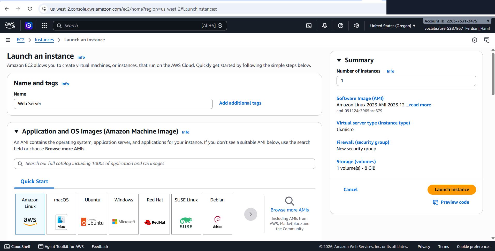
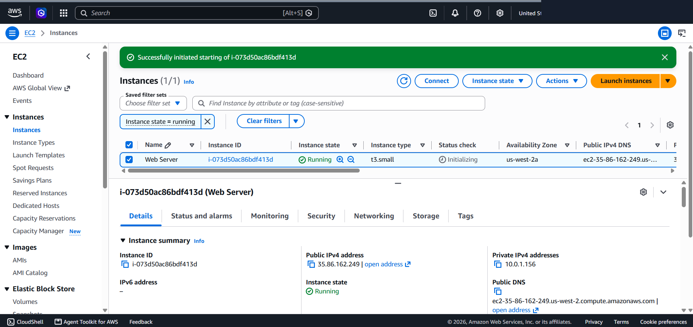
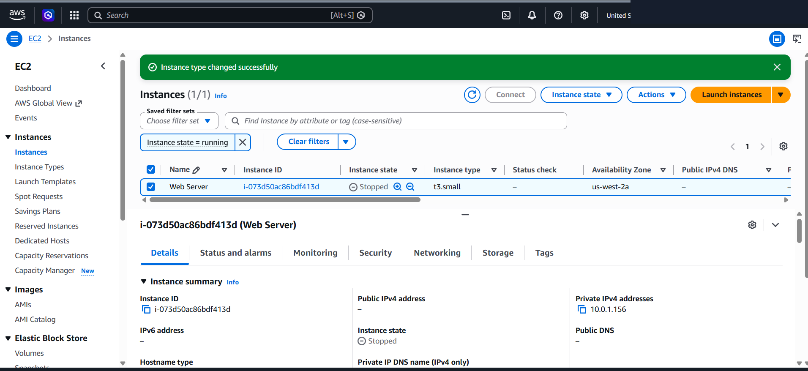
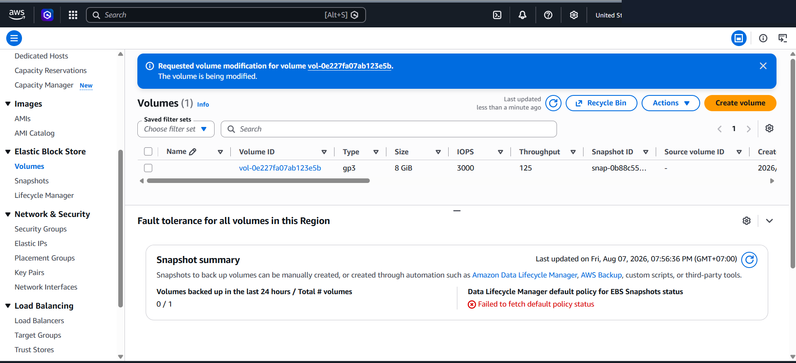
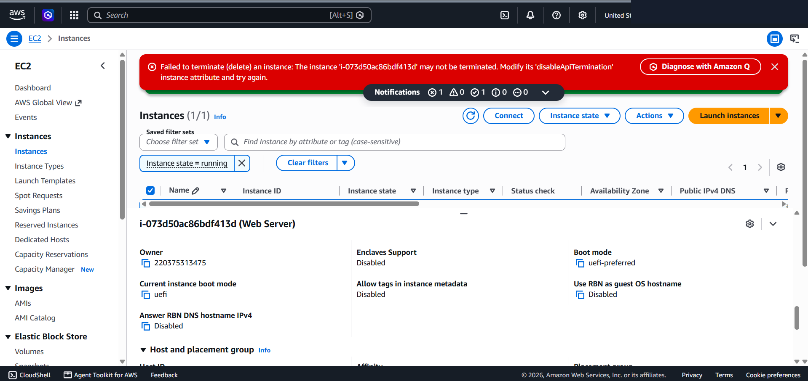

# Amazon EC2 Provisioning, Security Group Scoping & Workload Resilience

This lab project documents the practical deployment of an Amazon EC2 compute instance, automated server bootstrapping using User Data scripts, network security scoping with Security Groups, vertical compute and storage scaling, and termination protection safeguards.

---

## Scenario & Problem Statement

### Requirement Overview
A business application requires deploying a web server on AWS compute infrastructure. The workload demands:
1. Automated server initialization without requiring manual SSH administration.
2. Strict inbound firewall scoping to minimize exposure to automated security scans.
3. The flexibility to perform vertical compute and storage scaling as traffic demands increase.
4. Safeguards against accidental instance termination during maintenance operations.

---

## Architecture Overview

```
                     +---------------------------------------+
                     |         Internet / Public Client       |
                     +---------------------------------------+
                                         |
                                  HTTP (Port 80)
                                         v
                     +---------------------------------------+
                     |     Web Server Security Group         |
                     | (Inbound: HTTP Port 80 | Outbound: ALL)|
                     +---------------------------------------+
                                         |
                     +---------------------------------------+
                     |       Amazon EC2 (t3.small)           |
                     |       - OS: Amazon Linux 2023         |
                     |       - Web Engine: Apache (httpd)    |
                     |       - Storage: 10 GiB EBS (gp3)     |
                     |       - Termination Protection: ON    |
                     +---------------------------------------+
```

---

## Technical Implementation & Workflow

### 1. Instance Provisioning & Automated Bootstrapping
- Compute Instance: Amazon EC2 launched using Amazon Linux 2023 AMI in custom Lab VPC.
- Automated Bootstrap: Configured User Data script (`user_data_bootstrap.sh`) to automatically install Apache (`httpd`), enable it on boot, start the service, and serve a simple web page without manual SSH intervention.



```bash
#!/bin/bash
yum -y install httpd
systemctl enable httpd
systemctl start httpd
echo '<html><h1>Hello From Your Web Server!</h1></html>' > /var/www/html/index.html
```

---

### 2. Network Firewall & Inbound Traffic Scoping
- Zero Inbound Access Default: Initial configuration restricts management access (SSH/Port 22 disabled) to minimize port scanning attack vectors.
- Inbound Scoping: Security Group rules updated to explicitly permit HTTP (Port 80) inbound traffic from IPv4 addresses, demonstrating firewall-level network access control.



---

### 3. Vertical Compute & Storage Resizing
- Compute Scaling: Safely stopped the instance to modify instance type from `t3.micro` (1 GiB RAM) to `t3.small` (2 GiB RAM / 2 vCPUs) to accommodate higher workload demands.
- Storage Expansion: Modified attached Amazon EBS root volume capacity from 8 GiB to 10 GiB without requiring OS re-installation or data loss.




---

### 4. Termination Protection & Accidental Deletion Safeguard
- Enabled Termination Protection via Instance Settings.
- Tested accidental deletion via AWS Management Console. The API call was successfully rejected with error: `Failed to terminate an instance: The instance may not be terminated. Modify its 'disableApiTermination' instance attribute and try again.`



---

## Security Best Practices Applied

1. Least Privilege Network Access: Avoiding global SSH port exposure to minimize brute-force vulnerabilities.
2. Infrastructure Automation: Utilizing User Data scripts to eliminate manual server setup drift.
3. Accidental Deletion Barrier: Enforcing Termination Protection on critical compute workloads to prevent human error during console or API maintenance operations.
4. Graceful Maintenance Window: Executing hardware/storage scaling operations in stopped state to maintain file system data integrity.
