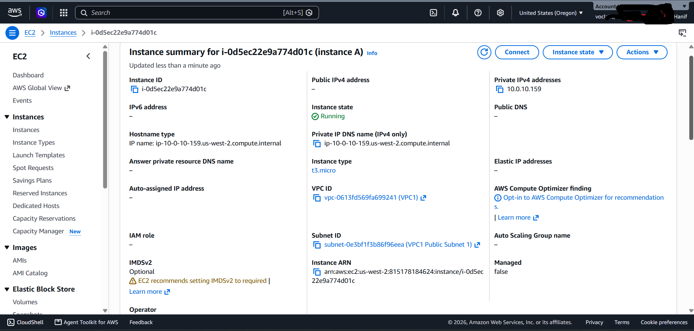
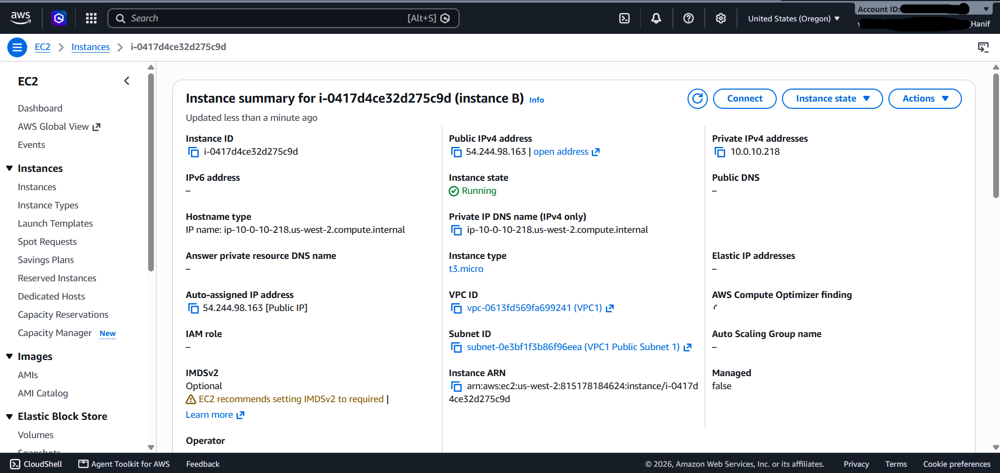
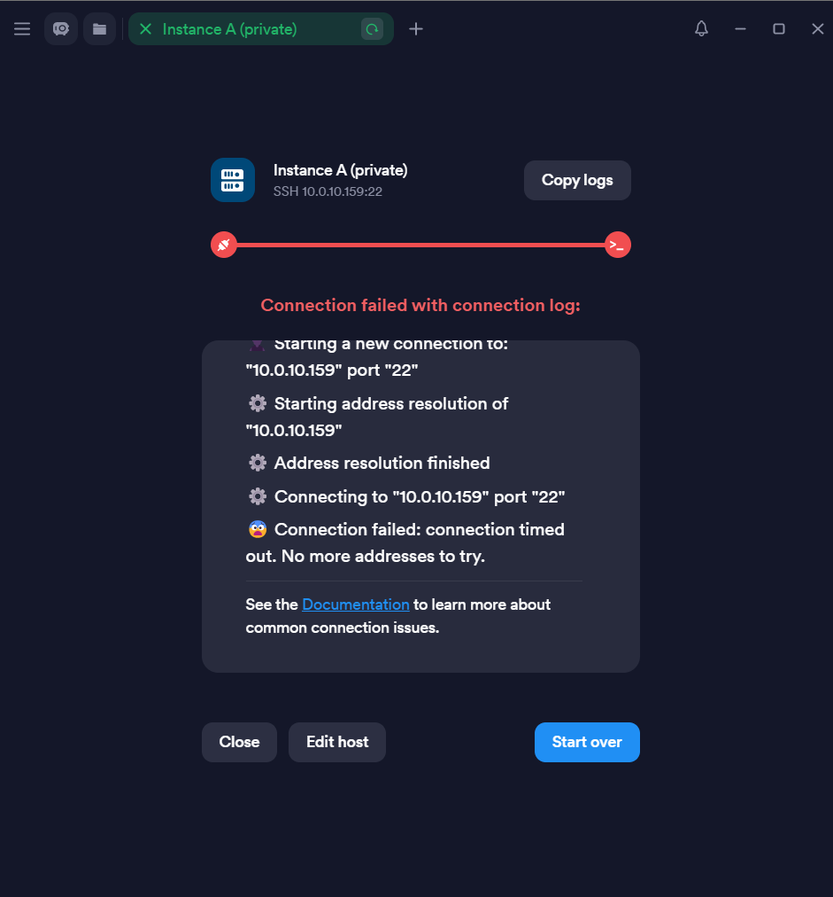
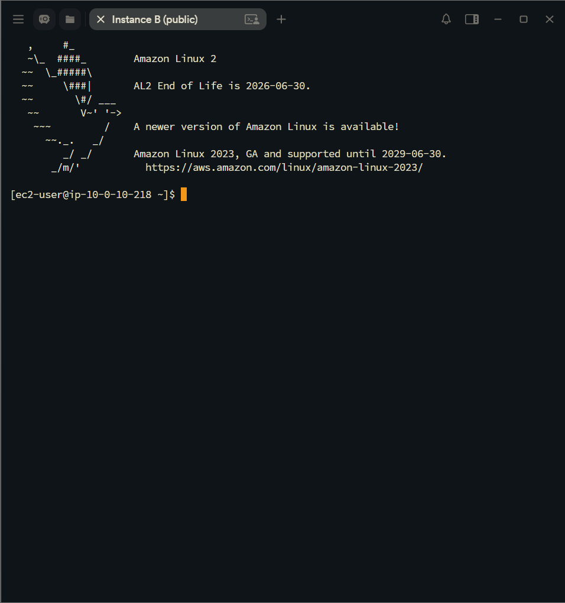
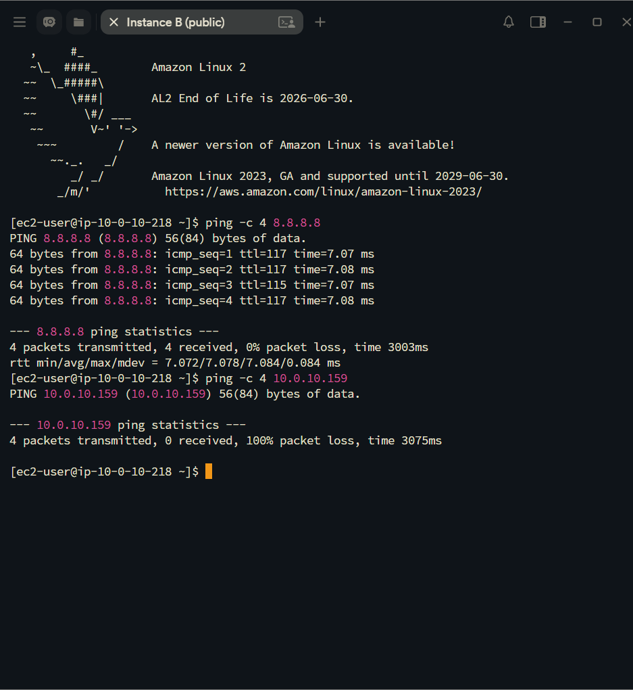

# AWS Networking: Public vs. Private IP Addressing & SSH Diagnostics

This lab project explores VPC IP addressing mechanisms, troubleshooting internet reachability across Amazon EC2 instances, and analyzing CIDR block allocation best practices.

---

## Problem Scenario & Root Cause Analysis

### Customer Issue Statement
A cloud infrastructure setup within a single VPC (`10.0.0.0/16`) contains two Amazon EC2 instances (`instance A` and `instance B`) deployed in the same public subnet. Despite having identical VPC configurations:
- `instance A`: Cannot connect to the internet and fails to establish external SSH management sessions.
- `instance B`: Successfully connects to the internet and accepts external SSH management sessions.

### Root Cause Diagnosis
1. IP Allocation Discrepancy:
   - `instance A`: Assigned only a Private IPv4 Address (`10.0.10.159`) with `Auto-assign Public IP` disabled. Private IP addresses (RFC 1918) are non-routable over the public internet, preventing external gateway traversal.
   - `instance B`: Assigned both a Private IPv4 Address (`10.0.10.218`) and an Auto-assigned Public IPv4 Address (`54.244.98.163`), enabling bidirectional communication via the Internet Gateway (IGW).

2. Public CIDR Best Practice Advisory (`12.0.0.0/16`):
   - Assigning public IP CIDR blocks (e.g., `12.0.0.0/16` owned by external registries/ISPs) to a private VPC causes overlapping IP routing conflicts. The VPC local route table overrides internet routing, rendering external public hosts within that range unreachable from inside the VPC.
   - Recommendation: Always utilize standard Private IPv4 ranges (RFC 1918: `10.0.0.0/8`, `172.16.0.0/12`, or `192.168.0.0/16`).

---

## Verification & Diagnostics Workflow

### 1. EC2 Networking Audit
Inspecting instance metadata via the AWS Management Console confirms the missing Public IPv4 address on `instance A`.

---

### 2. External Management Connectivity Test (Termius SSH)
- `instance A` (`10.0.10.159`): Connection attempt fails with `Connection timed out` due to lack of an internet-routable public IP.
- `instance B` (`54.244.98.163`): Connection attempt succeeds, establishing a secure terminal session.

---

### 3. Outbound Internet & Inbound ICMP Diagnostics
Executed ICMP reachability tests from inside `instance B`:
- `ping -c 4 8.8.8.8`: 0% packet loss, confirming active outbound internet routing via Internet Gateway.
- `ping -c 4 10.0.10.159` (Instance A): 100% packet loss, confirming Security Group inbound ICMP isolation between internal workloads.

---

## Key Networking Takeaways

1. Explicit Public IP Mapping: Compute workloads requiring direct external accessibility or management ingress must have `Auto-assign Public IP` enabled or be associated with an Elastic IP (EIP).
2. Subnet & Security Group Layering: Internal workloads (e.g., database nodes) should remain strictly on private IPs to enforce network-level isolation.
3. RFC 1918 Compliance: Adhering strictly to private IP addressing prevents global routing conflicts and ensures clean hybrid-cloud architecture.
