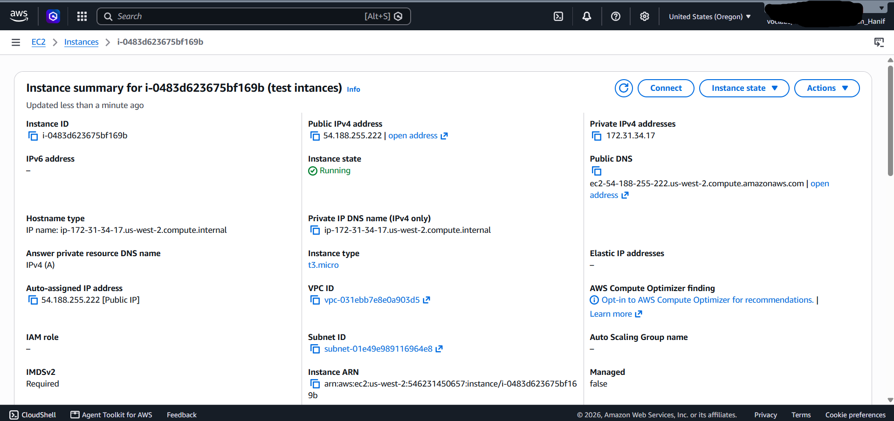
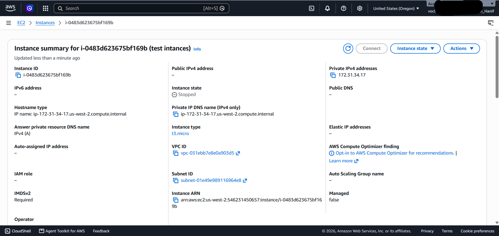
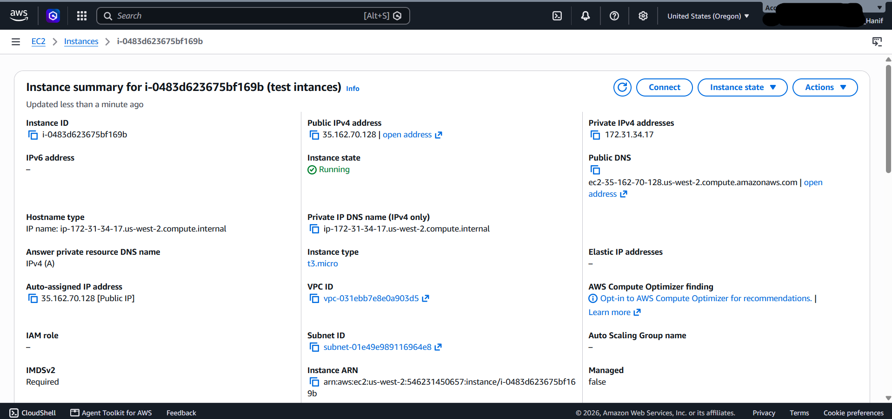
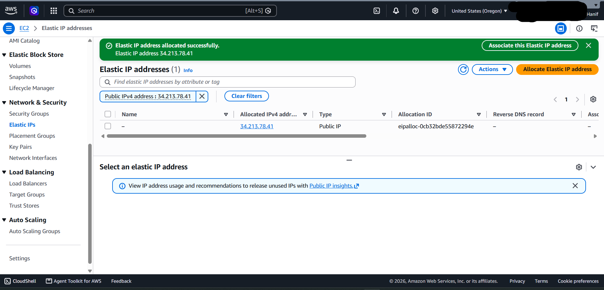
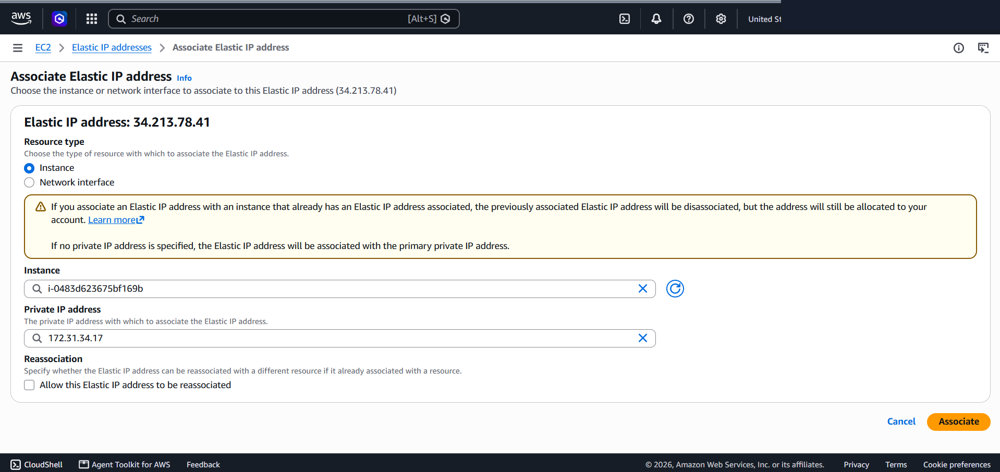
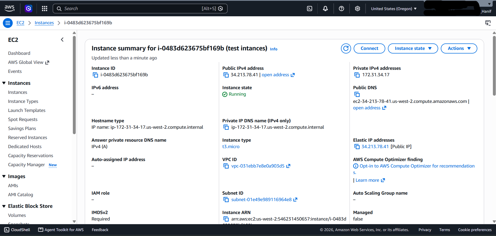

# AWS Networking: Dynamic Public IP Scoping vs. Static Elastic IP (EIP) Allocation

This lab project explores the fundamental differences between dynamically assigned Public IPv4 addresses and persistent Elastic IP (EIP) addresses on Amazon EC2 compute instances, resolving configuration breakdown issues caused by IP address instability.

---

## Scenario & Problem Statement

### Customer Issue Statement
A cloud administrator (Bob) reported an infrastructure issue regarding an Amazon EC2 instance named `Public Instance`. Every time the instance is stopped and restarted to optimize compute costs, AWS assigns a new random public IP address.

Because downstream application services and access control lists depend on a fixed endpoint, this dynamic behavior breaks system connectivity. The customer requires a persistent, static public IP address that remains unchanged across instance lifecycle state changes.

### Root Cause Diagnosis
1. Dynamic Auto-assigned Public IPv4 Behavior:
   - Default EC2 public IPv4 addresses are allocated from AWS's shared public IP pool.
   - When an instance transitions to the `Stopped` state, AWS releases the dynamic public IP back to the pool. Upon returning to the `Running` state, a new unassigned public IP is dynamically attached.

2. Architecture Solution:
   - Allocate a dedicated Elastic IP (EIP) address from the AWS region pool and associate it with the instance's primary network interface (ENI).
   - Elastic IPs remain persistently bound to the user account and instance regardless of stop, start, or reboot cycles.

---

## Technical Implementation & Workflow

### 1. Instance Provisioning & Initial Dynamic IP Audit
- Launched test instance (`test intances`) in `Lab VPC` on `Public Subnet 1` with `Auto-assign Public IP` enabled.
- Initial Running State: Assigned dynamic Public IPv4 address `54.188.255.222`.

---

### 2. Customer Issue Replication (Stop & Start Cycle)
- Stopped the instance: The dynamic public IP was immediately released (`Public IPv4 address: -`).
- Restarted the instance: AWS assigned a new random public IP (`35.162.70.128`), successfully replicating the customer's configuration drift issue.

---

### 3. Elastic IP (EIP) Allocation & Association
- Allocated a static Elastic IP (`34.213.78.41`) via the EC2 Network & Security console.
- Associated the Elastic IP directly with `test intances` and bound it to private IP `172.31.34.17`.

---

### 4. Persistence Verification & Resolution
- Performed a full Stop and Start cycle on the instance with the associated Elastic IP.
- Verification Outcome: The Public IPv4 address remained persistently locked to `34.213.78.41` across state changes, resolving the customer's issue.

---

## Architectural & Cost Management Takeaways

1. Endpoint Stability: Workloads requiring fixed external routing, DNS mapping, or IP whitelisting must utilize Elastic IPs or AWS Global Accelerator rather than dynamic public IPs.
2. Cost Allocation Rule: Elastic IP addresses incur hourly charges if allocated but unassociated with a running instance to discourage IPv4 address hoarding.
3. Private IP Persistence: Private IPv4 addresses remain static throughout the entire lifecycle of an EC2 instance until termination.
