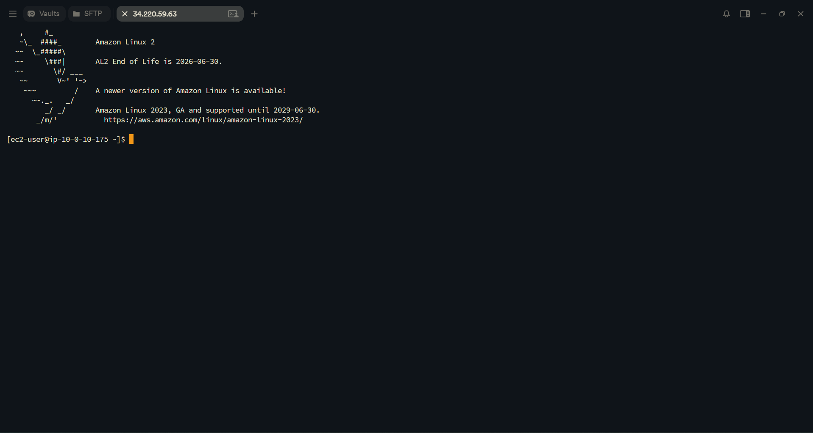
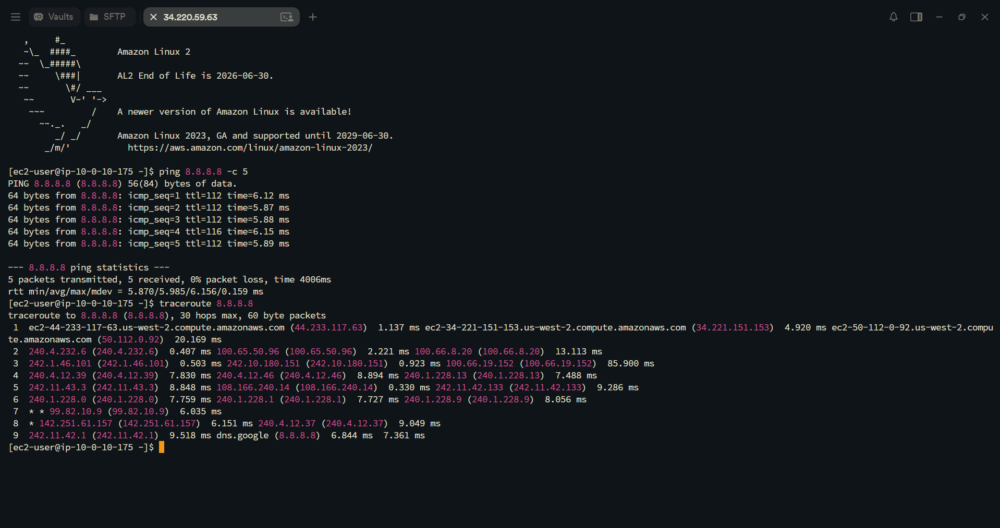
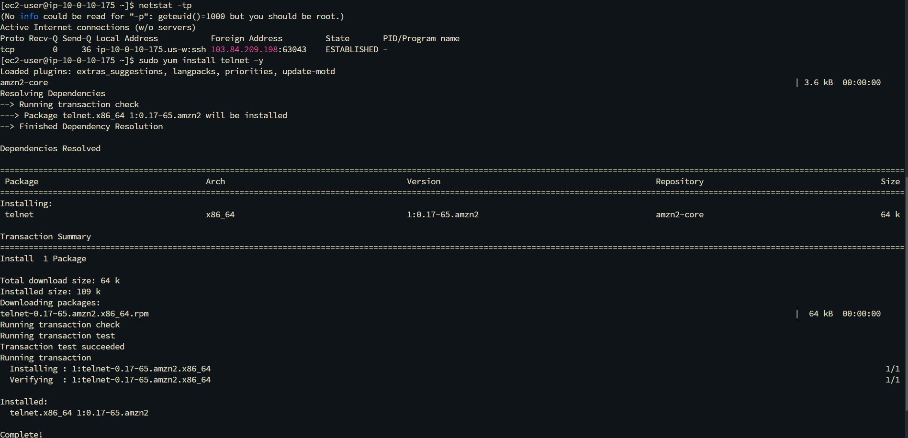
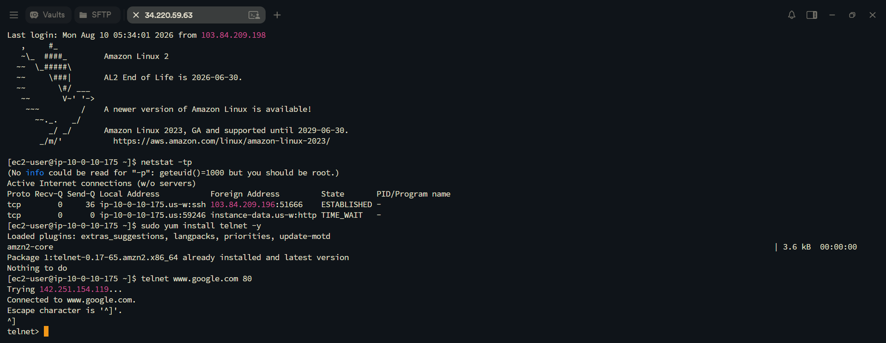
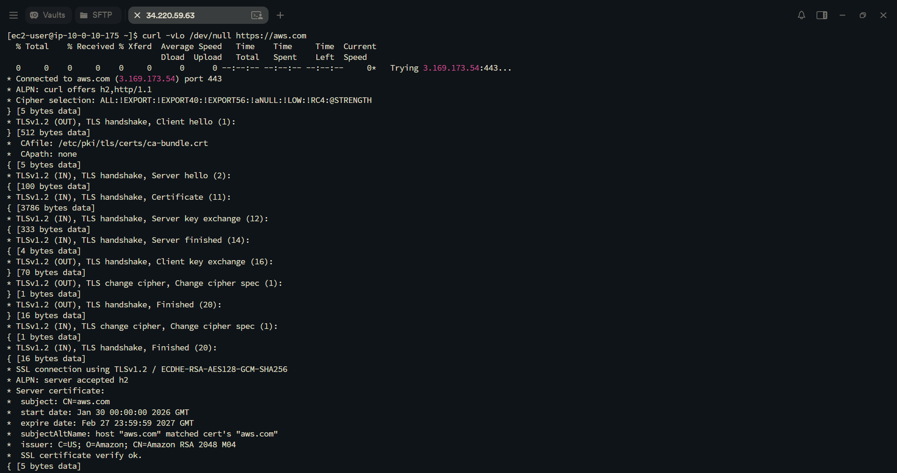
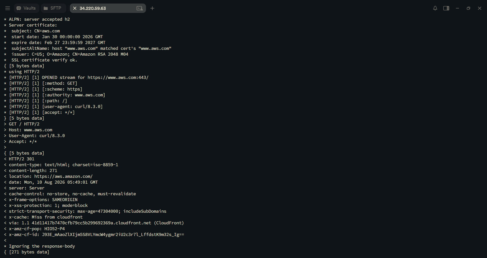

# AWS Network Engineering: Layered IP Troubleshooting Commands (OSI Model Diagnostics)

This lab project documents practical network diagnostics across OSI Layers 3, 4, and 7 using Amazon Linux EC2 instances. It explores key CLI troubleshooting utilities including `ping`, `traceroute`, `netstat`, `telnet`, and `curl` to diagnose packet loss, port accessibility, firewall rules, and application status codes.

---

## Scenario & Problem Statement

### Requirement Overview
As a Cloud Network Administrator responding to customer infrastructure tickets, network issues must be systematically isolated across the OSI model layers rather than making random configuration changes.

Common customer tickets include:
1. ICMP Reachability & Security Group Verification (Layer 3).
2. Network Latency & ISP Hop Packet Loss Isolation (Layer 3).
3. Listening Ports & Compromised Socket Verification (Layer 4).
4. Firewall / Security Group TCP Port Access Scoping (Layer 4).
5. Web Server Application Health & HTTP Status Code Auditing (Layer 7).

---

## OSI Model to Command Mapping

```
+-------------------+--------------------------------+--------------------------------------+
| OSI Layer         | Target AWS Resource / Focus    | Diagnostic Commands Executed         |
+-------------------+--------------------------------+--------------------------------------+
| Layer 7           | Web Servers & HTTP Services    | curl -vLo /dev/null https://aws.com  |
| (Application)     | HTTP 200/301 Status Codes      |                                      |
+-------------------+--------------------------------+--------------------------------------+
| Layer 4           | Security Groups & NACLs        | netstat -tp                          |
| (Transport)       | Active Sockets & TCP Ports     | telnet www.google.com 80             |
+-------------------+--------------------------------+--------------------------------------+
| Layer 3           | Subnets, IGW & Route Tables    | ping 8.8.8.8 -c 5                    |
| (Network)         | Hop Latency & Packet Loss      | traceroute 8.8.8.8                   |
+-------------------+--------------------------------+--------------------------------------+
```

---

## Technical Implementation & Diagnostic Commands

### 1. SSH Terminal Establishment
Connected to the Amazon Linux EC2 instance via Termius SSH using `labsuser.pem`.



---

### 2. Layer 3 (Network Layer) — Connectivity & Route Hop Analysis

#### ICMP Echo Verification (`ping`) & Path Tracing (`traceroute`)
- `ping 8.8.8.8 -c 5`: Transmitted 5 ICMP echo requests with 0% packet loss, confirming active outbound gateway routing.
- `traceroute 8.8.8.8`: Traced intermediate network hops, isolating latency across AWS gateways, transit providers, and destination host.



---

### 3. Layer 4 (Transport Layer) — Socket Connections & Port Scoping

#### Socket Connection Audit (`netstat`)
- `netstat -tp`: Audited active established TCP sockets and Process IDs on the local host.



#### TCP Port Reachability & Firewall Testing (`telnet`)
- Installed telnet utility (`sudo yum install telnet -y`).
- Command: `telnet www.google.com 80`
- Result: Successfully established TCP socket connection (`Connected to www.google.com.`), confirming Port 80 is open and not dropped by security groups or network ACLs.



---

### 4. Layer 7 (Application Layer) — HTTP Service & Header Verification

#### Web Data Transfer & Header Inspection (`curl`)
- Command: `curl -vLo /dev/null https://aws.com`
- Verbose SSL Handshake: Inspected TLS v1.2 cipher suites, certificates, and ALPN negotiation.
- HTTP Response Header Audit: Verified HTTP 301 redirect headers and CloudFront edge cache response metadata.




---

## Troubleshooting Best Practices Summary

1. Bottom-Up Diagnostic Methodology: Start troubleshooting at Layer 3 (`ping`/`traceroute`) before testing Layer 4 port connectivity (`telnet`/`netstat`), and finally auditing Layer 7 application responses (`curl`).
2. Security Group vs NACL Isolation:
   - Security Group block: Results in `Connection timed out` on `telnet` / `curl`.
   - Port not listening: Results in `Connection refused`.
3. Non-Destructive Auditing: Utilizing verbose options (`curl -v`, `netstat -ntlp`) enables rapid root-cause isolation without restarting services or interrupting live workloads.
