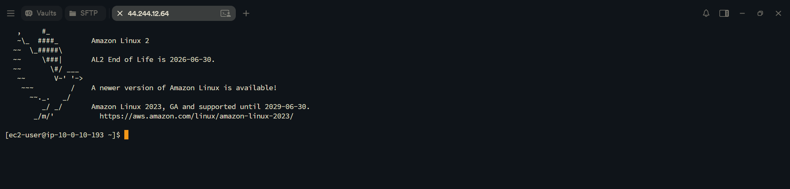
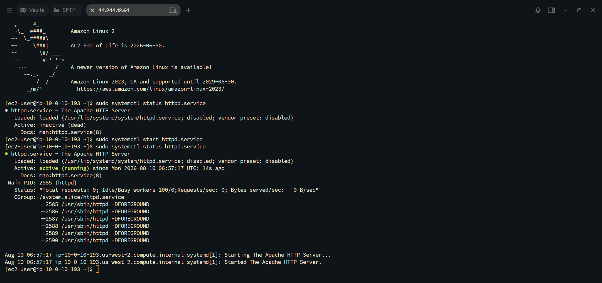
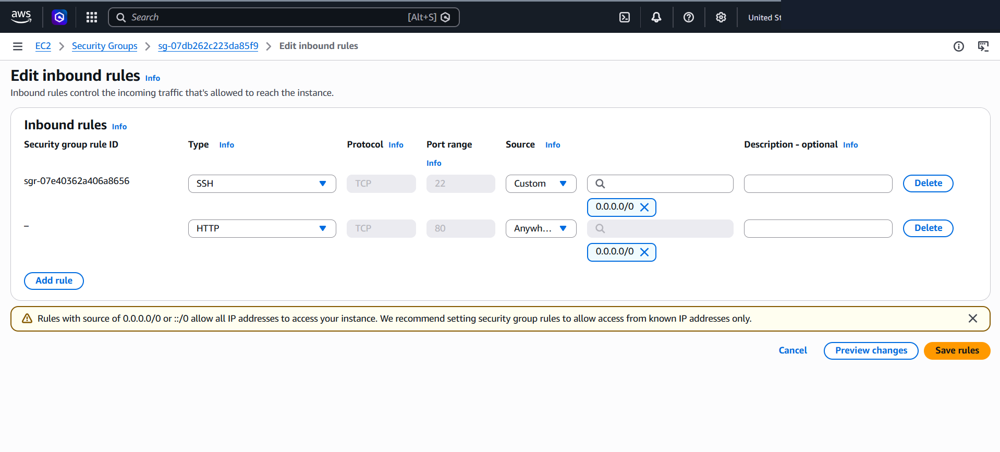
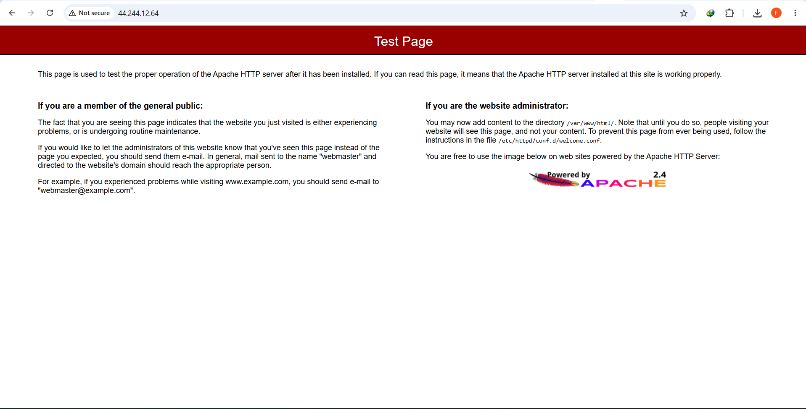

# AWS Network Troubleshooting: Isolating Inactive HTTP Services & Security Group Inbound Filtering

This lab project documents end-to-end network troubleshooting on AWS EC2 infrastructure. It isolates a multi-layered connectivity issue involving an inactive Apache HTTP daemon (`httpd`) and missing Security Group Inbound rules blocking HTTP traffic (Port 80) and ICMP probes.

---

## Scenario & Problem Statement

### Customer Issue Statement
A consulting contractor (Ana Contractor) reported that after launching an Apache web server on an Amazon EC2 instance via CLI, the server failed to respond to `ping` requests and returned browser connection errors (`ERR_CONNECTION_TIMED_OUT`) when accessing the public IPv4 address.

### Root Cause Diagnosis
1. Host Service Layer (Daemon State):
   - The Apache HTTP daemon (`httpd.service`) was installed but remained in an `inactive (dead)` state, failing to listen on Port 80.
2. Cloud Infrastructure Layer (Firewall Filtering):
   - The instance's Security Group lacked an Inbound Rule allowing TCP Port 80 (HTTP) traffic from public IPv4 clients (`0.0.0.0/0`), actively dropping incoming HTTP requests.

---

## Technical Implementation & Workflow

### 1. Terminal Connection
Established SSH terminal connection to the Amazon Linux EC2 instance (`ec2-user`) via Termius using `labsuser.pem`.

---

### 2. Host Service Audit & Initialization
- Service Status Inspection: `sudo systemctl status httpd.service` confirmed the daemon was `inactive (dead)`.
- Service Startup: Initialized Apache using `sudo systemctl start httpd.service`.
- Verification: Re-inspected service state to confirm `active (running)`.

---

### 3. Security Group Inbound Filtering Update
- Navigated to AWS Management Console → EC2 / VPC → Security Groups.
- Located the instance's associated Security Group and edited Inbound Rules.
- Rule Added: `HTTP` (TCP Port 80) | Source: `Anywhere-IPv4` (`0.0.0.0/0`). Preserved existing SSH (Port 22) access rules.

---

### 4. End-to-End Verification & Solution Outcome
- Accessed `http://<PUBLIC_IP_INSTANCE>` in external browser.
- Outcome: Successfully rendered the Apache HTTP Server Test Page, validating HTTP accessibility and resolving the customer's ticket.

---

## Architectural Takeaways

1. Multi-Layer Troubleshooting Protocol: Always inspect host-level service daemons (`systemctl status`) before modifying cloud infrastructure firewalls (Security Groups / NACLs).
2. Stateful Security Group Behavior: Security Groups are stateful. Adding an Inbound Rule for HTTP Port 80 automatically permits return outbound traffic to the client.
3. Rule Scope Integrity: Never overwrite existing administrative rules (e.g., SSH Port 22) when opening application ports; append new rules using `Add rule` to prevent administrative lockout.
