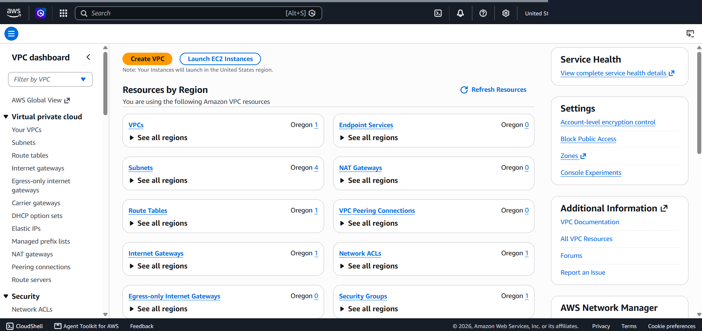
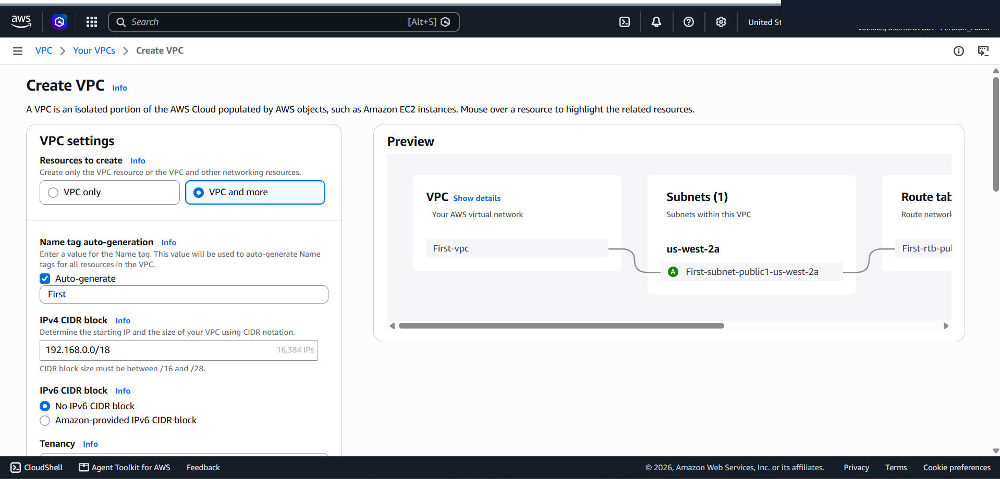
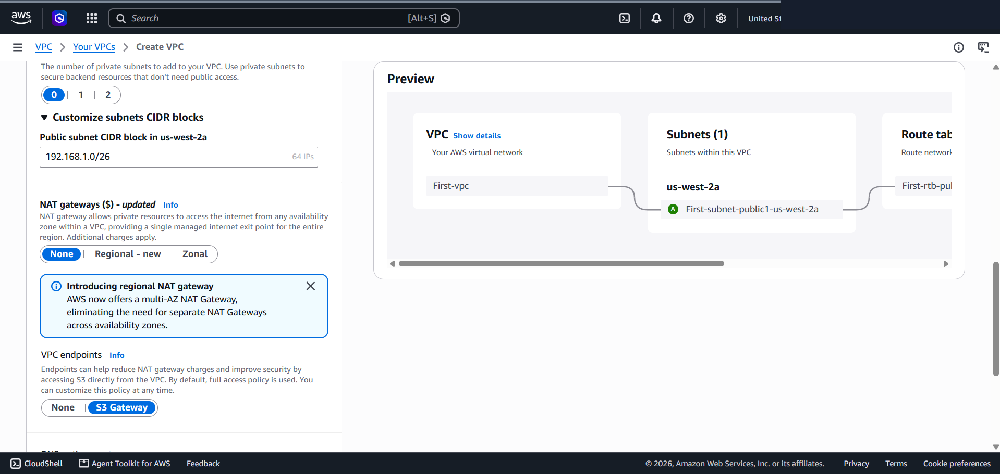
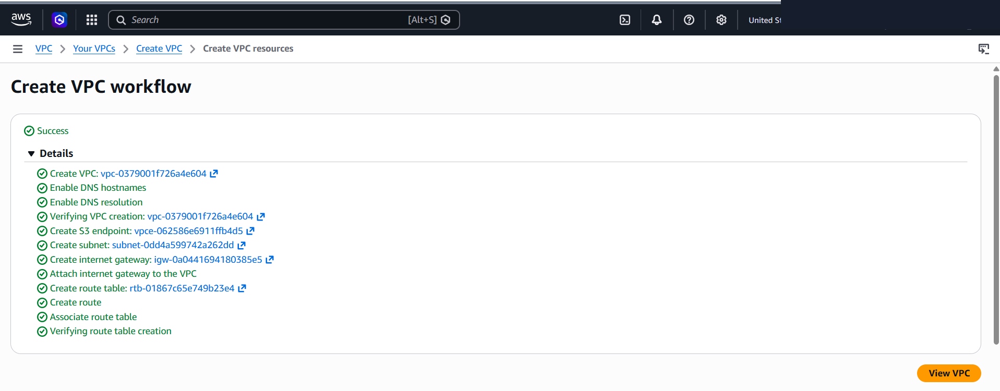
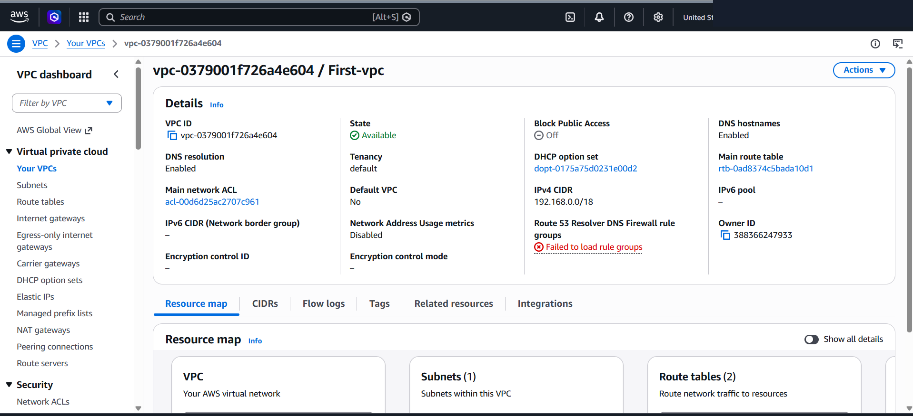
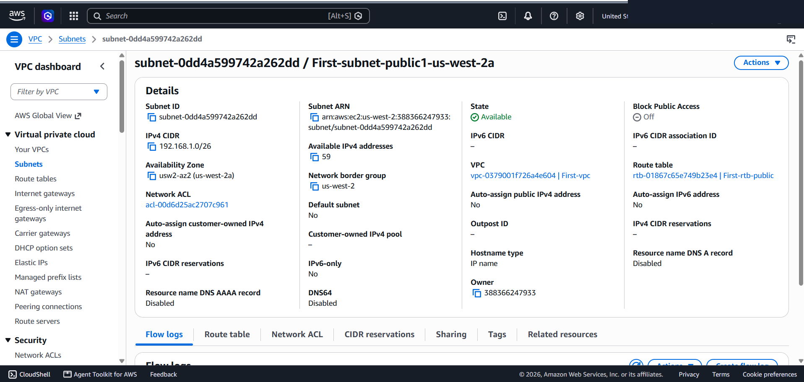

# AWS Virtual Private Cloud (VPC): Custom IPv4 Subnetting & RFC 1918 Address Allocation

This lab project documents the architectural design and implementation of an Amazon Virtual Private Cloud (VPC) tailored to specific corporate capacity requirements. It covers RFC 1918 private address selection, CIDR mask calculation for 15,000+ host addresses, and public subnet partitioning.

---

## Scenario & Problem Statement

### Customer Requirements (Paulo Santos - Startup Owner)
A startup company required assistance provisioning its initial AWS VPC infrastructure with exact IP address capacity boundaries:
1. Private Class C RFC 1918 Address Range: Must utilize the `192.168.0.0/16` private IP block.
2. VPC Total Capacity Target: Requires at least 15,000 private IPv4 addresses for the Seattle headquarters.
3. Public Subnet Capacity Target: Requires at least 50 usable IPv4 addresses for the operations department.

---

## Subnetting & CIDR Block Calculations

```
+-------------------+--------------------+------------------+-----------------------+-------------------+
| Network Layer     | Target Capacity    | Applied CIDR     | Total IP Pool         | Usable AWS IPs    |
+-------------------+--------------------+------------------+-----------------------+-------------------+
| VPC Block         | ≥ 15,000 IPs       | 192.168.0.0/18   | 16,384 IPv4 Addresses | 16,379 IPs        |
| Public Subnet     | ≥ 50 IPs           | 192.168.1.0/26   | 64 IPv4 Addresses     | 59 IPs            |
+-------------------+--------------------+------------------+-----------------------+-------------------+
```

### Mathematical Breakdown
- VPC CIDR Mask (`/18`): $2^{(32 - 18)} = 2^{14} = 16,384$ total IPv4 addresses (exceeds the 15,000 minimum requirement).
- Subnet CIDR Mask (`/26`): $2^{(32 - 26)} = 2^6 = 64$ total IPv4 addresses.
- AWS Reserved Subnet IPs: AWS reserves 5 IP addresses per subnet (Network Address, VPC Router, DNS Server, Future Use, Broadcast Address). $64 - 5 = 59$ usable host IPs (exceeds the 50 minimum requirement).

---

## Technical Implementation & Workflow

### 1. VPC Dashboard Inspection
Navigated to AWS Console → VPC Dashboard to audit existing regional networking resources.



---

### 2. VPC & Subnet Provisioning
- Launched Create VPC Wizard (`VPC and more` mode).
- VPC Name: `First-vpc`.
- IPv4 CIDR Block: `192.168.0.0/18` (16,384 IPs).
- IPv6 CIDR Block: Disabled.



---

### 3. Public Subnet Allocation
- Configured 1 Public Subnet in `us-west-2a`.
- Subnet Name: `First-subnet-public1-us-west-2a`.
- Public Subnet IPv4 CIDR: `192.168.1.0/26` (64 IPs).



---

### 4. Workflow Execution & Resource Verification
- Initiated VPC creation workflow. The wizard automatically provisioned the VPC, Subnet, Route Table, Internet Gateway, and Route Table association.



#### Infrastructure Details Verification
- VPC Inspection (`First-vpc`): Verified State `Available` with IPv4 CIDR `192.168.0.0/18`.
- Subnet Inspection (`First-subnet-public1-us-west-2a`): Verified State `Available` with IPv4 CIDR `192.168.1.0/26` and **59 Available IPv4 addresses**.




---

## Architectural Best Practices

1. RFC 1918 Compliance: Always select non-routable private IP ranges (`10.0.0.0/8`, `172.16.0.0/12`, `192.168.0.0/16`) for VPC CIDR blocks to avoid internet routing collisions.
2. Subnet Reservation Planning: Always account for the 5 reserved IP addresses per AWS subnet when sizing network capacity for workloads.
3. Variable Length Subnet Masking (VLSM): Sizing subnets precisely (e.g., `/26` for 50+ hosts) conserves unassigned IP space within the VPC CIDR for future expansion.
