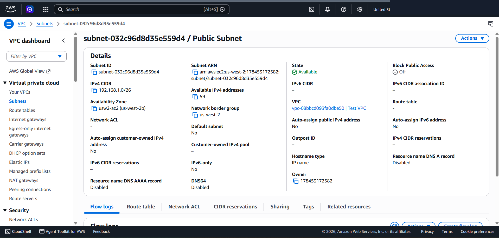
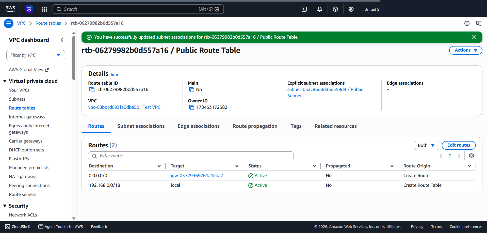
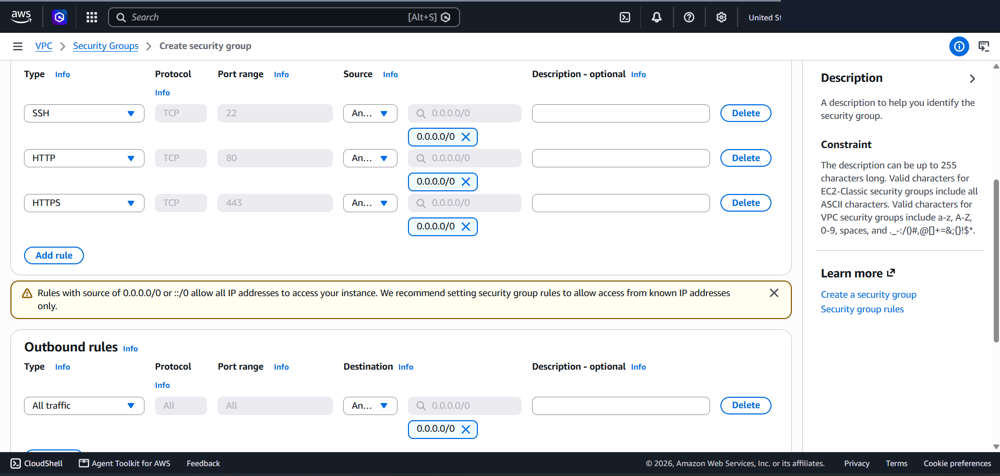
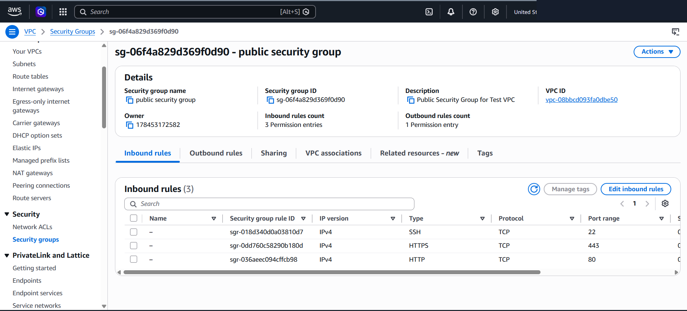
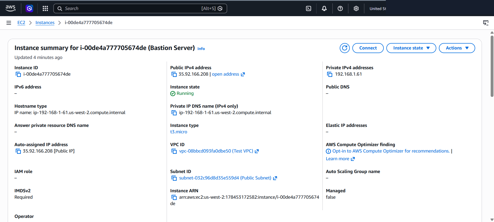
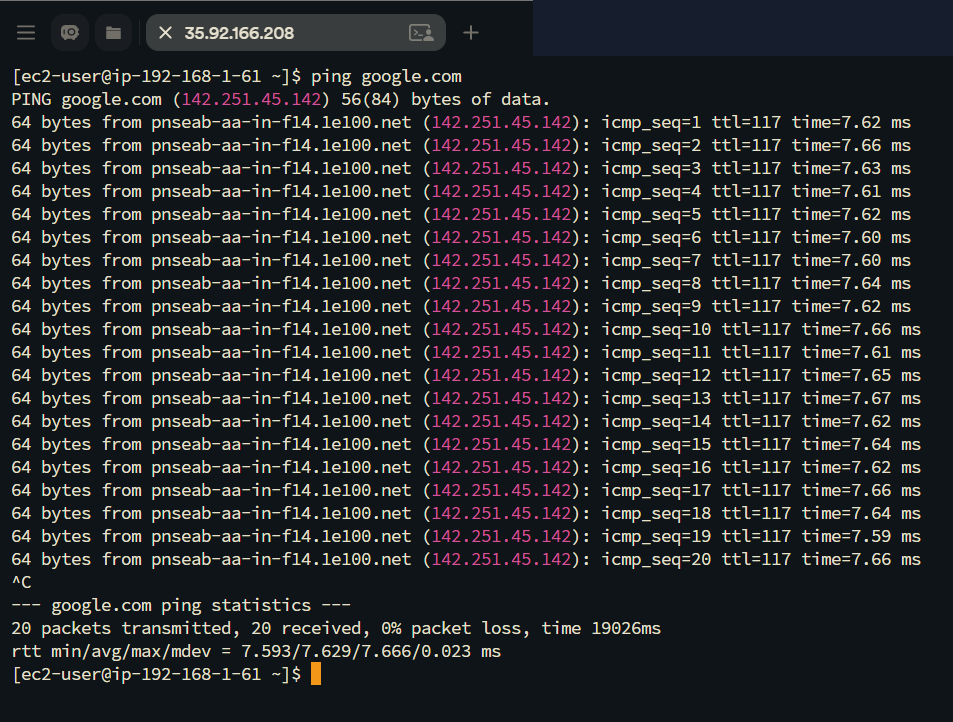

# AWS VPC Networking Architecture: Building Routable Subnets, Internet Gateways & Multi-Layer Firewalls

This lab project documents the end-to-end manual construction of a fully routable Amazon Virtual Private Cloud (VPC) architecture. It covers the top-down assembly of core AWS networking components including custom VPCs, IPv4 subnets, Internet Gateways (IGW), Route Tables, Network ACLs (NACL), Security Groups, and EC2 Bastion instances to achieve external internet connectivity.

---

## Scenario & Problem Statement

### Customer Requirements (Brock - Startup Owner)
A startup founder previously created a basic VPC but encountered total internet isolation—EC2 instances inside the VPC could not reach or `ping` external internet destinations (`ping google.com` failed with 100% packet loss).

The objective is to manually construct a complete, routable VPC networking stack from scratch, establishing bidirectional Internet Gateway routing, stateless subnet firewalls (NACLs), and stateful instance firewalls (Security Groups).

---

## Target Network Architecture

```
+-----------------------------------------------------------------------------------+
| AWS Cloud Region (us-west-2)                                                       |
|                                                                                   |
|  Test VPC (192.168.0.0/18)                                                        |
|  +-----------------------------------------------------------------------------+  |
|  | Public Subnet (192.168.1.0/26)                                              |  |
|  | +-----------------------+        +-------------------+                      |  |
|  | | EC2 Bastion Server    | <----> | Security Group    |                      |  |
|  | | IP: 192.168.1.61     |        | (SSH, HTTP, HTTPS)|                      |  |
|  | +-----------------------+        +-------------------+                      |  |
|  |             ^                                                               |  |
|  |             | (Subnet ACL Rule #100: ALL ALLOW)                             |  |
|  |             v                                                               |  |
|  | +--------------------------------------------------+                        |  |
|  | | Public Route Table (0.0.0.0/0 -> IGW)            |                        |  |
|  | +--------------------------------------------------+                        |  |
|  +-----------------------------------------------------------------------------+  |
|                                |                                                  |
|                                v                                                  |
|                      Internet Gateway (IGW)                                       |
+-----------------------------------------------------------------------------------+
                                 |
                                 v
                       Public Internet (google.com)
```

---

## Technical Implementation & Workflow

### 1. Custom VPC & Subnet Provisioning
- Created `Test VPC` with IPv4 CIDR `192.168.0.0/18` (16,384 total IPs).
- Created `Public Subnet` with IPv4 CIDR `192.168.1.0/26` (64 total IPs / 59 usable IPs).



---

### 2. Internet Gateway (IGW) Attachment & Route Table Mapping
- Created `Test VPC IGW` and attached it directly to `Test VPC`.
- Created `Public Route Table` and added default route:
  - Destination: `0.0.0.0/0` | Target: `Test VPC IGW` (`igw-05729369761a1eba7`).
- Associated `Public Route Table` with `Public Subnet`.



---

### 3. Multi-Layer Firewall Configuration

#### Network ACL (Subnet Level - Stateless)
- Provisioned `Public Subnet NACL` bound to `Public Subnet`.
- Inbound Rule #100: ALLOW All Traffic (`0.0.0.0/0`).
- Outbound Rule #100: ALLOW All Traffic (`0.0.0.0/0`).

#### Security Group (Instance Level - Stateful)
- Provisioned `public security group` bound to `Test VPC`.
- Description: `Public Security Group for Test VPC`.
- Inbound Rules: SSH (TCP 22), HTTP (TCP 80), HTTPS (TCP 443) from `0.0.0.0/0`.
- Outbound Rules: ALL Traffic to `0.0.0.0/0`.




---

### 4. EC2 Bastion Launch & Connectivity Verification

#### EC2 Provisioning
- Launched `Bastion Server` (`i-00de4a777705674de`, `t3.micro`, Amazon Linux 2023 AMI) inside `Test VPC` and `Public Subnet` with `Auto-assign Public IP` enabled.
- Assigned Public IPv4: `35.92.166.208` | Private IPv4: `192.168.1.61`.



#### Internet Reachability Verification
- Connected to instance via Termius SSH using `labsuser.pem`.
- Command Executed: `ping google.com`.
- Result: 20 packets transmitted, 20 received, **0% packet loss**, validating full bidirectional internet routing!



---

## Architectural Best Practices

1. Top-Down VPC Construction Theory: Always assemble VPC components sequentially: VPC → Subnet → IGW → Route Table → NACL → Security Group → EC2 Instance.
2. Route Table Association Necessity: An Internet Gateway attached to a VPC has no effect until a route (`0.0.0.0/0 -> IGW`) is explicitly added to the Route Table and associated with the Subnet.
3. Dual-Layer Security Defense-in-Depth: Combining stateless NACLs at the subnet boundary with stateful Security Groups at the ENI boundary provides comprehensive perimeter protection.
