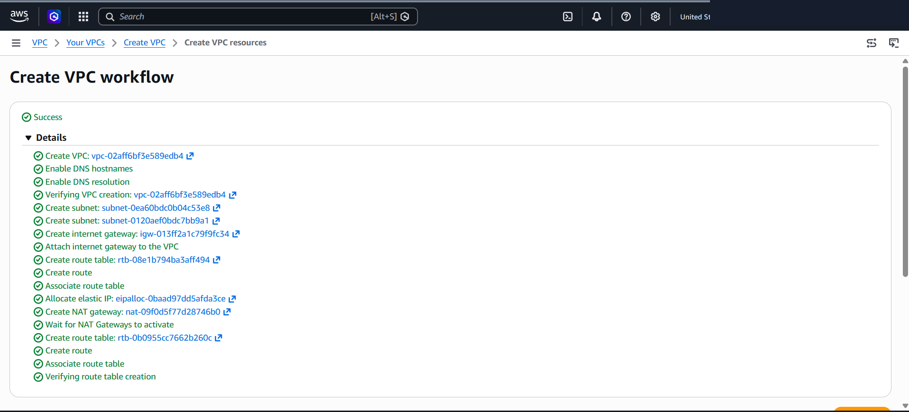
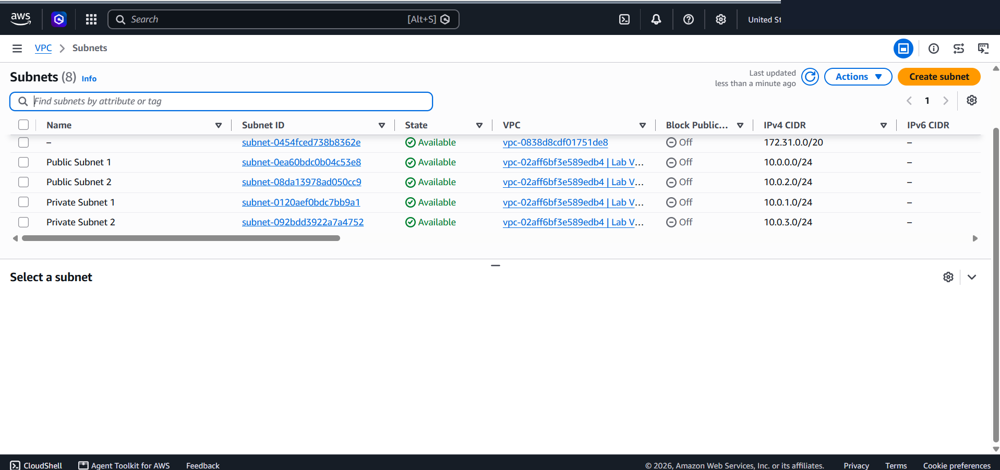
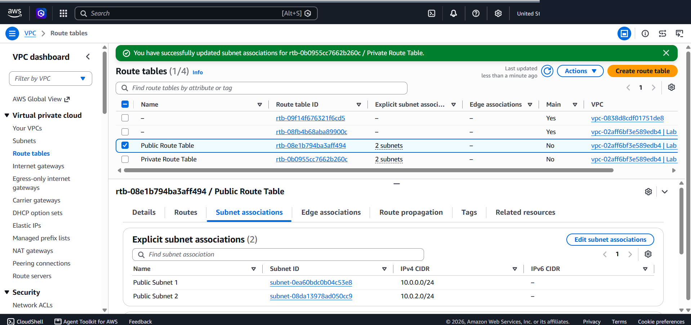
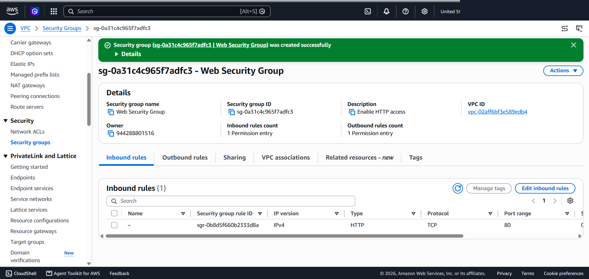
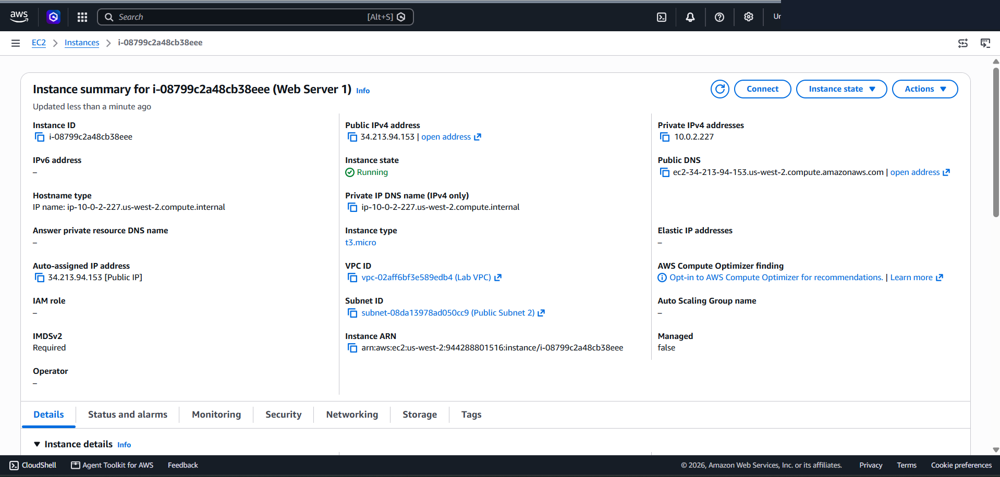
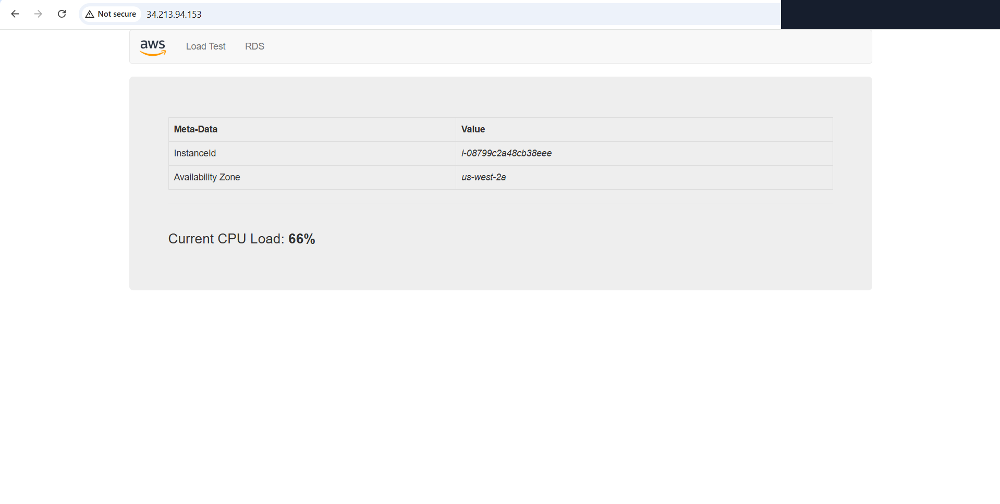

# Multi-AZ VPC Architecture: Provisioning High-Availability Subnets, NAT Gateways & PHP Web Server Workloads

This lab project documents the end-to-end deployment of a highly available, Multi-AZ Amazon Virtual Private Cloud (VPC) infrastructure for a Fortune 100 enterprise scenario. It covers the creation of public and private subnets across multiple Availability Zones, Internet Gateways (IGW), NAT Gateways, Route Tables, Security Group perimeter controls, and automated EC2 Apache/PHP web application deployment.

---

## Scenario & Requirements

### Enterprise Customer Requirements (Fortune 100)
A Fortune 100 customer required a customized cloud network architecture on AWS capable of hosting web server workloads with high availability and multi-tier subnet isolation.

Key Specifications:
- **VPC CIDR**: `10.0.0.0/16` (`Lab VPC`).
- **Multi-AZ Subnet Allocation**:
  - **Zone A (`us-west-2a`)**: `Public Subnet 1` (`10.0.0.0/24`) & `Private Subnet 1` (`10.0.1.0/24`).
  - **Zone B (`us-west-2b`)**: `Public Subnet 2` (`10.0.2.0/24`) & `Private Subnet 2` (`10.0.3.0/24`).
- **Edge Connections**: Internet Gateway (`IGW`) for public subnets & Single-AZ NAT Gateway for outbound private subnet connectivity.
- **Instance Workload**: `Web Server 1` launched into `Public Subnet 2` running an automated Apache (`httpd`) + PHP web application.

---

## Target Network Architecture

```
+---------------------------------------------------------------------------------------+
| AWS Cloud Region (us-west-2)                                                           |
|                                                                                       |
|  Lab VPC (10.0.0.0/16)                                                                |
|  +-----------------------------------+     +-----------------------------------+  |
|  | Availability Zone A (us-west-2a)   |     | Availability Zone B (us-west-2b)   |  |
|  |                                   |     |                                   |  |
|  |  +-----------------------------+  |     |  +-----------------------------+  |  |
|  |  | Public Subnet 1             |  |     |  | Public Subnet 2             |  |  |
|  |  | CIDR: 10.0.0.0/24           |  |     |  | CIDR: 10.0.2.0/24           |  |  |
|  |  |                             |  |     |  |                             |  |  |
|  |  | +-------------------------+ |  |     |  | +-------------------------+ |  |  |
|  |  | | NAT Gateway             | |  |     |  | | Web Server 1 (EC2)      | |  |  |
|  |  | +-------------------------+ |  |     |  | | IP: 34.213.94.153       | |  |  |
|  |  +-----------------------------+  |     |  | | Apache / PHP App        | |  |  |
|  |                                   |     |  | +-------------------------+ |  |  |
|  |  +-----------------------------+  |     |  +-----------------------------+  |  |
|  |  | Private Subnet 1            |  |     |                                   |  |
|  |  | CIDR: 10.0.1.0/24           |  |     |  +-----------------------------+  |  |
|  |  +-----------------------------+  |     |  | Private Subnet 2            |  |  |
|  |                                   |     |  | CIDR: 10.0.3.0/24           |  |  |
|  +-----------------------------------+     +-----------------------------------+  |
|                                                                                       |
|                          Internet Gateway (IGW)                                       |
+---------------------------------------------------------------------------------------+
                                     |
                                     v
                           Public Internet Clients
```

---

## Technical Implementation & Workflow

### 1. Multi-AZ VPC & Initial Subnet Provisioning
- Executed `VPC and more` Wizard to create `Lab VPC` (`10.0.0.0/16`).
- Automatically created `Public Subnet 1` (`10.0.0.0/24`), `Private Subnet 1` (`10.0.1.0/24`), `Internet Gateway`, and 1-AZ `NAT Gateway`.



---

### 2. Multi-AZ Expansion (Additional Subnets & Routing)
- Created `Public Subnet 2` (`10.0.2.0/24`) and `Private Subnet 2` (`10.0.3.0/24`) to establish 2-AZ fault tolerance.
- Associated `Public Subnet 2` with `Public Route Table` (`0.0.0.0/0 -> IGW`).
- Associated `Private Subnet 2` with `Private Route Table` (`0.0.0.0/0 -> NAT Gateway`).




---

### 3. Security Group Perimeter Configuration
- Provisioned `Web Security Group` attached to `Lab VPC`.
- Inbound Rule: Permitted HTTP (TCP Port 80) from `0.0.0.0/0`.
- Outbound Rule: Permitted ALL traffic to `0.0.0.0/0`.



---

### 4. EC2 Web Server Launch & Automation
- Launched `Web Server 1` (`i-08799c2a48cb38eee`, `t3.micro`) into `Public Subnet 2` with `Auto-assign Public IP: Enable`.
- Assigned Public IPv4: `34.213.94.153` | Private IPv4: `10.0.2.227`.
- Executed User Data bootstrap script for Apache/PHP application deployment.



#### Verification
- Navigated to `http://34.213.94.153` in browser.
- Verified live rendering of custom PHP Web Application displaying Instance ID `i-08799c2a48cb38eee` and Availability Zone `us-west-2a`.



---

## Architectural Key Takeaways

1. Multi-AZ High Availability: Spanning subnets across multiple Availability Zones protects cloud workloads from single-datacenter outages.
2. Dual-Tier Subnet Isolation: Placing frontend web servers in public subnets while isolating sensitive database tiers in private subnets creates strong security boundaries.
3. Automated User Data Provisioning: Automating web server installation via EC2 User Data bootstrap scripts ensures rapid, repeatable instance setup upon launch.
