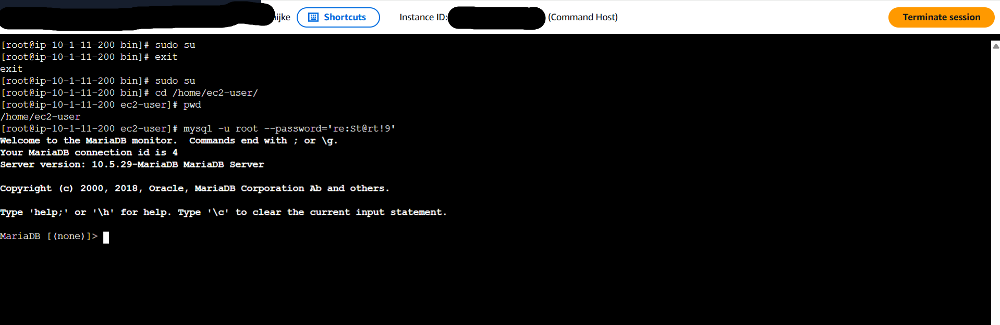
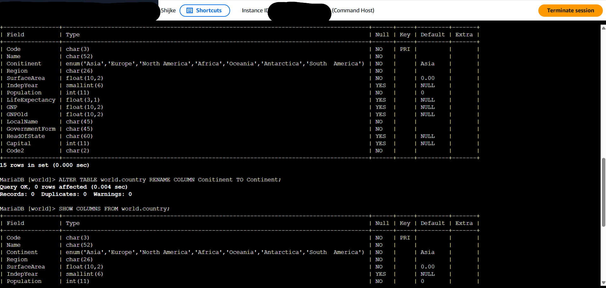
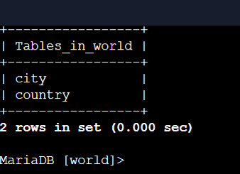
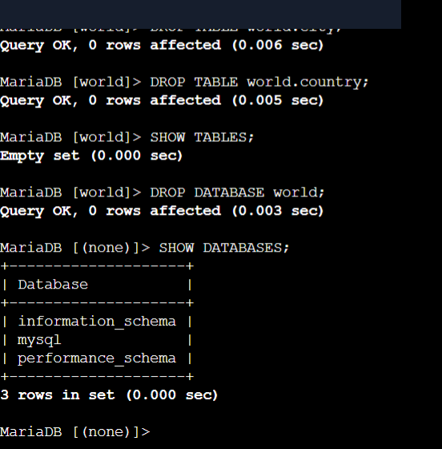

# Relational Database DDL Operations: MySQL Database & Table Schema Management

This lab project documents practical Data Definition Language (DDL) operations on a relational database instance running MySQL/MariaDB in AWS. It covers connecting via AWS Systems Manager Session Manager, creating databases and structured table schemas, executing schema alterations (`ALTER TABLE`), and performing table and database cleanup (`DROP`).

---

## Scenario & Objectives

### Enterprise Operations Task
The organization's database operations team required validation for standard SQL database lifecycle procedures. The objective is to connect to a relational database engine via a CLI Session Manager host, construct schema objects (`world` database, `country` table, `city` table), execute schema modifications, and perform controlled resource teardowns.

Key Objectives:
- Connect to MySQL database engine via EC2 Session Manager CLI.
- Execute `CREATE DATABASE` and `CREATE TABLE` DDL statements.
- Execute `ALTER TABLE RENAME COLUMN` to modify live table schemas.
- Complete Challenge 1 (creating custom `city` table schema).
- Complete Challenge 2 (dropping tables and databases safely via `DROP`).

---

## Technical Workflow & Execution

### 1. Database Client Connection via Session Manager
- Accessed EC2 `Command Host` via AWS Systems Manager Session Manager.
- Authenticated to MySQL shell using root credentials (`mysql -u root --password='...'`).



---

### 2. Schema Provisioning & Alteration (DDL)
- Created database `world` (`CREATE DATABASE world;`).
- Created `country` table with 16 column definitions including CHAR, ENUM, FLOAT, and INT data types with Primary Key constraints.
- Identified schema typo in column `Conitinent` and executed schema refactoring:
  ```sql
  ALTER TABLE world.country RENAME COLUMN Conitinent TO Continent;
  ```



#### Challenge 1 Execution
- Created additional table `city` with `Name` and `Region` columns.
- Verified schema presence via `SHOW TABLES;`.



---

### 3. Resource Cleanup & Teardown
- Dropped `city` table (`DROP TABLE world.city;`).
- Executed Challenge 2: Dropped `country` table (`DROP TABLE world.country;`).
- Dropped `world` database (`DROP DATABASE world;`).
- Verified complete teardown via `SHOW DATABASES;` returning standard system databases.



---

## Technical Takeaways

1. Declarative DDL Integrity: Defining strict data types (CHAR, ENUM, FLOAT) and constraints (NOT NULL, PRIMARY KEY) prevents corrupted data entry at the database layer.
2. In-Place Schema Refactoring: Using `ALTER TABLE RENAME COLUMN` allows zero-downtime structural fixes without destroying table data.
3. Destructive Operations Safety: `DROP TABLE` and `DROP DATABASE` operate permanently with no rollback mechanism unless external snapshots/backups are configured.
