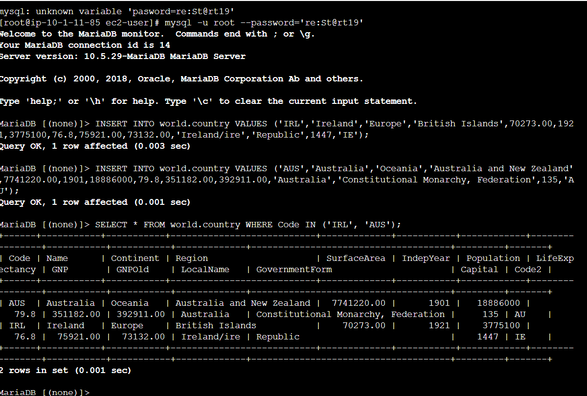
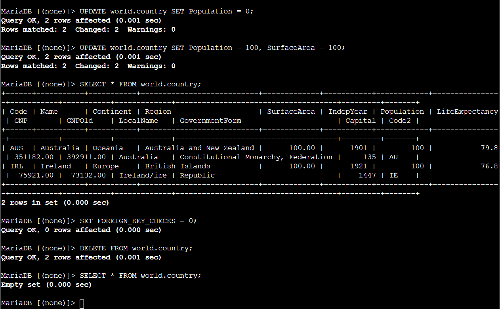
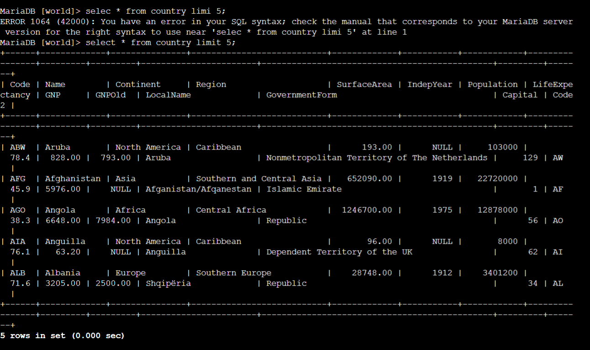

# Relational Database DML Operations: Data Insertion, Bulk Updates, Deletions & SQL Dump Restoration

This lab project documents practical Data Manipulation Language (DML) operations on a MySQL/MariaDB database in AWS. It covers executing explicit row insertions (`INSERT INTO`), mass data modifications (`UPDATE`), non-reversible row deletions (`DELETE`), and automated database restoration via a SQL dump backup file (`world.sql`).

---

## Scenario & Objectives

### Enterprise Operations Task
The database operations team required validation for data lifecycle management within the `world` relational database schema (`country`, `city`, `countrylanguage` tables). The objective is to validate data integrity during row insertions, evaluate the scope of unconditioned `UPDATE` and `DELETE` queries, and execute CLI SQL script restoration from external backup dumps.

Key Objectives:
- Insert explicit data rows (`IRL` Ireland and `AUS` Australia) into table `country`.
- Execute global `UPDATE` queries modifying column attributes across table rows.
- Execute unconditioned `DELETE FROM` statements with foreign key constraint overrides.
- Import mass relational data using a database backup script (`mysql < world.sql`).

---

## Technical Workflow & Execution

### 1. Row Insertion (INSERT INTO)
- Executed `INSERT INTO world.country VALUES (...)` for Ireland (`IRL`) and Australia (`AUS`).
- Verified data entry via filtered query:
  ```sql
  SELECT * FROM world.country WHERE Code IN ('IRL', 'AUS');
  ```



---

### 2. Global Modification & Deletion (UPDATE & DELETE)
- Executed unconditioned `UPDATE` statements modifying `Population` and `SurfaceArea` across all table rows.
- Disabled foreign key checks (`SET FOREIGN_KEY_CHECKS = 0;`) and performed a full table purge:
  ```sql
  DELETE FROM world.country;
  ```
- Verified empty table state (`Empty set (0.000 sec)`).



---

### 3. Automated Database Restoration via SQL Dump File
- Exited MySQL shell and executed CLI database restoration using the `/home/ec2-user/world.sql` backup file:
  ```bash
  mysql -u root --password='re:St@rt!9' < /home/ec2-user/world.sql
  ```
- Reconnected to MySQL shell and verified restoration across all three relational tables (`city`, `country`, `countrylanguage`).
- Executed `SELECT * FROM country LIMIT 5;` confirming full dataset recovery (Aruba, Afghanistan, Angola, Anguilla, Albania).



---

## Technical Takeaways

1. Unconditioned DML Risk: Omitting a `WHERE` clause in `UPDATE` or `DELETE` statements affects 100% of rows in a table, reinforcing the need for strict transaction management (`BEGIN`, `COMMIT`, `ROLLBACK`) and `WHERE` filtering.
2. Foreign Key Constraint Overrides: Disabling `FOREIGN_KEY_CHECKS` permits table truncations but risks breaking referential integrity if child tables contain orphaned records.
3. Disaster Recovery via SQL Dumps: Restoring relational databases via CLI input redirection (`mysql < backup.sql`) enables rapid automated recovery during disaster recovery (DR) procedures.
