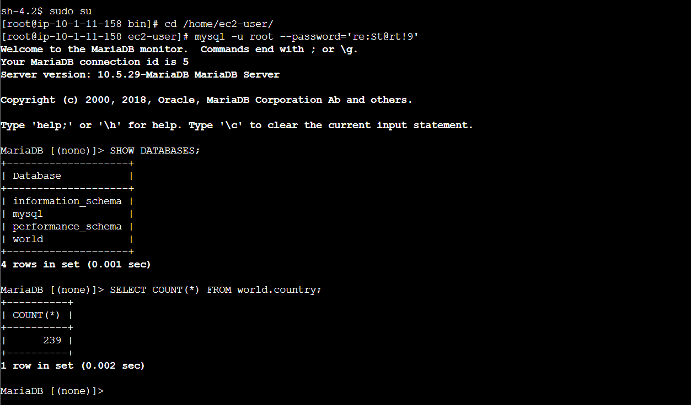
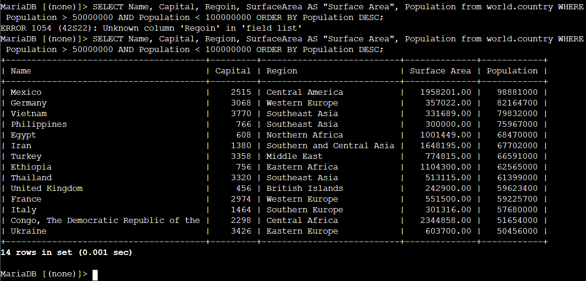
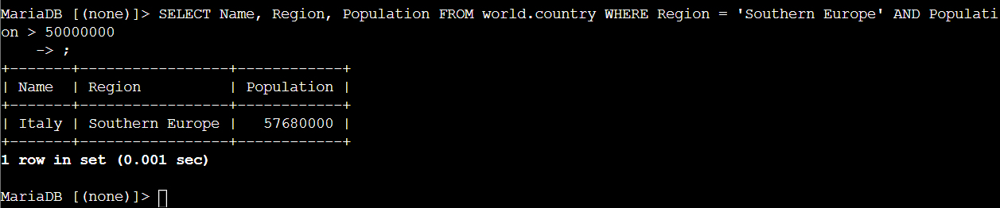

# Relational Data Querying: SQL DQL Operations, Column Aliasing & Compound Filtering

This lab project documents practical Data Query Language (DQL) operations on a relational database instance running MySQL/MariaDB in AWS. It covers executing `SELECT` statements, row aggregation via `COUNT()`, column aliasing (`AS`), multi-column sorting (`ORDER BY ASC/DESC`), and complex logical filtering using `WHERE` and `AND` operators.

---

## Scenario & Objectives

### Enterprise Data Analytics Task
The organization's database operations team required data extraction and filtering across the `world.country` relational dataset. The objective is to construct optimized SQL DQL queries, format user-friendly column headers, apply sorting rules, and execute targeted multi-condition searches to answer specific business intelligence questions.

Key Objectives:
- Execute `SELECT` queries and calculate total table rows using `COUNT(*)`.
- Format query output headers using column aliasing (`AS "Surface Area"`).
- Sort data result sets using `ORDER BY Population DESC`.
- Construct multi-condition search filters using `WHERE` and `AND` logical operators.
- Complete Challenge: Identify Southern European nations with population thresholds exceeding 50,000,000.

---

## Technical Workflow & Execution

### 1. Database Inspection & Row Aggregation (COUNT)
- Authenticated to MySQL shell via Session Manager host (`mysql -u root --password='...'`).
- Executed `SHOW DATABASES;` and verified `world` database availability.
- Executed `SELECT COUNT(*) FROM world.country;` returning a total of **239** country records.



---

### 2. Column Aliasing, Sorting & Compound Logical Filtering
- Formatted output headers with `AS` aliases and applied descending sorting (`ORDER BY Population DESC`).
- Filtered countries with population parameters between 50,000,000 and 100,000,000:
  ```sql
  SELECT Name, Capital, Region, SurfaceArea AS "Surface Area", Population 
  FROM world.country 
  WHERE Population > 50000000 AND Population < 100000000 
  ORDER BY Population DESC;
  ```



---

### 3. Challenge Resolution
- Question: *Which country in Southern Europe has a population greater than 50,000,000?*
- Constructed target query:
  ```sql
  SELECT Name, Region, Population 
  FROM world.country 
  WHERE Region = 'Southern Europe' AND Population > 50000000;
  ```
- Result: Successfully identified **Italy** (Region: Southern Europe, Population: 57,680,000).



---

## Technical Takeaways

1. Read-Only Query Safety (DQL): Unlike DML (`UPDATE`, `DELETE`), DQL `SELECT` statements query data without mutating backend database state, ensuring safe analytical reporting.
2. Index-Aware Sorting Performance: Applying `ORDER BY` on indexed numeric columns (e.g. `Population`) optimizes query execution speed across large relational datasets.
3. Logical Operator Precision: Combining `WHERE` with `AND` enforces strict conjunction, narrowing analytical query outputs to exact business requirement boundaries.
