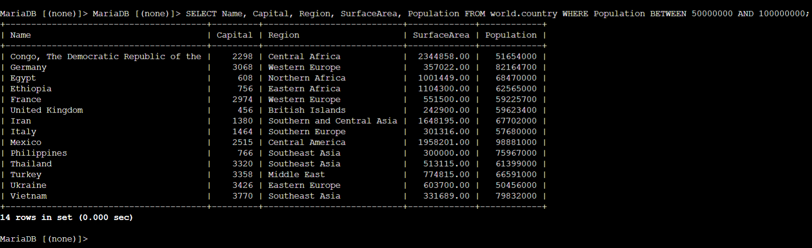
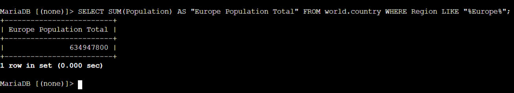
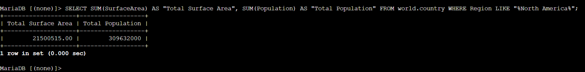

# Relational Conditional Filtering: Range Operators, Wildcard Pattern Matching & Aggregate Analytics

This lab project documents advanced Data Query Language (DQL) conditional search techniques on a relational MySQL/MariaDB database in AWS. It covers inclusive range filtering via `BETWEEN`, fuzzy string pattern matching via `LIKE "%..."`, case-insensitive string evaluation via `LOWER()`, and mathematical aggregation using `SUM()`.

---

## Scenario & Objectives

### Enterprise Analytics Task
The database operations team required multi-condition pattern search and summary analytics across the `world.country` dataset. The objective is to construct query predicates using range evaluation, wildcard pattern matching, and mathematical summation functions to compute geographic demographic totals.

Key Objectives:
- Execute inclusive range filtering using `BETWEEN 50000000 AND 100000000`.
- Execute wildcard string searches using `LIKE "%Europe%"` combined with `SUM(Population)`.
- Format aggregate column outputs using `AS` aliases (`AS "Europe Population Total"`).
- Execute case-insensitive string pattern matching using `LOWER(Region) LIKE "%central%"`.
- Complete Challenge: Compute total surface area and total population for North America.

---

## Technical Workflow & Execution

### 1. Inclusive Range Filtering (BETWEEN Operator)
- Authenticated to MySQL shell via Session Manager host (`mysql -u root --password='...'`).
- Executed `BETWEEN` range evaluation returning 14 matching country records:
  ```sql
  SELECT Name, Capital, Region, SurfaceArea, Population 
  FROM world.country 
  WHERE Population BETWEEN 50000000 AND 100000000;
  ```



---

### 2. Wildcard Pattern Search (LIKE) & Mathematical Aggregation (SUM)
- Applied wildcard pattern matching (`LIKE "%Europe%"`) and mathematical summation (`SUM(Population)`):
  ```sql
  SELECT SUM(Population) AS "Europe Population Total" 
  FROM world.country 
  WHERE Region LIKE "%Europe%";
  ```
- Calculated Total Europe Population: **634,947,800**.



---

### 3. Challenge Resolution
- Task: *Write a query to return the sum of the surface area and sum of the population of North America.*
- Constructed target query:
  ```sql
  SELECT SUM(SurfaceArea) AS "Total Surface Area", SUM(Population) AS "Total Population" 
  FROM world.country 
  WHERE Region LIKE "%North America%";
  ```
- Result: Total Surface Area = **21,500,515.00** | Total Population = **309,632,000**.



---

## Technical Takeaways

1. Range Evaluation Efficiency: Using `BETWEEN min AND max` replaces multi-predicate comparison statements (`>= AND <=`), reducing query complexity.
2. Wildcard Pattern Performance: Utilizing `LIKE "%pattern%"` enables flexible substring matching across text columns without requiring exact string equality.
3. Multi-Metric Aggregation: Combining multiple `SUM()` functions in a single `SELECT` statement processes complex demographic rollups in a single database execution pass.
