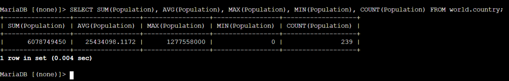
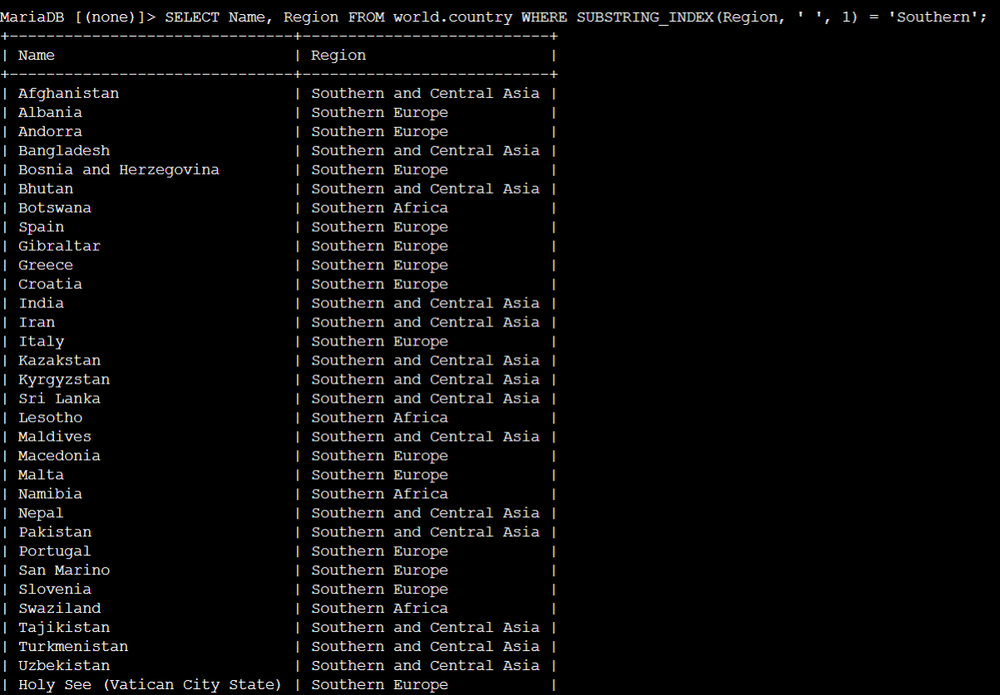
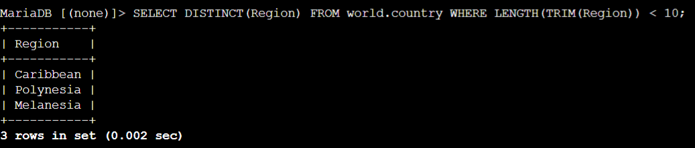
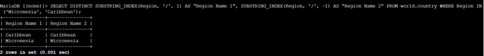

# Relational Database Functions: Mathematical Aggregation, String Parsing & Deduplication

This lab project documents practical SQL function operations on a relational MySQL/MariaDB database in AWS. It covers mathematical aggregate functions (`SUM`, `AVG`, `MAX`, `MIN`, `COUNT`), string parsing using `SUBSTRING_INDEX()`, string length and whitespace trimming using `LENGTH()` and `TRIM()`, and duplicate record removal using `DISTINCT()`.

---

## Scenario & Objectives

### Enterprise Data Engineering Task
The organization's database operations team required multi-metric analytical summaries and text transformation across the `world.country` dataset. The objective is to evaluate aggregate distribution metrics, perform string tokenization on delimited region fields, and filter duplicate string outputs.

Key Objectives:
- Compute summary metrics using aggregate functions (`SUM`, `AVG`, `MAX`, `MIN`, `COUNT`).
- Tokenize text columns using delimiter splitting via `SUBSTRING_INDEX()`.
- Clean text fields and filter by length using `LENGTH(TRIM(Column))`.
- De-duplicate record result sets using `DISTINCT()`.
- Complete Challenge: Split delimited region strings into two separate aliased output columns ("Region Name 1" & "Region Name 2").

---

## Technical Workflow & Execution

### 1. Statistical Aggregation (SUM, AVG, MAX, MIN, COUNT)
- Authenticated to MySQL shell via Session Manager host (`mysql -u root --password='...'`).
- Executed multi-aggregate summary query across all population records:
  ```sql
  SELECT SUM(Population), AVG(Population), MAX(Population), MIN(Population), COUNT(Population) 
  FROM world.country;
  ```



---

### 2. String Tokenization & Text Deduplication
- Tokenized region text by space delimiter:
  ```sql
  SELECT Name, Region 
  FROM world.country 
  WHERE SUBSTRING_INDEX(Region, ' ', 1) = 'Southern';
  ```
- Evaluated trimmed string length and de-duplicated region outputs:
  ```sql
  SELECT DISTINCT(Region) 
  FROM world.country 
  WHERE LENGTH(TRIM(Region)) < 10;
  ```




---

### 3. Challenge Resolution
- Task: *Write a query to return rows splitting region strings into two separate aliased columns.*
- Constructed target query:
  ```sql
  SELECT DISTINCT 
    SUBSTRING_INDEX(Region, '/', 1) AS "Region Name 1", 
    SUBSTRING_INDEX(Region, '/', -1) AS "Region Name 2" 
  FROM world.country 
  WHERE Region IN ('Micronesia', 'Caribbean');
  ```



---

## Technical Takeaways

1. Single-Pass Aggregate Summarization: Executing `SUM`, `AVG`, `MAX`, `MIN`, and `COUNT` within a single `SELECT` statement minimizes I/O overhead by scanning dataset pages once.
2. Delimited Text Tokenization: `SUBSTRING_INDEX(string, delimiter, count)` provides powerful in-engine string parsing without requiring external ETL scripting.
3. Output Refinement with `DISTINCT` & `TRIM`: Combining `TRIM()` with `LENGTH()` removes extraneous padding before applying `DISTINCT()` filtering, preventing false duplicates caused by whitespace variations.
