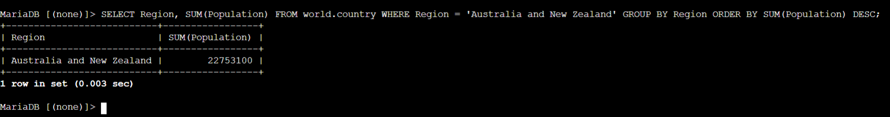
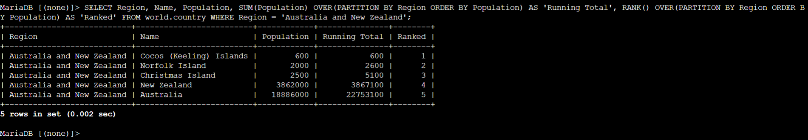
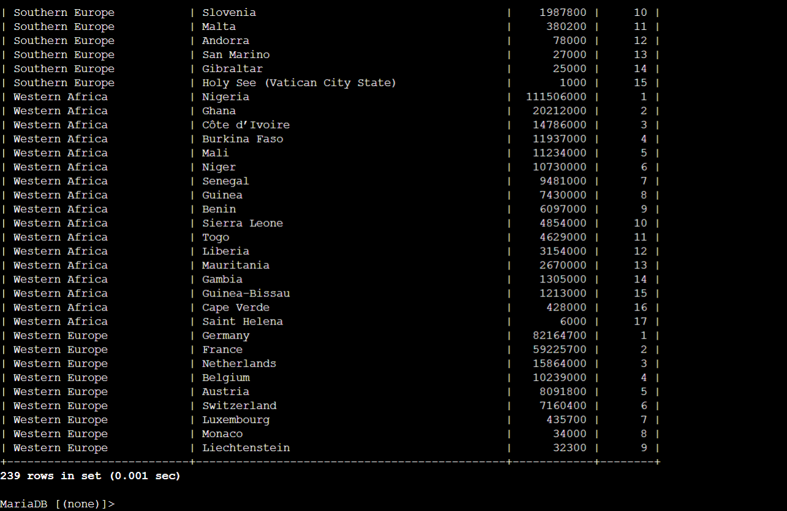

# Advanced Data Analytics: Relational Aggregation (GROUP BY) & Window Functions (OVER / RANK)

This lab project documents advanced analytical SQL grouping and windowing operations on a relational MySQL/MariaDB database in AWS. It covers dataset partitioning via `GROUP BY`, cumulative running totals via `SUM() OVER(PARTITION BY ...)`, and analytical ranking via `RANK() OVER(PARTITION BY ... ORDER BY ... DESC)`.

---

## Scenario & Objectives

### Enterprise Business Intelligence Task
The database operations team required multi-level regional aggregation and analytical ranking across the `world.country` dataset. The objective is to evaluate aggregate regional totals without collapsing individual row details, compute cumulative running totals, and generate dynamic population rankings per geographic region.

Key Objectives:
- Group records and compute regional totals using `GROUP BY` and `SUM()`.
- Compute cumulative running totals per region using `SUM(Population) OVER(PARTITION BY Region ORDER BY Population)`.
- Compute analytical row positions using `RANK() OVER(PARTITION BY Region ORDER BY Population)`.
- Complete Challenge: Rank all countries within their respective regions by population in descending order.

---

## Technical Workflow & Execution

### 1. Relational Grouping & Aggregation (GROUP BY)
- Authenticated to MySQL shell via Session Manager host (`mysql -u root --password='...'`).
- Executed `GROUP BY Region` with `SUM(Population)` filtering for *Australia and New Zealand*:
  ```sql
  SELECT Region, SUM(Population) 
  FROM world.country 
  WHERE Region = 'Australia and New Zealand' 
  GROUP BY Region 
  ORDER BY SUM(Population) DESC;
  ```



---

### 2. Window Functions & Cumulative Analytics (OVER & RANK)
- Computed cumulative running totals and analytical ranks without compressing record rows:
  ```sql
  SELECT Region, Name, Population, 
         SUM(Population) OVER(PARTITION BY Region ORDER BY Population) AS 'Running Total', 
         RANK() OVER(PARTITION BY Region ORDER BY Population) AS 'Ranked' 
  FROM world.country 
  WHERE Region = 'Australia and New Zealand';
  ```



---

### 3. Challenge Resolution
- Task: *Write a query to rank the countries in each region by their population from largest to smallest.*
- Constructed target query:
  ```sql
  SELECT Region, Name, Population, 
         RANK() OVER(PARTITION BY Region ORDER BY Population DESC) AS "Ranked" 
  FROM world.country;
  ```
- Result: Successfully partitioned all 239 country records across their respective regions and generated dynamic population rankings in descending order.



---

## Technical Takeaways

1. `GROUP BY` vs Window Functions (`OVER`): While `GROUP BY` collapses individual records into a single summary row per group, `OVER(PARTITION BY ...)` retains row-level granularity while computing windowed aggregations.
2. Cumulative Metric Calculation: Using `SUM() OVER(PARTITION BY ... ORDER BY ...)` calculates cumulative running totals dynamically within database partitions without requiring procedural loops.
3. Analytical Ranking Precision: `RANK() OVER(PARTITION BY ... ORDER BY ... DESC)` generates competitive rank positions per partition, handling ties and ordering large datasets efficiently.
