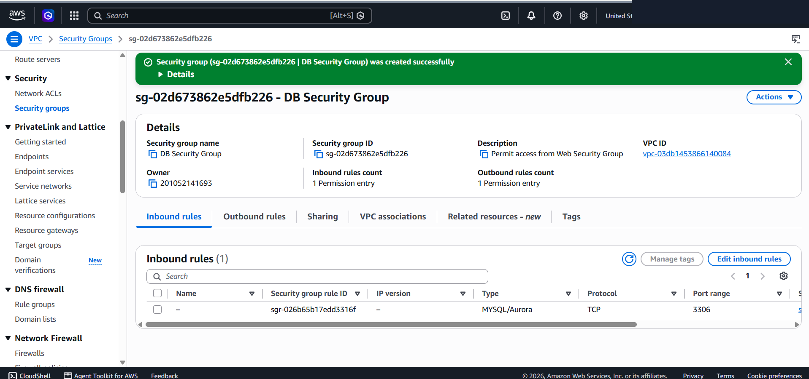
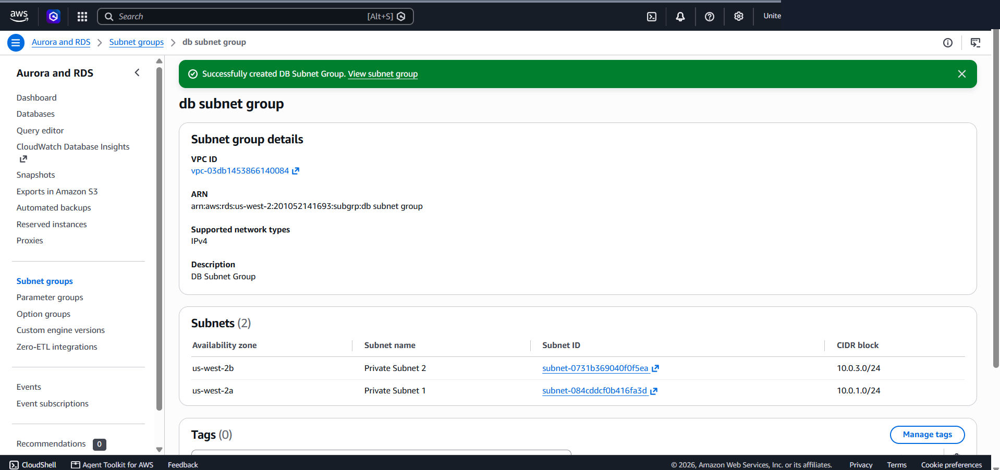
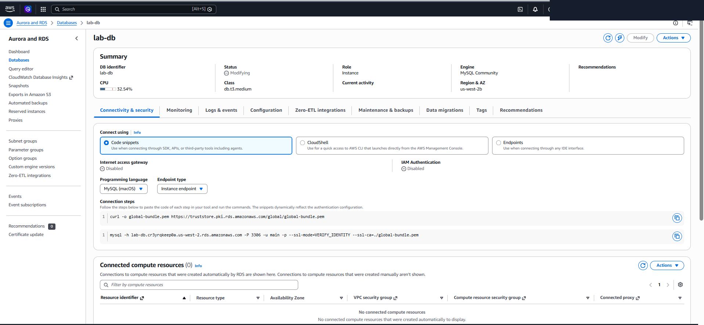
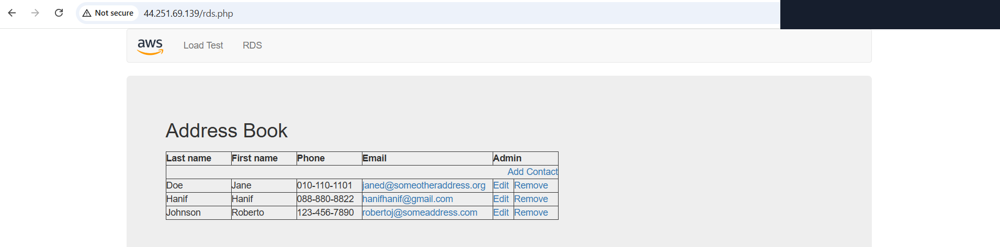

# Managed Multi-AZ Relational Database: Amazon RDS Integration with Decoupled Frontend Workloads

This lab project documents the end-to-end provisioning of an Amazon Relational Database Service (RDS) MySQL instance deployed in a Multi-AZ high-availability architecture across private subnets, integrated with an EC2 frontend web application.

---

## Scenario & Requirements

### Enterprise Requirement
An enterprise web application requires a highly available, scalable relational database backend isolated from direct internet access. Frontend web servers running in public subnets must interact securely with the managed database engine via least-privilege perimeter controls.

Key Specifications:
- **Managed Engine**: Amazon RDS MySQL (`db.t3.medium`, Multi-AZ deployment across 2 Availability Zones).
- **Subnet Group**: `DB Subnet Group` spanning `Private Subnet 1` (`10.0.1.0/24`) and `Private Subnet 2` (`10.0.3.0/24`).
- **Perimeter Control**: `DB Security Group` permitting inbound MySQL traffic (TCP Port 3306) **strictly** from `Web Security Group`.
- **Application Integration**: Address Book PHP Web Application configured to query and persist contact records to the RDS endpoint.

---

## Target Network & Database Architecture

```
+---------------------------------------------------------------------------------------+
| AWS Cloud Region (us-west-2)                                                           |
|                                                                                       |
|  Lab VPC (10.0.0.0/16)                                                                |
|  +-----------------------------------+     +-----------------------------------+  |
|  | Availability Zone A (us-west-2a)   |     | Availability Zone B (us-west-2b)   |  |
|  |                                   |     |                                   |  |
|  |  +-----------------------------+  |     |  +-----------------------------+  |  |
|  |  | Public Subnet 1             |  |     |  | Public Subnet 2             |  |  |
|  |  | (EC2 Web Server)            |  |     |  |                             |  |  |
|  |  | Port 80 HTTP / 443 HTTPS    |  |     |  +-----------------------------+  |  |
|  |  +-----------------------------+  |     |                                   |  |
|  |                |                  |     |                                   |  |
|  |                | Port 3306        |     |                                   |  |
|  |                v                  |     |                                   |  |
|  |  +-----------------------------+  | Synchronous |  +-----------------------------+  |
|  |  | Private Subnet 1            |  | Dynamic Rep |  | Private Subnet 2            |  |
|  |  | (10.0.1.0/24)               |  |<===========>|  | (10.0.3.0/24)               |  |
|  |  | Amazon RDS Primary Instance |  | Replication |  | Amazon RDS Standby Instance |  |
|  |  | Engine: MySQL (lab-db)      |  |             |  | (Multi-AZ Standby)          |  |
|  |  +-----------------------------+  |     |  +-----------------------------+  |  |
|  +-----------------------------------+     +-----------------------------------+  |
+---------------------------------------------------------------------------------------+
```

---

## Technical Implementation Workflow

### 1. Inter-Service Security Group Provisioning
- Provisioned `DB Security Group` in `Lab VPC`.
- Inbound Rule: Allowed TCP Port 3306 (MySQL/Aurora) from Source `Web Security Group`.



---

### 2. Multi-AZ DB Subnet Group Allocation
- Created `DB Subnet Group` bound to `Lab VPC`.
- Assigned dual private subnets across 2 Availability Zones (`Private Subnet 1: 10.0.1.0/24` & `Private Subnet 2: 10.0.3.0/24`).



---

### 3. Multi-AZ Amazon RDS Deployment
- Launched Amazon RDS MySQL (`lab-db`, `db.t3.medium`) with Multi-AZ DB instance deployment.
- Connected DB Subnet Group and `DB Security Group`.
- Disabled Public Access (`Public access: No`).
- Verified Instance Status transition to `Available` and retrieved instance endpoint.



---

### 4. Application Integration & Real-Time Data Persistence
- Navigated to Web Application interface at `http://<WebServer-IP>/rds.php`.
- Submitted RDS endpoint connection parameters (Database: `lab`, User: `main`).
- Verified active connection to Address Book web application and performed real-time data entry (Added record `Hanif Hanif`).



---

## Architectural Key Takeaways

1. Multi-AZ Synchronous Replication: Amazon RDS Multi-AZ deployments synchronously replicate database transactions across multiple Availability Zones, offering high availability and zero data loss during datacenter failures.
2. Least-Privilege Inter-Service Firewalling: Restricting database security group access specifically to the security group ID of frontend web servers (rather than IP ranges) enforces strict least-privilege cloud network isolation.
3. Decoupled Tiering Architecture: Isolating database engines within private subnets while routing web traffic through public subnets guarantees strong security boundaries for enterprise workloads.
