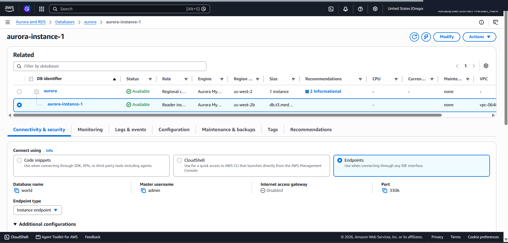
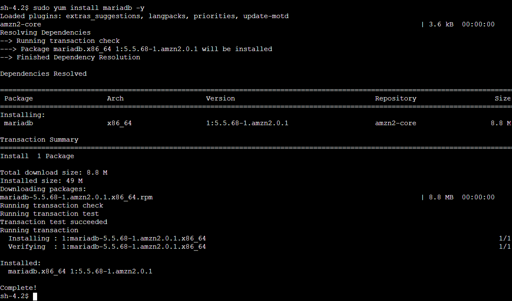
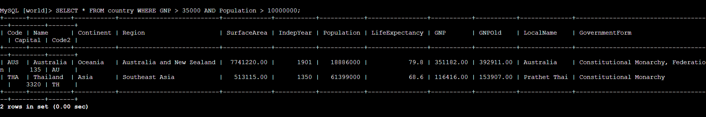

# Enterprise Managed Relational Database: Amazon Aurora (MySQL Compatible) Cluster Deployment & EC2 Connectivity

This lab project documents the end-to-end architecture and deployment of a high-performance managed relational database cluster using **Amazon Aurora (MySQL Compatible)** on AWS RDS. It covers DB cluster provisioning in a custom VPC (`LabVPC`), security group inter-service scoping (`DBSecurityGroup`), MariaDB client installation on an EC2 application host (`Command Host`), and SQL schema DDL/DML/DQL execution over cluster Writer Endpoints.

---

## Scenario & Objectives

### Enterprise High-Performance Database Deployment
The enterprise required a high-availability, fully managed relational database engine capable of delivering commercial-grade performance with MySQL compatibility. The objective is to provision an Amazon Aurora cluster (`aurora`), attach it to private DB subnets (`dbsubnetgroup`), restrict inbound traffic to port 3306 from authorized EC2 compute instances, and execute relational data queries across the `world.country` dataset.

Key Objectives:
- Provision an Amazon Aurora (MySQL Compatible) DB cluster (`aurora`) with a primary Writer instance (`db.t3.medium`).
- Attach cluster endpoints to private subnets inside `LabVPC` and configure `DBSecurityGroup`.
- Provision MariaDB client tools on an EC2 instance via AWS SSM Session Manager (`sudo yum install mariadb -y`).
- Authenticate to Aurora Writer Endpoint over TCP port 3306.
- Execute DDL table creation (`country`), populate relational dataset rows (`INSERT INTO`), and perform analytical filtering (`GNP > 35000 AND Population > 10000000`).

---

## Architecture Diagram & Security Scoping

```
+-----------------------------------------------------------------------------------+
| AWS Cloud (us-west-2 / LabVPC)                                                    |
|                                                                                   |
|  +-------------------------------+         +-----------------------------------+  |
|  | Public Subnet                 |         | Private DB Subnet (dbsubnetgroup) |  |
|  |                               |         |                                   |  |
|  |  [EC2: Command Host]          |         |  [Amazon Aurora Cluster: aurora]  |  |
|  |  - MariaDB Client installed   | ======> |  - Writer Endpoint (Port 3306)    |  |
|  |  - SSM Session Manager Access | TCP 3306|  - Engine: Aurora MySQL 8.0       |  |
|  |                               |         |  - Security Group: DBSecurityGroup|  |
|  +-------------------------------+         +-----------------------------------+  |
+-----------------------------------------------------------------------------------+
```

---

## Technical Workflow & Execution

### 1. Amazon Aurora DB Cluster Provisioning
- Navigated to Amazon RDS console and selected **Aurora (MySQL Compatible)** engine with Dev/Test template.
- Configured DB cluster identifier `aurora`, master credentials (`admin`), and DB instance class `db.t3.medium`.
- Assigned network parameters: `LabVPC`, `dbsubnetgroup`, disabled public access, and attached `DBSecurityGroup`.
- Initialized default database `world` and verified Writer Cluster Endpoint availability.



---

### 2. EC2 Application Host Setup (Session Manager & MariaDB Client)
- Connected to EC2 `Command Host` via AWS SSM Session Manager.
- Installed MariaDB client package via `yum`:
  ```bash
  sudo yum install mariadb -y
  ```



---

### 3. Aurora Cluster Connection & SQL Execution (DDL/DML/DQL)
- Authenticated to Aurora Writer Endpoint over port 3306:
  ```bash
  mysql -u admin --password='admin123' -h aurora.cluster-xxxxxx.us-west-2.rds.amazonaws.com
  ```
- Selected initial database (`USE world;`) and created `country` table schema.
- Populated sample records (`INSERT INTO country VALUES (...)`).
- Executed multi-condition analytical query:
  ```sql
  SELECT * FROM country WHERE GNP > 35000 AND Population > 10000000;
  ```
- Result: Successfully returned matching records for **Australia** (GNP: 351,182, Population: 18,886,000) and **Thailand** (GNP: 116,416, Population: 61,399,000).



---

## Technical Takeaways

1. Aurora Cluster Architecture: Amazon Aurora decouples compute from storage, replicating 6 copies of data across 3 Availability Zones automatically, delivering up to 5x throughput of standard MySQL.
2. Writer vs Reader Endpoints: The Cluster (Writer) Endpoint handles all DDL/DML write operations and routes to the primary DB instance, while Reader Endpoints load-balance read-only analytical traffic across replicas.
3. Security Group Scoping: Restricting DB access by keeping `Public access = No` and allowing inbound port 3306 exclusively from the EC2 application security group prevents unauthorized public database exposure.
