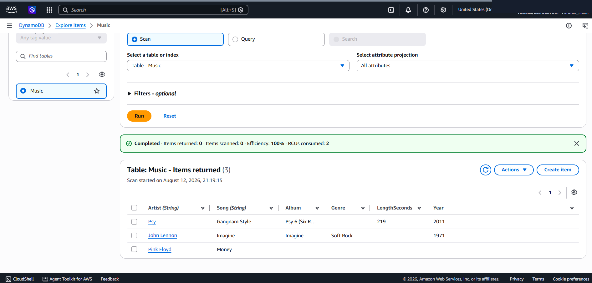
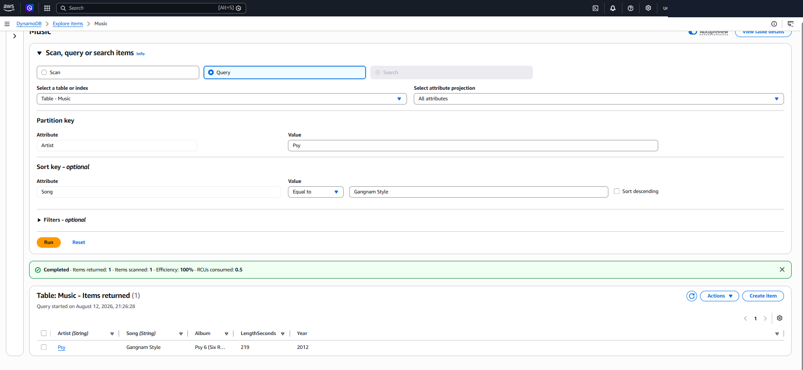
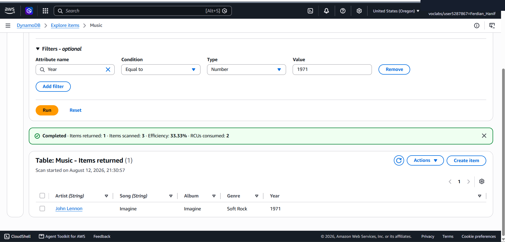

# Managed NoSQL Database: Amazon DynamoDB Schemaless Data Modeling, Item Mutation & Query vs. Scan Efficiency

This lab project documents the end-to-end configuration and data operations on **Amazon DynamoDB**, a fully managed, serverless NoSQL key-value and document database service on AWS. It covers table provisioning with composite primary keys (Partition Key `Artist` + Sort Key `Song`), schemaless item population with heterogeneous attributes, item attribute mutation, indexed `Query` vs full-table `Scan` performance comparison, and lifecycle table deletion.

---

## Scenario & Objectives

### Enterprise NoSQL Key-Value & Document Store
The organization required a high-scale, low-latency NoSQL database to store dynamic music metadata. The objective is to design a DynamoDB table (`Music`) using composite keys, store items with flexible non-relational schemas, modify non-key attributes dynamically, evaluate search performance between indexed `Query` operations and unindexed `Scan` operations, and execute controlled table deletion.

Key Objectives:
- Provision a serverless NoSQL table (`Music`) with Partition Key `Artist` (String) and Sort Key `Song` (String).
- Insert heterogeneous items without a rigid predefined schema (`Pink Floyd`, `John Lennon` with `Genre`, `Psy` with `LengthSeconds`).
- Perform item attribute mutation (updating Psy's release `Year` from 2011 to 2012).
- Execute indexed `Query` operations targeting composite primary keys (`Artist` = Psy, `Song` = Gangnam Style).
- Execute unindexed `Scan` operations with attribute filters (`Year` = 1971 returning John Lennon).
- Perform table lifecycle teardown to prevent unnecessary resource consumption.

---

## Technical Workflow & Execution

### 1. NoSQL Table Provisioning & Schemaless Item Population
- Created DynamoDB table `Music` using composite primary keys: Partition Key `Artist` (S) and Sort Key `Song` (S).
- Populated 3 items with distinct attribute structures:
  - Item 1: `Pink Floyd` | `Money` | `The Dark Side of the Moon` | `Year`: 1973
  - Item 2: `John Lennon` | `Imagine` | `Imagine` | `Year`: 1971 | `Genre`: Soft rock
  - Item 3: `Psy` | `Gangnam Style` | `Psy 6 Part 1` | `Year`: 2011 | `LengthSeconds`: 219

---

### 2. Item Attribute Mutation & High-Performance Query Operation
- Updated item attribute `Year` for Psy from 2011 to 2012.
- Executed `Query` operation targeting primary keys (`Artist` = Psy, `Song` = Gangnam Style).
- Measured performance: Single-digit millisecond response time consuming minimal Read Capacity Units (RCUs: 0.5).

---

### 3. Filtered Scan Operation & Resource Cleanup
- Executed `Scan` operation across all table items with an attribute filter (`Year` = 1971).
- Result: Successfully retrieved John Lennon (`Imagine`, `Soft rock`, `1971`).
- Evaluated performance: Consumed 2 RCUs by scanning all 3 items to evaluate the filter predicate.
- Performed controlled table deletion via `Delete` confirmation.

---

## Technical Takeaways

1. Schemaless Data Flexibility: Unlike RDBMS engines requiring `ALTER TABLE` DDL migrations for new columns, DynamoDB allows each item to contain unique attributes independently.
2. Query vs. Scan Performance Architecture:
   - **Query**: Searches indexed primary keys directly, returning targeted items with predictable single-digit millisecond latency regardless of dataset size.
   - **Scan**: Reads every item in the table before evaluating filter expressions, resulting in higher RCU consumption and linear latency degradation as dataset size grows.
3. Serverless Provisioning & Lifecycle Safety: DynamoDB manages physical partition splitting and replication automatically, requiring zero server maintenance or OS patching.
