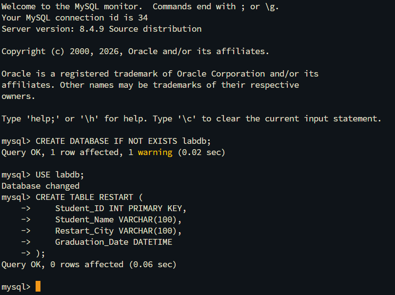
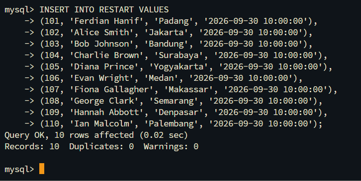
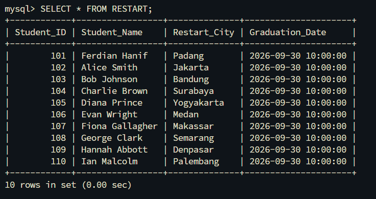
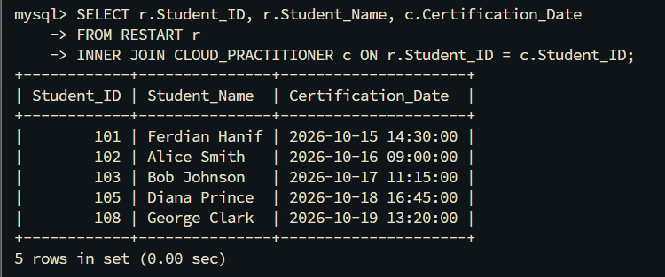

# Challenge Lab: Build Your DB Server and Interact With Your DB

This challenge lab project documents the end-to-end deployment of an **Amazon RDS MySQL** instance in a custom VPC (`Lab VPC`), SSH client setup on an EC2 host (`Web Server 1`), authentication troubleshooting, DDL schema creation, DML data population, and relational `INNER JOIN` analytical querying across multi-table student certification records.

---

## Scenario & Objectives

### Enterprise Relational Database Provisioning & Schema Integration
The enterprise required a dedicated managed database server to track student program enrollment (`RESTART`) and certification achievement (`CLOUD_PRACTITIONER`). The challenge objective is to launch a single-AZ Amazon RDS MySQL instance (`lab-db`), configure security groups (`Web Security Group`), establish secure client connectivity via SSH/Termius, resolve client-server authentication plugin mismatches, and execute relational SQL queries.

Key Objectives:
- Provision a Single-AZ Amazon RDS MySQL instance (`db.t3.micro` / `db.t3.small`) inside `Lab VPC`.
- Attach `Web Security Group` and configure inbound rule port 3306.
- Establish SSH access to `Web Server 1` via Termius using PEM key authentication.
- Resolve client-server authentication plugin mismatches (`caching_sha2_password` vs MariaDB/MySQL 8 client upgrade).
- Create `RESTART` schema (Student ID, Name, City, Graduation Date) and populate 10 rows.
- Create `CLOUD_PRACTITIONER` schema (Student ID, Certification Date) and populate 5 rows.
- Execute `INNER JOIN` query to correlate student graduation and certification data.

---

## Technical Workflow & Execution

### 1. Amazon RDS Provisioning & Security Scoping
- Launched Amazon RDS MySQL DB instance (`lab-db`) with `db.t3.micro` instance class.
- Configured parameters: Dev/Test template, Single DB instance, General Purpose SSD (`gp2`), disabled Enhanced Monitoring.
- Attached `Web Security Group` with inbound TCP port 3306 allowed from EC2 host.

---

### 2. Client Authentication & Troubleshooting (RCA)
- Connected to `Web Server 1` via SSH using Termius and PEM private key.
- Encrypted Connection Issue: Encountered `ERROR 2059 (HY000): Authentication plugin 'caching_sha2_password' cannot be loaded`.
- Root Cause Analysis (RCA): Default MariaDB client package on Amazon Linux 2 lacks the `caching_sha2_password.so` module required by MySQL 8.0 server authentication.
- Resolution: Upgraded client to official `mysql-community-client` v8.0 and executed `hash -r` to reset Bash binary path caching.

---

### 3. DDL & DML Execution for `RESTART` Table
- Executed DDL statement:
  ```sql
  CREATE TABLE RESTART (
      Student_ID INT PRIMARY KEY,
      Student_Name VARCHAR(100),
      Restart_City VARCHAR(100),
      Graduation_Date DATETIME
  );
  ```



- Populated 10 sample student records:
  ```sql
  INSERT INTO RESTART VALUES (101, 'Ferdian Hanif', 'Padang', '2026-09-30 10:00:00'), ...;
  ```



- Verified populated table rows (`SELECT * FROM RESTART;`):



---

### 4. DDL & DML Execution for `CLOUD_PRACTITIONER` Table
- Executed DDL statement:
  ```sql
  CREATE TABLE CLOUD_PRACTITIONER (
      Student_ID INT PRIMARY KEY,
      Certification_Date DATETIME
  );
  ```


- Populated 5 certification records:
  ```sql
  INSERT INTO CLOUD_PRACTITIONER VALUES (101, '2026-10-15 14:30:00'), ...;
  ```


- Verified populated table rows (`SELECT * FROM CLOUD_PRACTITIONER;`):


---

### 5. Relational `INNER JOIN` Query Execution
- Executed multi-table join query:
  ```sql
  SELECT r.Student_ID, r.Student_Name, c.Certification_Date
  FROM RESTART r
  INNER JOIN CLOUD_PRACTITIONER c ON r.Student_ID = c.Student_ID;
  ```
- Result: Successfully correlated and displayed 5 matching certified student records (`Ferdian Hanif`, `Alice Smith`, `Bob Johnson`, `Diana Prince`, `George Clark`).



---

## Technical Takeaways

1. Client-Server Authentication Alignment: MySQL 8.0 defaults to `caching_sha2_password`. Legacy MariaDB clients fail to load this shared object library, requiring a client binary upgrade to `mysql-community-client` v8.0.
2. Bash Binary Location Caching: Removing a package (`yum remove`) while installing a replacement binary leaves stale path entries in Bash. Running `hash -r` forces Bash to re-index system `$PATH` locations.
3. Relational Data Integrity: Utilizing Primary Keys (`Student_ID`) across `RESTART` and `CLOUD_PRACTITIONER` tables ensures strict referential integrity and zero-duplication `INNER JOIN` performance.
