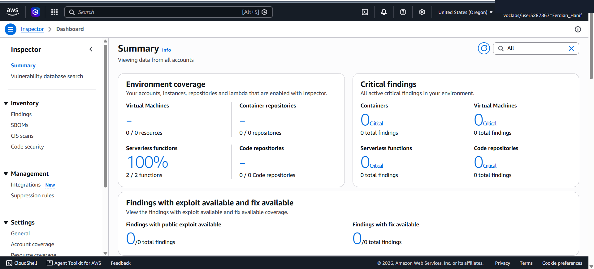
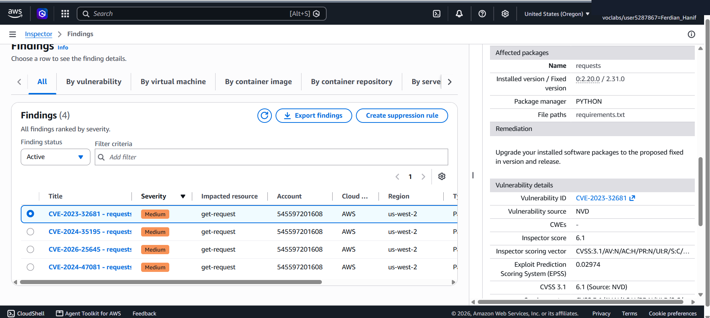
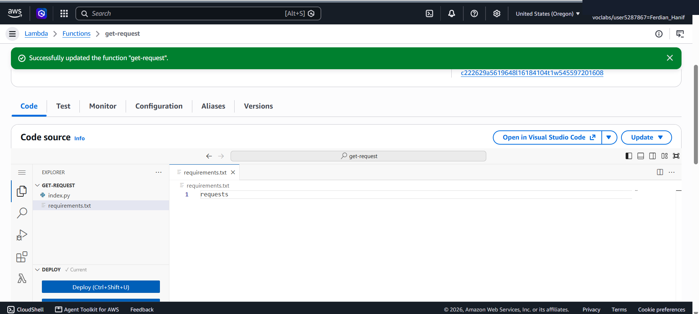
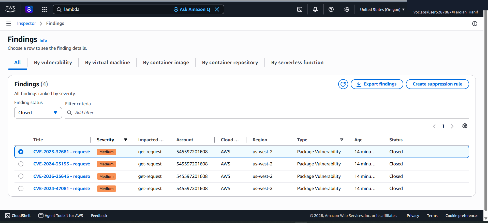

# Automated Security & Vulnerability Remediation: Amazon Inspector Assessment on Serverless AWS Lambda

This lab project documents the end-to-end activation, automated security vulnerability scanning, NVD/CVE report analysis, and code remediation workflow using **Amazon Inspector** across serverless **AWS Lambda** functions. It covers continuous scanning setup, Common Vulnerabilities and Exposures (CVE) identification (`CVE-2023-32681` on `requests==2.20.0`), dependency version remediation in `requirements.txt`, and automated closed-status verification.

---

## Scenario & Objectives

### Enterprise DevSecOps Vulnerability Management
AnyCompany required an automated, continuous security assessment tool to scan deployed application code and package dependencies for known vulnerabilities without interrupting initial development velocity. The objective is to enable Amazon Inspector, evaluate detected package vulnerabilities against the National Vulnerability Database (NVD), remediate outdated dependencies in AWS Lambda (`get-request`), and confirm automated scan closure upon function re-deployment.

Key Objectives:
- Activate Amazon Inspector for continuous automated vulnerability scanning across AWS Lambda serverless functions.
- Achieve 100% environment coverage across deployed serverless resources.
- Analyze active findings (`CVE-2023-32681` - Medium Severity) affecting the `get-request` Lambda function.
- Remediate package dependencies in `requirements.txt` by unpinning `requests==2.20.0` to auto-fetch the latest secure release.
- Deploy updated Lambda code and verify automated finding status transition from `Active` to `Closed`.

---

## Technical Workflow & Execution

### 1. Amazon Inspector Activation & Environment Coverage
- Activated Amazon Inspector service to initiate continuous vulnerability scanning.
- Verified 100% serverless environment coverage across deployed Lambda functions (`get-request`).

---

### 2. Active Finding Review & CVE Analysis
- Inspected active findings report within Amazon Inspector console.
- Identified `CVE-2023-32681` affecting Python package `requests==2.20.0` inside `get-request` Lambda function.
- Analyzed CVSS scoring (6.1 Medium Severity) and reviewed NIST NVD remediation guidance.

---

### 3. Serverless Code Remediation & Function Re-deployment
- Navigated to AWS Lambda console and selected `get-request` function.
- Modified `requirements.txt` to remove pinned vulnerable version constraint (`requests==2.20.0` -> `requests`).
- Deployed function update to trigger automated re-scanning by Amazon Inspector.

---

### 4. Vulnerability Closure Verification
- Re-examined Amazon Inspector Findings dashboard with `Finding status: Closed`.
- Confirmed `CVE-2023-32681 - requests` successfully transitioned to `Closed` status.
- Verified updated `Last scanned` timestamp under Lambda resources coverage.

---

## Technical Takeaways

1. Continuous Automated Scanning: Amazon Inspector automatically initiates scans upon new AWS Lambda deployments or container image pushes, eliminating manual security audit delays.
2. Dependency Version Pinning Risks: Hardcoding outdated package versions (`requests==2.20.0`) introduces known CVE exploits into production environments. Unpinning or using automated patch management guarantees secure dependency resolution.
3. DevSecOps Lifecycle Feedback: Amazon Inspector provides real-time verification of remediation actions, moving finding status from `Active` to `Closed` automatically once fixed code is deployed.
