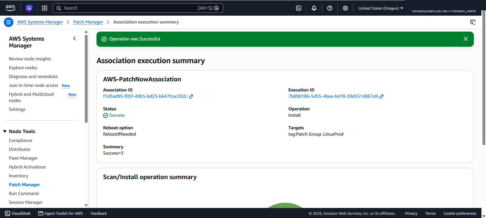
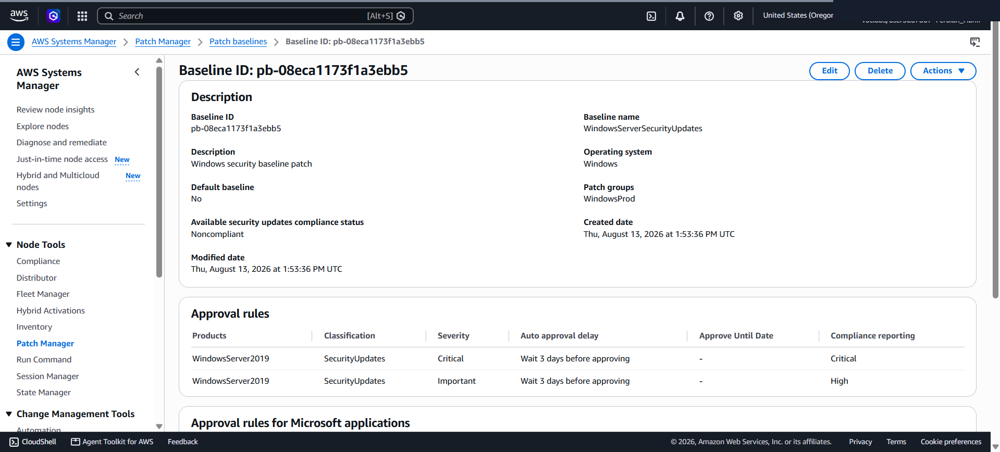
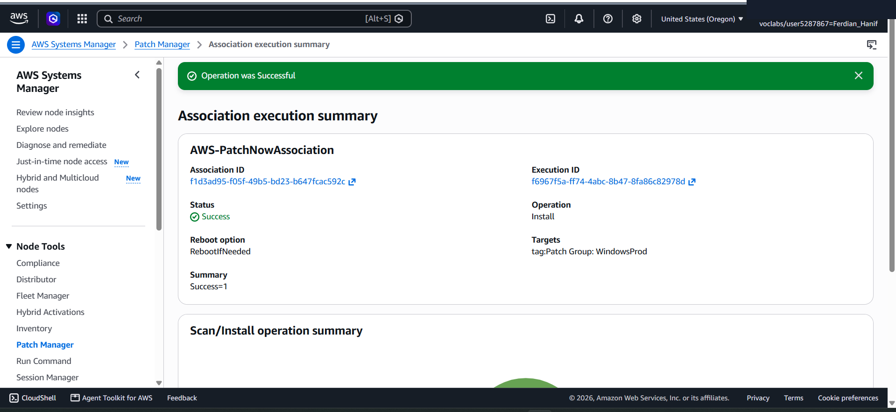
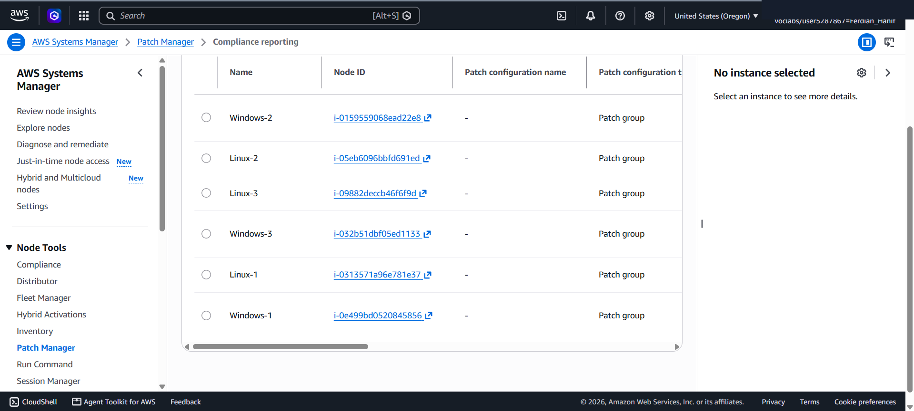

# Automated Systems Hardening & Security Compliance: AWS Systems Manager Patch Manager

This lab project documents the end-to-end configuration of enterprise system hardening, OS patch management, and automated security compliance across multi-platform fleet instances (Linux & Windows) using **AWS Systems Manager (SSM) Patch Manager**. It covers default baseline execution, custom patch baseline creation with auto-approval rules (`WindowsServerSecurityUpdates`), patch group targeting (`LinuxProd` & `WindowsProd`), and enterprise compliance reporting.

---

## Scenario & Objectives

### Enterprise System Hardening & Compliance Policy
AnyCompany manages a heterogeneous fleet of Amazon EC2 instances running both Linux and Windows Server operating systems. To enforce organizational security baselines and minimize vulnerability exposure, system administrators require a centralized, policy-driven patching solution that automatically approves critical security updates while providing unified compliance reporting across all nodes.

Key Objectives:
- Utilize AWS Systems Manager (SSM) Patch Manager to enforce automated patch baselines.
- Execute automated patching (`Scan and install`) on Linux instances (`LinuxProd`) using `AWS-AmazonLinux2DefaultPatchBaseline`.
- Create a custom patch baseline (`WindowsServerSecurityUpdates`) for Windows Server 2019 specifying auto-approval delays (3 days) for `Critical` and `Important` security updates.
- Associate custom patch baselines with targeted patch groups (`WindowsProd`) and tag EC2 instances accordingly.
- Verify 100% fleet compliance reporting across all 6 managed nodes (3 Linux + 3 Windows instances).

---

## Technical Workflow & Execution

### 1. Linux Fleet Patching via Default Patch Baseline
- Targeted EC2 Linux instances using tag-based selection (`Patch Group: LinuxProd`).
- Triggered automated `Scan and install` operation utilizing `AWS-AmazonLinux2DefaultPatchBaseline`.
- Verified execution success across all 3 Linux nodes (`Linux-1`, `Linux-2`, `Linux-3`).

---

### 2. Custom Windows Patch Baseline & Patch Group Configuration
- Created custom patch baseline `WindowsServerSecurityUpdates` for Windows Server 2019.
- Defined granular approval rules:
  - **Rule 1**: Product: `WindowsServer2019` | Severity: `Critical` | Classification: `SecurityUpdates` | Auto-approval: `3 days` | Compliance: `Critical`
  - **Rule 2**: Product: `WindowsServer2019` | Severity: `Important` | Classification: `SecurityUpdates` | Auto-approval: `3 days` | Compliance: `High`
- Associated patch baseline with Patch Group `WindowsProd`.

---

### 3. Windows Instance Tagging & Patch Execution
- Applied resource tags (`Patch Group: WindowsProd`) to EC2 instances (`Windows-1`, `Windows-2`, `Windows-3`).
- Initiated `Patch now` operation calling SSM `AWS-RunPatchBaseline` document on `WindowsProd`.
- Monitored state manager execution and verified installation completion.

---

### 4. Fleet Compliance Reporting & Verification
- Navigated to Systems Manager Patch Manager Compliance Reporting dashboard.
- Verified 100% compliance status (`Compliant: 6`) across all 6 managed nodes.
- Audited individual node patching details to confirm 0 non-compliant vulnerabilities remaining.

---

## Technical Takeaways

1. Policy-Driven Centralized Patching: AWS Systems Manager Patch Manager decouples patch policies from individual OS agent scripts, allowing security teams to enforce uniform baselines across hybrid EC2 fleets.
2. Auto-Approval Staging & Risk Mitigation: Setting auto-approval delays (e.g., 3 days) ensures critical security patches are thoroughly vetted in staging environments before automatic rollout to production patch groups.
3. Unified Cross-Platform Auditing: Patch Manager provides a single dashboard to track compliance across Linux and Windows fleets, eliminating tool fragmentation during security audits.
