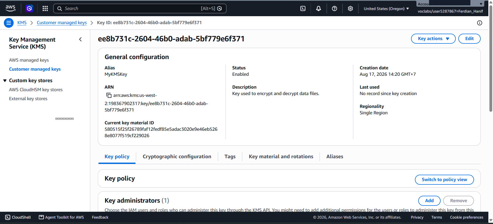
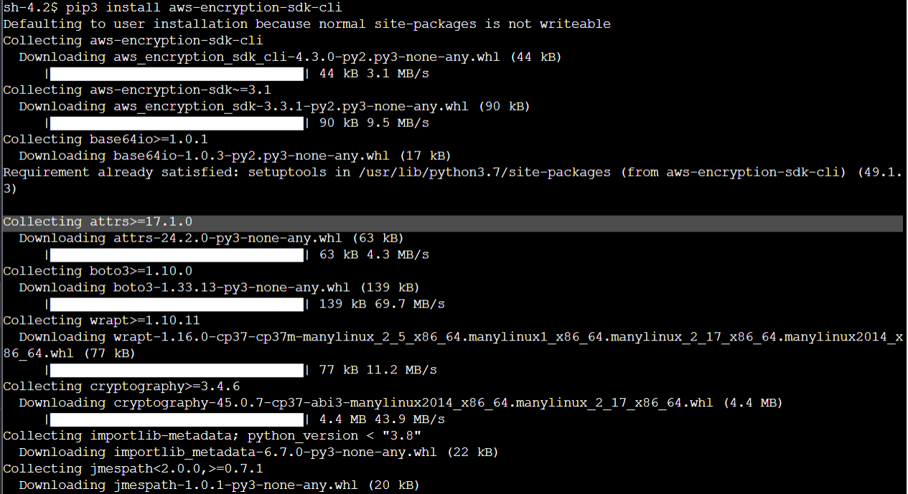
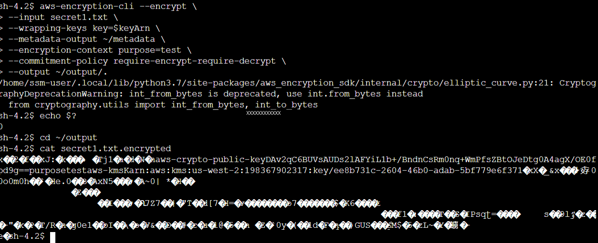
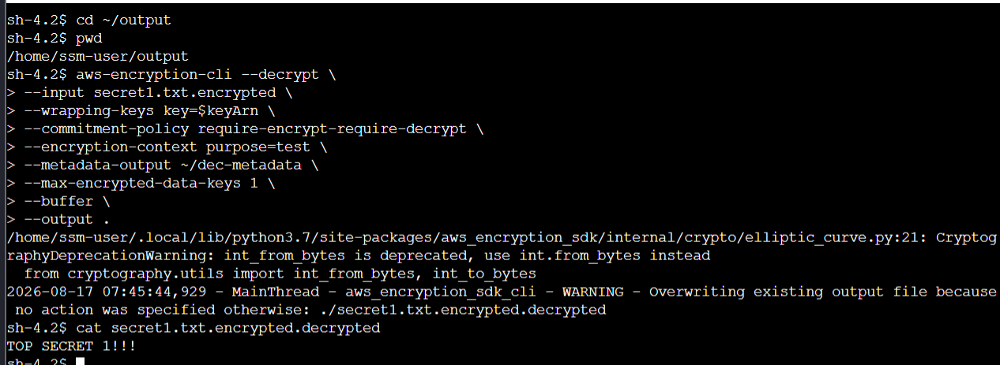

# Data Protection Using Encryption: AWS KMS & AWS Encryption CLI

This lab project documents the end-to-end implementation of data protection at rest and in transit using **AWS Key Management Service (AWS KMS)** and the **AWS Encryption CLI** (`aws-encryption-sdk-cli`). It covers symmetric Customer Managed Key (CMK) provisioning (AES-256 GCM), environment credential configuration on Amazon EC2 instances via AWS Systems Manager Session Manager, envelope encryption of sensitive plaintext files into scrambled ciphertext, and data integrity verification through successful decryption.

---

## Scenario & Objectives

### Enterprise Data Protection & Cryptographic Standards
AnyCompany requires a standardized, automated cryptographic solution to secure sensitive data stored on EC2 file servers. To enforce data privacy policies and comply with regulatory security frameworks, security engineers must implement envelope encryption using centralized AWS KMS keys, guaranteeing that sensitive payload data remains unreadable to unauthorized parties even if underlying storage media is exposed.

Key Objectives:
- Provision a Symmetric Customer Managed Key (`MyKMSKey`) in AWS KMS with custom key administrative and usage policies.
- Configure AWS credentials and deploy the AWS Encryption CLI (`aws-encryption-sdk-cli`) on an EC2 instance (`File Server`) via Systems Manager Session Manager.
- Encrypt sensitive plaintext files (`secret1.txt`) into ciphertext (`secret1.txt.encrypted`) using AWS KMS envelope encryption, key commitment policies, and custom encryption contexts.
- Decrypt ciphertext back to plaintext (`secret1.txt.encrypted.decrypted`) and verify 100% data integrity.

---

## Architecture Diagram

```
+-----------------------------------------------------------------------------------+
|                              AWS Management Console                               |
|  +-----------------------------------------------------------------------------+  |
|  | AWS Key Management Service (AWS KMS)                                        |  |
|  | - Key Type: Symmetric (AES-256 GCM)                                         |  |
|  | - Key Alias: MyKMSKey                                                       |  |
|  | - Key ARN: arn:aws:kms:us-west-2:XXXXXXXXXXXX:key/ee8b731c-2604-...        |  |
|  +-----------------------------------------------------------------------------+  |
+------------------------------------------|----------------------------------------+
                                           | AWS KMS Key Wrapping & Envelope Encryption
                                           v
+-----------------------------------------------------------------------------------+
| EC2 Instance: File Server (Linux) via SSM Session Manager                         |
|                                                                                   |
|  [ Plaintext ] -----------> ( AWS Encryption CLI ) ----------> [ Ciphertext ]      |
|  secret1.txt                 aws-encryption-cli --encrypt       secret1.txt.encrypted
|  "TOP SECRET 1!!!"                                              (Encrypted Bytes) |
|                                                                        |          |
|  [ Restored Data ] <------- ( AWS Encryption CLI ) <-------------------+          |
|  secret1.txt.encrypted.decrypted  aws-encryption-cli --decrypt                |
|  "TOP SECRET 1!!!"                                                                |
+-----------------------------------------------------------------------------------+
```

---

## Technical Workflow & Execution

### 1. Provisioning AWS KMS Symmetric Key (`MyKMSKey`)
- Navigated to AWS KMS and initiated symmetric key creation (`Key Type: Symmetric`, `Key Spec: SYMMETRIC_DEFAULT`).
- Configured key metadata:
  - **Alias**: `MyKMSKey`
  - **Description**: `Key used to encrypt and decrypt data files.`
- Defined key administrative and usage permissions assigned to the pre-configured `voclabs` IAM role.
- Extracted and verified the unique KMS Key ARN (`arn:aws:kms:us-west-2:XXXXXXXXXXXX:key/ee8b731c-2604-46b0-adab-5bf779e6f371`).



---

### 2. EC2 Credential Configuration & AWS Encryption CLI Deployment
- Connected to EC2 instance `File Server` utilizing AWS Systems Manager Session Manager.
- Configured temporary session credentials in `~/.aws/credentials`.
- Deployed AWS Encryption CLI with Python 3.7 compatibility dependencies:
  ```bash
  cd ~
  pip3 install "aws-encryption-sdk-cli<4.0" importlib-metadata
  export PATH=$PATH:/home/ssm-user/.local/bin
  ```



---

### 3. Plaintext Data Encryption & Ciphertext Generation
- Generated mock sensitive file `secret1.txt` containing `"TOP SECRET 1!!!"` and initialized the output directory.
- Saved KMS Key ARN to environment variable `$keyArn`.
- Executed CLI encryption with explicit key commitment (`require-encrypt-require-decrypt`) and additional authenticated data (`encryption-context purpose=test`):
  ```bash
  aws-encryption-cli --encrypt \
    --input secret1.txt \
    --wrapping-keys key=$keyArn \
    --metadata-output ~/metadata \
    --encryption-context purpose=test \
    --commitment-policy require-encrypt-require-decrypt \
    --output ~/output/.
  ```
- Checked return status (`echo $?` -> `0`) and inspected scrambled ciphertext output `secret1.txt.encrypted`.



---

### 4. Ciphertext Decryption & Payload Integrity Verification
- Executed CLI decryption targeting `secret1.txt.encrypted` with matching wrapping keys and encryption context:
  ```bash
  cd ~/output
  aws-encryption-cli --decrypt \
    --input secret1.txt.encrypted \
    --wrapping-keys key=$keyArn \
    --commitment-policy require-encrypt-require-decrypt \
    --encryption-context purpose=test \
    --metadata-output ~/dec-metadata \
    --max-encrypted-data-keys 1 \
    --buffer \
    --output .
  ```
- Printed decrypted file `secret1.txt.encrypted.decrypted` to confirm exact restoration of original plaintext `"TOP SECRET 1!!!"`.



---

## Technical Takeaways

1. Envelope Encryption Efficiency: AWS Encryption CLI uses envelope encryption where local data is encrypted with a Data Encryption Key (DEK), and the DEK is protected by the AWS KMS Customer Master Key (CMK), eliminating latency overhead for large file payloads.
2. Cryptographic Context Security: The `--encryption-context` parameter binds non-secret key-value pairs to the encrypted payload as Additional Authenticated Data (AAD). If the context fails to match during decryption, AWS KMS rejects the request, protecting against unauthorized data tampering.
3. Key Commitment & Integrity Enforcement: Enforcing `--commitment-policy require-encrypt-require-decrypt` guarantees that the ciphertext can only be decrypted by the exact key that produced it, mitigating cipher manipulation attacks.
