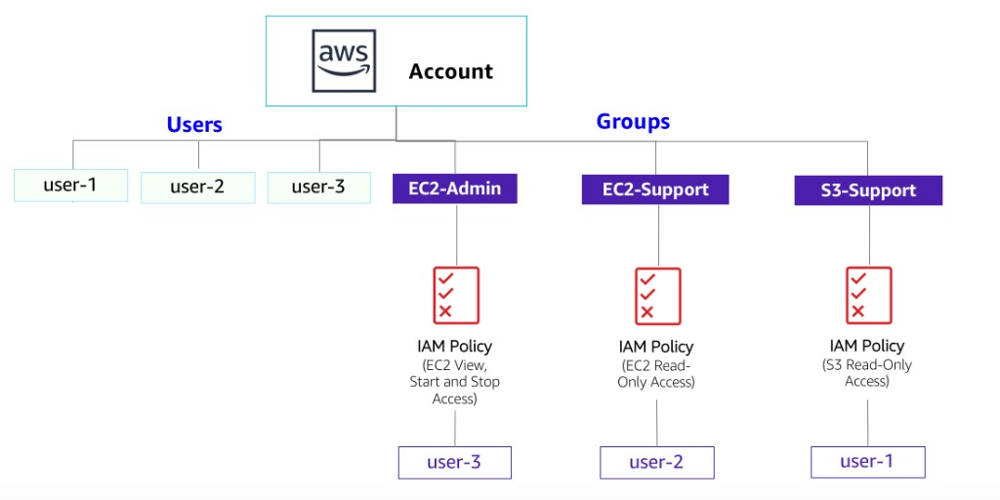
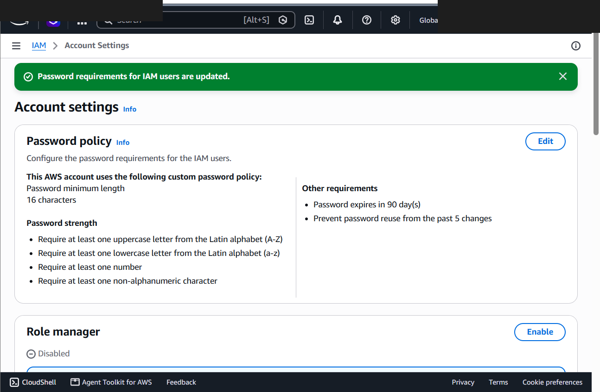
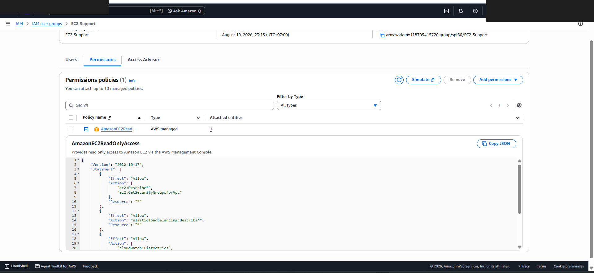
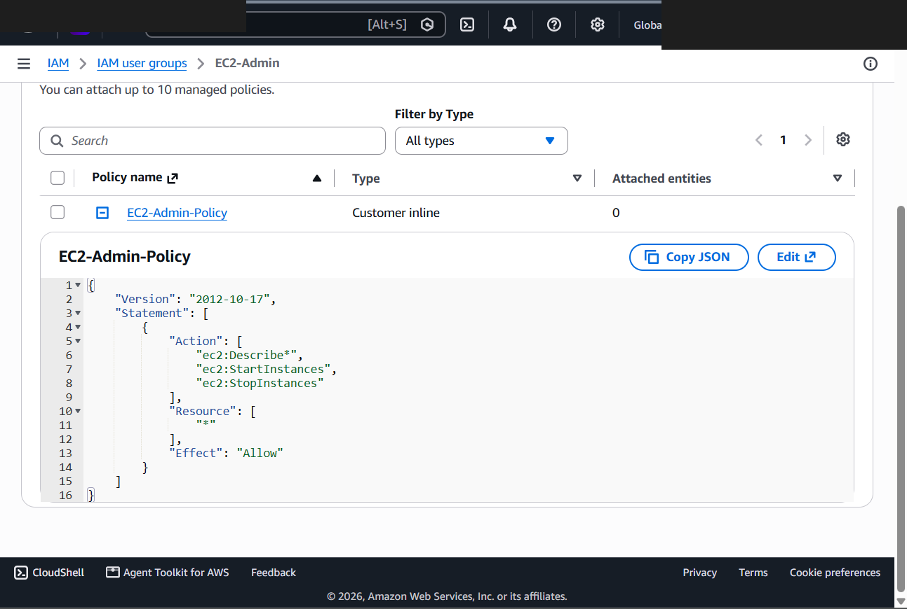
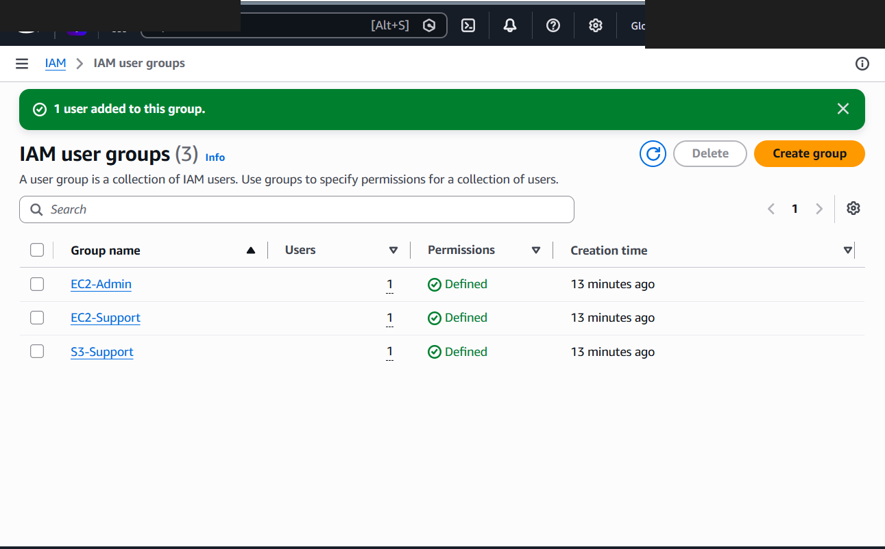
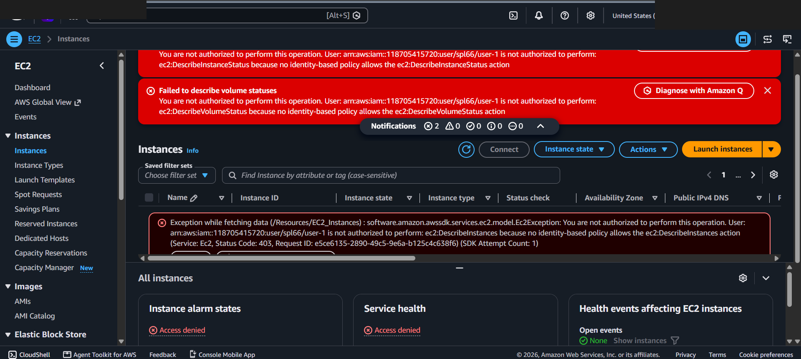
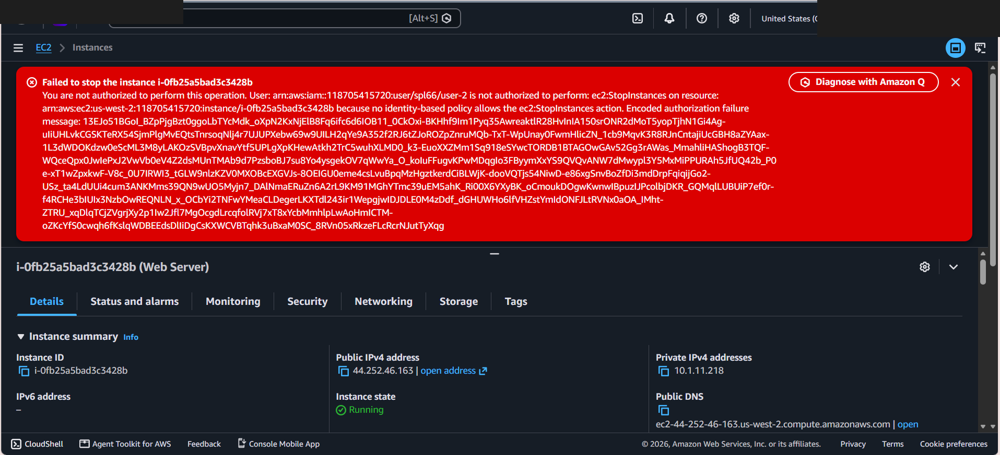
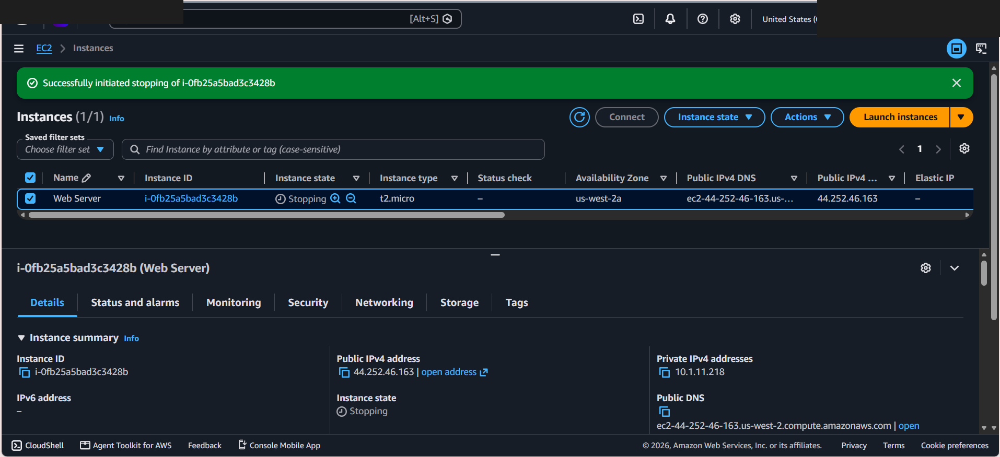

# AWS IAM User Management, Custom Password Policies & Access Control Testing

This lab documents configuring account-level security controls, managing IAM user groups, and evaluating permission boundaries across AWS IAM users using AWS Managed and Customer Inline policies.

---

## Scenario & Objectives

### Business Access Control Requirements
An organization requires structured identity management on AWS. New team members need specific access tailored to their job roles while adhering to least-privilege principles:
- **Account Password Policy**: Enforce strong password requirements across all IAM users in the account.
- **`user-1` (S3 Support)**: Requires read-only access to Amazon S3 buckets and objects, while denying access to Amazon EC2 resources.
- **`user-2` (EC2 Support)**: Requires read-only access to Amazon EC2 instances, while denying instance state mutations (stop/start) and S3 access.
- **`user-3` (EC2 Admin)**: Requires administrative permissions to describe, start, and stop Amazon EC2 instances.

---

## Architecture Overview



```
+-----------------------------------------------------------------------------------+
|                                  AWS Account                                      |
|                                                                                   |
|  +------------------------+  +------------------------+  +---------------------+  |
|  | Group: S3-Support      |  | Group: EC2-Support     |  | Group: EC2-Admin    |  |
|  | AWS Managed Policy:    |  | AWS Managed Policy:    |  | Customer Inline:    |  |
|  | AmazonS3ReadOnlyAccess |  | AmazonEC2ReadOnlyAccess|  | EC2 View/Start/Stop |  |
|  +-----------|------------+  +-----------|------------+  +----------|----------+  |
|              |                           |                          |             |
|              v                           v                          v             |
|           user-1                      user-2                     user-3           |
+-----------------------------------------------------------------------------------+
```

---

## Technical Implementation & Verified Screenshots

### 1. Account-Level Password Policy Configuration
- Navigated to **IAM Account Settings** and updated the default password policy.
- Enforced security requirements: Minimum 10 characters, uppercase, lowercase, numbers, non-alphanumeric symbols, 90-day expiration, and 5-password history retention.


*Figure 1: Custom Password Policy configured at the AWS Account level.*

---

### 2. IAM User Group Inspection & Policy Analysis
- Inspected pre-created IAM users (`user-1`, `user-2`, `user-3`) and verified zero initial individual permissions.
- Analyzed IAM Group configurations and attached policy JSON documents:
  - **`S3-Support` Group**: Attached `AmazonS3ReadOnlyAccess` managed policy.
  - **`EC2-Support` Group**: Attached `AmazonEC2ReadOnlyAccess` managed policy.
  - **`EC2-Admin` Group**: Attached Customer Inline policy `EC2-Admin-Policy`.


*Figure 2: AWS Managed Policy AmazonEC2ReadOnlyAccess attached to EC2-Support group.*


*Figure 3: Customer Inline Policy EC2-Admin-Policy attached to EC2-Admin group.*

---

### 3. User Group Membership Assignment
- Added **`user-1`** to the **`S3-Support`** user group.
- Added **`user-2`** to the **`EC2-Support`** user group.
- Added **`user-3`** to the **`EC2-Admin`** user group.


*Figure 4: IAM User Groups showing 1 active user assigned to each group.*

---

### 4. Permission Testing & Access Control Verification
- **Test 1: `user-1` Session (S3 Support)**
  - Access to Amazon S3: **ALLOWED** (Successfully browsed S3 bucket contents).
  - Access to Amazon EC2 Instances: **DENIED** (`You are not authorized to perform this operation`).


*Figure 5: Explicit Access Denied error when user-1 attempts to view EC2 resources.*

- **Test 2: `user-2` Session (EC2 Support)**
  - Access to Amazon EC2 Instances: **ALLOWED** (Viewed running EC2 instances).
  - Attempted EC2 State Mutation (`Stop Instance`): **DENIED** (`Failed to stop the instance. You are not authorized to perform this operation`).


*Figure 6: Unauthorized operation error when user-2 attempts to stop an EC2 instance.*

- **Test 3: `user-3` Session (EC2 Admin)**
  - Access to Amazon EC2 Instances: **ALLOWED** (Viewed running EC2 instances).
  - Attempted EC2 State Mutation (`Stop Instance`): **ALLOWED** (Successfully transitioned instance state to `Stopping`).


*Figure 7: Successful EC2 instance state mutation to Stopping executed by user-3.*

---

## Technical Takeaways

1. Group-Based Permission Management: Assigning permissions to IAM Groups rather than individual IAM Users simplifies access control and prevents policy drift as teams scale.
2. Managed vs. Inline Policies: AWS Managed Policies provide reusable baseline permissions across multiple entities, whereas Customer Inline Policies maintain strict 1-to-1 relationships for unique role edge cases.
3. Access Control Boundary Enforcement: IAM policies grant explicit permissions per service API call. Unauthorized actions default to implicit denial, guaranteeing that users without explicit permissions cannot access or modify resources.
