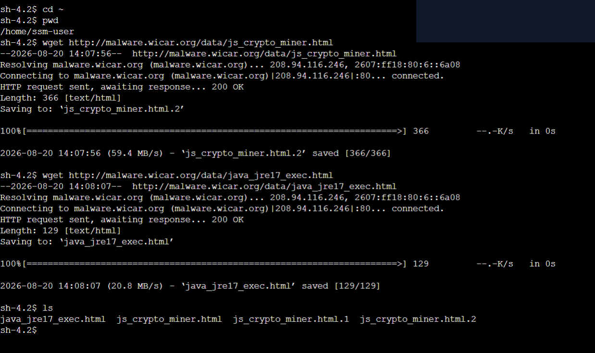
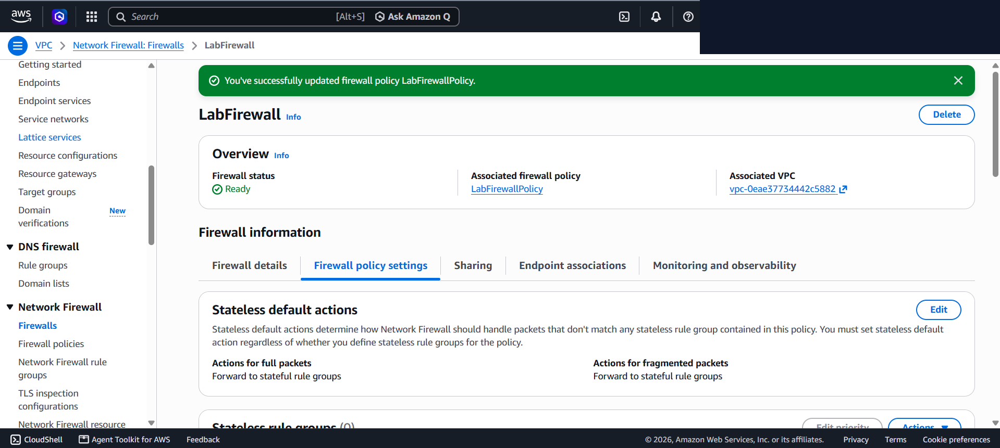
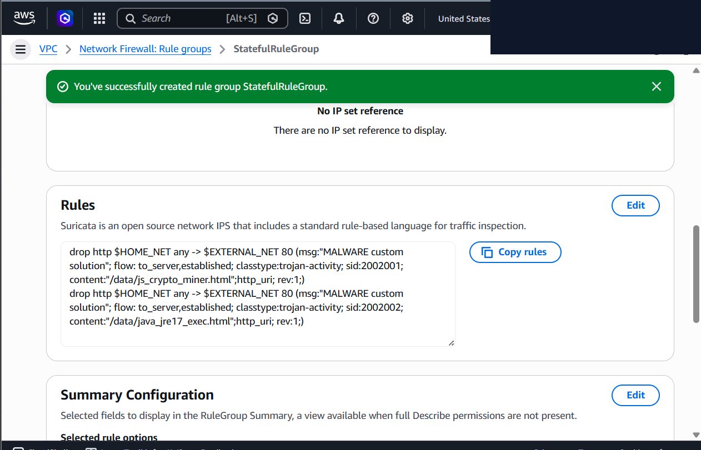
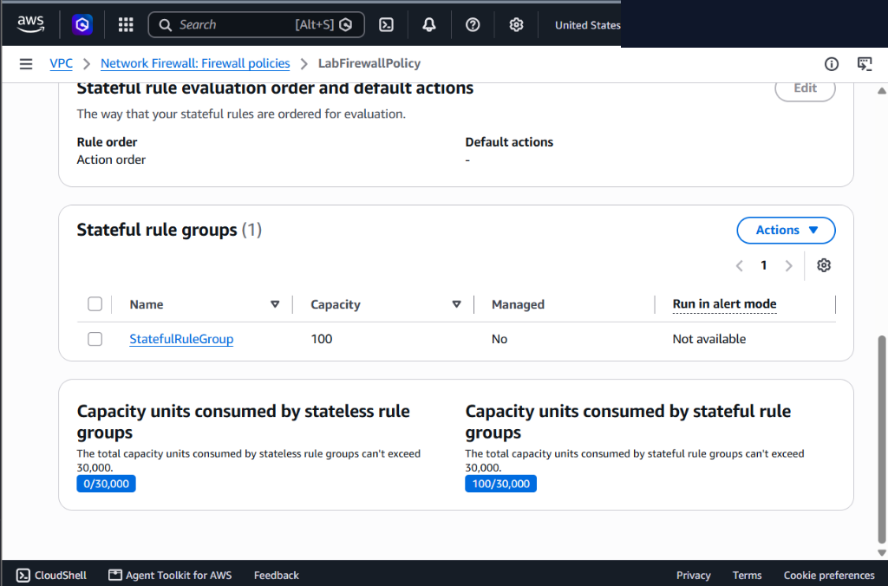
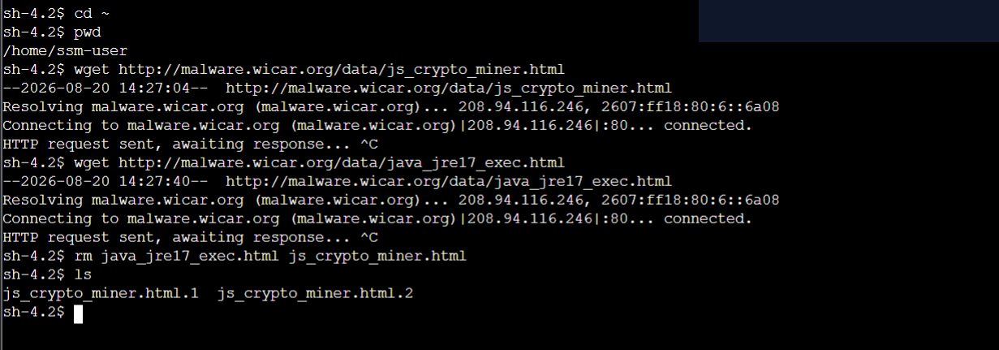

# AWS Network Firewall Outbound Threat Prevention & Suricata IPS Rules

This lab documents deploying perimeter security controls, configuring AWS Network Firewall policies, and engineering custom Suricata Intrusion Prevention System (IPS) rules to block malicious outbound HTTP payload downloads.

---

## Scenario & Objectives

### Enterprise Perimeter Hardening Requirements
An enterprise infrastructure team detected security incidents where internal workloads were downloading malicious files after connecting to external threat actor domains. The security engineering team was tasked with implementing perimeter-level network inspection:
- **Baseline Threat Assessment**: Confirm reachability of external malicious actor domains (`http://malware.wicar.org/data/`) prior to firewall enforcement.
- **Firewall Policy Refactoring**: Transition stateless network firewall rules to forward unhandled and fragmented packets to stateful deep packet inspection (DPI).
- **Suricata IPS Rule Engineering**: Deploy custom stateful Suricata rules targeting malicious HTTP URI payloads (`/data/js_crypto_miner.html` and `/data/java_jre17_exec.html`).
- **Remediation Validation**: Verify that outbound HTTP requests targeting malicious URIs are dropped at the VPC perimeter while preserving normal network flow.

---

## Architecture Overview

```
+---------------------------------------------------------------------------------------------------+
|                                  AWS NETWORK FIREWALL ARCHITECTURE                                |
+---------------------------------------------------------------------------------------------------+
|                                                                                                   |
|   [ TestInstance (EC2) ]  ---> ( Outbound HTTP Port 80 ) ---> [ AWS Network Firewall ]            |
|   (IP: 10.0.0.x)                                              |                                   |
|                                                               v                                   |
|                                                  [ Stateless Default Engine ]                     |
|                                                               | (Forward to Stateful)             |
|                                                               v                                   |
|                                                  [ Stateful Suricata Engine ]                     |
|                                                  (Rule: drop http_uri malware)                    |
|                                                               |                                   |
|                                                +--------------+--------------+                    |
|                                                |                             |                    |
|                                         [ 200 OK Allowed ]           [ Connection Dropped ]       |
|                                       (Non-malware traffic)         (Malware URI Match)           |
+---------------------------------------------------------------------------------------------------+
```

---

## Technical Implementation & Verified Screenshots

### 1. Pre-Enforcement Reachability Baseline
- Connected to the isolated `TestInstance` EC2 workload via AWS Systems Manager Session Manager.
- Issued command-line network file downloads (`wget`) to evaluate initial reachability to external malware distribution URLs.
- Verified that HTTP requests returned `200 OK` status codes and successfully saved malicious payload files (`js_crypto_miner.html` and `java_jre17_exec.html`) prior to firewall rule enforcement.


*Figure 1: Initial verification confirming malicious payloads download successfully (200 OK) before firewall enforcement.*

---

### 2. Stateless Default Action & Engine Routing
- Evaluated `LabFirewall` configuration and opened associated `LabFirewallPolicy`.
- Reconfigured *Stateless default actions* to route all unhandled and fragmented network packets directly to the stateful rules engine for flow-level evaluation.


*Figure 2: Reconfiguring stateless default actions to forward unhandled traffic to stateful rule groups.*

---

### 3. Suricata IPS Stateful Rule Group Engineering
- Provisioned a new stateful rule group (`StatefulRuleGroup`) with a capacity allocation of 100 capacity units.
- Configured Suricata-compatible IPS rules specifying Layer 7 HTTP URI content matching to drop outbound malware traffic:

```suricata
drop http $HOME_NET any -> $EXTERNAL_NET 80 (msg:"MALWARE custom solution"; flow: to_server,established; classtype:trojan-activity; sid:2002001; content:"/data/js_crypto_miner.html";http_uri; rev:1;)
drop http $HOME_NET any -> $EXTERNAL_NET 80 (msg:"MALWARE custom solution"; flow: to_server,established; classtype:trojan-activity; sid:2002002; content:"/data/java_jre17_exec.html";http_uri; rev:1;)
```


*Figure 3: Custom Suricata IPS stateful rule group targeting malicious URI HTTP content.*

---

### 4. Firewall Policy Association & Rule Enforcement
- Associated `StatefulRuleGroup` with `LabFirewallPolicy` under active stateful rule groups.
- Verified successful policy sync across the active `LabFirewall` deployment.


*Figure 4: Active firewall policy confirmation displaying StatefulRuleGroup attached to LabFirewallPolicy.*

---

### 5. Remediation Validation & Packet Drop Verification
- Re-established Session Manager connection to `TestInstance` to test outbound network traffic remediation.
- Executed `wget` requests targeting the malicious payload URIs.
- Observed that HTTP requests failed to establish payload delivery and hung indefinitely at `HTTP request sent, awaiting response...`, confirming that AWS Network Firewall successfully dropped all matching malware packets at the perimeter.


*Figure 5: Verification showing HTTP requests hanging indefinitely (awaiting response...), confirming packet drops at the VPC perimeter.*

---

## Technical Takeaways

1. **Layer 7 Deep Packet Inspection (DPI)**: Relying solely on IP address filtering is ineffective against modern malware hosts that dynamically change domain IPs. Suricata HTTP URI inspection enables precise payload signature matching.
2. **Stateless to Stateful Engine Handoff**: Forwarding unhandled stateless packets to stateful rule engines ensures flow tracking across TCP session states (`flow: to_server,established`).
3. **Perimeter Hardening & Blast Radius Reduction**: Dropping malicious outbound requests at the Network Firewall layer prevents stage-2 malware payload retrieval and stops command-and-control (C2) beaconing.
