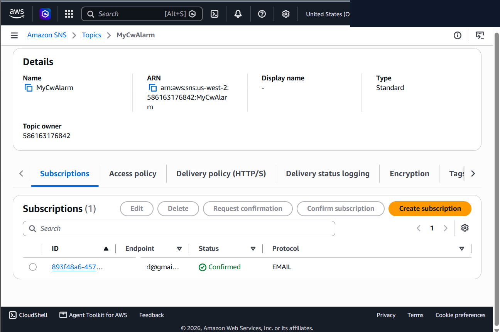
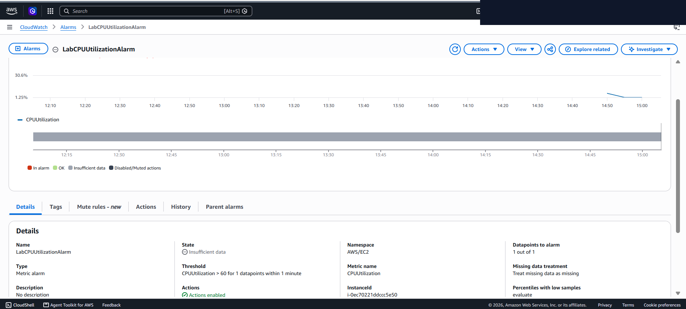
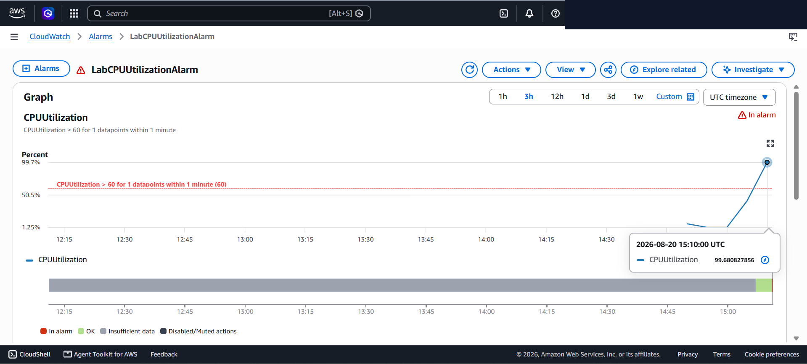
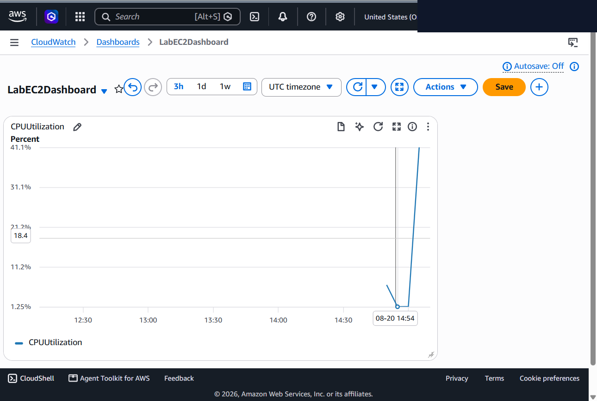

# EC2 Workload Monitoring, CloudWatch Threshold Alarms & SNS Alerting

This lab documents implementing automated infrastructure monitoring, configuring metric-based CloudWatch alarms, and integrating Amazon Simple Notification Service (SNS) to deliver real-time operational alerts upon CPU utilization anomalies.

---

## Scenario & Objectives

### Operational Observability Requirements
An enterprise IT operations team required proactive monitoring and alerting across production EC2 compute workloads to detect CPU spiking events indicative of system abuse, runaway processes, or malicious malware activity:
- **Notification Channel Integration**: Provision an Amazon SNS topic and configure email endpoint subscriptions with confirmed authorization tokens.
- **Metric Alarm Engineering**: Define a static CloudWatch metric alarm tracking EC2 `CPUUtilization` (>60% threshold over 1-minute evaluation windows).
- **Synthetic Load Testing**: Simulate malicious CPU spiking using Linux `stress` utility (`sudo stress --cpu 10 --timeout 400s`) to force EC2 CPU utilization to 100%.
- **Alert Delivery & Observability Validation**: Confirm automated state transition to `In alarm` and verify email notification delivery across the SNS subscription.

---

## Architecture Overview

```
+---------------------------------------------------------------------------------------------------+
|                                  CLOUDWATCH & SNS MONITORING ARCHITECTURE                         |
+---------------------------------------------------------------------------------------------------+
|                                                                                                   |
|   [ Stress Test EC2 ]  ---> ( CPU Load Spikes 100% ) ---> [ Amazon CloudWatch ]                   |
|   (sudo stress --cpu 10)                                          |                               |
|                                                                   v                               |
|                                                     [ LabCPUUtilizationAlarm ]                    |
|                                                     (Threshold: CPU > 60% 1-Min)                  |
|                                                                   |                               |
|                                                                   v (State Transition: IN ALARM)  |
|                                                                                                   |
|                                                      [ Amazon SNS Topic ]                         |
|                                                        (Name: MyCwAlarm)                          |
|                                                                   |                               |
|                                                                   v                               |
|                                                       [ Email Inbox Alert ]                       |
|                                                      (Confirmed Subscription)                     |
+---------------------------------------------------------------------------------------------------+
```

---

## Technical Implementation & Verified Screenshots

### 1. Amazon SNS Topic Provisioning & Subscription Confirmation
- Created a standard Amazon SNS topic (`MyCwAlarm`) to serve as the notification dispatch engine.
- Configured an Email protocol subscription pointing to the designated administrator endpoint.
- Executed out-of-band email confirmation to transition subscription state to `Confirmed`.


*Figure 1: Amazon SNS subscription details displaying Confirmed status for the active email endpoint.*

---

### 2. CloudWatch Metric Alarm Threshold Definition
- Navigated to **CloudWatch > Alarms** and created a new metric alarm (`LabCPUUtilizationAlarm`).
- Selected the `CPUUtilization` metric for the target EC2 compute workload (`Stress Test` instance).
- Defined metric evaluation parameters:
  - **Statistic**: `Average`
  - **Evaluation Period**: `1 minute`
  - **Threshold Type**: `Static` (>60% CPU utilization trigger)


*Figure 2: CloudWatch metric alarm threshold definition targeting EC2 CPUUtilization >60%.*

---

### 3. Synthetic CPU Stress Testing & Alarm State Transition
- Established Session Manager terminal sessions to the target EC2 workload.
- Executed Linux kernel stress testing to simulate a malicious workload spike:
  ```bash
  sudo stress --cpu 10 -v --timeout 400s
  ```
- Monitored real-time process execution using Linux `top` and evaluated CloudWatch metric aggregation.
- Verified that aggregated CPU utilization surpassed the 60% threshold, triggering an automated alarm state transition to `In alarm`.


*Figure 3: CloudWatch alarm graph displaying CPU utilization spike exceeding 60% and transitioning to In alarm state.*

---

### 4. Automated Alert Delivery & Remediation Verification
- Checked administrator email inbox following the CloudWatch alarm state transition.
- Verified receipt of the automated notification payload dispatched from Amazon SNS (`AWS Notification - ALARM: "LabCPUUtilizationAlarm"`).


*Figure 4: Automated email alert payload received via Amazon SNS confirming successful notification dispatch.*

---

## Technical Takeaways

1. **Proactive Performance Baselining**: Configuring short 1-minute CloudWatch evaluation windows ensures rapid detection of compute anomalies before system degradation impacts end users.
2. **Decoupled Notification Architecture**: Utilizing Amazon SNS decouples monitoring triggers from alert consumers, enabling multi-destination notification fanout (Email, SMS, Slack webhooks, AWS Lambda).
3. **Malware & Resource Hijacking Detection**: Unscheduled 100% CPU utilization spikes are primary indicators of unauthorized crypto-mining malware or rogue daemon execution.
