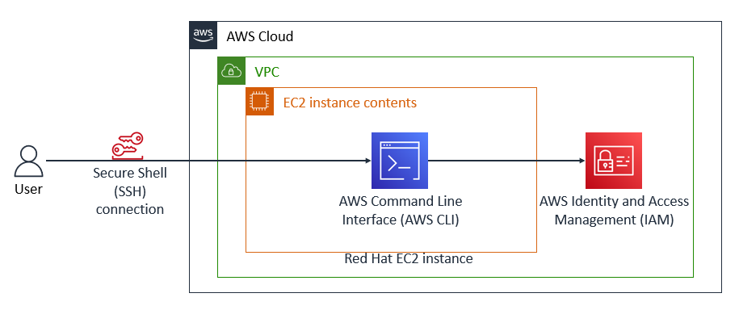
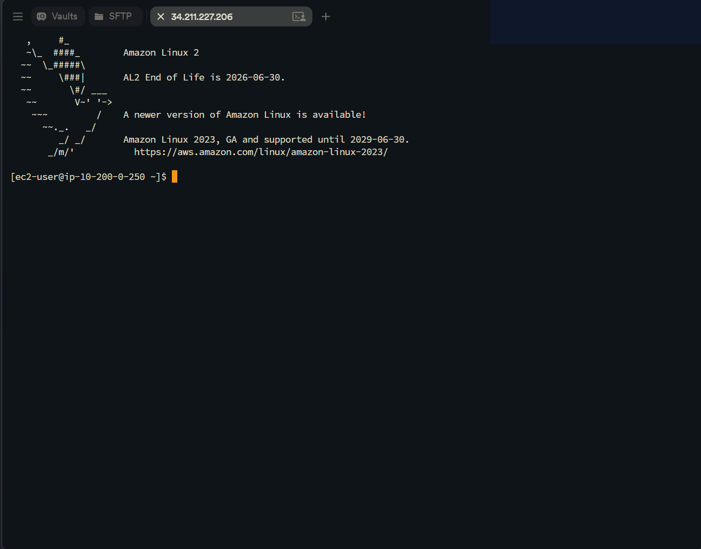
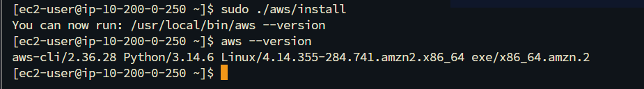
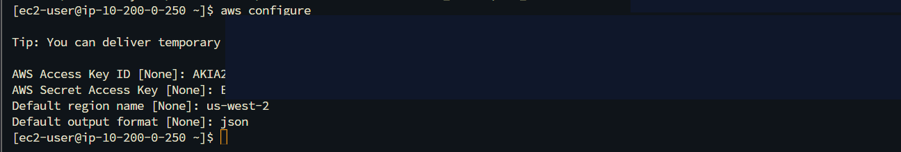
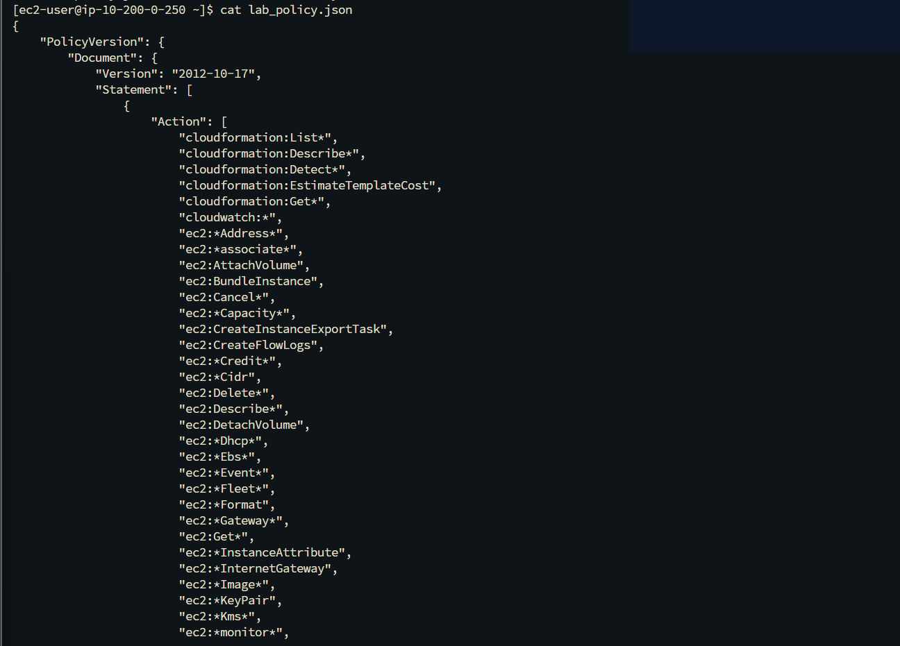

# AWS CLI v2 Installation, API Credential Authentication & IAM Auditing

This lab documents installing and configuring the AWS Command Line Interface (AWS CLI v2) on a Red Hat Enterprise Linux (RHEL) EC2 instance, establishing API credential authentication, and executing programmatic IAM policy export workflows.

---

## Scenario & Objectives

### Infrastructure Automation Requirements
Enterprise cloud environments require programmatic administrative capabilities alongside web console access. Non-Amazon Linux distributions (such as Red Hat Enterprise Linux) require manual installation and configuration of AWS CLI binaries to enable automated system management and security auditing:
- **Remote Host Access**: Establish a secure SSH session to a standalone Red Hat Enterprise Linux EC2 workload.
- **Binary Installation**: Fetch, unpack, and install the official 64-bit Linux AWS CLI v2 binary bundle.
- **Credential Authentication**: Configure programmatically scoped AWS Access Key ID and Secret Access Key credentials for regional API operations (`us-west-2`).
- **IAM Policy Auditing & Export**: Execute programmatic API queries (`aws iam list-users`, `aws iam list-policies`) and export customer-managed IAM policy documents directly to JSON files (`lab_policy.json`).

---

## Architecture Overview


*Figure 1: Official AWS lab architecture diagram illustrating remote SSH connection to Red Hat EC2 running AWS CLI for programmatic IAM management.*

```
+---------------------------------------------------------------------------------------------------+
|                                  AWS CLI PROGRAMMATIC MANAGEMENT ARCHITECTURE                     |
+---------------------------------------------------------------------------------------------------+
|                                                                                                   |
|   [ Administrator Workstation ]                                                                  |
|               |                                                                                   |
|               v (SSH Port 22 / PEM Key)                                                           |
|    +-----------------------------------------------------------------------------------------+    |
|    |  VPC (10.200.0.0/16)                                                                    |    |
|    |    +-------------------------------------------------------------------------------+    |    |
|    |    |  [ Red Hat EC2 Instance ] (ip-10-200-0-250)                                   |    |    |
|    |    |    +---------------------------------------------------------------------+    |    |    |
|    |    |    |  AWS CLI v2 Engine (/usr/local/bin/aws)                             |    |    |    |
|    |    |    |  Credentials: ~/.aws/credentials & ~/.aws/config                     |    |    |    |
|    |    |    +---------------------------------------------------------------------+    |    |    |
|    |    +-------------------------------------------------------------------------------+    |    |
|    +-----------------------------------------------------------------------------------------+    |
|               |                                                                                   |
|               v (AWS HTTPS API Calls / Access Key Credentials)                                    |
|    +-----------------------------------------------------------------------------------------+    |
|    |  [ AWS IAM Service ]                                                                    |    |
|    |  Queries: list-users, list-policies, get-policy-version > lab_policy.json               |    |
|    +-----------------------------------------------------------------------------------------+    |
+---------------------------------------------------------------------------------------------------+
```

---

## Technical Implementation & Verified Screenshots

### 1. Remote SSH Access to Red Hat Enterprise Linux
- Connected to the target Red Hat Linux instance via SSH using `labsuser.pem` key pair:
  ```bash
  ssh -i labsuser.pem ec2-user@<PUBLIC_IP>
  ```
- Verified interactive shell access (`[ec2-user@ip-10-200-0-250 ~]$`).


*Figure 2: Verified SSH login session to the Red Hat Enterprise Linux host.*

---

### 2. AWS CLI v2 Binary Compilation & Installation
- Fetched the official AWS CLI v2 installation package:
  ```bash
  curl "https://awscli.amazonaws.com/awscli-exe-linux-x86_64.zip" -o "awscliv2.zip"
  ```
- Unpacked the installer archive using `unzip -u awscliv2.zip`.
- Executed the installer script with administrative privileges (`sudo ./aws/install`).
- Verified binary path `/usr/local/bin/aws` and confirmed version output (`aws-cli/2.36.28`).


*Figure 3: Verified AWS CLI v2 installation output on Red Hat Enterprise Linux.*

---

### 3. Programmatic Credential Configuration
- Configured CLI credentials via interactive shell initialization:
  ```bash
  aws configure
  ```
- Defined parameters:
  - **AWS Access Key ID**: Programmatic IAM access key credentials
  - **AWS Secret Access Key**: Cryptographic secret key
  - **Default Region**: `us-west-2`
  - **Default Output Format**: `json`


*Figure 4: Interactive AWS CLI credential authentication setup.*

---

### 4. Programmatic IAM Security Auditing & Policy Export
- Executed programmatic IAM queries to list active account users:
  ```bash
  aws iam list-users
  ```
- Filtered local customer-managed policies:
  ```bash
  aws iam list-policies --scope Local
  ```
- Exported the active policy document directly to a local JSON file:
  ```bash
  aws iam get-policy-version --policy-arn arn:aws:iam::<ACCOUNT_ID>:policy/lab_policy --version-id v1 > lab_policy.json
  ```
- Inspected the exported JSON document structure using `cat lab_policy.json`.


*Figure 5: Programmatic IAM user query and policy JSON export verification.*

---

## Technical Takeaways

1. **Console vs. CLI Authentication**: AWS Management Console authentication relies on interactive username, password, and MFA, whereas the AWS CLI utilizes Access Key IDs and Secret Access Keys signed via SigV4 headers for stateless HTTPS REST API requests.
2. **Cross-Distribution Portability**: While Amazon Linux 2 includes AWS CLI pre-installed, enterprise distributions (Red Hat, Ubuntu, SUSE) require explicit package installation via binary bundles or package managers.
3. **Infrastructure as Code & Automation Prep**: Exporting IAM policies directly to JSON via the CLI lays the groundwork for automated policy analysis, CI/CD pipeline validation, and CloudFormation/Terraform state tracking.
