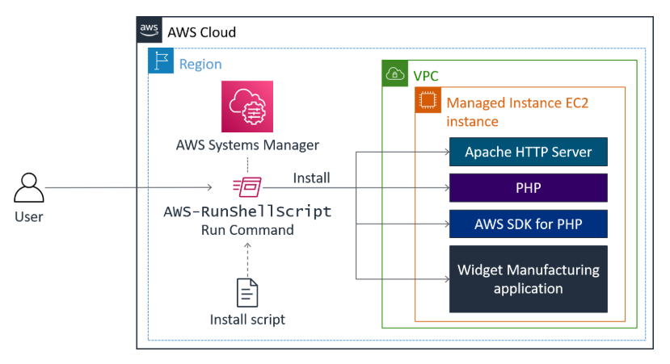
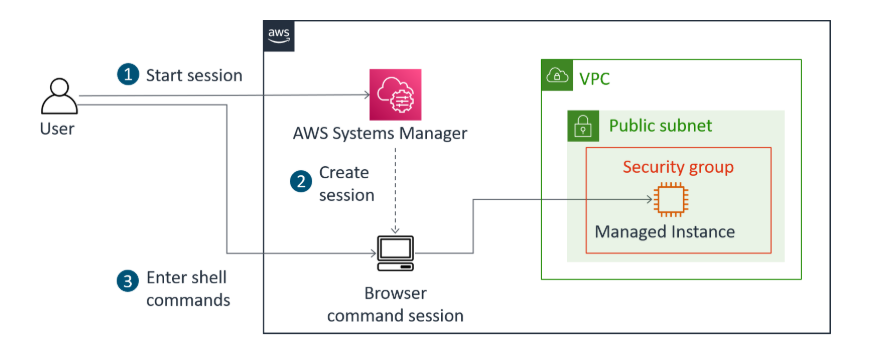
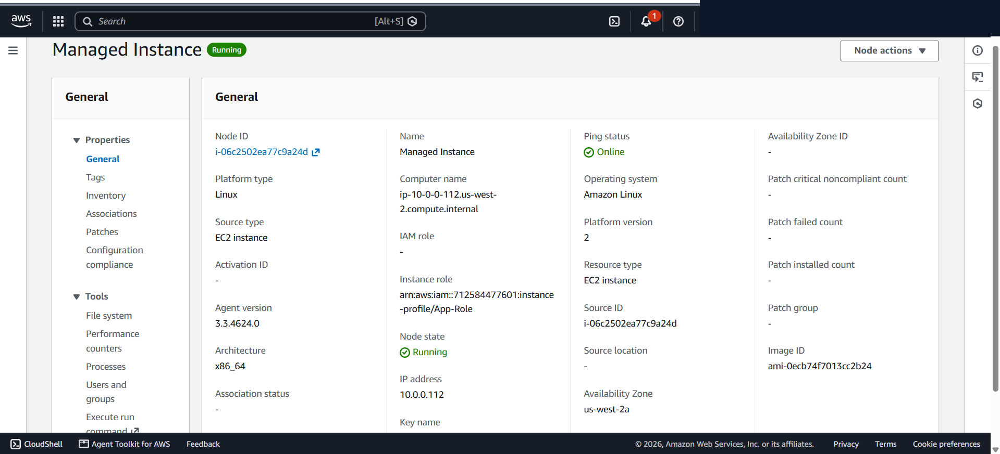
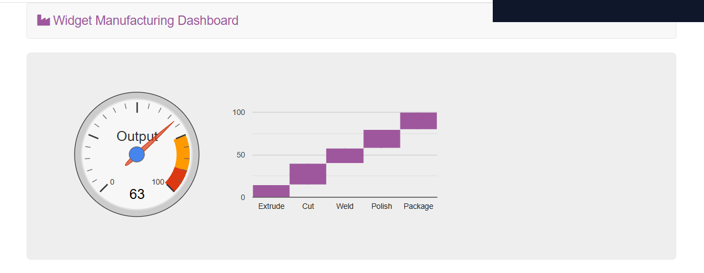
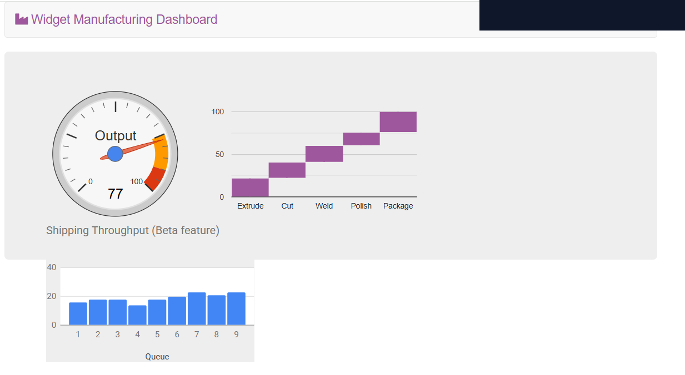
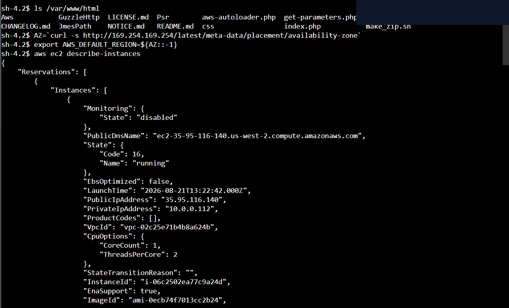

# Centralized Server Operations, Fleet Inventory, Run Command & Session Manager

This lab documents implementing centralized operational management across Amazon EC2 compute workloads using AWS Systems Manager (SSM). It covers agent-based inventory collection via Fleet Manager, automated multi-node application deployment via Run Command, dynamic dark-launch feature flag management via Parameter Store, and auditable browser-based shell access via Session Manager without opening inbound SSH ports.

---

## Scenario & Objectives

### Enterprise Operations & Zero-Trust Access Requirements
Enterprise infrastructure teams managing large compute fleets require centralized configuration baselining, automated remote script execution, dynamic configuration management, and secure administrative access without opening inbound SSH ports or managing static SSH key pairs:
- **Fleet Inventory Auditing**: Configure SSM Fleet Manager inventory collection to audit installed applications, OS properties, and software baselines across compute nodes without remote terminal logins.
- **Automated Web Application Deployment**: Utilize SSM Run Command to execute an automated deployment shell script (`Install Dashboard App`), installing Apache HTTP server, PHP, AWS SDK, and launching the *Widget Manufacturing Dashboard* web application.
- **Dynamic Feature Flag Management**: Store hierarchical configuration parameters in SSM Parameter Store (`/dashboard/show-beta-features`) to dynamically enable dark-launched beta features on live web applications without server redeployment or downtime.
- **Secure Browser-Based Administration**: Establish secure, encrypted, and auditable interactive shell sessions via SSM Session Manager without opening inbound SSH port 22 or maintaining bastion host infrastructure.

---

## Architecture Overview

### 1. Automated Application Deployment via SSM Run Command

*Figure 1: Official AWS architecture diagram illustrating SSM Run Command executing the deployment shell script to install Apache, PHP, AWS SDK, and the web application.*

---

### 2. Zero-SSH Administration via SSM Session Manager

*Figure 2: Official AWS architecture diagram illustrating secure browser shell access to the EC2 instance via SSM Session Manager without inbound SSH port exposure.*

```
+---------------------------------------------------------------------------------------------------+
|                         AWS SYSTEMS MANAGER ENTERPRISE ARCHITECTURE                               |
+---------------------------------------------------------------------------------------------------+
|                                                                                                   |
|   [ Administrator Workstation ]                                                                  |
|         |                                                                                         |
|         +---> (1. Setup Inventory) ----> [ SSM Fleet Manager ] ---> Audits Installed Packages     |
|         |                                                                                         |
|         +---> (2. Execute Shell) ------> [ SSM Run Command ] ---> Deploys Web App (HTTP Port 80) |
|         |                                                                                         |
|         +---> (3. Toggle Beta Flag) ---> [ SSM Parameter Store ] -> Dynamically Enables 3rd Chart |
|         |                                                                                         |
|         +---> (4. Browser Shell) -------> [ SSM Session Manager ] -> Encrypted KMS HTTPS Tunnel   |
|                                                                     (No SSH Port 22 Required)     |
|                                                                                                   |
|   +-------------------------------------------------------------------------------------------+   |
|   |  AWS VPC (Public Subnet)                                                                  |   |
|   |    +---------------------------------------------------------------------------------+    |   |
|   |    |  [ Managed EC2 Instance ] (SSM Agent Active)                                     |    |   |
|   |    |  App: Apache HTTP Server + PHP + Widget Manufacturing Dashboard                   |    |   |
|   |    +---------------------------------------------------------------------------------+    |   |
|   +-------------------------------------------------------------------------------------------+   |
+---------------------------------------------------------------------------------------------------+
```

---

## Technical Implementation & Verified Screenshots

### 1. Software Inventory Baselines via Fleet Manager
- Navigated to **Systems Manager > Fleet Manager** and initialized an Inventory association (`Inventory-Association`).
- Configured manual target selection targeting the registered `Managed Instance`.
- Verified automated package collection under the **Node Overview > Inventory** tab without opening remote terminal connections.


*Figure 3: Fleet Manager Inventory tab displaying installed software packages and OS metadata for the managed node.*

---

### 2. Automated Application Deployment via Run Command
- Selected the customer-owned SSM document `Install Dashboard App` within **Systems Manager > Run Command**.
- Targeted the registered `Managed Instance` and executed the shell deployment payload.
- Verified command execution state (`Overall status: Success`) and accessed the public web application (`http://<ServerIP>`), confirming live execution of the *Widget Manufacturing Dashboard* (2 baseline charts).


*Figure 4: Systems Manager Run Command execution displaying Success status and the deployed web application.*

---

### 3. Dynamic Dark-Launch Feature Toggling via Parameter Store
- Navigated to **Systems Manager > Parameter Store** and provisioned a new hierarchical String parameter:
  - **Name**: `/dashboard/show-beta-features`
  - **Value**: `True`
- Refreshed the live web application browser tab.
- Verified that the application dynamically detected the parameter change and activated the third beta feature chart without requiring web server restarts or code redeployments.


*Figure 5: Widget Manufacturing Dashboard showing dynamic activation of the 3rd beta chart via Parameter Store.*

---

### 4. Zero-SSH Browser Shell Administration via Session Manager
- Navigated to **Systems Manager > Session Manager** and initiated an interactive browser shell session with the `Managed Instance`.
- Executed web directory verification:
  ```bash
  ls /var/www/html
  ```
- Queried regional EC2 metadata and executed AWS CLI commands over the encrypted HTTPS session tunnel:
  ```bash
  AZ=`curl -s http://169.254.169.254/latest/meta-data/placement/availability-zone`
  export AWS_DEFAULT_REGION=${AZ::-1}
  aws ec2 describe-instances
  ```


*Figure 6: Encrypted interactive browser shell session active on the Managed Instance via Session Manager.*

---

## Technical Takeaways

1. **Zero-Trust Administrative Access**: Session Manager eliminates the need for inbound SSH port 22 rules, static public IPs, or bastion host maintenance, routing all administrative traffic over secure TLS HTTPS tunnels audited via CloudTrail.
2. **Automated Fleet Management**: SSM Run Command enables executing idempotent configuration scripts across hundreds of instances simultaneously using EC2 Resource Tags, enforcing operational consistency.
3. **Decoupled Configuration & Feature Flags**: Parameter Store provides secure hierarchical configuration storage, enabling dark-launch feature deployment and dynamic environment configuration without code re-releases.
