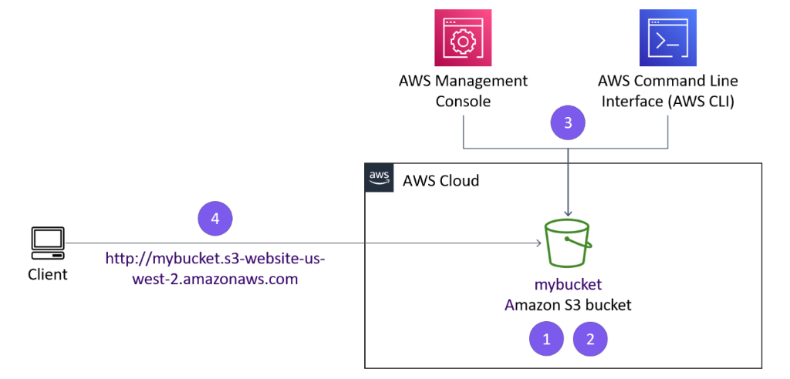
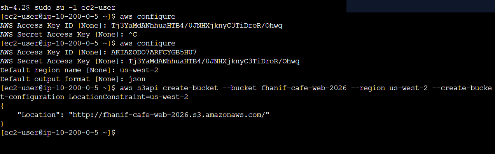
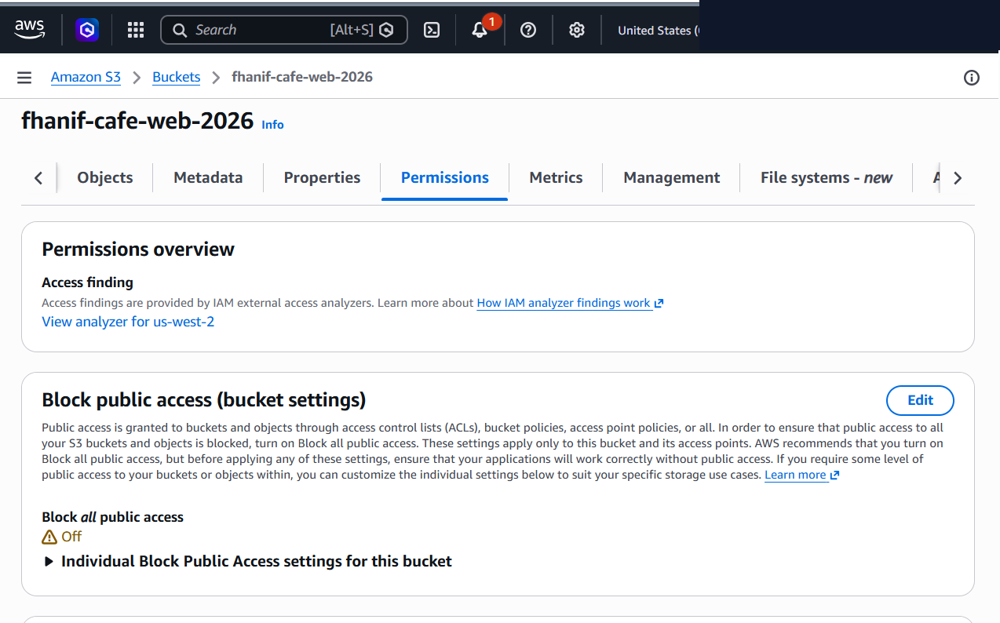
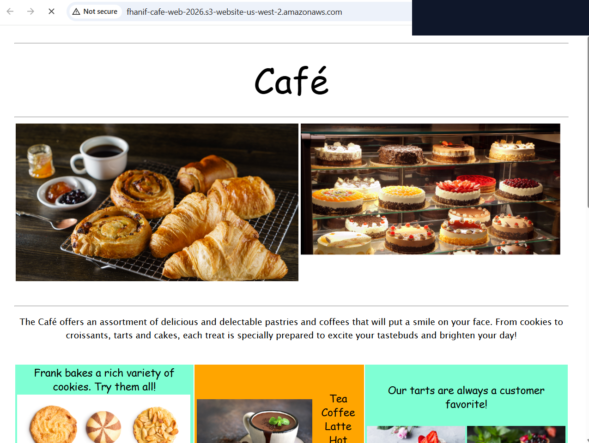
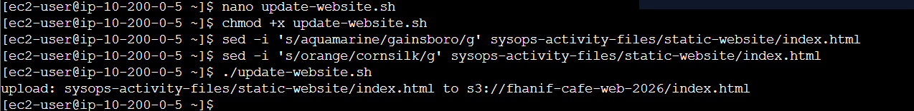

# Amazon S3 Static Website Hosting, IAM Policies & Automated CLI Sync

This lab documents provisioning and deploying a serverless static web application (*Café & Bakery*) using Amazon Simple Storage Service (Amazon S3), configuring fine-grained bucket permissions (Block Public Access disabling, ACL enablement, public-read object policies), and building an automated, idempotent Bash synchronization script (`update-website.sh`) using the AWS CLI `aws s3 sync` command.

---

## Scenario & Objectives

### Serverless Web Hosting & CI/CD Deployment Requirements
Modern cloud architectures leverage object storage for hosting web applications to eliminate compute management overhead, reduce operational costs, and achieve high availability. This project establishes programmatic S3 static site deployment and repeatable update pipelines:
- **Programmatic Bucket Provisioning**: Create a globally unique Amazon S3 bucket (`us-west-2`) using the AWS CLI `aws s3api create-bucket` command.
- **IAM User Access Management**: Provision a dedicated IAM user (`awsS3user`) and attach the managed policy `AmazonS3FullAccess`.
- **Public Security & Access Control**: Disable S3 Block Public Access settings, enable Object Ownership ACLs, and apply `public-read` object permissions for website assets.
- **Website Hosting Configuration**: Enable S3 Static Website Hosting (`aws s3 website`) with `index.html` configured as the primary entry point.
- **Automated Deployment Pipeline**: Develop a Bash deployment script (`update-website.sh`) utilizing `aws s3 sync` to push delta updates efficiently rather than re-uploading unchanged assets.

---

## Architecture Overview


*Figure 1: Official AWS lab architecture diagram illustrating public client access to the Amazon S3 Static Website Endpoint managed via the Console and AWS CLI.*

```
+---------------------------------------------------------------------------------------------------+
|                        AMAZON S3 STATIC WEBSITE HOSTING ARCHITECTURE                              |
+---------------------------------------------------------------------------------------------------+
|                                                                                                   |
|   [ Public Web Client ]                                                                           |
|         |                                                                                         |
|         v (HTTP / Port 80)                                                                        |
|   +-------------------------------------------------------------------------------------------+   |
|   |  Amazon S3 Static Website Endpoint                                                        |   |
|   |  http://<bucket-name>.s3-website-us-west-2.amazonaws.com                                  |   |
|   +-------------------------------------------------------------------------------------------+   |
|         |                                                                                         |
|         v                                                                                         |
|   +-------------------------------------------------------------------------------------------+   |
|   |  Amazon S3 Bucket (us-west-2)                                                             |   |
|   |    - Block Public Access: OFF                                                             |   |
|   |    - Object Ownership: ACLs Enabled                                                       |   |
|   |    - Objects Policy: public-read (index.html, css/, images/)                              |   |
|   +-------------------------------------------------------------------------------------------+   |
|         ^                                                                                         |
|         | (Delta Asset Sync / AWS CLI)                                                            |
|   [ EC2 Admin Host / Deployment Host ]                                                            |
|     - Script: ./update-website.sh (`aws s3 sync ... --acl public-read`)                           |
+---------------------------------------------------------------------------------------------------+
```

---

## Technical Implementation & Verified Screenshots

### 1. Programmatic S3 Bucket Provisioning via AWS CLI
- Created a globally unique S3 bucket in the `us-west-2` region:
  ```bash
  aws s3api create-bucket --bucket fhanif2026 --region us-west-2 --create-bucket-configuration LocationConstraint=us-west-2
  ```
- Verified JSON response returning the canonical bucket URI (`"Location": "http://fhanif2026.s3.amazonaws.com/"`).


*Figure 2: AWS CLI command output confirming creation of the Amazon S3 bucket.*

---

### 2. IAM Provisioning & Bucket Permission Hardening
- Provisioned a dedicated IAM user (`awsS3user`) and attached `AmazonS3FullAccess`.
- Configured S3 Bucket security settings via the Management Console:
  - **Block Public Access**: Disabled *Block all public access*.
  - **Object Ownership**: Enabled *ACLs enabled*.


*Figure 3: Amazon S3 console displaying disabled Block Public Access and enabled ACL permissions.*

---

### 3. Static Website Hosting & Initial Asset Upload
- Enabled S3 Static Website Hosting via AWS CLI:
  ```bash
  aws s3 website s3://fhanif2026/ --index-document index.html
  ```
- Uploaded static website assets with public read access:
  ```bash
  aws s3 cp /home/ec2-user/sysops-activity-files/static-website/ s3://fhanif2026/ --recursive --acl public-read
  ```
- Navigated to the live S3 Website Endpoint (`http://fhanif2026.s3-website-us-west-2.amazonaws.com`) to verify site rendering.


*Figure 4: Browser rendering the live Café & Bakery static website hosted on the Amazon S3 endpoint.*

---

### 4. Repeatable CI/CD Pipeline Automation (`aws s3 sync`)
- Built an automated deployment script `update-website.sh`:
  ```bash
  #!/bin/bash
  aws s3 sync /home/ec2-user/sysops-activity-files/static-website/ s3://fhanif2026/ --acl public-read
  ```
- Made the script executable (`chmod +x update-website.sh`).
- Modified local HTML assets (`index.html` color scheme changes) and executed the script.
- Verified that `aws s3 sync` updated **only modified delta files** rather than re-uploading the entire site directory.


*Figure 5: Terminal execution of update-website.sh demonstrating efficient delta synchronization via aws s3 sync.*

---

## Technical Takeaways

1. **Serverless Infrastructure Hosting**: Amazon S3 static website hosting provides massive scalability and 99.999999999% (11 9s) durability without requiring web server operating systems, patch management, or load balancers.
2. **Efficiency of `aws s3 sync` vs. `aws s3 cp`**: While `aws s3 cp --recursive` blindly re-uploads every local file regardless of modification timestamp, `aws s3 sync` compares file size and modification timestamps, uploading only modified delta assets to minimize API calls and network bandwidth.
3. **Layered Public Access Control**: Successfully exposing public website objects requires aligning both bucket-level settings (*Block Public Access: OFF*) and object-level settings (*ACLs enabled with public-read*).
