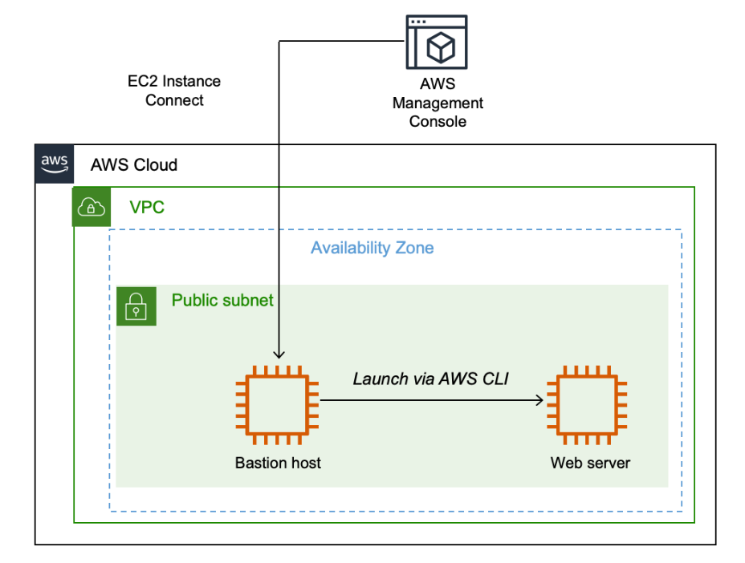
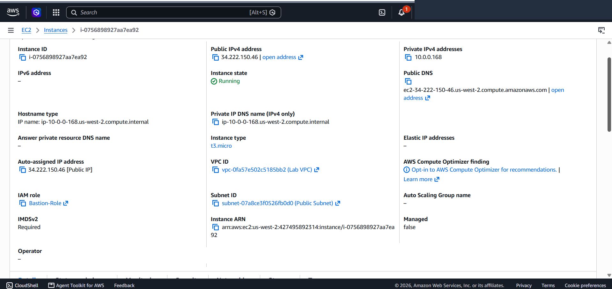
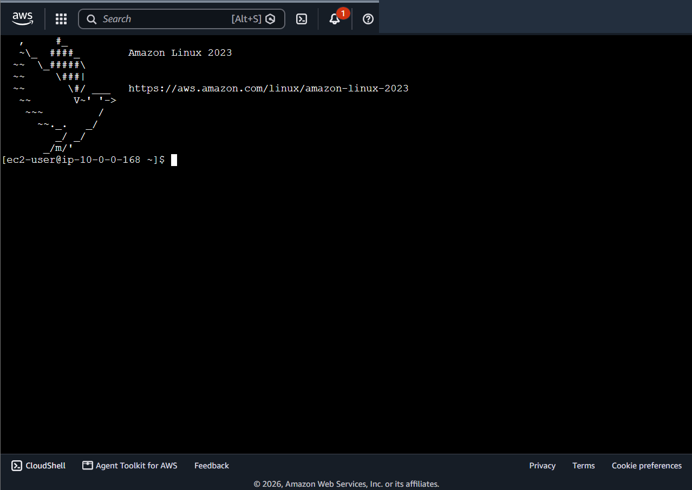
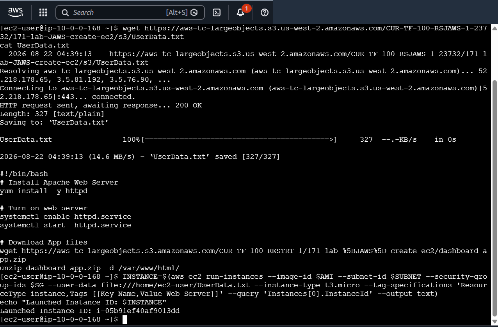
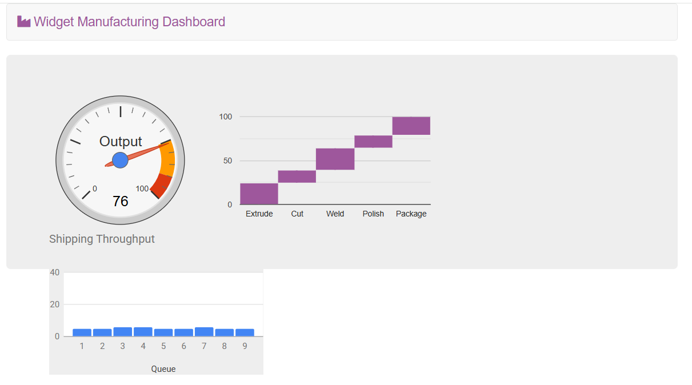
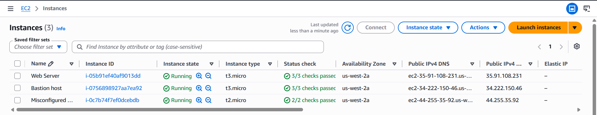
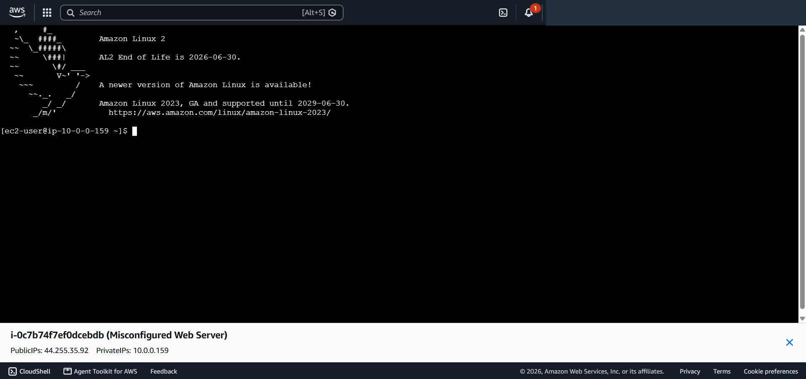
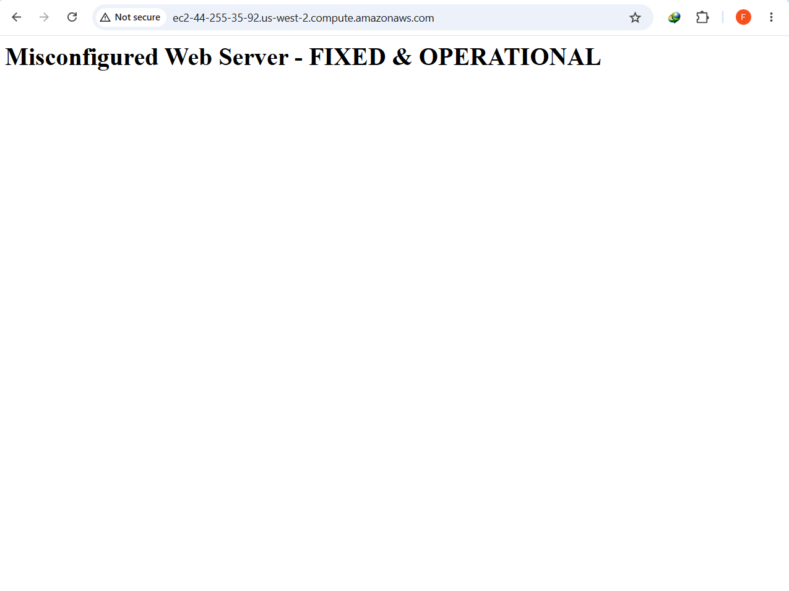

# Amazon EC2 Provisioning, EC2 Instance Connect & Automated CLI Orchestration

This lab documents provisioning compute infrastructure across hybrid administrative paradigms on Amazon Web Services (AWS). It covers manual instance deployment with IAM Role integration (`Bastion-Role`) via the AWS Management Console, establishing browser-based ephemeral administrative access using **EC2 Instance Connect**, and executing automated infrastructure provisioning via the **AWS CLI** with dynamic Parameter Store AMI querying and **EC2 User Data** bootstrapping. Additionally, it details systematic Root Cause Analysis (RCA) and remediation for network and host-level misconfigurations.

---

## Scenario & Objectives

### Enterprise Bastion & Dynamic CLI Provisioning
In cloud operations, provisioning workloads through isolated jump boxes (Bastion Hosts) reduces attack surfaces while programmatic CLI deployment ensures repeatability and automated bootstrapping:
- **Management Console Provisioning**: Launch an Amazon Linux 2 Bastion Host instance within a custom VPC (`Lab VPC`), attach an IAM Role (`Bastion-Role`), and restrict ingress via a dedicated Security Group (`Bastion security group`).
- **Zero-Key Administrative Access**: Establish secure shell access to the Bastion Host via browser-based **EC2 Instance Connect**, avoiding long-lived SSH private key management.
- **Dynamic CLI Resource Querying**: Retrieve region placement and query the latest Amazon Linux 2 AMI ID from **AWS Systems Manager Parameter Store** (`/aws/service/ami-amazon-linux-latest/amzn2-ami-hvm-x86_64-gp2`), dynamic Subnet IDs, and Security Group IDs.
- **Automated Web Server Bootstrapping**: Launch a production Web Server instance via `aws ec2 run-instances` injecting shell scripts via `--user-data` to install Apache HTTP Server and deploy the *Widget Manufacturing Dashboard* application.
- **Diagnostic Troubleshooting & RCA**: Investigate and remediate multi-layer failures (Security Group Inbound Port 22/80 filtering and Apache `httpd` daemon lifecycle) on a faulty instance (`Misconfigured Web Server`).

---

## Architecture Overview


*Figure 1: Architecture diagram showing the Bastion Host accessed via EC2 Instance Connect orchestrating programmatic Web Server provisioning via AWS CLI and User Data in a public subnet.*

```
+---------------------------------------------------------------------------------------------------+
|                         HYBRID EC2 PROVISIONING & CLI ORCHESTRATION ARCHITECTURE                  |
+---------------------------------------------------------------------------------------------------+
|                                                                                                   |
|   [ Cloud Engineer / Web Browser ]                                                                |
|         |                                                                                         |
|         | (1. Console Launch & 2. EC2 Instance Connect / Port 22)                                 |
|         v                                                                                         |
|   +-------------------------------------------------------------------------------------------+   |
|   |  Lab VPC (10.0.0.0/16) - Public Subnet (10.0.0.0/24)                                      |   |
|   |                                                                                           |   |
|   |   +---------------------------------------+       +-----------------------------------+   |   |
|   |   |  Bastion Host (t3.micro)              |       |  Web Server (t3.micro)            |   |   |
|   |   |  - IAM Profile: Bastion-Role          | (3. CLI) |  - Security Group: WebSecurityGroup |   |
|   |   |  - SG: Bastion security group (SSH 22)|------>|  - UserData: Apache HTTPD + App   |   |   |
|   |   |  - Role: SSM / EC2 API Execution      |       |  - Port 80: Widget Dashboard      |   |   |
|   |   +---------------------------------------+       +-----------------------------------+   |   |
|   |                                                             ^                             |   |
|   +-------------------------------------------------------------|-----------------------------+   |
|                                                                 | (HTTP / Port 80)                |
|   [ Public End User / Browser ] --------------------------------+                                 |
+---------------------------------------------------------------------------------------------------+
```

---

## Technical Implementation & Verified Screenshots

### 1. Bastion Host Provisioning via AWS Management Console
- Configured and launched the `Bastion host` instance on Amazon Linux 2 (`t3.micro`) within `Lab VPC` and `Public Subnet`.
- Attached the IAM instance profile `Bastion-Role` granting programmatic API permissions for AWS CLI calls without static hardcoded credentials.
- Configured `Bastion security group` permitting inbound SSH traffic.


*Figure 2: AWS Management Console displaying running Bastion Host with attached IAM Role (`Bastion-Role`) and public network attributes.*

---

### 2. Ephemeral Administrative Access via EC2 Instance Connect
- Connected to the running Bastion Host instance using browser-based **EC2 Instance Connect**.
- Authenticated directly into the Linux terminal session (`ec2-user`) using temporary AWS-signed SSH public keys pushed to instance metadata.


*Figure 3: Active EC2 Instance Connect terminal session established to the Bastion Host.*

---

### 3. Dynamic Environment Querying & CLI Web Server Deployment
- Dynamically extracted instance placement metadata and retrieved the latest Amazon Linux 2 AMI ID via Systems Manager Parameter Store:
  ```bash
  AZ=$(curl -s http://169.254.169.254/latest/meta-data/placement/availability-zone)
  export AWS_DEFAULT_REGION=$(echo "$AZ" | sed 's/.$//')
  AMI=$(aws ssm get-parameters --names /aws/service/ami-amazon-linux-latest/amzn2-ami-hvm-x86_64-gp2 --query 'Parameters[0].[Value]' --output text)
  ```
- Retrieved dynamic Subnet and Security Group identifiers:
  ```bash
  SUBNET=$(aws ec2 describe-subnets --filters "Name=tag:Name,Values=Public Subnet" --query "Subnets[0].SubnetId" --output text)
  SG=$(aws ec2 describe-security-groups --filters "Name=group-name,Values=WebSecurityGroup" --query "SecurityGroups[0].GroupId" --output text)
  ```
- Downloaded the `UserData.txt` provisioning script and launched the Web Server instance programmatically:
  ```bash
  INSTANCE=$(aws ec2 run-instances     --image-id $AMI     --subnet-id $SUBNET     --security-group-ids $SG     --user-data file:///home/ec2-user/UserData.txt     --instance-type t3.micro     --tag-specifications 'ResourceType=instance,Tags=[{Key=Name,Value=Web Server}]'     --query 'Instances[0].InstanceId'     --output text)
  ```


*Figure 4: Terminal execution output showing `UserData.txt` inspection, parameter resolution, and successful instance launch ID (`i-05b91ef40af9013dd`).*

---

### 4. Workload Bootstrapping & Live Web Application Verification
- Queried instance state until transition from `pending` to `running`, then extracted the Public DNS endpoint:
  ```bash
  aws ec2 describe-instances --instance-ids $INSTANCE --query 'Reservations[0].Instances[0].PublicDnsName' --output text
  ```
- Verified the automated User Data execution by loading the *Widget Manufacturing Dashboard* in a web browser over HTTP.


*Figure 5: Live Widget Manufacturing Dashboard rendered in browser confirming automated Apache and application artifact deployment.*

---

### 5. Fleet Status & Health Overview
- Verified instance lifecycle and system health checks in the EC2 Management Console.
- Confirmed `Bastion host`, `Web Server`, and `Misconfigured Web Server` instances operational with passed 2/2 and 3/3 status checks.


*Figure 6: AWS Management Console overview confirming healthy running states across all managed compute nodes.*

---

## Challenge Section: Multi-Layer Diagnostic & Root Cause Analysis (RCA)

### Challenge 1: SSH / Instance Connect Failure Remediation
- **Symptom**: EC2 Instance Connect connection attempts to `Misconfigured Web Server` failed with network timeout.
- **Root Cause**: The attached Security Group lacked an inbound rule for TCP port 22 (SSH), dropping incoming management packets at the virtual firewall layer.
- **Remediation**: Added an inbound rule to the instance's Security Group authorizing SSH (port 22) traffic from `0.0.0.0/0`.


*Figure 7: Successful EC2 Instance Connect terminal session established to `Misconfigured Web Server` (`i-0c7b74f7ef0dcebdb`) following Security Group rule remediation.*

---

### Challenge 2: Web Server Outage & Daemon Lifecycle Remediation
- **Symptom**: Public IPv4 DNS requests to `Misconfigured Web Server` timed out and returned connection refused errors.
- **Root Cause Analysis (Multi-Layer)**:
  1. *Network Layer*: The Security Group lacked an inbound rule allowing HTTP traffic on TCP port 80.
  2. *OS/Service Layer*: The Apache HTTP daemon (`httpd`) was inactive and uninitialized on the host operating system.
- **Remediation**:
  1. Authorized inbound HTTP (TCP port 80) from `0.0.0.0/0` in the Security Group.
  2. Installed Apache HTTP Server, initialized the service daemon, enabled persistence across reboots, and deployed an index page:
     ```bash
     sudo yum install -y httpd
     sudo systemctl start httpd
     sudo systemctl enable httpd
     echo "<h1>Misconfigured Web Server - FIXED & OPERATIONAL</h1>" | sudo tee /var/www/html/index.html
     ```


*Figure 8: Browser successfully rendering response from the remediated web server instance confirming end-to-end resolution.*

---

## Key Takeaways & Operational Best Practices

1. **Least-Privilege CLI Access via IAM Roles**: Attaching IAM Roles (`Bastion-Role`) to EC2 instances eliminates the security risk of storing long-lived `AWS_ACCESS_KEY_ID` and `AWS_SECRET_ACCESS_KEY` credentials on local disks.
2. **Dynamic AMI Lookup via SSM Parameter Store**: Hardcoding AMI IDs creates brittle deployment pipelines across regions and updates. Querying `/aws/service/ami-amazon-linux-latest/...` guarantees automated retrieval of the latest security-patched AMIs.
3. **Idempotent User Data Bootstrapping**: EC2 User Data executes automatically with root privileges during the initial instance boot, enabling repeatable Infrastructure-as-Code application deployment without manual SSH intervention.
4. **Defense-in-Depth Diagnostics**: Cloud network failures require structured isolation across Layer 4/7 virtual firewalls (Security Groups, NACLs) and host-level OS services (`systemctl`, process listeners).
