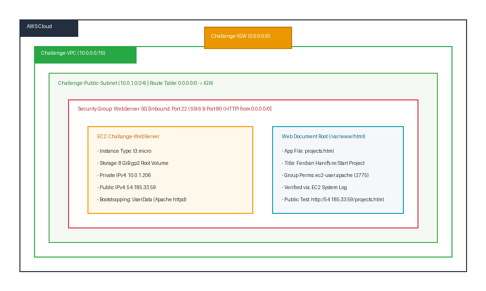
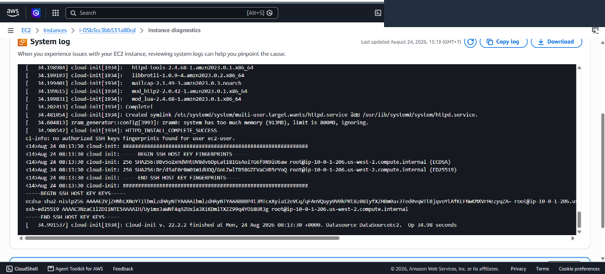
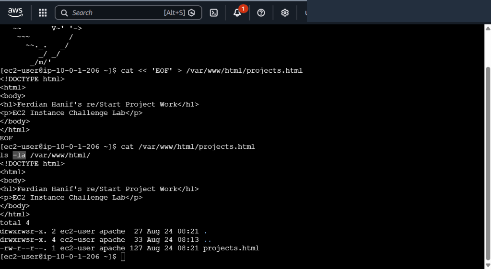
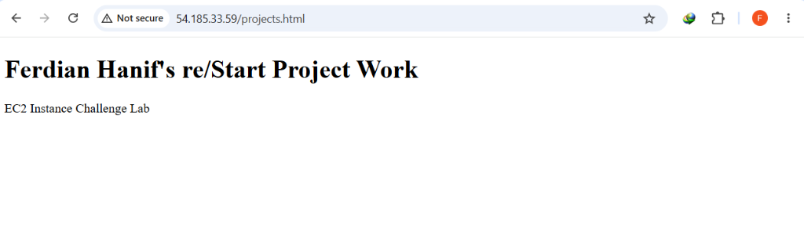
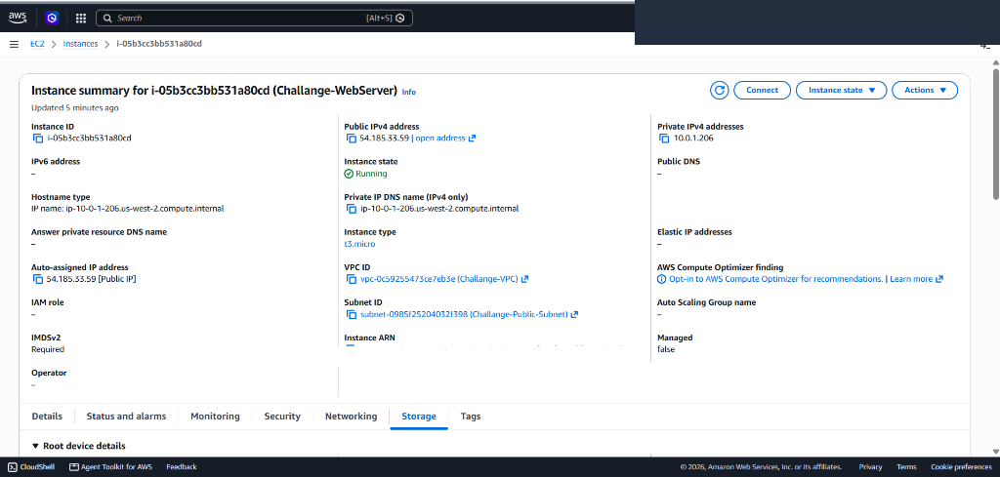

# Full-Stack EC2 Compute Provisioning, Custom VPC Architecture & Automated Web Bootstrapping

This challenge lab documents architecting and deploying an end-to-end cloud compute and networking infrastructure from scratch on Amazon Web Services (AWS). It covers designing an isolated Virtual Private Cloud (`Challenge-VPC`), provisioning an Internet Gateway with custom route table associations, enforcing multi-port ingress security filtering (`WebServer-SG`), bootstrapping an Amazon Linux compute instance with **EC2 User Data** (`httpd` daemon lifecycle and POSIX file permission delegation), and deploying a custom web application verified via **EC2 System Log** auditing and public browser rendering.

---

## Scenario & Objectives

### Infrastructure as Code & Unattended Web Tier Provisioning
Enterprise workload deployments require robust, self-healing foundation layers. Rather than relying on default VPCs or manual post-boot configuration, this project implements a standalone web application infrastructure:
- **Custom Virtual Private Cloud (VPC)**: Provision `Challenge-VPC` (`10.0.0.0/16`) with an attached `Challenge-IGW` and a dedicated `Challenge-Public-Subnet` (`10.0.1.0/24`) configured for automated public IPv4 addressing.
- **Bi-Directional Route Table Engineering**: Configure `Challenge-Public-RT` directing default egress/ingress (`0.0.0.0/0`) to the Internet Gateway.
- **Multi-Port Security Hardening**: Construct `WebServer-SG` authorizing stateful ingress for administrative SSH (TCP Port 22) and public web traffic (TCP Port 80).
- **Automated Host Bootstrapping via User Data**: Inject a shell bootstrap script at launch to install Apache HTTP Server (`httpd`), manage systemd daemon startup, and grant group write permissions (`ec2-user:apache` mode `2775`) on `/var/www/html`.
- **Auditability & Verification**: Validate unattended execution via the EC2 System Log, establish keyless access via **EC2 Instance Connect**, deploy `projects.html`, and verify public delivery.

---

## Architecture Overview


*Figure 1: Architecture diagram showing the custom VPC, Internet Gateway, Public Subnet, Security Group boundaries, and automated web tier bootstrapping.*

```
+---------------------------------------------------------------------------------------------------+
|                     FULL-STACK CUSTOM VPC & EC2 WEB PROVISIONING ARCHITECTURE                     |
+---------------------------------------------------------------------------------------------------+
|                                                                                                   |
|   [ Internet / Public Clients & Admin Browser ]                                                   |
|         |                                                                                         |
|         v (HTTP :80 / SSH :22)                                                                    |
|   +-------------------------------------------------------------------------------------------+   |
|   |  Challenge-IGW (Internet Gateway: 0.0.0.0/0)                                              |   |
|   +-------------------------------------------------------------------------------------------+   |
|         |                                                                                         |
|         v                                                                                         |
|   +-------------------------------------------------------------------------------------------+   |
|   |  Challenge-VPC (10.0.0.0/16)                                                              |   |
|   |                                                                                           |   |
|   |   +-----------------------------------------------------------------------------------+   |   |
|   |   |  Challenge-Public-Subnet (10.0.1.0/24) | Route Table: 0.0.0.0/0 -> IGW            |   |   |
|   |   |                                                                                   |   |   |
|   |   |   +---------------------------------------------------------------------------+   |   |   |
|   |   |   |  Security Group: WebServer-SG (Inbound: TCP 22 & 80)                      |   |   |   |
|   |   |   |                                                                           |   |   |   |
|   |   |   |   +-------------------------------------------------------------------+   |   |   |   |
|   |   |   |   |  EC2: Challange-WebServer (t3.micro, 8 GiB gp2)                   |   |   |   |   |
|   |   |   |   |  - Private IP: 10.0.1.206 | Public IPv4: 54.185.33.59             |   |   |   |   |
|   |   |   |   |  - User Data: yum install httpd && systemctl enable httpd         |   |   |   |   |
|   |   |   |   |  - App: /var/www/html/projects.html (Ferdian Hanif)               |   |   |   |   |
|   |   |   |   +-------------------------------------------------------------------+   |   |   |   |
|   |   |   +---------------------------------------------------------------------------+   |   |   |
|   |   +-----------------------------------------------------------------------------------+   |   |
|   +-------------------------------------------------------------------------------------------+   |
+---------------------------------------------------------------------------------------------------+
```

---

## Technical Implementation & Verified Screenshots

### 1. Automated Bootstrapping & EC2 System Log Verification
- Bootstrapped the Amazon Linux instance with the following User Data script:
  ```bash
  #!/bin/bash
  yum update -y
  yum install -y httpd
  systemctl start httpd
  systemctl enable httpd
  usermod -a -G apache ec2-user
  chown -R ec2-user:apache /var/www
  chmod 2775 /var/www
  find /var/www -type d -exec chmod 2775 {} +
  find /var/www -type f -exec chmod 0664 {} +
  echo "HTTPD_INSTALL_COMPLETE_SUCCESS"
  ```
- Queried the **EC2 System Log** via instance diagnostics to confirm package installation and systemd unit activation (`Created symlink /etc/systemd/system/multi-user.target.wants/httpd.service`).


*Figure 2: EC2 System Log output confirming successful unattended package installation, symlink creation, and cloud-init finalization.*

---

### 2. Ephemeral Access & Application Deployment via EC2 Instance Connect
- Connected to the instance terminal via browser-based **EC2 Instance Connect**.
- Deployed the web application file `projects.html` into the document root `/var/www/html/`:
  ```bash
  cat << 'EOF' > /var/www/html/projects.html
  <!DOCTYPE html>
  <html>
  <body>
  <h1>Ferdian Hanif's re/Start Project Work</h1>
  <p>EC2 Instance Challenge Lab</p>
  </body>
  </html>
  EOF
  ```
- Verified file presence and ownership permissions (`-rw-r--r-- 1 ec2-user apache`).


*Figure 3: Terminal session showing non-root application file creation under `/var/www/html` with proper group permissions.*

---

### 3. End-to-End Public Delivery & Web Browser Validation
- Accessed the public URL endpoint `http://54.185.33.59/projects.html` via an external web browser.
- Confirmed bi-directional network flow across the Internet Gateway, Route Table, and Security Group firewall.


*Figure 4: Browser rendering the live projects.html page displaying customized candidate identification and lab verification text.*

---

### 4. Infrastructure Configuration & Compute Health Overview
- Inspected the instance state and resource mappings in the AWS Management Console:
  - **Instance ID**: `i-05b3cc3bb531a80cd` (`Challange-WebServer`)
  - **VPC / Subnet**: `vpc-0c59255473ce7eb3e` (`Challange-VPC`) / `subnet-0985f25204032f398` (`Challange-Public-Subnet`)
  - **Storage Architecture**: 8 GiB General Purpose SSD (`gp2`) root EBS volume.
  - **Public IPv4 Address**: `54.185.33.59` (Auto-assigned).


*Figure 5: AWS Management Console showing healthy running instance state, network parameters, and gp2 storage attachment.*

---

## Key Takeaways & Architectural Insights

1. **Top-Down VPC Networking**: Building a functional public cloud compute environment requires the explicit orchestration of 4 networking components: VPC CIDR block, Internet Gateway attachment, Subnet CIDR allocation, and Route Table target associations (`0.0.0.0/0 -> IGW`).
2. **Cloud-Init & User Data Telemetry**: The EC2 System Log serves as the primary diagnostic mechanism for verifying *unattended boot scripts* without requiring active SSH sessions.
3. **POSIX Group Permissions in Web Servers**: Assigning `ec2-user` to the `apache` group with setgid bit (`2775`) ensures future files inherit group write permissions, eliminating the need to elevate to `sudo` for routine content updates.
4. **General Purpose SSD (`gp2` vs `gp3`)**: Understanding EBS storage types enables cost and IOPS baseline optimization aligned with specific workload requirements.
