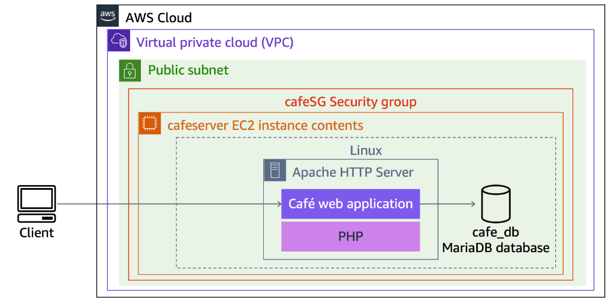
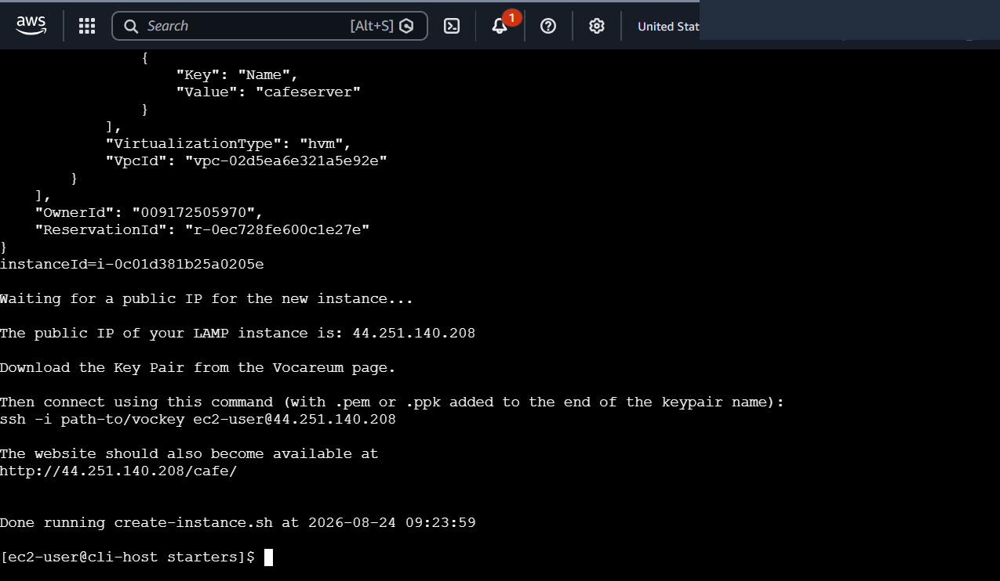
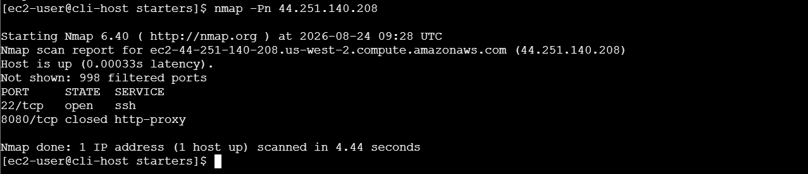
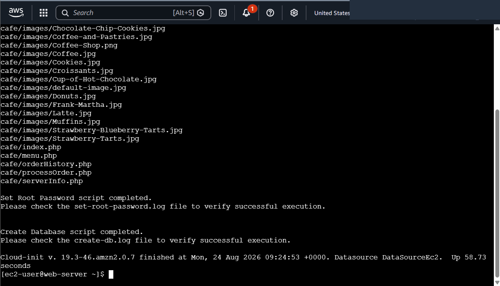
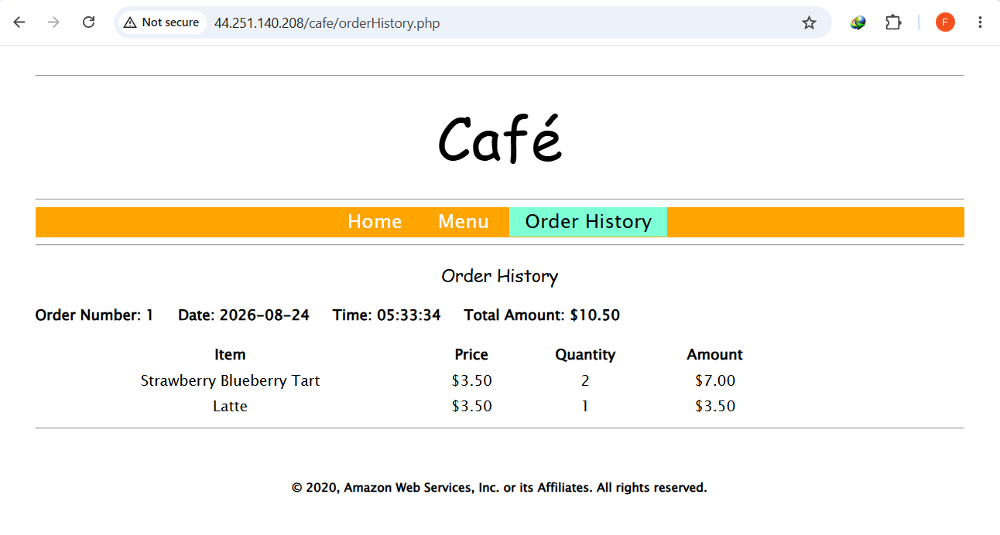

# Troubleshooting AWS CLI EC2 Provisioning, Nmap Network Diagnostics & LAMP Stack Bootstrapping

This project documents systematic root cause analysis (RCA) and remediation of automated Infrastructure as Code (IaC) provisioning scripts on Amazon Web Services (AWS). It covers debugging multi-region scope and AMI lookup failures (`InvalidAMIID.NotFound`) in Bash/AWS CLI deployment pipelines, performing Layer 4 network port scanning using the open-source **nmap** utility, auditing **cloud-init** database bootstrapping logs, and verifying the end-to-end operational integrity of a full-stack **LAMP** (Linux, Apache HTTP Server, MariaDB, PHP) web application (*Café*).

---

## Scenario & Objectives

### Automated Deployment Pipeline Debugging & Root Cause Analysis
Production deployment scripts frequently encounter execution blockers due to regional mismatch, missing security group rules, or daemon lifecycle faults. This lab resolves two intentional production failure modes:
- **Issue #1 (API Regional Mismatch & AMI Lookup Failure)**: Diagnose and resolve `InvalidAMIID.NotFound` errors caused by hardcoded region parameters (`--region us-east-1`) in `create-lamp-instance-v2.sh` when deploying resources into a `us-west-2` VPC (`Cafe VPC`).
- **Issue #2 (Network Layer Port Filtering & Nmap Scanning)**: Utilize `nmap -Pn` from an administrative host (`CLI Host`) to identify blocked/filtered HTTP traffic (Port 80) resulting from misconfigured security group ingress rules, followed by real-time rule remediation.
- **Host Bootstrapping & Database Telemetry Audit**: Verify unattended cloud-init provisioning logs (`/var/log/cloud-init-output.log`) on the target compute node (`cafeserver`), confirming root password configuration and database table initialization for `cafe_db`.
- **End-to-End Application & Persistence Verification**: Test transactional operations across the dynamic PHP web frontend (`/cafe/menu.php`), validating data capture and persistence in the underlying MariaDB relational database (`/cafe/orderHistory.php`).

---

## Architecture Overview


*Figure 1: Architecture diagram illustrating the LAMP stack deployment topology within Cafe VPC and Cafe Public Subnet 1, guarded by cafeSG and accessed by clients.*

```
+---------------------------------------------------------------------------------------------------+
|                        TROUBLESHOOTING & LAMP STACK DEPLOYMENT ARCHITECTURE                       |
+---------------------------------------------------------------------------------------------------+
|                                                                                                   |
|   [ Web Client / Browser ]                                                                        |
|         |                                                                                         |
|         v (HTTP / TCP Port 80)                                                                    |
|   +-------------------------------------------------------------------------------------------+   |
|   |  Cafe VPC (us-west-2)                                                                     |   |
|   |                                                                                           |   |
|   |   +-----------------------------------------------------------------------------------+   |   |
|   |   |  Cafe Public Subnet 1                                                             |   |   |
|   |   |                                                                                   |   |   |
|   |   |   +---------------------------------------------------------------------------+   |   |   |
|   |   |   |  Security Group: cafeSG (Inbound: TCP 22 & TCP 80 from 0.0.0.0/0)         |   |   |   |
|   |   |   |                                                                           |   |   |   |
|   |   |   |   +-------------------------------------------------------------------+   |   |   |   |
|   |   |   |   |  EC2 Instance: cafeserver (t3.small, Amazon Linux 2)              |   |   |   |   |
|   |   |   |   |  Public IPv4: 44.251.140.208                                      |   |   |   |   |
|   |   |   |   |                                                                   |   |   |   |   |
|   |   |   |   |   +-----------------------------------------------------------+   |   |   |   |   |
|   |   |   |   |   |  LAMP Stack Components:                                   |   |   |   |   |   |
|   |   |   |   |   |  - Web Server: Apache HTTP Server (httpd :80)              |   |   |   |   |   |
|   |   |   |   |   |  - Scripting: PHP 7.2 Core & Extensions                   |   |   |   |   |   |
|   |   |   |   |   |  - Application: Café Web Application (/var/www/html/cafe) |   |   |   |   |   |
|   |   |   |   |   |  - Database: MariaDB Relational Engine (cafe_db)          |   |   |   |   |   |
|   |   |   |   |   +-----------------------------------------------------------+   |   |   |   |   |
|   |   |   |   +-------------------------------------------------------------------+   |   |   |   |
|   |   |   +---------------------------------------------------------------------------+   |   |   |
|   |   +-----------------------------------------------------------------------------------+   |   |
|   +-------------------------------------------------------------------------------------------+   |
+---------------------------------------------------------------------------------------------------+
```

---

## Technical Implementation & Verified Screenshots

### 1. Root Cause Analysis & Resolution of Issue #1 (`InvalidAMIID.NotFound`)
- **Fault Identification**: The provisioning script dynamically queried the latest Amazon Linux 2 AMI ID in the target VPC region (`us-west-2`), but invoked `aws ec2 run-instances` with a hardcoded `--region us-east-1` argument.
- **Remediation**: Patched the script to reference the resolved region variable dynamically:
  ```bash
  sed -i 's/--region us-east-1/--region $region/' create-lamp-instance-v2.sh
  ```
- Executed `./create-lamp-instance-v2.sh`, successfully provisioning the `cafeserver` instance (`i-0c01d381b25a0205e`) and obtaining the public IP `44.251.140.208`.


*Figure 2: Terminal output confirming resolution of regional mismatch, successful instance launch, and public IP allocation.*

---

### 2. Network Layer Diagnostics via Nmap (Issue #2)
- **Fault Identification**: Navigating to `http://44.251.140.208` resulted in a connection timeout.
- **Port Scanning**: Executed `nmap -Pn` from `CLI Host` to assess accessible transport ports:
  ```bash
  nmap -Pn 44.251.140.208
  ```
- **Diagnostic Finding**: Nmap confirmed Port 22 (SSH) was `open`, while Port 80 (HTTP) was completely `filtered` by virtual firewall policies.
- **Remediation**: Authorized inbound HTTP traffic on TCP Port 80 from `0.0.0.0/0` on `cafeSG`.


*Figure 3: Nmap scan output demonstrating Layer 4 discovery of filtered HTTP ports and open SSH ports.*

---

### 3. Cloud-Init Bootstrapping & Database Telemetry Audit
- Connected to `cafeserver` via **EC2 Instance Connect** and inspected `/var/log/cloud-init-output.log`.
- Confirmed unattended package installation (MariaDB 10.2, PHP 7.2, Apache `httpd`), root password assignment (`/db/set-root-password.sh`), and application database generation (`/db/create-db.sh`).


*Figure 4: Tail log output showing successful unattended execution of database creation and cloud-init finalization.*

---

### 4. End-to-End Application & Transactional Persistence Verification
- Loaded the Café Web Application frontend at `http://44.251.140.208/cafe/`.
- Submitted customer dessert orders through `menu.php` and verified real-time relational persistence on `orderHistory.php` (Order #1: *Strawberry Blueberry Tart x2, Latte x1, Total: $10.50*).


*Figure 5: Live browser confirmation displaying transactional order history retrieved directly from the backend MariaDB database.*

---

## Key Takeaways & Operational Best Practices

1. **Regional Scope Homogeneity**: Cloud resources (AMIs, Subnets, Security Groups) are region-bound. Automation scripts must maintain strict parameter scoping to prevent cross-region API collision.
2. **Layered Diagnostic Strategy**: When web applications fail to respond, leverage transport-layer network scanners like `nmap` before inspecting application code or OS service status to isolate Security Group/NACL issues quickly.
3. **Automated User Data Telemetry**: System administrators should inspect `/var/log/cloud-init-output.log` as the definitive telemetry stream for debugging multi-tier application bootstrapping and database initialization.
