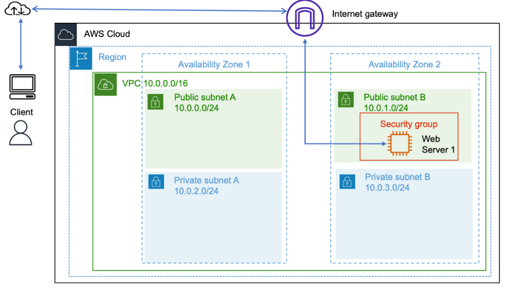
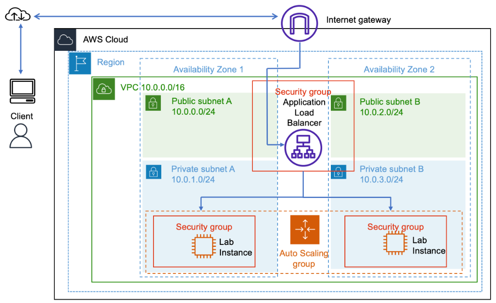
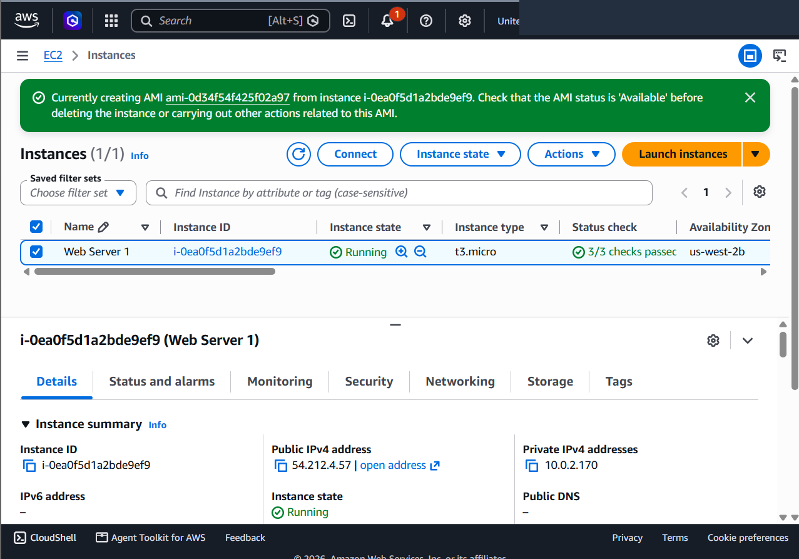
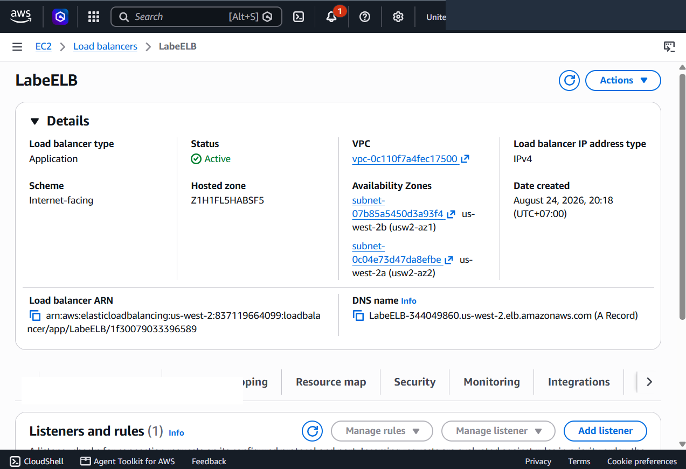
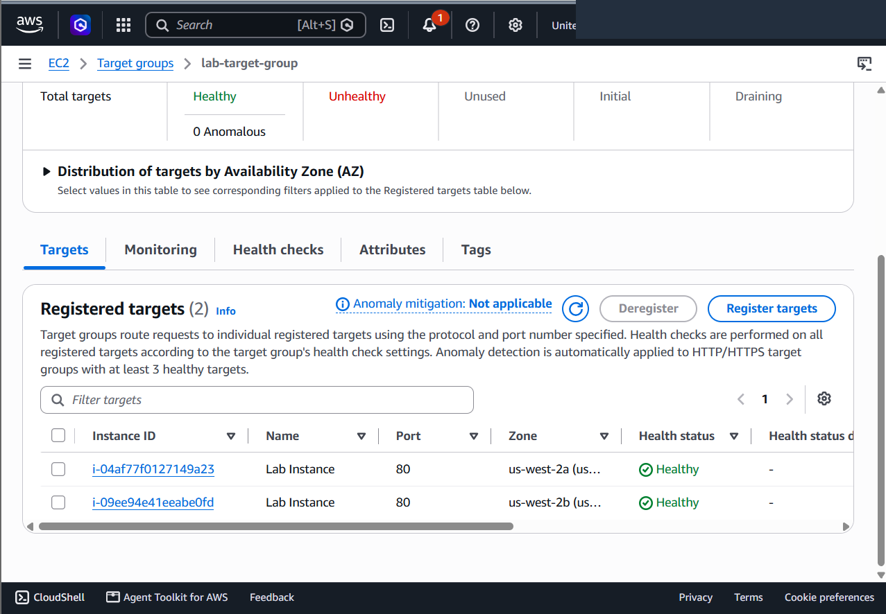
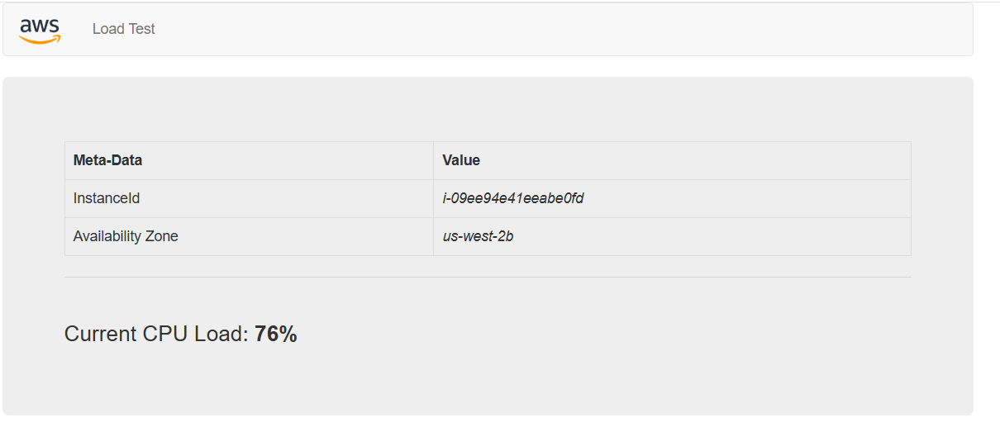
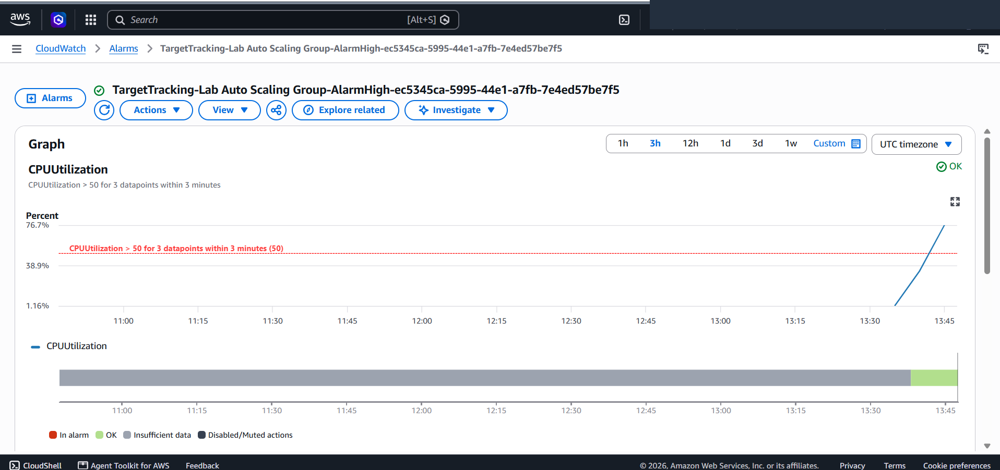
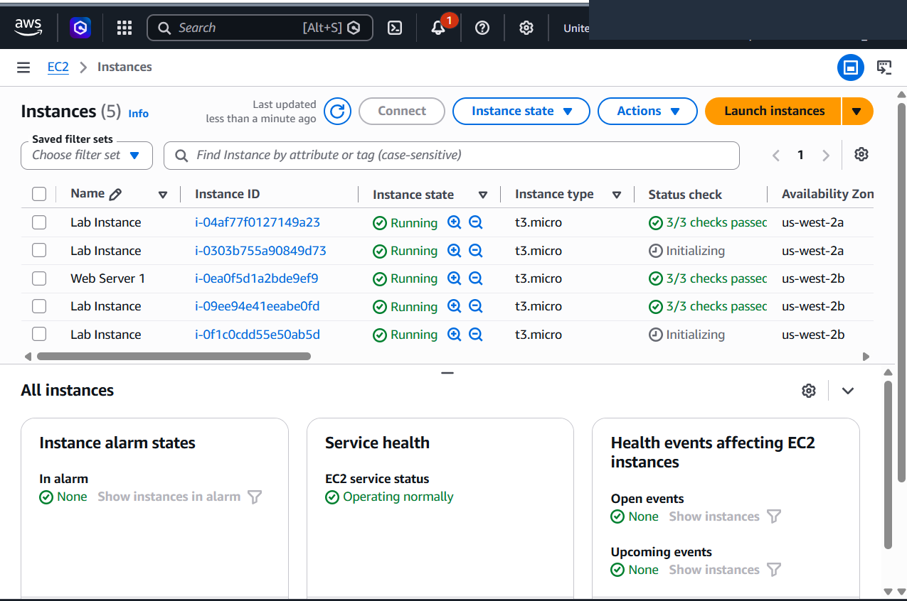

# Scaling & Load Balancing Architecture: Multi-AZ Application Load Balancer & EC2 Auto Scaling

This project documents the architectural transformation of a single-instance, single-AZ web workload into an enterprise-grade, highly available, and elastically scalable infrastructure on Amazon Web Services (AWS). It demonstrates the creation of custom Golden AMIs, deployment of an Internet-facing Multi-AZ **Application Load Balancer (ALB)**, encapsulation of instance provisioning within **EC2 Launch Templates**, secure placement of compute nodes across **Private Subnets**, and implementation of dynamic **Auto Scaling Target Tracking Policies** driven by **Amazon CloudWatch** CPU alarms under synthetic load testing.

---

## Scenario & Architecture Transformation

### Production Bottlenecks & High Availability Objectives
Single-instance public deployments suffer from acute availability vulnerabilities (Single Points of Failure / SPOF) and lack elasticity during sudden traffic spikes. This lab engineers a resilient, decoupled web tier:
- **Golden Image Standardization**: Capture a snapshot of an operational web instance (`Web Server 1`) to generate an immutable Golden AMI (`Web Server AMI`), ensuring bit-for-bit configuration consistency across dynamically spawned fleet members.
- **Multi-AZ Application Load Balancing**: Deploy an Internet-facing ALB (`LabELB`) across two public subnets (`Public Subnet 1` and `Public Subnet 2`) to perform round-robin HTTP ingress routing and health checking against a target group (`lab-target-group`).
- **Private Subnet Compute Isolation**: Isolate compute workloads within `Private Subnet 1` (10.0.1.0/24) and `Private Subnet 2` (10.0.3.0/24), eliminating public IP exposure while allowing the ALB to bridge external client traffic.
- **Dynamic Target Tracking Elasticity**: Configure an EC2 Auto Scaling Group (Min: 2, Desired: 2, Max: 4) governed by an average CPU utilization threshold of 50%, with ELB-driven health replacement policies.
- **Stress Testing & Telemetry Validation**: Generate synthetic calculation load via the web application to trigger CloudWatch `AlarmHigh`, validating autonomous scale-out expansion from 2 to 4 instances.

---

## Architecture Evolution: Before vs. After Transformation

### 1. Starting State: Monolithic Single-AZ Architecture (SPOF)

*Figure 1A: Baseline infrastructure with a single Web Server instance deployed in a single public subnet / single Availability Zone, vulnerable to hardware failure and traffic surges.*

### 2. Final State: Enterprise Multi-AZ Load Balanced & Auto-Scaled Architecture

*Figure 1B: Enterprise target state featuring an Internet-facing Application Load Balancer in dual Public Subnets routing traffic to an Auto Scaling fleet isolated securely in Private Subnets across multiple Availability Zones.*

```
+---------------------------------------------------------------------------------------------------+
|                        SCALING & LOAD BALANCING ARCHITECTURE TOPOLOGY                             |
+---------------------------------------------------------------------------------------------------+
|                                                                                                   |
|   [ Internet / Client Browser ]                                                                   |
|         |                                                                                         |
|         v (HTTP :80)                                                                              |
|   [ Internet Gateway (IGW) ]                                                                      |
|         |                                                                                         |
|   +-----v-------------------------------------------------------------------------------------+   |
|   |  Lab VPC (10.0.0.0/16)                                                                    |   |
|   |                                                                                           |   |
|   |   +---------------------------------------+   +---------------------------------------+   |   |
|   |   | Public Subnet 1 (AZ 1 - 10.0.0.0/24)  |   | Public Subnet 2 (AZ 2 - 10.0.2.0/24)  |   |   |
|   |   |  [ Application Load Balancer: LabELB ]<---+--->[ Application Load Balancer: LabELB ]  |   |   |
|   |   +-------------------|-------------------+   +-------------------|-------------------+   |   |
|   |                       |                                           |                       |   |
|   |                       +---------------------+---------------------+                       |   |
|   |                                             | (Forward: lab-target-group)                 |   |
|   |   ==========================================v==========================================   |   |
|   |   | Auto Scaling Group: Lab Auto Scaling Group (Desired: 2, Min: 2, Max: 4)           |   |   |
|   |   | Policy: Target Tracking (Avg CPU 50%) | Health Check: ELB                         |   |   |
|   |   ==========================================+==========================================   |   |
|   |                                             |                                             |   |
|   |   +-----------------------------------------+   +-------------------------------------+   |   |
|   |   | Private Subnet 1 (AZ 1 - 10.0.1.0/24)   |   | Private Subnet 2 (AZ 2 - 10.0.3.0/24)|   |   |
|   |   |                                         |   |                                     |   |   |
|   |   |   +---------------------------------+   |   |   +-----------------------------+   |   |   |
|   |   |   | EC2: Lab Instance               |   |   |   | EC2: Lab Instance           |   |   |   |
|   |   |   | (Golden AMI, Web Security Group)|   |   |   | (Golden AMI, Web Sec Group) |   |   |   |
|   |   |   +---------------------------------+   |   |   +-----------------------------+   |   |   |
|   |   +-----------------------------------------+   +-------------------------------------+   |   |
|   +-------------------------------------------------------------------------------------------+   |
+---------------------------------------------------------------------------------------------------+
```

---

## Technical Implementation & Verified Screenshots

### 1. Golden AMI Creation from Production Instance
- Captured an immutable machine image (`Web Server AMI`, `ami-0d34f54f425f02a97`) from `Web Server 1` (`i-0ea0f5d1a2bde9ef9`) to preserve installed application code, web server configurations, and system dependencies.


*Figure 2: AWS EC2 Console confirming creation of Web Server AMI from running source instance.*

---

### 2. Multi-AZ Application Load Balancer Provisioning
- Deployed `LabELB` spanning `Public Subnet 1` and `Public Subnet 2`.
- Attached `Web Security Group` allowing inbound HTTP on port 80.
- Configured listener forwarding to `lab-target-group` and retrieved public DNS endpoint (`LabELB-344049860.us-west-2.elb.amazonaws.com`).


*Figure 3: Details panel showing active state, dual Availability Zone mapping, and public DNS name for LabELB.*

---

### 3. Launch Template & Private Subnet Auto Scaling Group
- Configured `lab-app-launch-template` referencing `Web Server AMI`, `t3.micro`, and `Web Security Group`.
- Provisioned `Lab Auto Scaling Group` spanning `Private Subnet 1` (10.0.1.0/24) and `Private Subnet 2` (10.0.3.0/24).
- Linked the ASG to `lab-target-group` with ELB-based health checks, ensuring dynamic fleet replacement upon health check failure.


*Figure 4: Target Group console demonstrating 2 registered Lab Instances achieving Healthy status across AZs us-west-2a and us-west-2b.*

---

### 4. Application Verification via ALB Endpoint
- Accessed `http://LabELB-344049860.us-west-2.elb.amazonaws.com` through a web browser.
- Validated end-to-end routing from the public ALB to backend instances running in private subnets.


*Figure 5: Load Test application rendered successfully via ALB DNS endpoint, displaying backend instance ID and 76% CPU load.*

---

### 5. Stress Testing & CloudWatch Automated Scale-Out
- Initiated synthetic CPU stress via the web application (`Load Test` feature).
- Monitored CloudWatch Alarm `TargetTracking-Lab Auto Scaling Group-AlarmHigh-...`, observing CPU utilization surge past the 50% threshold to 76.7%.
- In response to the breach, Auto Scaling dynamically triggered a scale-out event, provisioning 2 additional `Lab Instance` nodes (scaling fleet from 2 to 4 active instances).


*Figure 6: CloudWatch metrics dashboard tracking CPU utilization spike breaching the 50% threshold and triggering AlarmHigh.*


*Figure 7: EC2 Instances Console showing expanded fleet of 4 Lab Instances distributed across Availability Zones us-west-2a and us-west-2b.*

---

## Key Takeaways & Architectural Best Practices

1. **Defense-in-Depth Network Tiering**: Compute nodes hosting application logic should never reside in public subnets. Using an ALB in public subnets with target instances in private subnets enforces strict boundary security.
2. **Target Tracking Scaling Simplicity**: Target tracking policies dramatically simplify auto scaling by maintaining a single metric (e.g. 50% average CPU), automatically generating both scale-out and scale-in CloudWatch alarms.
3. **ELB Health Checks vs. EC2 Status Checks**: Configuring ASG health checks to use `ELB` rather than standard `EC2` ensures instances failing application-level HTTP checks (e.g. 500 errors or hung web servers) are automatically terminated and replaced.
