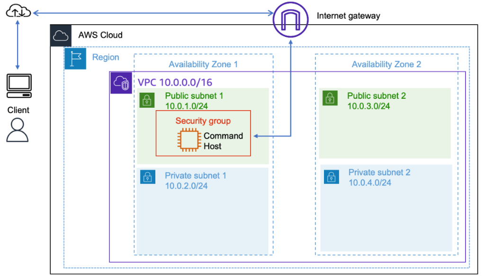
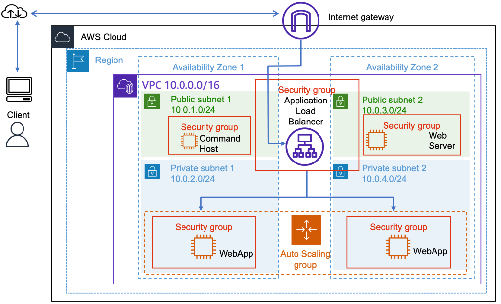
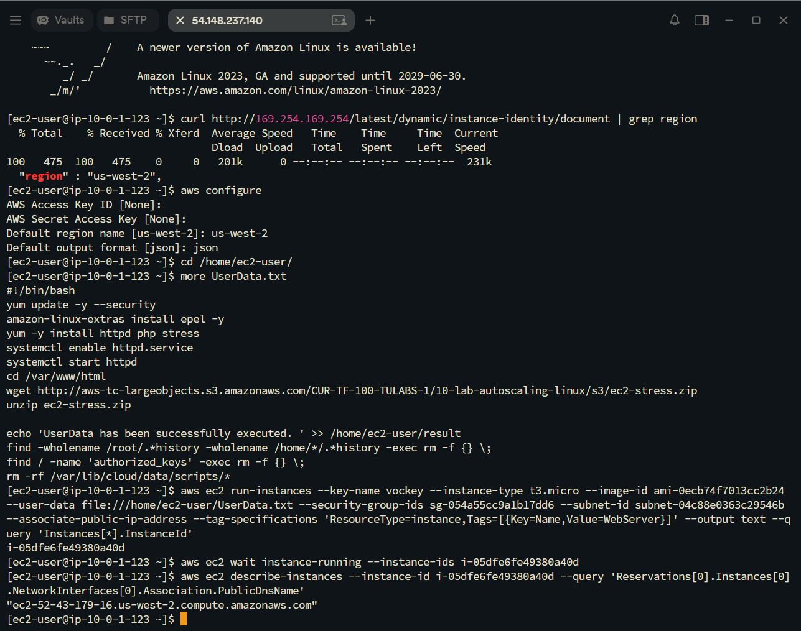
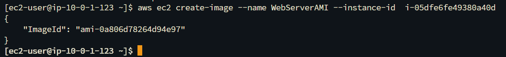
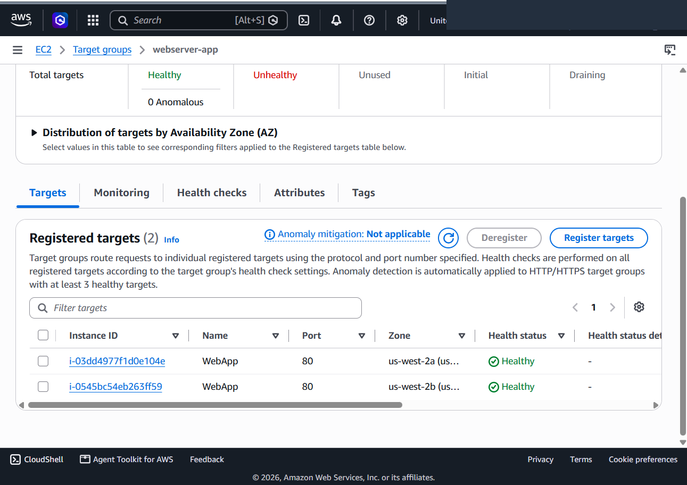
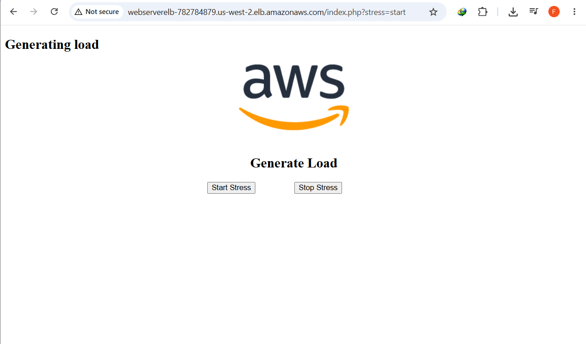
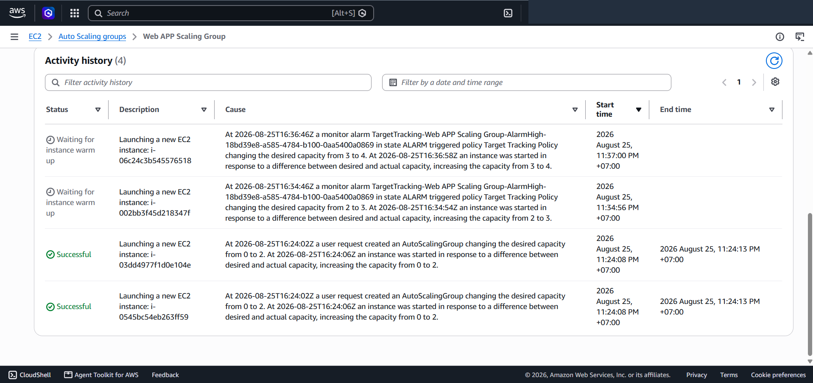
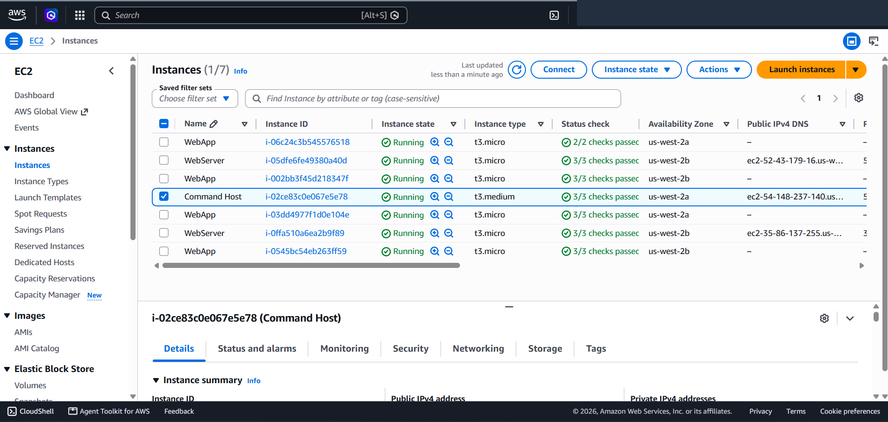

# Automated EC2 Provisioning, Custom AMI Baking & Multi-AZ Auto Scaling on Linux

This project demonstrates a production-grade infrastructure deployment combining programmatic **AWS CLI** instance provisioning, automated **Golden AMI creation**, and multi-tier **Application Load Balancing (ALB)** with **EC2 Auto Scaling Groups (ASG)** across multiple Availability Zones on Amazon Web Services (AWS). It showcases system sanitization before image capture, private subnet workload isolation, target tracking scaling policies governed by **Amazon CloudWatch** CPU utilization alarms, and real-time fleet expansion under synthetic computational load.

---

## Scenario & Architecture Transformation

### Single-Host Operational Risks vs. Elastic Scalable Architecture
Deploying application workloads on single standalone instances creates critical operational risks: single points of failure (SPOF), downtime during maintenance, and failure to handle sudden demand spikes. This project achieves full elasticity and high availability:
- **Programmatic CLI Bootstrapping & Sanitization**: Provision an initial compute node (`WebServer`) via AWS CLI from an administrative host (`Command Host`), injecting `UserData.txt` to install Apache HTTPD, PHP, and a synthetic stress test suite while securely executing sanitization routines (removing shell history, `authorized_keys`, and cloud-init cache).
- **Automated Golden AMI Baking**: Capture an immutable machine image (`WebServerAMI`, `ami-0a806d78264d94e97`) using `aws ec2 create-image` to standardize application binaries and configurations across dynamically spawned fleet instances.
- **Multi-AZ Application Load Balancing**: Deploy an Internet-facing ALB (`WebServerELB`) spanning `Public Subnet 1` and `Public Subnet 2`, configured with custom health checks on `/index.php` routing to `webserver-app`.
- **Private Subnet Compute Tier**: Enforce network segregation by launching auto-scaled `WebApp` instances exclusively within `Private Subnet 1` (10.0.2.0/24) and `Private Subnet 2` (10.0.4.0/24).
- **Dynamic Target Tracking Elasticity**: Configure an Auto Scaling Group with Target Tracking (50% average CPU utilization) and ELB health check integration, scaling from a baseline of 2 instances up to a maximum of 4 instances under sustained computational stress.

---

## Architecture Evolution: Before vs. After Transformation

### 1. Starting State: Single-Host Management Architecture

*Figure 1A: Baseline environment with administrative Command Host deployed in a single public subnet.*

### 2. Final State: Enterprise Multi-AZ Load Balanced & Auto-Scaled Architecture

*Figure 1B: Final enterprise architecture featuring an Internet-facing Application Load Balancer in Public Subnets routing ingress traffic to an Auto Scaling fleet isolated securely in Private Subnets across dual Availability Zones.*

```
+---------------------------------------------------------------------------------------------------+
|                     AUTOMATED EC2 PROVISIONING & ELASTIC AUTO SCALING TOPOLOGY                    |
+---------------------------------------------------------------------------------------------------+
|                                                                                                   |
|   [ Web Client / Browser ]                                                                        |
|         |                                                                                         |
|         v (HTTP / TCP Port 80)                                                                    |
|   [ Internet Gateway (IGW) ]                                                                      |
|         |                                                                                         |
|   +-----v-------------------------------------------------------------------------------------+   |
|   |  Lab VPC (10.0.0.0/16)                                                                    |   |
|   |                                                                                           |   |
|   |   +---------------------------------------+   +---------------------------------------+   |   |
|   |   | Public Subnet 1 (AZ 1 - 10.0.1.0/24)  |   | Public Subnet 2 (AZ 2 - 10.0.3.0/24)  |   |   |
|   |   |  - [ Command Host ]                   |   |  - [ WebServer (Source Instance) ]    |   |   |
|   |   |  - [ ALB Ingress Node ] <=============+===> - [ ALB Ingress Node ]                |   |   |
|   |   +-------------------|-------------------+   +-------------------|-------------------+   |   |
|   |                       |                                           |                       |   |
|   |                       +---------------------+---------------------+                       |   |
|   |                                             | (Forward: webserver-app /index.php)         |   |
|   |   ==========================================v==========================================   |   |
|   |   | Auto Scaling Group: Web App Auto Scaling Group (Min: 2, Desired: 2, Max: 4)       |   |   |
|   |   | Policy: Target Tracking (Avg CPU 50%) | Health Check: ELB                         |   |   |
|   |   ==========================================+==========================================   |   |
|   |                                             |                                             |   |
|   |   +-----------------------------------------+   +-------------------------------------+   |   |
|   |   | Private Subnet 1 (AZ 1 - 10.0.2.0/24)   |   | Private Subnet 2 (AZ 2 - 10.0.4.0/24)|   |   |
|   |   |                                         |   |                                     |   |   |
|   |   |   +---------------------------------+   |   |   +-----------------------------+   |   |   |
|   |   |   | EC2: WebApp Instance            |   |   |   | EC2: WebApp Instance        |   |   |   |
|   |   |   | (WebServerAMI, HTTPAccess SG)   |   |   |   | (WebServerAMI, HTTPAccess)  |   |   |   |
|   |   |   +---------------------------------+   |   |   +-----------------------------+   |   |   |
|   |   +-----------------------------------------+   +-------------------------------------+   |   |
|   +-------------------------------------------------------------------------------------------+   |
+---------------------------------------------------------------------------------------------------+
```

---

## Technical Implementation & Verified Screenshots

### 1. Programmatic EC2 Provisioning & Sanitization via AWS CLI
- Connected to `Command Host` via **EC2 Instance Connect** and inspected `UserData.txt`.
- Executed `aws ec2 run-instances` specifying `vockey` keypair, `t3.micro`, `ami-0ecb74f7013cc2b24`, security group `sg-054a55cc9a1b17dd6`, and public subnet `subnet-04c88e0363c29546b`.
- Monitored launch status using `aws ec2 wait instance-running` and retrieved public DNS `ec2-52-43-179-16.us-west-2.compute.amazonaws.com`.


*Figure 2: Terminal session demonstrating instance creation, wait command execution, and public DNS query via AWS CLI.*

---

### 2. Custom Golden AMI Baking via CLI
- Executed `aws ec2 create-image` to generate `WebServerAMI` (`ami-0a806d78264d94e97`) from the sanitized source instance (`i-05dfe6fe49380a40d`).


*Figure 3: Output JSON confirming the successful generation of WebServerAMI.*

---

### 3. Application Load Balancer & Target Group Health Checks
- Configured `WebServerELB` spanning `Public Subnet 1` and `Public Subnet 2` with `HTTPAccess` security group.
- Registered target group `webserver-app` with HTTP health check path set to `/index.php`.
- Verified both auto-scaled `WebApp` instances (`i-03dd4977f1d0e104e` and `i-0545bc54eb263ff59`) achieved `Healthy` status across Availability Zones `us-west-2a` and `us-west-2b`.


*Figure 4: AWS Console showing 2 registered WebApp targets passing ELB health checks on port 80.*

---

### 4. Synthetic Load Generation & CloudWatch Alarm Triggering
- Accessed `http://webserverelb-782784879.us-west-2.elb.amazonaws.com/index.php?stress=start` via web browser.
- Initiated background CPU stress computation, driving CPU utilization across active instances to 100%.


*Figure 5: Web interface executing synthetic computational load to test auto scaling triggers.*

---

### 5. Dynamic Scale-Out & Fleet Expansion Verification
- Monitored `Web App Auto Scaling Group` Activity history, confirming `TargetTracking-...-AlarmHigh` entered `ALARM` state.
- Observed autonomous scale-out events expanding fleet capacity from 2 to 3 (`i-002bb3f45d218347f`), and subsequently from 3 to 4 instances (`i-06c24c3b545576518`).
- Confirmed the expanded fleet of 4 running `WebApp` instances distributed across Availability Zones in the EC2 Management Console.


*Figure 6: Auto Scaling Group Activity History logging automated instance launches triggered by CloudWatch high CPU alarms.*


*Figure 7: EC2 Instances dashboard confirming expanded fleet of 4 healthy WebApp instances running in private subnets.*

---

## Key Takeaways & Operational Best Practices

1. **System Sanitization Prior to Image Baking**: Before generating Golden AMIs from running instances, always purge temporary shell histories (`.*history`), SSH authorized keys (`authorized_keys`), and cloud-init cache to prevent security credential leakage into child instances.
2. **Path-Specific Health Checking**: Configuring the Target Group health check path to the specific application entrypoint (`/index.php` rather than default `/`) ensures that the ALB accurately detects application-level faults.
3. **Multi-AZ Fault Isolation**: Distributing Auto Scaling instances across multiple private subnets guarantees that the application survives complete Availability Zone outages without manual intervention.
