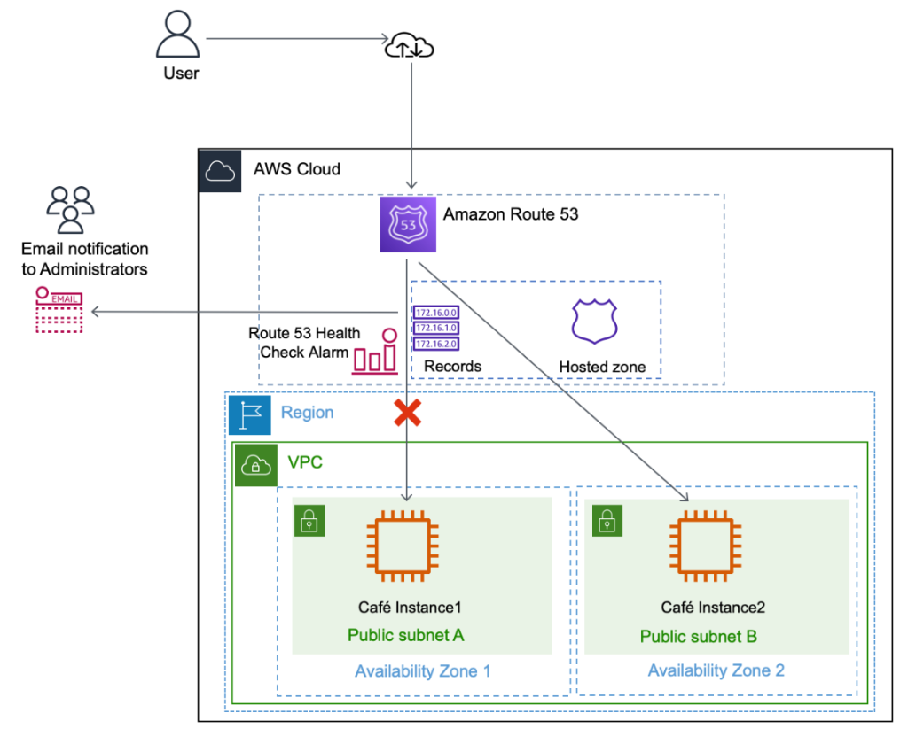
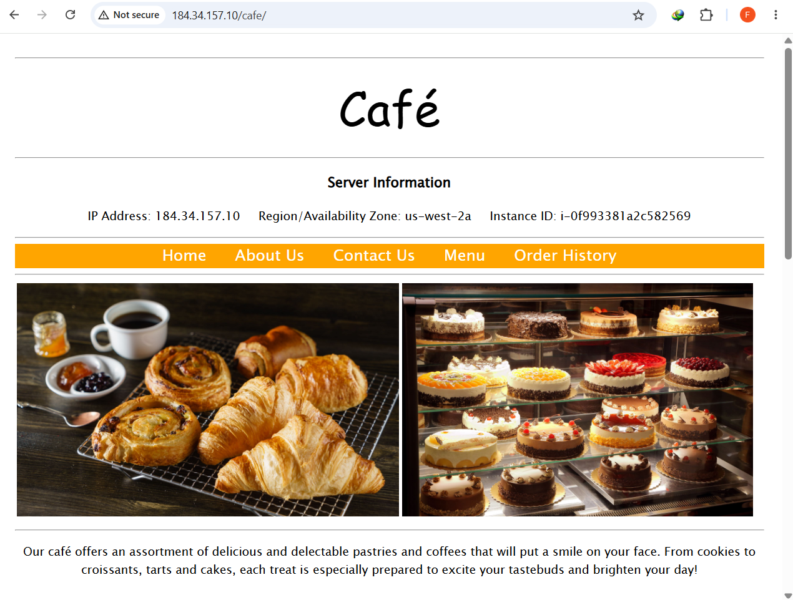
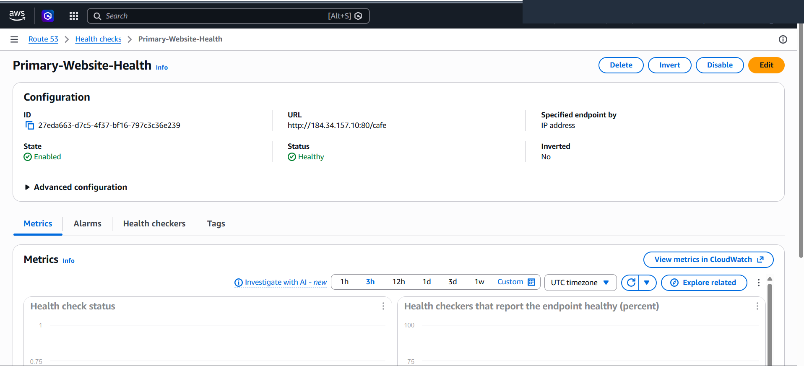
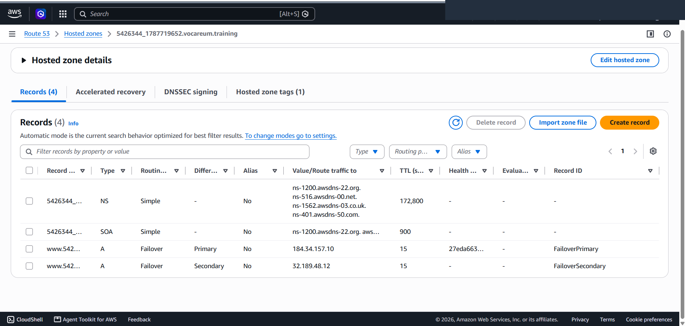
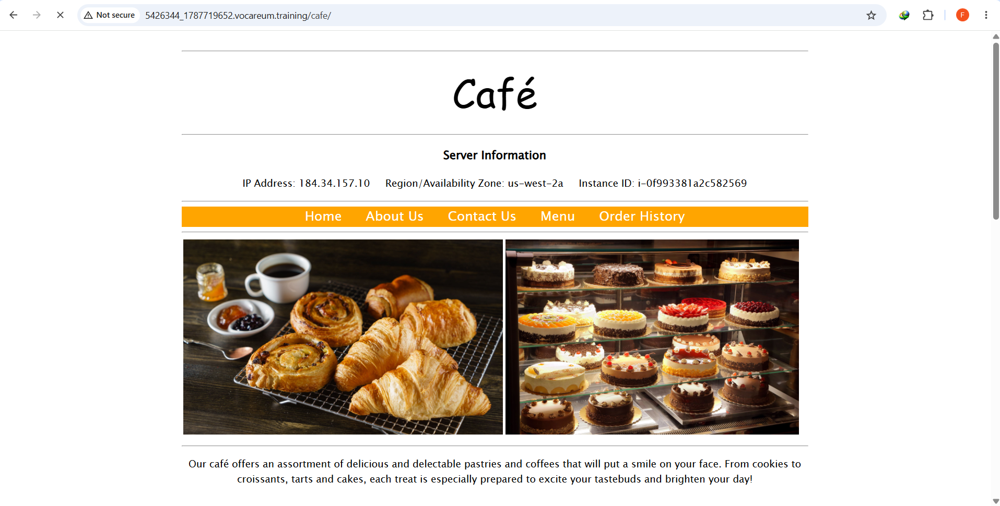
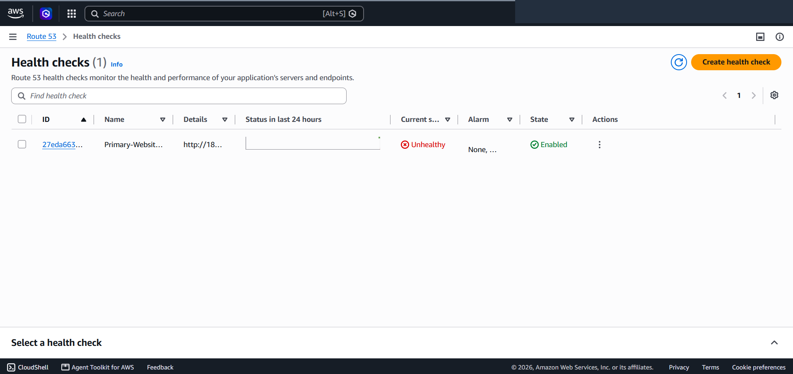
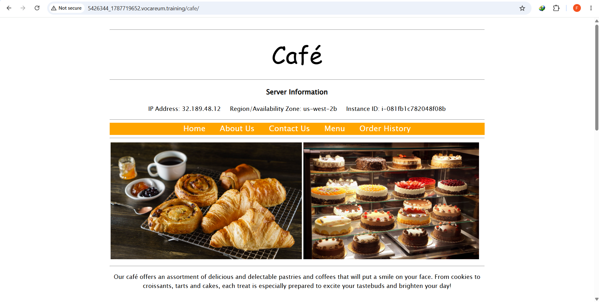

# Multi-AZ Active-Passive Disaster Recovery & DNS Failover Routing with Amazon Route 53

This project demonstrates a production-grade **Active-Passive Disaster Recovery (DR)** architecture using **Amazon Route 53** DNS failover routing, endpoint health checks, and cross-Availability Zone fault tolerance on Amazon Web Services (AWS). It showcases automated infrastructure health probing, rapid DNS record caching adjustments (low TTL), and instant, zero-touch traffic redirection to a secondary warm standby compute instance during primary node outages.

---

## Scenario & Disaster Recovery Architecture

### Single-Zone Risk vs. Automated DNS-Level Failover
Relying on a single Availability Zone creates catastrophic business risk during localized data center power loss, network partition, or compute hardware failure. To eliminate manual failover delays and reduce Mean Time to Recovery (MTTR), this architecture implements:
- **Multi-AZ Dual-Node Deployment**: Provision two independent EC2 LAMP compute instances running the Café Web Application across isolated Availability Zones: `CafeInstance1` (`184.34.157.10`, `i-0f993381a2c582569`) in `us-west-2a` (Primary) and `CafeInstance2` (`32.189.48.12`, `i-081fb1c782048f08b`) in `us-west-2b` (Secondary/Standby).
- **Fast Endpoint Health Checking**: Configure a dedicated Route 53 Health Check (`Primary-Website-Health`, ID `27eda663-d7c5-4f37-bf16-797c3c36e239`) targeting `http://184.34.157.10:80/cafe` with a **Fast (10-second)** polling interval and a **Failure Threshold of 2**, triggering state changes within 20 seconds of failure.
- **Active-Passive DNS Record Pairs**: Create two `A` records in the Route 53 Hosted Zone (`5426344_1787719652.vocareum.training`) with a 15-second Time-To-Live (TTL):
  1. `FailoverPrimary`: Routes apex traffic to `184.34.157.10` conditional upon `Primary-Website-Health` being `Healthy`.
  2. `FailoverSecondary`: Serves as the backup target routing to `32.189.48.12` when the primary endpoint fails.
- **Simulated Disaster & Automated Traffic Failover**: Deliberately stop `CafeInstance1`, observe the health check transition to `Unhealthy`, and verify seamless, immediate browser redirection to the secondary instance in `us-west-2b`.

---

## Architecture Topology


*Figure 1: High Availability DNS Failover Architecture showing Route 53 health monitoring and automated failover from primary AZ 1 to standby AZ 2.*

```
+---------------------------------------------------------------------------------------------------+
|                     AMAZON ROUTE 53 DNS FAILOVER ROUTING TOPOLOGY                                 |
+---------------------------------------------------------------------------------------------------+
|                                                                                                   |
|   [ Client Web Browser ]                                                                          |
|         |                                                                                         |
|         v (DNS Query: 5426344_1787719652.vocareum.training)                                       |
|   +-------------------------------------------------------------------------------------------+   |
|   | Amazon Route 53 (Global Anycast DNS Service)                                              |   |
|   |                                                                                           |   |
|   |   Hosted Zone: 5426344_1787719652.vocareum.training                                       |   |
|   |   +-----------------------------------------------------------------------------------+   |   |
|   |   | Record 1: Primary Failover (TTL 15s)   -> 184.34.157.10 (Health: Primary-Health)    |   |   |
|   |   | Record 2: Secondary Failover (TTL 15s) -> 32.189.48.12  (Default Standby)           |   |   |
|   |   +-----------------------------------------------------------------------------------+   |   |
|   |                                                                                           |   |
|   |   Health Check: Primary-Website-Health (Probing http://184.34.157.10:80/cafe)             |   |   |
|   +-----|---------------------------------------------------------|---------------------------+   |
|         |                                                         |                               |
|         | [Status: Healthy] (Normal Operation)                    | [Status: Unhealthy] (Failover)|
|         v                                                         v                               |
|   +---------------------------------------+         +-----------------------------------------+   |
|   | Availability Zone 1 (us-west-2a)      |         | Availability Zone 2 (us-west-2b)        |   |
|   |                                       |         |                                         |   |
|   |   +-------------------------------+   |         |   +---------------------------------+   |   |
|   |   | EC2: CafeInstance1 (PRIMARY)  |   |         |   | EC2: CafeInstance2 (SECONDARY)  |   |   |
|   |   | IP: 184.34.157.10             |   |         |   | IP: 32.189.48.12                |   |   |
|   |   | Status: [STOPPED / FAILURE]   |   |         |   | Status: [ACTIVE SERVING]        |   |   |
|   |   +-------------------------------+   |         |   +---------------------------------+   |   |
|   +---------------------------------------+         +-----------------------------------------+   |
+---------------------------------------------------------------------------------------------------+
```

---

## Technical Implementation & Verification Proofs

### 1. Baseline Primary & Secondary Verification
- Confirmed baseline operation of both web servers across isolated Availability Zones.
- Accessed `http://184.34.157.10/cafe/` directly to verify `CafeInstance1` (`i-0f993381a2c582569`) serving traffic from `us-west-2a`.


*Figure 2: Web browser accessing the primary Café instance displaying Server Information in us-west-2a.*

---

### 2. Fast Endpoint Health Check Configuration
- Configured Route 53 Health Check `Primary-Website-Health` targeting endpoint `http://184.34.157.10:80/cafe`.
- Configured Advanced parameters: **Fast (10s)** interval and **Failure threshold = 2** for rapid detection.
- Verified initial health status transition to **`Healthy`**.


*Figure 3: Route 53 Health Check console confirming enabled, healthy status probing the primary endpoint.*

---

### 3. Failover DNS Records Configuration in Hosted Zone
- Created two `A` records with low TTL (15 seconds) inside `5426344_1787719652.vocareum.training`:
  - `FailoverPrimary`: Target `184.34.157.10` associated with Health Check ID `27eda663-d7c5-4f37-bf16-797c3c36e239`.
  - `FailoverSecondary`: Target `32.189.48.12` without a health check to act as the unconditional fallback target.


*Figure 4: Hosted Zone record set showing both Primary and Secondary Failover records.*

---

### 4. Normal Domain Resolution to Primary (AZ 1)
- Navigated to `http://5426344_1787719652.vocareum.training/cafe/`.
- Verified that Route 53 successfully resolved the domain name to `184.34.157.10` (`us-west-2a`).


*Figure 5: Public domain resolving to primary instance in us-west-2a during healthy state.*

---

### 5. Disaster Simulation: Health Check Alarm Trigger
- Simulated primary node failure by executing `Stop instance` on `CafeInstance1` in the EC2 Console.
- Route 53 health checkers detected consecutive connection timeouts, driving health status to **`Unhealthy`** (Red indicator).


*Figure 6: Route 53 Health Check dashboard displaying Unhealthy status following instance termination.*

---

### 6. Automated Zero-Touch Failover to Secondary (AZ 2)
- Refreshed `http://5426344_1787719652.vocareum.training/cafe/`.
- Route 53 instantly returned the Secondary record IP (`32.189.48.12`), seamlessly serving the application from **Availability Zone `us-west-2b`** (`CafeInstance2`, `i-081fb1c782048f08b`).


*Figure 7: Public domain resolving automatically to secondary instance in us-west-2b after primary failure.*

---

## Key Takeaways & Operational Best Practices

1. **DNS TTL Optimization for Disaster Recovery**: Standard DNS TTLs (e.g., 3600 seconds) cause client resolvers to cache stale IP addresses for hours during outages. Setting a low TTL (15–60 seconds) on failover records ensures rapid client redirection without caching lag.
2. **Application-Specific Health Check Paths**: Health checks should probe deep application paths (e.g., `/cafe` or `/healthz`) rather than generic web root `/` to ensure that web server software, application runtimes, and databases are operational.
3. **Active-Passive vs. Active-Active Considerations**: While Active-Passive routing provides predictable capacity and simple database synchronization, Active-Active (Weighted or Latency-based) routing can be leveraged when both nodes actively serve traffic concurrently.
