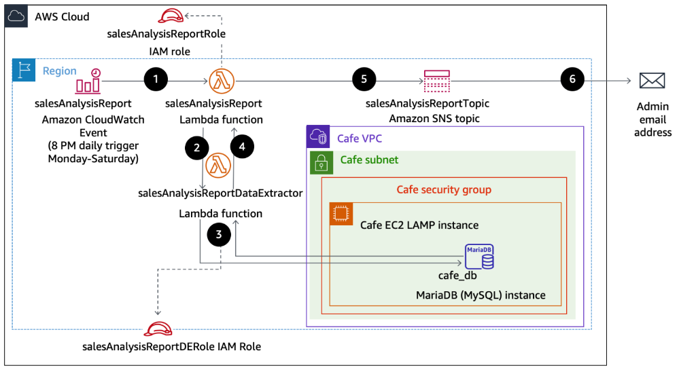
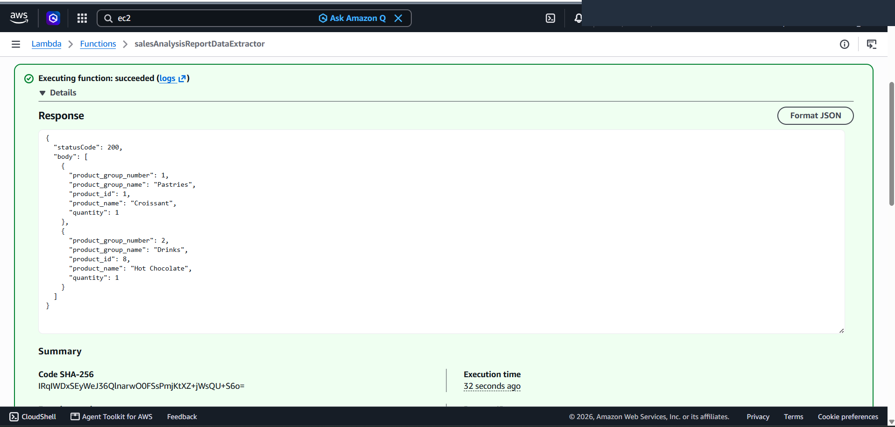
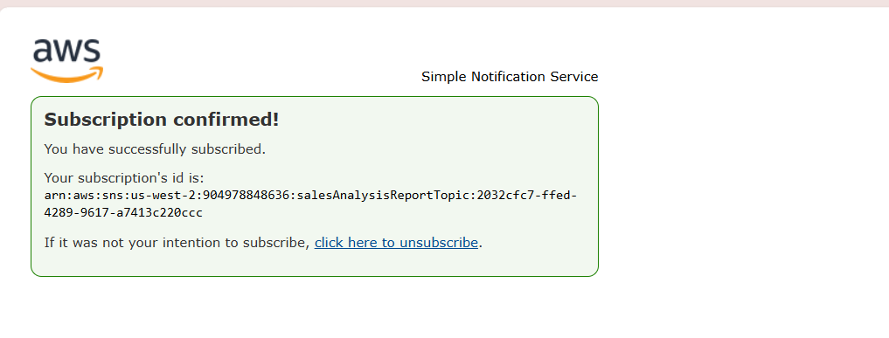
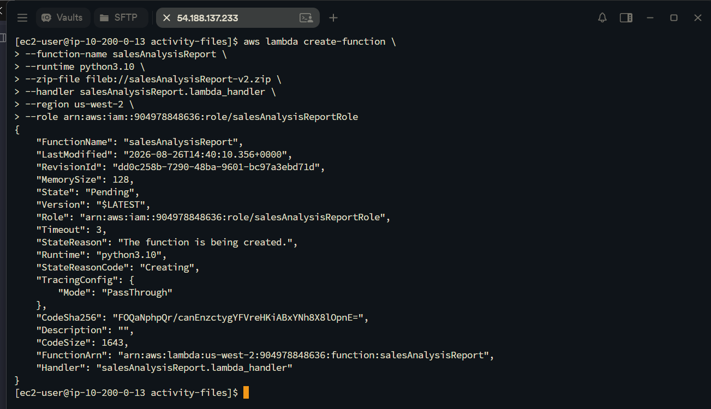
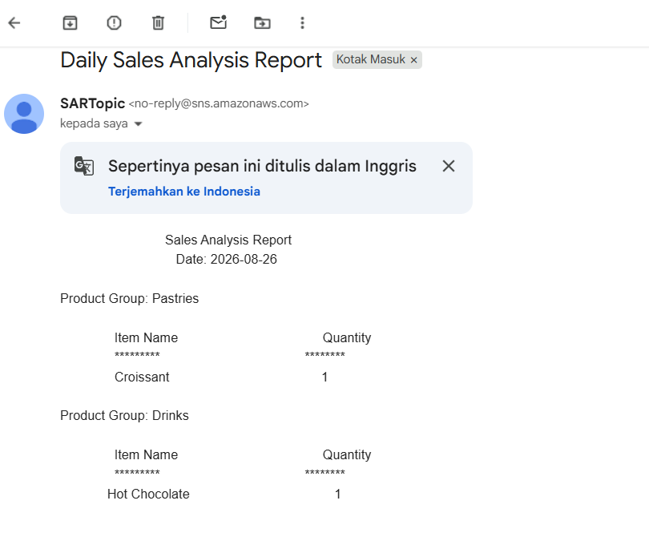
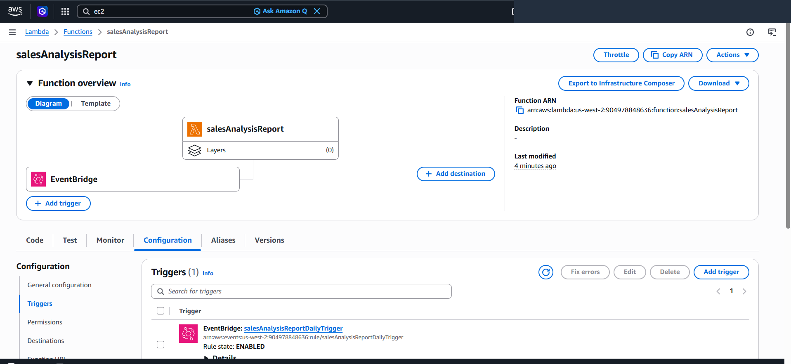

# Automated Serverless Reporting Pipeline with AWS Lambda, EventBridge, SSM & Amazon SNS

This project demonstrates a production-grade **Event-Driven Serverless Data Pipeline** on Amazon Web Services (AWS). It orchestrates scheduled cron triggers via **Amazon EventBridge**, database extraction across private VPC subnets with **AWS Lambda Layers (PyMySQL)**, secure configuration retrieval via **AWS Systems Manager Parameter Store**, and automated executive email distribution using **Amazon Simple Notification Service (SNS)**.

---

## Scenario & Enterprise Architecture

### Persistent Compute vs. On-Demand Serverless Pipeline
Running dedicated virtual machines 24/7 for periodic daily reporting creates unnecessary operational overhead and idle infrastructure costs. This solution implements a fully serverless, zero-maintenance analytics workflow:
- **Scheduled Triggering (EventBridge)**: An EventBridge Cron Rule (`salesAnalysisReportDailyTrigger`) fires daily, triggering the primary orchestrator function.
- **Master Orchestrator Function (`salesAnalysisReport`)**: Governed by `salesAnalysisReportRole`, it fetches database connection parameters from Systems Manager Parameter Store, invokes the downstream worker function, formats raw analytics, and publishes the report to Amazon SNS (`salesAnalysisReportTopic`).
- **Worker Function with Custom Layer (`salesAnalysisReportDataExtractor`)**: Governed by `salesAnalysisReportDERole` and attached to `Cafe VPC`, it utilizes a custom Lambda Layer (`pymysqlLibrary`) to query the MySQL/MariaDB database (`cafe_db`) securely across VPC Elastic Network Interfaces (ENIs).
- **Automated Multi-Channel Alerting (Amazon SNS)**: Fans out formatted transactional sales reports to confirmed administrative email subscribers.

---

## Architectural Workflow & Topology


*Figure 1: High-level architectural pipeline illustrating the end-to-end execution flow from EventBridge schedule to SNS email delivery.*

```
+---------------------------------------------------------------------------------------------------+
|                        AWS SERVERLESS EVENT-DRIVEN REPORTING PIPELINE                             |
+---------------------------------------------------------------------------------------------------+
|                                                                                                   |
|   +-------------------------------------------------------------------------------------------+   |
|   | 1. Amazon EventBridge (CloudWatch Events)                                                  |   |
|   |    Rule: salesAnalysisReportDailyTrigger (Cron Schedule: Mon-Sat 8 PM UTC)                 |   |
|   +---------------------------------------------+---------------------------------------------+   |
|                                                 |                                                 |
|                                                 v (Scheduled Trigger)                             |
|   +---------------------------------------------+---------------------------------------------+   |
|   | 2. Orchestrator: salesAnalysisReport (Lambda Function / Python 3.10)                       |   |
|   |    - IAM Role: salesAnalysisReportRole (SNS Full, SSM ReadOnly, Lambda Invoke, BasicRun)  |   |
|   |    - Fetches DB Credentials from SSM Parameter Store (/cafe/dbUrl, dbName, dbUser, pass)  |   |
|   |    - Environment Variable: topicARN                                                       |   |
|   +---------------------+-------------------------------------------------------+-------------+   |
|                         |                                                       |                 |
|                         v (Sync Invoke)                                         |                 |
|   +---------------------+---------------------------------------+               |                 |
|   | 3. Worker: salesAnalysisReportDataExtractor (Lambda)        |               |                 |
|   |    - Layer: pymysqlLibrary (PyMySQL Client Module)          |               |                 |
|   |    - IAM Role: salesAnalysisReportDERole (VPC Access)       |               |                 |
|   |    - Network: Cafe VPC (Cafe Public Subnet 1, Port 3306)    |               |                 |
|   +---------------------+---------------------------------------+               |                 |
|                         |                                                       |                 |
|                         v (SQL Analytical Query)                                |                 |
|   +---------------------+---------------------------------------+               |                 |
|   | 4. Database: MariaDB / MySQL (cafe_db)                      |               |                 |
|   |    - Host: Cafe EC2 LAMP Instance (Port 3306)               |               |                 |
|   |    - Returns: Sales aggregation by product & category       |               |                 |
|   +---------------------+---------------------------------------+               |                 |
|                         |                                                       |                 |
|                         +-----------------------+ (JSON Order Data)             |                 |
|                                                 |                               |                 |
|                                                 v                               v                 |
|   +-----------------------------------------------------------------------------+-------------+   |
|   | 5. Notification: Amazon SNS Topic (salesAnalysisReportTopic / SARTopic)                   |   |
|   +---------------------------------------------+---------------------------------------------+   |
|                                                 |                                                 |
|                                                 v (Email Protocol)                                |
|   +---------------------------------------------+---------------------------------------------+   |
|   | 6. Administrator Email Inbox: "Daily Sales Analysis Report" Delivered                      |   |
|   +-------------------------------------------------------------------------------------------+   |
+---------------------------------------------------------------------------------------------------+
```

---

## Technical Implementation & Verification Proofs

### 1. Lambda Layer & Database Worker Function Testing
- Packaged the `PyMySQL` client library into `pymysqlLibrary` Layer (Version 1).
- Deployed `salesAnalysisReportDataExtractor` configured with `salesAnalysisReportDERole` and attached to `Cafe VPC`.
- Remediated database connectivity by adding an Inbound Rule for MySQL (Port 3306) in `CafeSecurityGroup`.
- Executed `SARDETestEvent` retrieving live transactional order data (`Pastries: Croissant` & `Drinks: Hot Chocolate`).


*Figure 2: Execution result of salesAnalysisReportDataExtractor returning structured JSON sales payload.*

---

### 2. Amazon SNS Topic & Email Subscription
- Created Standard SNS topic `salesAnalysisReportTopic` (`SARTopic`).
- Subscribed administrator email address and verified the subscription confirmation handshake.


*Figure 3: AWS SNS console confirmation indicating active, verified email subscription.*

---

### 3. Programmatic Lambda Deployment via AWS CLI
- Connected to `CLI Host` via EC2 Instance Connect and configured AWS CLI with IAM credentials.
- Executed `aws lambda create-function` to deploy `salesAnalysisReport` with runtime `python3.10` from `salesAnalysisReport-v2.zip`.


*Figure 4: Terminal session showing successful creation of the salesAnalysisReport Lambda function.*

---

### 4. End-to-End Report Delivery Verification
- Injected `topicARN` environment variable into `salesAnalysisReport`.
- Triggered unit test `SARTestEvent`, invoking the full pipeline and delivering the formatted report directly to the administrator inbox.


*Figure 5: Inbox receiving the automated Daily Sales Analysis Report email delivered via Amazon SNS.*

---

### 5. Scheduled Automation via Amazon EventBridge
- Configured EventBridge scheduled rule `salesAnalysisReportDailyTrigger` to execute the pipeline automatically on a scheduled cron basis.


*Figure 6: Lambda Function Overview diagram confirming active EventBridge cron trigger.*

---

## Key Takeaways & Operational Best Practices

1. **Decoupling Orchestration from Data Ingestion**: Separating orchestrator (`salesAnalysisReport`) from database worker (`salesAnalysisReportDataExtractor`) ensures that only functions requiring direct VPC access are placed inside VPC subnets, reducing Cold Start latency and ENI resource consumption.
2. **Externalizing Secrets to SSM Parameter Store**: Storing database endpoints and credentials in AWS Systems Manager Parameter Store prevents hardcoding sensitive credentials in source code repositories.
3. **Lambda Layer Reusability**: Using Lambda Layers allows external dependencies (`PyMySQL`) to be maintained, versioned, and shared independently without inflating function package sizes.
