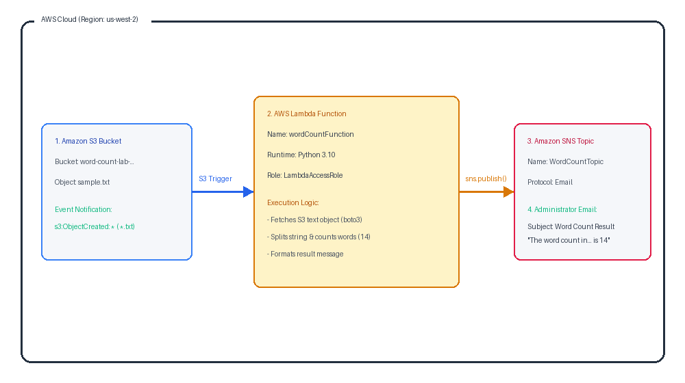
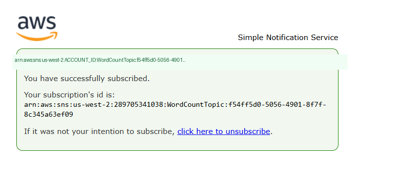
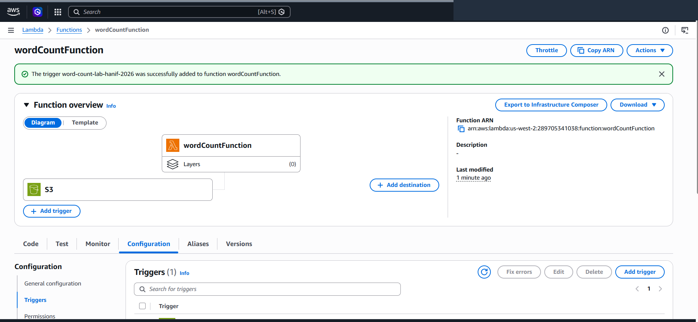
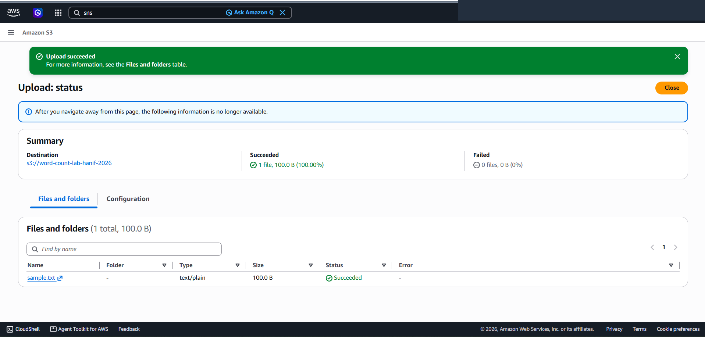
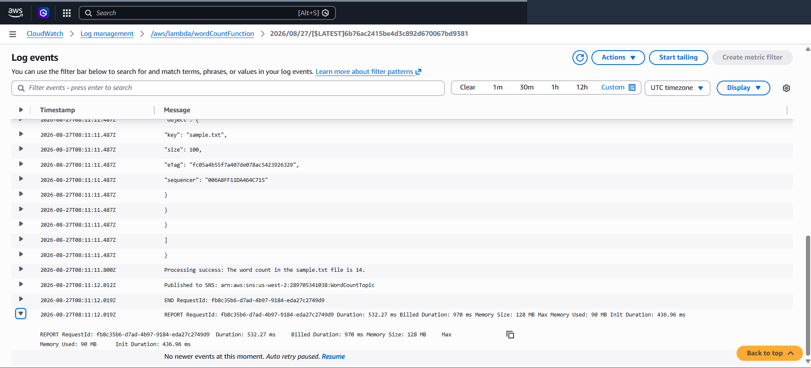
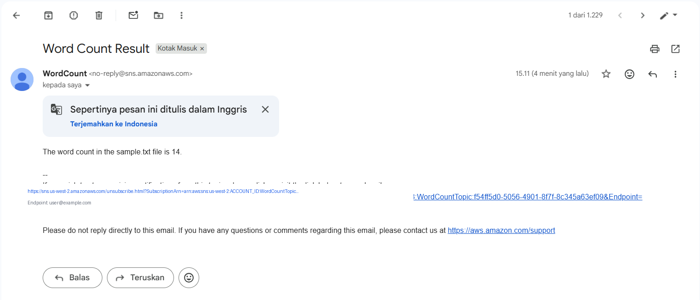

# Event-Driven Serverless Document Analytics with Amazon S3, AWS Lambda & Amazon SNS

This project implements an end-to-end, event-driven serverless document processing architecture on Amazon Web Services (AWS). It demonstrates autonomous object storage ingestion triggers via **Amazon S3**, custom Python analytics execution with **AWS Lambda**, and fan-out executive email notification delivery using **Amazon Simple Notification Service (SNS)**.

---

## Scenario & Serverless Architecture

### Manual Polling vs. Zero-Latency Event-Driven Analytics
Traditional document processing workflows rely on scheduled polling jobs or long-running virtual machines that waste idle compute resources. This architecture replaces legacy polling with real-time, event-driven compute:
- **Object Ingestion Layer (Amazon S3)**: An S3 Bucket (`word-count-lab-hanif-2026`) captures incoming `.txt` document uploads, emitting granular `s3:ObjectCreated:*` events.
- **Serverless Compute Engine (AWS Lambda)**: A Python 3.10 Lambda function (`wordCountFunction`) governed by `LambdaAccessRole` is triggered asynchronously upon object creation. It extracts object metadata, streams document content using the AWS SDK for Python (`boto3`), calculates total word frequency, and formats the output message according to strict business specifications.
- **Decoupled Notification Layer (Amazon SNS)**: The function publishes analysis results directly to a Standard SNS topic (`WordCountTopic`), instantly distributing structured email notifications (`Word Count Result`) to subscribed administrative stakeholders.

---

## Architecture Pipeline & Component Topology


*Figure 1: Architectural pipeline illustrating real-time document ingestion in S3, event-driven Lambda execution, and automated SNS email dissemination.*

```
+---------------------------------------------------------------------------------------------------+
|                  EVENT-DRIVEN SERVERLESS DOCUMENT ANALYTICS PIPELINE                              |
+---------------------------------------------------------------------------------------------------+
|                                                                                                   |
|   [ Client / Data Source ]                                                                        |
|         |                                                                                         |
|         v (Upload: sample.txt)                                                                    |
|   +-----+-------------------------------------------------------------------------------------+   |
|   | 1. Amazon S3 Bucket: word-count-lab-hanif-2026                                            |   |
|   |    - Object: sample.txt (14 words)                                                        |   |
|   |    - Event Notification: s3:ObjectCreated:* (Suffix: .txt)                                |   |
|   +---------------------------------------------+---------------------------------------------+   |
|                                                 |                                                 |
|                                                 v (Asynchronous Event Trigger)                    |
|   +---------------------------------------------+---------------------------------------------+   |
|   | 2. AWS Lambda: wordCountFunction (Python 3.10)                                            |   |
|   |    - Execution Role: LambdaAccessRole (S3 Full, SNS Full, CloudWatch Logs)                |   |
|   |    - Environment Variable: TOPIC_ARN                                                     |   |
|   |    - Logic: s3.get_object() -> content.split() -> len() -> 14 words                       |   |
|   |    - Message: "The word count in the sample.txt file is 14."                              |   |
|   +---------------------------------------------+---------------------------------------------+   |
|                                                 |                                                 |
|                                                 v (sns_client.publish())                          |
|   +---------------------------------------------+---------------------------------------------+   |
|   | 3. Amazon SNS Topic: WordCountTopic (Standard)                                            |   |
|   |    - Subscription: Protocol Email (Confirmed)                                             |   |
|   +---------------------------------------------+---------------------------------------------+   |
|                                                 |                                                 |
|                                                 v (Push Delivery)                                 |
|   +---------------------------------------------+---------------------------------------------+   |
|   | 4. Administrator Email: Subject: "Word Count Result" Delivered                            |   |
|   +-------------------------------------------------------------------------------------------+   |
+---------------------------------------------------------------------------------------------------+
```

---

## Technical Implementation & Verified Proofs

### 1. Decoupled Notification Layer (Amazon SNS)
- Provisioned Standard SNS topic `WordCountTopic` with display name `WordCount`.
- Subscribed administrator email endpoint and completed the mutual subscription handshake.


*Figure 2: AWS SNS console verifying active, confirmed email subscription state.*

---

### 2. Serverless Analytics Function & S3 Event Binding
- Developed `wordCountFunction` in Python 3.10 with `LambdaAccessRole` permissions.
- Injected `TOPIC_ARN` into Lambda Environment Variables.
- Bound an S3 Event Notification trigger filtering for `.txt` object creations on `word-count-lab-hanif-2026`.


*Figure 3: AWS Lambda Function Overview confirming S3 event source mapping and active configuration.*

---

### 3. Object Storage Ingestion Testing
- Uploaded `sample.txt` (100.0 B) containing a sample corpus to Amazon S3.


*Figure 4: S3 console confirming successful upload of sample.txt.*

---

### 4. CloudWatch Observability & Execution Analytics
- Monitored Amazon CloudWatch log streams (`/aws/lambda/wordCountFunction`).
- Verified zero-latency event consumption, string tokenization, word count calculation (`14 words`), and SNS publication (`Duration: 532.27 ms`, `Max Memory Used: 90 MB`).


*Figure 5: CloudWatch Logs output validating successful text processing and SNS dispatch.*

---

### 5. Automated Email Report Delivery
- Verified receipt of formatted email report in administrator inbox.
- Validated exact subject (`Word Count Result`) and payload structure (`The word count in the sample.txt file is 14.`).


*Figure 6: Delivered email notification confirming end-to-end serverless pipeline functionality.*

---

## Key Takeaways & Operational Best Practices

1. **Suffix & Prefix Event Filtering**: Applying `.txt` suffix filters at the S3 trigger level prevents unnecessary Lambda invocations from unrelated object types (images, metadata JSON), drastically minimizing execution cost.
2. **URL-Decoding S3 Object Keys**: Object keys received from S3 events may contain URL-encoded characters (spaces as `+` or `%20`). Using `urllib.parse.unquote_plus()` prevents `NoSuchKey` runtime exceptions.
3. **Decoupled Architecture with SNS**: Publishing processing results to an SNS topic decouples the processing function from notification consumers, allowing seamless addition of downstream consumers (SMS, HTTP webhooks, SQS queues) without altering compute logic.
