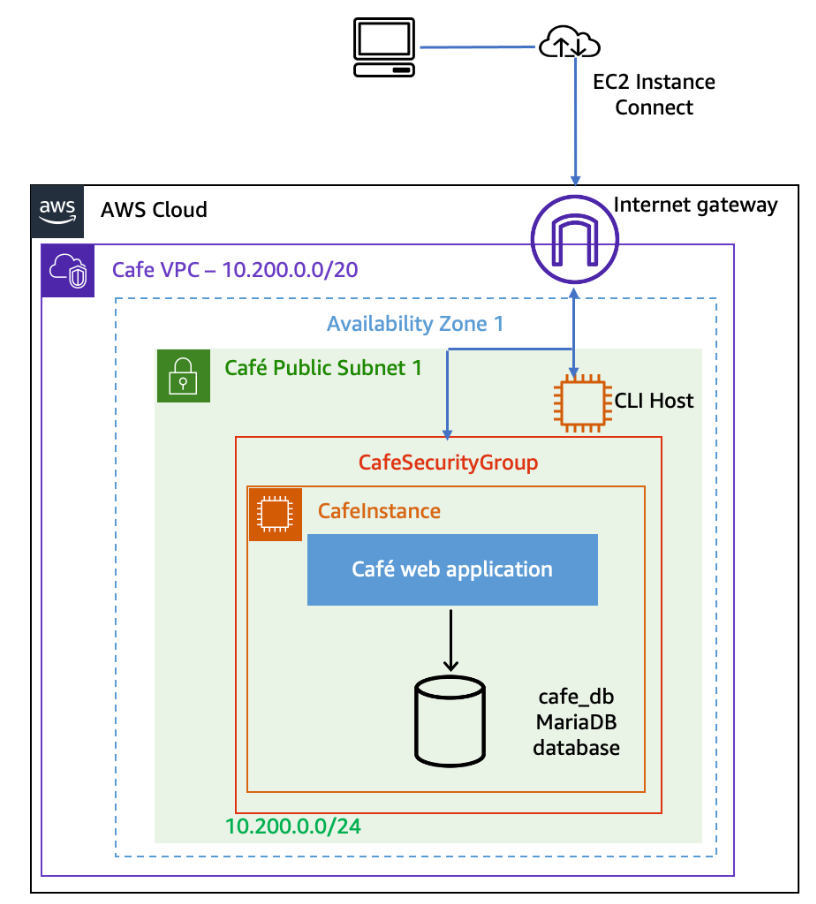
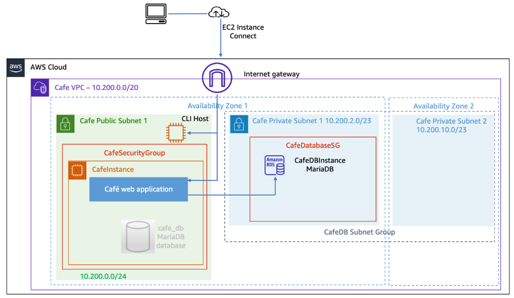
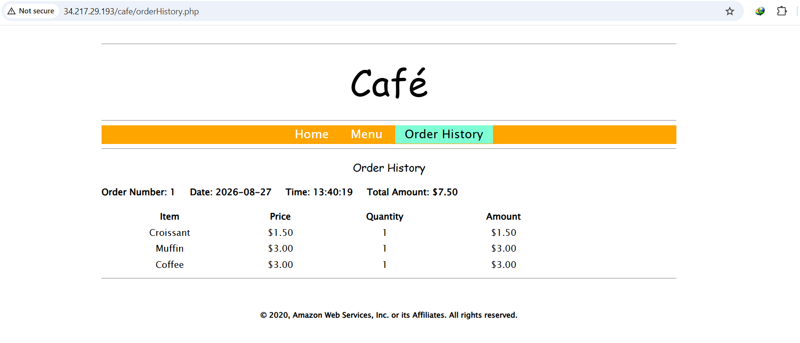
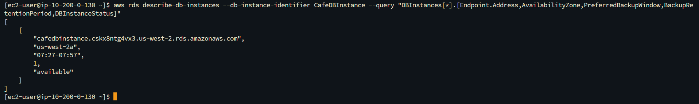
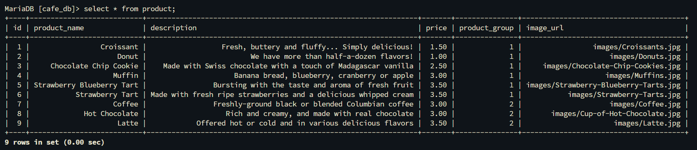
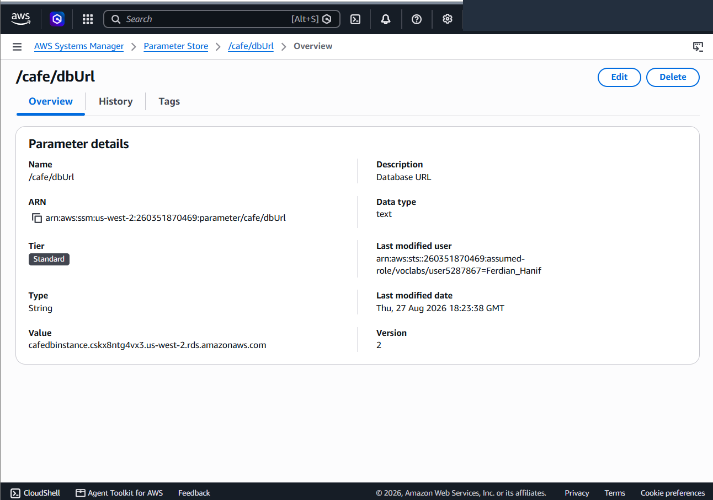
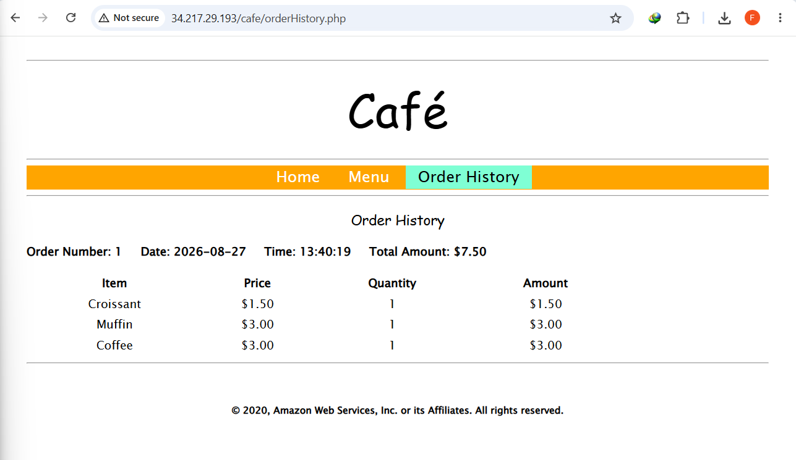
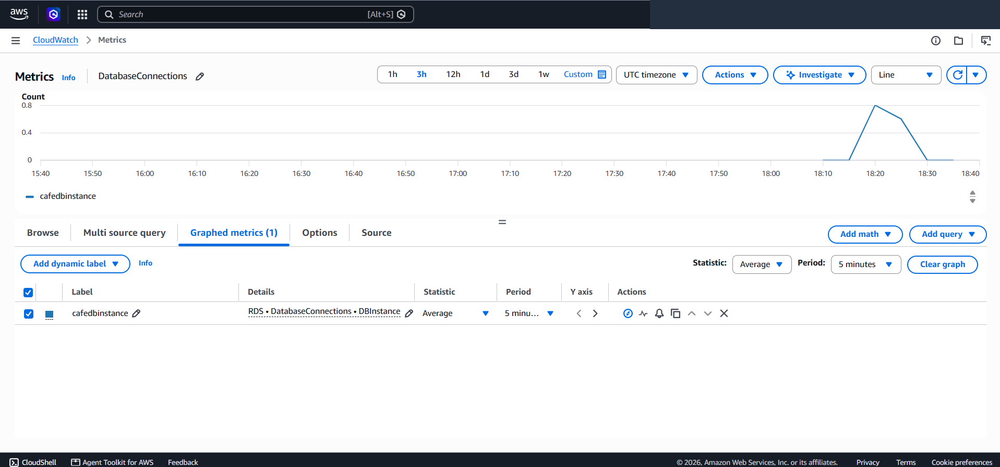

# Zero-Downtime Database Decoupling & Migration to Managed Amazon RDS MariaDB

This project demonstrates the architectural transition of an enterprise web application from a legacy monolithic LAMP stack to a decoupled, multi-tier cloud infrastructure on Amazon Web Services (AWS). It covers programmatic provisioning of **Amazon RDS MariaDB**, isolated **Multi-AZ DB Subnet Groups**, stateful Security Group boundaries, encrypted SSL/TLS data migration using `mysqldump`, dynamic configuration decoupling via **AWS Systems Manager Parameter Store**, and performance telemetry with **Amazon CloudWatch**.

---

## Scenario & Enterprise Architecture

### Legacy Monolith vs. Decoupled Multi-Tier Architecture
Running web server processes and relational database engines on a single Amazon EC2 instance introduces significant architectural bottlenecks:
- **Single Point of Failure (SPOF)**: A crash in the web server daemon or operating system halts database access completely.
- **Resource Contention**: Heavy database indexing and web traffic spikes compete for identical CPU, RAM, and disk I/O channels.
- **Horizontal Scaling Constraints**: Auto Scaling cannot scale stateless web servers dynamically because database writes are tightly coupled to local disk storage.

### Target Cloud-Native State
- **Isolated Database Tier**: The database is migrated to **Amazon RDS MariaDB** (`CafeDBInstance`) placed in private subnets across two Availability Zones (`CafeDB Private Subnet 1` & `CafeDB Private Subnet 2`).
- **Least-Privilege Network Access**: `CafeDatabaseSG` permits ingress traffic exclusively on TCP Port 3306 originating from `CafeSecurityGroup`.
- **Dynamic Secret Decoupling**: Database connection endpoints are managed in **AWS Systems Manager Parameter Store** (`/cafe/dbUrl`), eliminating code redeployments during infrastructure cutover.

---

## Architecture Evolution & Topology

| Starting Architecture (Monolith) | Final Target Architecture (Decoupled Multi-Tier) |
| :---: | :---: |
|  |  |
| *Figure 1: Monolithic LAMP stack on single EC2 instance.* | *Figure 2: Decoupled web application with managed Multi-AZ RDS MariaDB.* |

```
+---------------------------------------------------------------------------------------------------+
|                        AWS DECOUPLED DATABASE MIGRATION TOPOLOGY                                  |
+---------------------------------------------------------------------------------------------------+
|                                                                                                   |
|   +-------------------------------------------------------------------------------------------+   |
|   | AWS Cloud (Region: us-west-2 / Cafe VPC: 10.200.0.0/20)                                   |   |
|   |                                                                                           |   |
|   |   [ Public Subnet 1: 10.200.0.0/24 - AZ 1 ]                                               |   |
|   |   +---------------------------------------+   +---------------------------------------+   |   |
|   |   | CafeInstance (EC2 LAMP Web App)       |   | CLI Host (EC2 Instance Connect)       |   |   |
|   |   | - Security Group: CafeSecurityGroup   |   | - AWS CLI v2 Provisioning Engine      |   |   |
|   |   | - PHP Frontend (/cafe)                |   +---------------------------------------+   |   |
|   |   +-------------------+-------------------+                                               |   |
|   |                       |                                                                   |   |
|   |                       v (Encrypted SQL Traffic / TLS 1.3 / TCP 3306)                      |   |
|   |   +-------------------+---------------------------------------------------------------+   |   |
|   |   | CafeDB Subnet Group (Multi-AZ DB Subnet Group)                                    |   |   |
|   |   |                                                                                   |   |   |
|   |   |   [ Private Subnet 1: 10.200.2.0/23 - AZ 1 ]   [ Private Subnet 2: 10.200.10.0/23 ]   |   |
|   |   |   +---------------------------------------+   +-----------------------------------+   |   |
|   |   |   | CafeDBInstance (Amazon RDS MariaDB)   |   | Standby / High Availability Zone  |   |   |
|   |   |   | - Security Group: CafeDatabaseSG      |   +-----------------------------------+   |   |
|   |   |   | - Storage: 20 GB gp2                  |                                           |   |
|   |   |   | - CA Bundle: global-bundle.pem        |                                           |   |
|   |   |   +---------------------------------------+                                           |   |
|   |   +-----------------------------------------------------------------------------------+   |   |
|   +-------------------------------------------------------------------------------------------+   |
|                                                                                                   |
|   +-------------------------------------------------------------------------------------------+   |
|   | AWS Systems Manager Parameter Store: /cafe/dbUrl -> cafedbinstance.xxxx.rds.amazonaws.com |   |
|   +-------------------------------------------------------------------------------------------+   |
+---------------------------------------------------------------------------------------------------+
```

---

## Technical Implementation & Verification Proofs

### 1. Pre-Migration Baseline Verification
- Generated transactional order baseline on the monolithic local database (`Croissant`, `Muffin`, `Coffee`, Total: `$7.50`).


*Figure 3: Pre-migration order history stored on local MySQL instance.*

---

### 2. Programmatic Provisioning via AWS CLI
- Connected to `CLI Host` and configured CLI parameters.
- Provisioned `CafeDatabaseSG`, authorized ingress port 3306 from `CafeSecurityGroup`.
- Created dual-AZ subnets `10.200.2.0/23` (`us-west-2a`) and `10.200.10.0/23` (`us-west-2b`), assembled `CafeDB Subnet Group`.
- Executed `aws rds create-db-instance` launching `CafeDBInstance` (MariaDB engine, `db.t3.micro`), and verified transition to `available` state.


*Figure 4: AWS CLI output showing active status and endpoint address of CafeDBInstance.*

---

### 3. Encrypted Data Dump & RDS Import
- Connected to `CafeInstance` and extracted full database structure and records via `mysqldump`.
- Downloaded the AWS RDS PKI Root CA certificate (`global-bundle.pem`).
- Streamed the SQL backup over TLS/SSL to the Amazon RDS instance and queried `product` table to verify zero data loss.


*Figure 5: Terminal verification showing product catalog successfully restored in RDS MariaDB.*

---

### 4. Dynamic Decoupled Cutover (SSM Parameter Store)
- Updated `/cafe/dbUrl` in AWS Systems Manager Parameter Store with the newly provisioned RDS endpoint.
- Enabled SSL transport on web application PHP connection handlers.


*Figure 6: Systems Manager Parameter Store configuration pointing to Amazon RDS.*

---

### 5. Post-Migration Verification & Data Integrity
- Refreshed the live application: confirmed order history was read accurately from Amazon RDS without downtime or data corruption.


*Figure 7: Live web application seamlessly querying orders from Amazon RDS MariaDB.*

---

### 6. CloudWatch Performance Monitoring
- Executed active SQL queries on `CafeDBInstance` and validated real-time telemetry spikes on the `DatabaseConnections` CloudWatch metric graph.


*Figure 8: Amazon CloudWatch metric graph displaying active database connections.*

---

## Key Takeaways & Operational Best Practices

1. **VPC Subnet Group Multi-AZ Mandate**: AWS RDS requires a DB Subnet Group spanning at least two Availability Zones even for single-AZ deployments, ensuring infrastructure is pre-architected for instant Multi-AZ failover conversion.
2. **Encrypted Transport by Default (`require_secure_transport`)**: Modern enterprise database engines enforce TLS encryption natively. Application drivers must explicitly supply AWS RDS CA bundles (`global-bundle.pem`) to maintain end-to-end security compliance.
3. **Decoupled Configuration Management**: Externalizing database connection strings to AWS Systems Manager Parameter Store or AWS Secrets Manager enables zero-downtime database migrations without code modifications or server redeployments.
