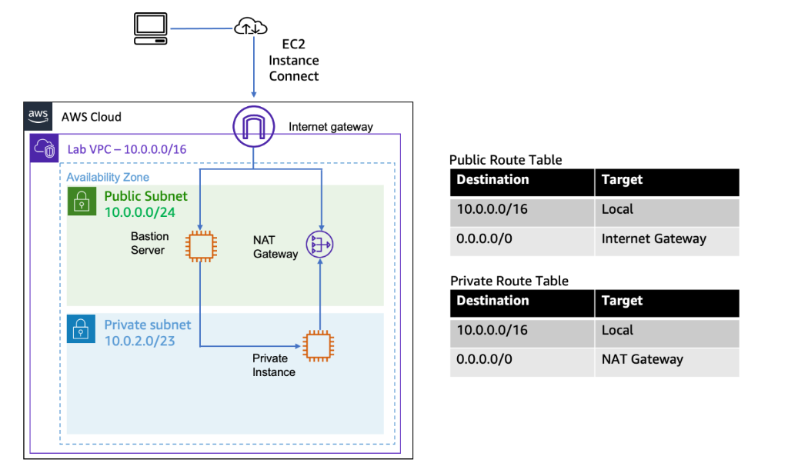
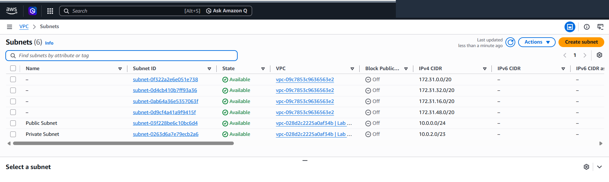
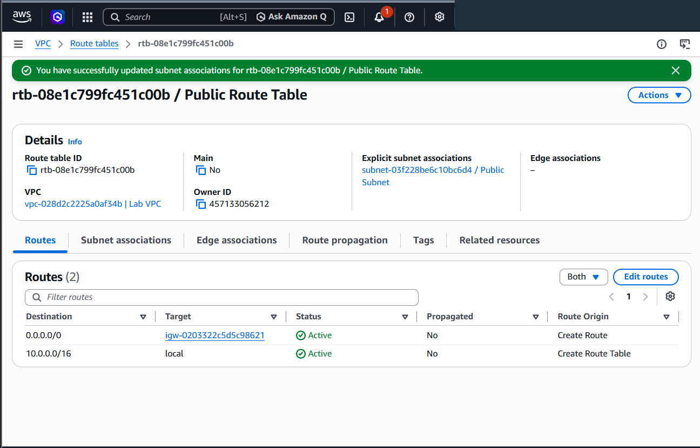
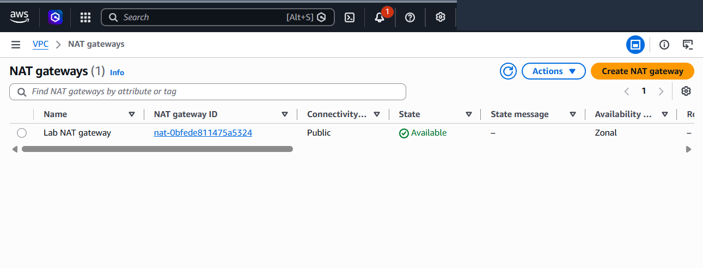
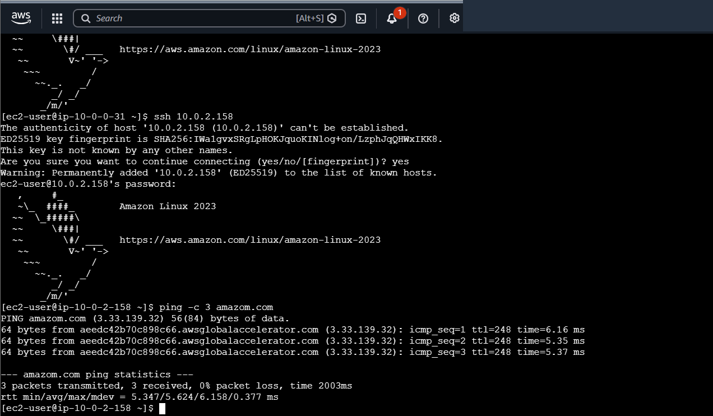

# Production-Grade Custom Amazon VPC Architecture with Bastion Jump Host & NAT Gateway

This engineering project demonstrates the end-to-end implementation of an isolated, multi-tier enterprise network infrastructure on Amazon Web Services (AWS). It covers custom CIDR planning, public and private subnet segmentation, bi-directional routing via an **Internet Gateway (IGW)**, managed egress-only internet access using a **NAT Gateway**, secure jump-box administration via a public **Bastion Host**, and validation of outbound internet connectivity from an air-gapped private compute workload.

---

## Scenario & Enterprise Architecture

### Network Security & Segmentation Challenges
In enterprise cloud topologies, exposing backend databases or application processing servers directly to the public internet introduces critical security vulnerabilities. Standard security best practices mandate a strict separation of concerns:
- **Public Ingress Layer**: Dedicated solely to internet-facing appliances such as Application Load Balancers or **Bastion Servers (Jump Boxes)**.
- **Private Egress Layer**: Isolated backend compute instances (`Private Instance`) remain completely inaccessible from inbound internet traffic (no public IPv4 assigned) while retaining the capability to retrieve essential security updates, OS patches, and external API data via a managed **NAT Gateway**.
- **Least-Privilege Administrative Access**: Direct SSH access from the internet to internal servers is blocked; operators authenticate strictly through an audited, perimeter-hardened Bastion Host.

---

## Architecture Topology


*Figure 1: Custom Amazon VPC network topology featuring Public/Private Subnets, IGW, NAT Gateway, Bastion Server, and Private Instance.*

```
+---------------------------------------------------------------------------------------------------+
|                        AWS CUSTOM VPC NETWORK INFRASTRUCTURE (10.0.0.0/16)                        |
+---------------------------------------------------------------------------------------------------+
|                                                                                                   |
|   +-------------------------------------------------------------------------------------------+   |
|   | Internet Gateway: Lab IGW (0.0.0.0/0 Bi-directional Ingress/Egress)                       |   |
|   +---------------------------------------------+---------------------------------------------+   |
|                                                 |                                                 |
|                                                 v                                                 |
|   +-------------------------------------------------------------------------------------------+   |
|   | Public Subnet: 10.0.0.0/24 (Associated with Public Route Table: 0.0.0.0/0 -> Lab IGW)    |   |
|   |                                                                                           |   |
|   |   +---------------------------------------+   +---------------------------------------+   |   |
|   |   | Bastion Server (EC2 t3.micro)         |   | Lab NAT Gateway (Zonal Egress Device) |   |   |
|   |   | - Public IP: Auto-Assigned            |   | - Subnet: Public Subnet               |   |   |
|   |   | - SG: Inbound Port 22 (0.0.0.0/0)     |   | - EIP: Allocated Elastic IP           |   |   |
|   |   | - Role: Administrative Jump Host      |   | - Role: Outbound Source NAT (SNAT)    |   |   |
|   |   +-------------------+-------------------+   +-------------------+-------------------+   |   |
|   |                       | (Internal SSH Jump)                       ^                           |   |
|   +-----------------------|-------------------------------------------|-----------------------+   |
|                           |                                           | (Outbound Egress Only)    |
|                           v                                           |                           |
|   +-------------------------------------------------------------------|-----------------------+   |
|   | Private Subnet: 10.0.2.0/23 (Associated with Private Route Table: 0.0.0.0/0 -> NAT GW)   |   |
|   |                                                                                           |   |
|   |   +---------------------------------------------------------------+                       |   |
|   |   | Private Instance (EC2 t3.micro)                               |                       |   |
|   |   | - Private IP: 10.0.2.x (No Public IP)                         |                       |   |
|   |   | - SG: Inbound Port 22 from VPC CIDR (10.0.0.0/16)            |                       |   |
|   |   | - Validation: Egress ping to amazon.com via NAT Gateway       |                       |   |
|   |   +---------------------------------------------------------------+                       |   |
|   +-------------------------------------------------------------------------------------------+   |
+---------------------------------------------------------------------------------------------------+
```

---

## Technical Implementation & Verification Proofs

### 1. Subnet Segmentation & Address Allocation
- Provisioned `Lab VPC` (`10.0.0.0/16`) with DNS hostnames enabled.
- Created `Public Subnet` (`10.0.0.0/24`, 251 available IP addresses) with auto-assign public IPv4 enabled.
- Created `Private Subnet` (`10.0.2.0/23`, 507 available IP addresses) accommodating large-scale internal workload expansion.


*Figure 2: AWS VPC Subnet management console displaying active Public Subnet and Private Subnet allocations.*

---

### 2. Public Ingress/Egress Routing via Internet Gateway
- Provisioned `Lab IGW` and attached it directly to `Lab VPC`.
- Constructed `Public Route Table`, configured default route `0.0.0.0/0` targeting `Lab IGW`, and explicitly associated it with `Public Subnet`.


*Figure 3: Route table configuration validating active default routing to Internet Gateway.*

---

### 3. Managed Egress NAT Gateway Deployment
- Provisioned `Lab NAT gateway` in `Public Subnet` using standard `Zonal` availability mode.
- Allocated and bound a dedicated Elastic IP (EIP) to the NAT gateway.
- Updated `Private Route Table` with default route `0.0.0.0/0` targeting `Lab NAT gateway`, ensuring private instances obtain internet egress without inbound vulnerability exposure.


*Figure 4: VPC NAT Gateway console displaying active status and public zonal connectivity.*

---

### 4. Perimeter Bastion Jump & Outbound NAT Validation
- Deployed `Bastion Server` in `Public Subnet` with perimeter SSH access.
- Deployed `Private Instance` in `Private Subnet` with private-only IP (`10.0.2.158`) and strict internal security group rules (`10.0.0.0/16`).
- Authenticated to `Bastion Server` via EC2 Instance Connect, executed internal SSH jump (`ssh 10.0.2.158`), and ran `ping -c 3 amazon.com` from the private instance.
- Verified **0% packet loss** (`avg = 5.624 ms`), confirming successful outbound internet routing through the NAT Gateway.


*Figure 5: Terminal execution showing successful internal SSH jump and outbound ICMP ping over NAT Gateway.*

---

## Key Takeaways & Architectural Best Practices

1. **NAT Gateway Placement Prerequisite**: A NAT Gateway translates private IP addresses to its allocated public Elastic IP. Consequently, it **must always be deployed in a Public Subnet** with a route to an Internet Gateway, even though its consumers reside in Private Subnets.
2. **Subnet Sizing Asymmetry (`/24` vs `/23`)**: In enterprise architectures, public subnets only host ingress gateways, load balancers, and bastion nodes, requiring fewer IPs (`/24`). Private subnets host databases, containers, and autoscaling application tiers, requiring substantially larger address pools (`/23` or `/22`).
3. **Zonal vs. Regional NAT Deployments**: While AWS introduced Regional NAT Gateways, standard production enterprise designs deploy Zonal NAT Gateways per Availability Zone to eliminate cross-AZ data transfer fees and prevent single-AZ outage cascading.
