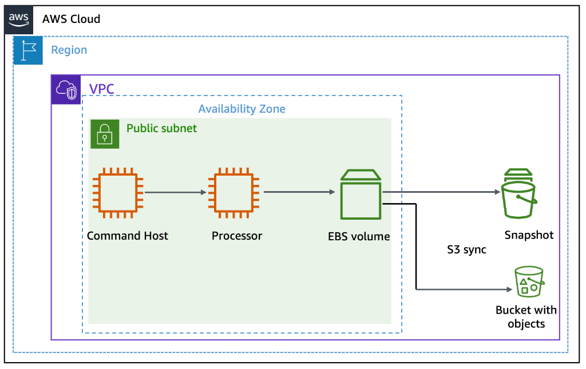
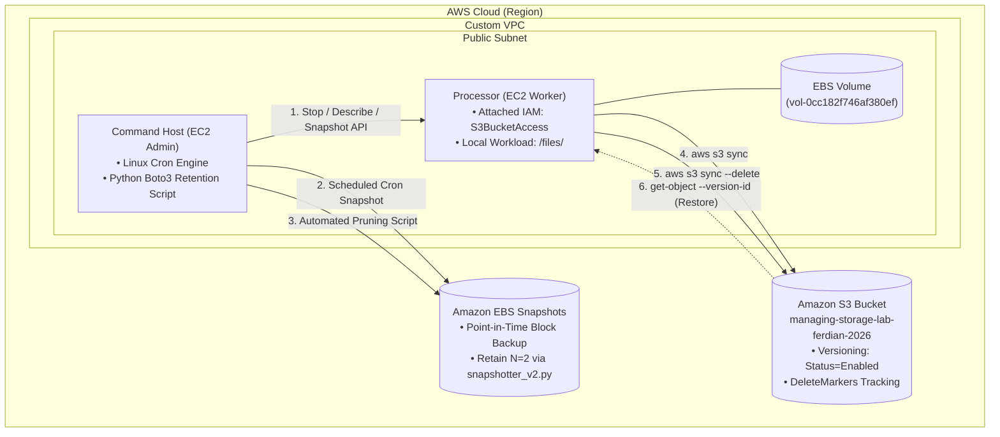
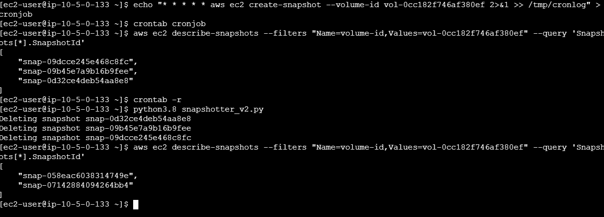
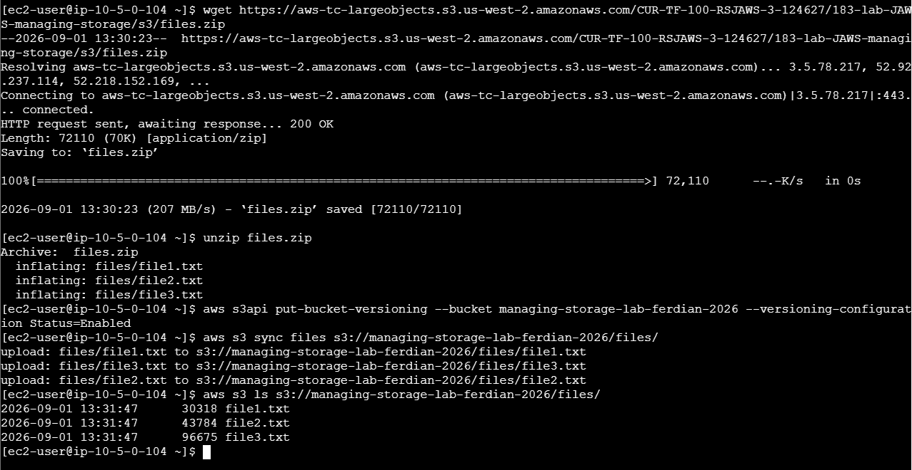
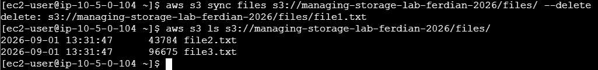
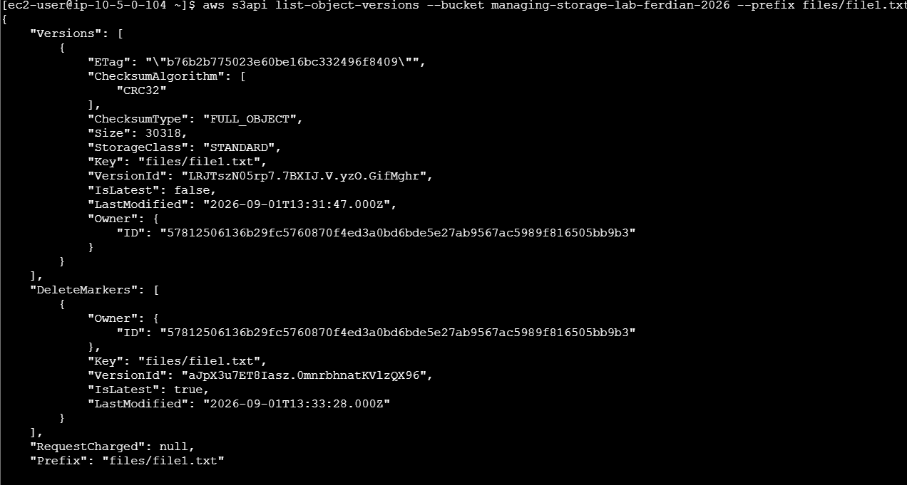
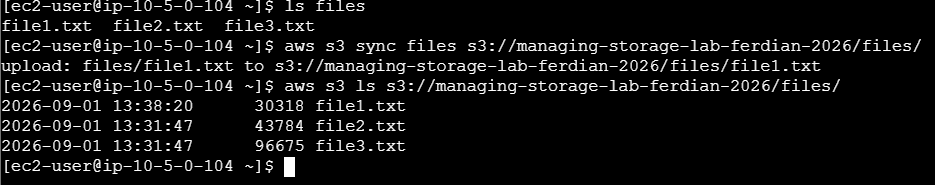

# Automated EBS Snapshot Lifecycle Management & S3 Disaster Recovery via Versioning

## Executive Summary & Architectural Purpose
In enterprise cloud infrastructure, data persistence and disaster recovery are paramount operational pillars. This hands-on engineering lab focuses on designing automated, cost-conscious storage management workflows across **Amazon Elastic Block Store (Amazon EBS)** and **Amazon Simple Storage Service (Amazon S3)**. 

The lab implements two critical architectural workflows:
1. **Automated EBS Snapshot Lifecycle Management**: Orchestrating point-in-time EBS block volume snapshots using Linux cron and Python Boto3 automation (`snapshotter_v2.py`), enforcing strict retention policies (retaining only the 2 most recent snapshots) to prevent storage bloat and billing sprawl.
2. **Hybrid Storage Synchronization & Accidental Deletion Protection**: Leveraging the high-throughput `aws s3 sync` CLI command to mirror block storage file systems into an object storage bucket. By enforcing **S3 Bucket Versioning**, the architecture implements enterprise-grade resilience against accidental deletions, leveraging S3 Delete Markers and point-in-time version retrieval via `aws s3api get-object --version-id`.

---

## Architectural Topology & Data Flow





---

## Technical Specifications & Environment Baseline

| Parameter | Specification / Resource Value | Context & Architectural Purpose |
|:---|:---|:---|
| **VPC Infrastructure** | Single Public Subnet VPC | Isolated network container for administrative and processing instances |
| **Command Host** | Amazon EC2 (Amazon Linux 2) | Administrative jump host running AWS CLI, cron engine, and Python 3.8 SDK |
| **Processor Instance** | Amazon EC2 (`10.5.0.104`) | Worker node hosting primary block storage and executing file operations |
| **Target EBS Volume** | `vol-0cc182f746af380ef` | Attached root/data block volume backing the Processor instance |
| **IAM Instance Profile** | `S3BucketAccess` | Role granting least-privilege `s3:PutObject`, `s3:GetObject`, `s3:ListBucket` to Processor |
| **S3 Storage Target** | `managing-storage-lab-ferdian-2026` | Target object bucket configured with `Status=Enabled` versioning |
| **Automation Engine** | Linux Cron (`* * * * *`) + Python Boto3 | Cron for rapid snapshot ingestion; Python SDK for timestamp sorting & pruning |

---

## Key Implementation Phases & Verification

### Phase 1: Resource Provisioning, S3 Creation & IAM Role Attachment
1. Provisioned globally unique Amazon S3 bucket: `managing-storage-lab-ferdian-2026`.
2. Attached pre-configured IAM role `S3BucketAccess` to the `Processor` EC2 instance via **Actions > Security > Modify IAM role**, enabling programmatic S3 API operations without long-term static access keys.

---

### Phase 2: EBS Snapshot Lifecycle Management & Python Pruning Automation
1. **Target Volume Identification**: From `Command Host`, queried the dynamic EBS block device mapping of `Processor`:
   ```bash
   aws ec2 describe-instances --filter 'Name=tag:Name,Values=Processor'      --query 'Reservations[0].Instances[0].BlockDeviceMappings[0].Ebs.{VolumeId:VolumeId}'
   # Output: "vol-0cc182f746af380ef"
   ```
2. **Consistent Snapshot Creation**: Stopped `Processor` to flush cached disk buffers, invoked `aws ec2 create-snapshot`, waited for completion via `aws ec2 wait snapshot-completed`, and safely restarted the instance.
3. **Cron-Driven Snapshot Scheduling**: Configured an aggressive 1-minute recurring cron schedule to simulate automated enterprise backup cycles:
   ```bash
   echo "* * * * * aws ec2 create-snapshot --volume-id vol-0cc182f746af380ef 2>&1 >> /tmp/cronlog" > cronjob
   crontab cronjob
   ```
4. **Automated Pruning via Python Boto3 (`snapshotter_v2.py`)**:
   - Cleared active crontab (`crontab -r`) after multiple snapshots accumulated (`snap-09dcce245e468c8fc`, `snap-09b45e7a9b16b9fee`, `snap-0d32ce4deb54aa8e8`).
   - Executed `python3.8 snapshotter_v2.py` which queried all account snapshots for `vol-0cc182f746af380ef`, sorted them chronologically by `StartTime`, and purged all legacy snapshots while strictly retaining only the **2 most recent snapshots** (`snap-058eac6038314749e`, `snap-07142884094264bb4`).



---

### Phase 3: S3 Bucket Versioning & Delta File Synchronization
1. Connected to `Processor` (`10.5.0.104`) via EC2 Instance Connect.
2. Ingested sample test files (`file1.txt`, `file2.txt`, `file3.txt`) from AWS repository and unpacked them.
3. Activated bucket versioning via AWS CLI:
   ```bash
   aws s3api put-bucket-versioning      --bucket managing-storage-lab-ferdian-2026      --versioning-configuration Status=Enabled
   ```
4. Synchronized local directory to remote object store using delta sync:
   ```bash
   aws s3 sync files s3://managing-storage-lab-ferdian-2026/files/
   ```
   *Verified that all 3 files (`file1.txt`: 30,318 bytes, `file2.txt`: 43,784 bytes, `file3.txt`: 96,675 bytes) were uploaded concurrently.*



---

### Phase 4: Bi-Directional Deletion Mirroring (`--delete` Flag)
1. Simulated accidental or intentional local file deletion:
   ```bash
   rm files/file1.txt
   ```
2. Propagated deletion state to Amazon S3 using the `--delete` modifier:
   ```bash
   aws s3 sync files s3://managing-storage-lab-ferdian-2026/files/ --delete
   # Output: delete: s3://managing-storage-lab-ferdian-2026/files/file1.txt
   ```
3. Verified via `aws s3 ls s3://managing-storage-lab-ferdian-2026/files/` that only `file2.txt` and `file3.txt` were returned by standard object listing APIs.



---

### Phase 5: Deep-Dive Versioning Inspection & Disaster Recovery
1. **Auditing Object Versions & Delete Markers**:
   Ran low-level S3 API inspection to confirm that `file1.txt` was not physically purged, but rather masked by an S3 **Delete Marker**:
   ```bash
   aws s3api list-object-versions      --bucket managing-storage-lab-ferdian-2026      --prefix files/file1.txt
   ```
   *Inspection Result*:
   - `Versions`: Original object retained with `VersionId: LRJTSzN05rp7.7BXIJ.V.yzO.GifMghr` (`IsLatest: false`).
   - `DeleteMarkers`: Active tombstone marker with `VersionId: aJpX3u7ET8Iasz.OmnrbhnatKVlzQX96` (`IsLatest: true`).



2. **Point-in-Time File Restoration & Re-synchronization**:
   - Recovered the deleted payload directly from S3 using its explicit `VersionId`:
     ```bash
     aws s3api get-object        --bucket managing-storage-lab-ferdian-2026        --key files/file1.txt        --version-id LRJTSzN05rp7.7BXIJ.V.yzO.GifMghr        files/file1.txt
     ```
   - Verified local restoration: `ls files` confirmed `file1.txt`, `file2.txt`, and `file3.txt` present.
   - Re-synchronized the restored state to S3 via `aws s3 sync files s3://managing-storage-lab-ferdian-2026/files/`.
   - Verified via `aws s3 ls` that `file1.txt` is once again the current active object in the bucket.



---

## Practitioner Insights & Operational Best Practices

> [!NOTE]
> **EBS Crash-Consistent vs. Application-Consistent Snapshots**: Taking snapshots while an EC2 instance is running creates a *crash-consistent* backup (identical to pulling the power plug). For critical database workloads (e.g., MySQL, PostgreSQL, Oracle), stopping the instance or freezing database I/O (`FLUSH TABLES WITH READ LOCK`) prior to `aws ec2 create-snapshot` guarantees *application-consistent* data integrity.

> [!TIP]
> **Production Alternative to Custom Python Snapshot Scripts**: In modern enterprise environments, custom cron/Python snapshot scripts are typically superseded by **AWS Data Lifecycle Manager (DLM)** or **AWS Backup**. DLM provides policy-driven snapshot creation, cross-Region copying, automated lifecycle transition to EBS Snapshot Archive, and retention schedules without maintaining underlying compute instances.

> [!WARNING]
> **S3 Versioning Billing & Throttling Implications**: While Versioning protects against accidental deletions, unmanaged version accumulation can result in massive billing surprises. Every non-current version and delete marker consumes metadata and storage billing. In production, always pair S3 Versioning with **S3 Lifecycle Rules** (e.g., `NoncurrentVersionExpiration` after 30 days) to permanently delete expired versions and clean up expired object delete markers.

---

## Master Command Reference

```bash
# 1. Query attached EBS Volume ID dynamically
aws ec2 describe-instances --filter 'Name=tag:Name,Values=Processor'   --query 'Reservations[0].Instances[0].BlockDeviceMappings[0].Ebs.{VolumeId:VolumeId}'

# 2. Consistent Snapshot workflow
aws ec2 stop-instances --instance-ids <INSTANCE_ID>
aws ec2 wait instance-stopped --instance-id <INSTANCE_ID>
aws ec2 create-snapshot --volume-id <VOLUME_ID>
aws ec2 wait snapshot-completed --snapshot-id <SNAPSHOT_ID>
aws ec2 start-instances --instance-ids <INSTANCE_ID>

# 3. Enable S3 Bucket Versioning
aws s3api put-bucket-versioning --bucket <BUCKET_NAME> --versioning-configuration Status=Enabled

# 4. S3 Synchronization with Deletion Propagation
aws s3 sync <LOCAL_DIR> s3://<BUCKET_NAME>/<PREFIX>/ --delete

# 5. Inspect S3 Versions and Delete Markers
aws s3api list-object-versions --bucket <BUCKET_NAME> --prefix <KEY_PREFIX>

# 6. Retrieve specific object version for disaster recovery
aws s3api get-object --bucket <BUCKET_NAME> --key <KEY> --version-id <VERSION_ID> <LOCAL_DESTINATION>
```
