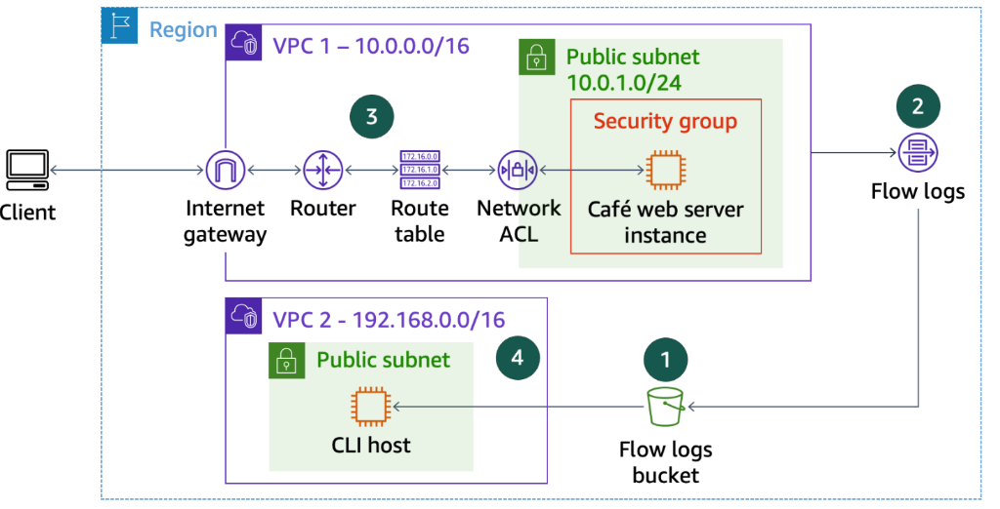
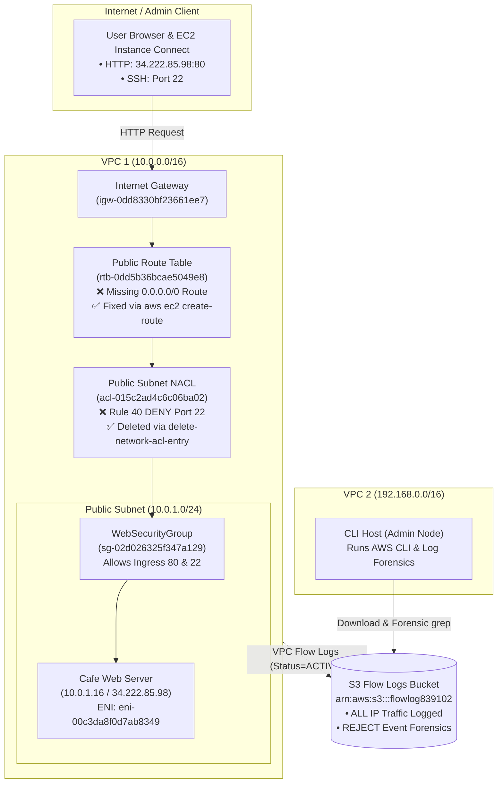
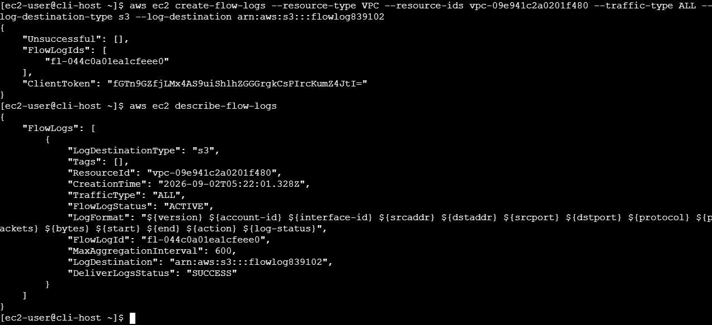
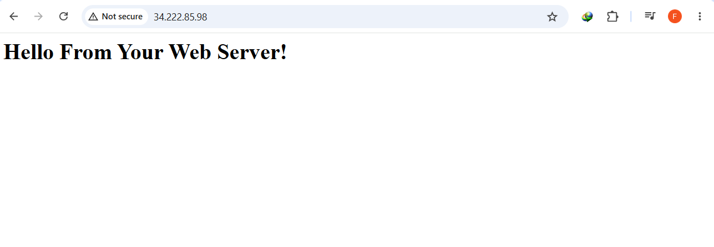
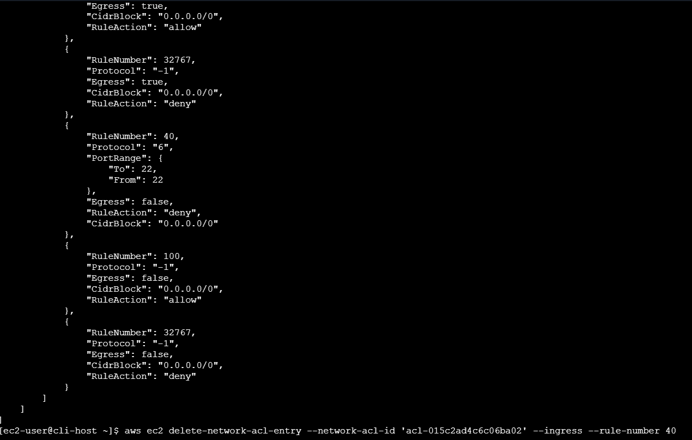
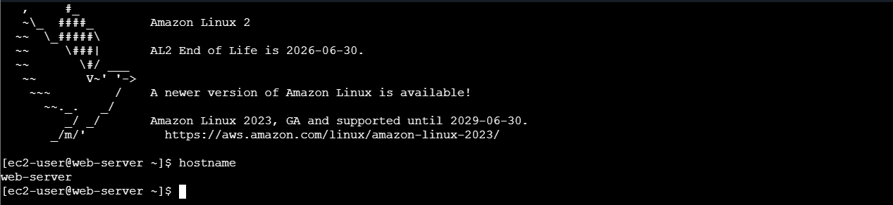
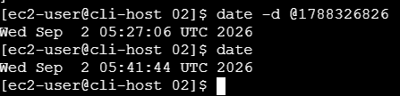

# Enterprise Multi-Layer VPC Network Troubleshooting, Route Remediation & Flow Logs Telemetry

## Executive Summary & Architectural Purpose
In enterprise cloud environments, network misconfigurations represent the leading cause of service outages and security vulnerabilities. This hands-on engineering lab demonstrates rigorous, systematic troubleshooting of an Amazon VPC infrastructure exhibiting multiple compounding network connectivity failures.

Using a layered diagnostics approach aligning with the OSI model, the lab addresses two critical production failure modes:
1. **Layer 3 Routing Outage**: Resolving public web server unreachability (HTTP port 80 timeout) caused by a missing default route (`0.0.0.0/0`) to the **Internet Gateway (IGW)** in the public subnet's route table.
2. **Layer 4 Stateless Firewall Block**: Diagnosing and remediating an SSH (port 22) and EC2 Instance Connect failure caused by an explicit `DENY` rule (Rule 40) in the subnet's **Network Access Control List (Network ACL)**, despite permissive Security Group rules.
3. **Forensic Telemetry via VPC Flow Logs**: Provisioning an **Amazon S3** centralized log repository, enabling VPC Flow Logs across `VPC 1`, extracting and parsing millions of raw flow log records using Linux CLI tools (`grep`, `gunzip`), and correlating dropped SSH attempts with client source IPs and Elastic Network Interface (ENI) IDs.

---

## Architectural Topology & Diagnostics Workflow





---

## Technical Specifications & Environment Baseline

| Parameter | Resource ID / Value | Architectural Role & Context |
|:---|:---|:---|
| **VPC 1 (Production)** | `vpc-09e941c2a0201f480` (`10.0.0.0/16`) | Primary VPC hosting production web tier workload |
| **VPC 2 (Management)** | `192.168.0.0/16` | Management VPC hosting the administrative `CLI Host` instance |
| **Public Subnet (VPC 1)** | `subnet-09341c21ee706cd8d` (`10.0.1.0/24`) | Subnet hosting Cafe Web Server; initially misconfigured |
| **Public Route Table** | `rtb-0dd5b36bcae5049e8` | Associated route table lacking default route to Internet Gateway |
| **Internet Gateway** | `igw-0dd8330bf23661ee7` | Attached gateway providing internet ingress and egress for VPC 1 |
| **Network ACL** | `acl-015c2ad4c6c06ba02` | Subnet firewall with restrictive Rule 40 blocking inbound SSH |
| **Cafe Web Server** | `i-02a2a3026690467a7` (`34.222.85.98`) | Apache web server; private IP `10.0.1.16`, ENI `eni-00c3da8f0d7ab8349` |
| **Web Security Group** | `sg-02d026325f347a129` | Stateful firewall correctly permitting inbound ports 80 and 22 |
| **Flow Logs S3 Bucket** | `flowlog839102` (`us-west-2`) | Dedicated S3 telemetry sink for raw VPC Flow Log ingestion |

---

## Key Implementation Phases & Forensic Verification

### Phase 1: Telemetry Activation – VPC Flow Logs to Amazon S3
1. Configured AWS CLI on `CLI Host` with regional credentials in `us-west-2`.
2. Created a dedicated S3 bucket: `flowlog839102` with LocationConstraint `us-west-2`.
3. Created VPC Flow Logs capturing `ALL` traffic across `vpc-09e941c2a0201f480`:
   ```bash
   aws ec2 create-flow-logs --resource-type VPC --resource-ids vpc-09e941c2a0201f480      --traffic-type ALL --log-destination-type s3 --log-destination arn:aws:s3:::flowlog839102
   ```
4. Verified via `aws ec2 describe-flow-logs` that flow log `fl-044c0a01ea1cfeee0` was in `ACTIVE` state with delivery status `SUCCESS`.



---

### Phase 2: Root Cause Analysis & Resolution of Layer 3 Routing Outage
1. **Symptom**: Attempting to load `http://34.222.85.98` resulted in a connection timeout (`ERR_CONNECTION_TIMED_OUT`).
2. **Investigation**:
   - Audited instance metadata: Confirmed instance `i-02a2a3026690467a7` was `running`, security group `sg-02d026325f347a129` allowed port 80, and public IP `34.222.85.98` was associated.
   - Audited Route Table `rtb-0dd5b36bcae5049e8`:
     ```json
     "Routes": [
         {
             "GatewayId": "local", 
             "DestinationCidrBlock": "10.0.0.0/16", 
             "State": "active"
         }
     ]
     ```
     *Root Cause Identified*: Subnet `subnet-09341c21ee706cd8d` had no default route to the Internet Gateway (`igw-0dd8330bf23661ee7`), making the subnet private despite its public IP allocation.
3. **Remediation**: Added the default route via AWS CLI:
   ```bash
   aws ec2 create-route --route-table-id 'rtb-0dd5b36bcae5049e8'      --gateway-id 'igw-0dd8330bf23661ee7' --destination-cidr-block '0.0.0.0/0'
   ```
4. **Verification**: Refreshed browser; the web server immediately responded with **"Hello From Your Web Server!"**.



---

### Phase 3: Root Cause Analysis & Resolution of Layer 4 NACL SSH Block
1. **Symptom**: Attempting to connect to `Cafe Web Server` via EC2 Instance Connect failed with error: *"Failed to connect to your instance."*
2. **Investigation**:
   - Web traffic (port 80) worked, confirming physical host and IGW connectivity.
   - Security Group `sg-02d026325f347a129` explicitly allowed port 22 ingress.
   - Audited Network ACL `acl-015c2ad4c6c06ba02` associated with the subnet:
     ```json
     {
         "RuleNumber": 40,
         "Protocol": "6",
         "PortRange": { "To": 22, "From": 22 },
         "Egress": false,
         "RuleAction": "deny",
         "CidrBlock": "0.0.0.0/0"
     }
     ```
     *Root Cause Identified*: Network ACL rules evaluate in ascending numerical order. Rule 40 explicitly denied TCP port 22 traffic before reaching Rule 100 (`allow all`), dropping all inbound SSH packets at the subnet boundary.
3. **Remediation**: Deleted the malicious/misconfigured Rule 40:
   ```bash
   aws ec2 delete-network-acl-entry --network-acl-id 'acl-015c2ad4c6c06ba02' --ingress --rule-number 40
   ```



4. **Verification**: Successfully established an EC2 Instance Connect terminal session to the instance. Executed `hostname` which confirmed active connection to `web-server`.



---

### Phase 4: Network Forensics & VPC Flow Logs Incident Reconstruction
1. **Log Ingestion & Decompression**:
   Downloaded flow log archives from S3 to `CLI Host` and decompressed gzip bundles:
   ```bash
   aws s3 cp s3://flowlog839102/ . --recursive
   gunzip *.gz
   ```
2. **Dropped Packet Isolation**:
   Filtered log records for rejected traffic targeting port 22:
   ```bash
   grep -rn 22 . | grep REJECT
   ```
   *Forensic Findings*:
   ```text
   eni-00c3da8f0d7ab8349 18.237.140.164 10.0.1.16 50799 22 6 3 180 1788326826 1788326855 REJECT OK
   ```
   - **Target ENI**: `eni-00c3da8f0d7ab8349` (matched the web server's primary network interface via `describe-network-interfaces`).
   - **Source IP**: `18.237.140.164` (AWS EC2 Instance Connect service endpoint in `us-west-2`).
   - **Destination**: Private IP `10.0.1.16`, Port `22` (SSH).
   - **Action**: `REJECT` (proves that packets reached the VPC boundary but were rejected by NACL Rule 40).
3. **Timeline Conversion**:
   Converted raw Unix timestamps (`1788326826`) to human-readable UTC timestamps:
   ```bash
   date -d @1788326826
   # Output: Wed Sep 2 05:27:06 UTC 2026
   ```
   *Confirmed exact time correlation between admin connection attempt and NACL drop event.*



---

## Practitioner Insights & Security Architecture Takeaways

> [!NOTE]
> **Stateful vs. Stateless Packet Filtering in AWS**:
> - **Security Groups (Stateful)**: Automatically track connection states. Inbound traffic allowed on port 80 automatically permits outbound return traffic, regardless of outbound rules. Evaluates all rules before deciding.
> - **Network ACLs (Stateless)**: Do not track connection state. Both inbound and outbound traffic must be explicitly allowed. Rules are evaluated in strict numerical order (lowest rule number wins).

> [!TIP]
> **Production Log Querying with Amazon Athena**:
> While Linux `grep` is effective for targeted lookups on small datasets, enterprise environments with gigabytes of daily flow logs should query S3 Flow Logs using **Amazon Athena**. Athena allows running standard SQL queries directly over partitioned S3 data (e.g., `SELECT srcaddr, dstport, action, count(*) FROM vpc_flow_logs WHERE action='REJECT' GROUP BY 1,2,3;`) without provisioning server infrastructure.

> [!WARNING]
> **Ephemeral Port Traps with Network ACLs**:
> When configuring custom NACLs for public subnets, administrators frequently forget to open outbound ephemeral ports (`1024-65535`). When a client sends a request to port 80, the web server responds on an ephemeral port chosen by the client OS. If outbound ephemeral ports are blocked in the NACL, web traffic will fail even if inbound port 80 is allowed!

---
