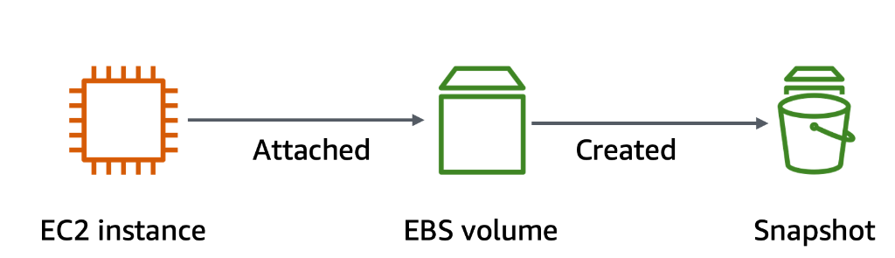
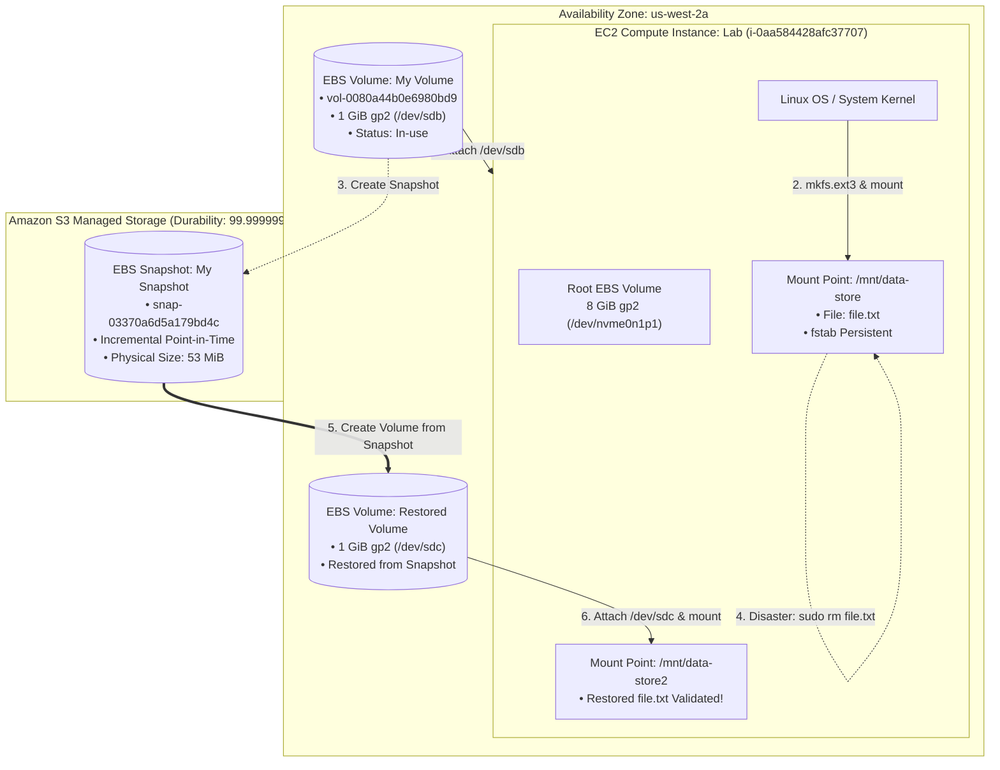
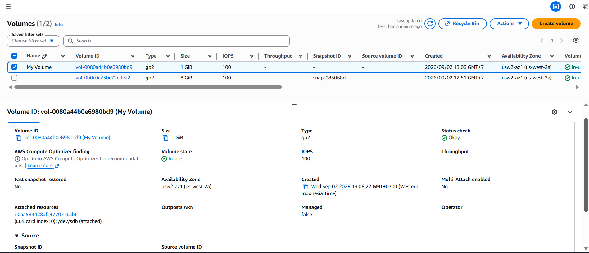
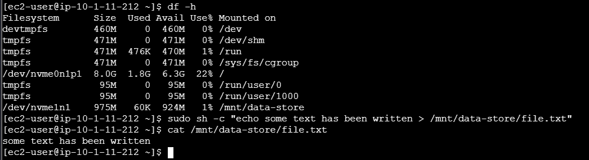
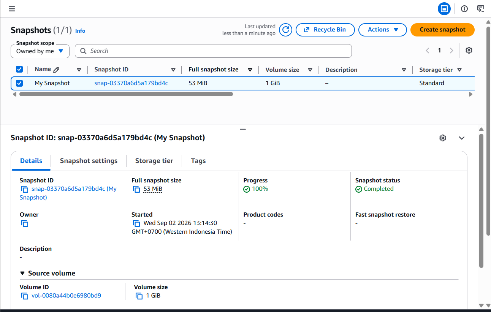
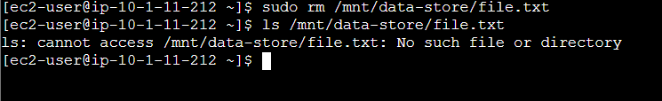
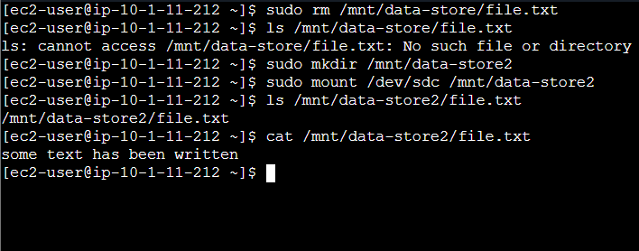

# Production Block Storage Operations: Dynamic EBS Provisioning, Linux Filesystem Mounting & Snapshot Disaster Recovery

## Executive Summary & Architectural Purpose
In enterprise cloud computing environments, persisting operational state and implementing resilient Disaster Recovery (DR) strategies are fundamental engineering prerequisites. Ephemeral storage options (such as EC2 Instance Store) expose applications to complete data loss upon host termination or reboot. **Amazon Elastic Block Store (Amazon EBS)** mitigates this risk by providing durable, high-performance, point-in-time snapshotable block-level storage volumes decoupled from the EC2 compute lifecycle.

This hands-on engineering project implements the complete lifecycle of production block storage on AWS:
1. **Dynamic Block Volume Provisioning**: Creating a secondary `General Purpose SSD (gp2)` EBS block volume within a targeted Availability Zone (`us-west-2a`) and dynamically attaching it to a live Linux EC2 instance as block device `/dev/sdb`.
2. **Operating System Integration & Filesystem Persistence**: Initializing an `ext3` filesystem on the raw block device via Linux utilities, establishing a system mount point at `/mnt/data-store`, committing persistence entries to `/etc/fstab` to ensure auto-mount resilience across system reboots, and verifying atomic read/write disk I/O.
3. **Point-in-Time Snapshot Backups**: Capturing an incremental, S3-backed Amazon EBS snapshot (`My Snapshot`), guaranteeing crash-consistent state preservation while consuming storage strictly proportional to mutated data blocks (53 MiB allocated out of 1 GiB).
4. **Disaster Recovery Simulation & Snapshot Restoration**: Simulating catastrophic application-level data corruption (`rm file.txt`), creating an independent EBS volume (`Restored Volume`) directly from the historical snapshot, attaching it as `/dev/sdc` under mount point `/mnt/data-store2`, and validating zero-loss data restoration.

---

## Architectural Topology & Disaster Recovery Workflow





---

## Technical Specifications & Storage Baseline

| Parameter | Technical Value / Resource Identifier | Architectural Role & Context |
|:---|:---|:---|
| **EC2 Compute Instance** | `i-0aa584428afc37707` (`Lab`) | Amazon Linux host executing disk I/O and recovery procedures |
| **Availability Zone** | `us-west-2a` (`usw2-az1`) | Strict boundary requirement: EBS volumes cannot attach across AZs |
| **Root Volume** | `vol-0b0c0c230c72edea2` (8 GiB, `gp2`) | Base boot filesystem (`/dev/nvme0n1p1`) |
| **Provisioned EBS Volume** | `vol-0080a44b0e6980bd9` (`My Volume`) | 1 GiB `gp2` General Purpose SSD, baseline 100 IOPS |
| **Device Mapping (Vol 1)** | `/dev/sdb` (mapped by kernel to `/dev/nvme1n1`) | Primary attached block device for application data storage |
| **Filesystem Type** | `ext3` | Journaled Linux filesystem provisioned via `mkfs -t ext3` |
| **System Mount Point 1** | `/mnt/data-store` | Production mount target configured in `/etc/fstab` |
| **EBS Snapshot ID** | `snap-03370a6d5a179bd4c` (`My Snapshot`) | S3-backed point-in-time block backup (allocated size: 53 MiB) |
| **Restored EBS Volume** | `Restored Volume` (1 GiB, `gp2`) | Reconstructed block volume spawned from `snap-03370a6d5a179bd4c` |
| **Device Mapping (Vol 2)** | `/dev/sdc` -> `/mnt/data-store2` | Secondary attached recovery device validating DR fidelity |

---

## Key Implementation Phases & Forensic Verification

### Phase 1: Block Volume Provisioning & Instance Attachment
1. Verified host Availability Zone: `us-west-2a`.
2. Created a 1 GiB `General Purpose SSD (gp2)` EBS volume named `My Volume` in `us-west-2a`.
3. Executed dynamic attachment to `Lab` instance specifying device identifier `/dev/sdb`.
4. Audited volume state transitions: `Creating` -> `Available` -> `In-use` (`/dev/sdb attached`).



---

### Phase 2: Linux Filesystem Formatting, Mounting & Boot Persistence
1. **Initial Block Inspection**:
   Executed `df -h` via EC2 Instance Connect; verified only the 8 GiB root partition was recognized by the filesystem layer.
2. **Formatting**:
   Initialized journaled `ext3` structure on the unformatted block device:
   ```bash
   sudo mkfs -t ext3 /dev/sdb
   ```
3. **Mounting & Fstab Persistence**:
   Created mount directory and mapped filesystem:
   ```bash
   sudo mkdir /mnt/data-store
   sudo mount /dev/sdb /mnt/data-store
   echo "/dev/sdb /mnt/data-store ext3 defaults,noatime 1 2" | sudo tee -a /etc/fstab
   ```
4. **Data Verification**:
   Confirmed 975M available capacity on `/dev/nvme1n1` mounted on `/mnt/data-store`. Injected application payload:
   ```bash
   sudo sh -c "echo some text has been written > /mnt/data-store/file.txt"
   cat /mnt/data-store/file.txt
   ```



---

### Phase 3: Incremental Point-in-Time Snapshot Creation
1. Initiated a crash-consistent point-in-time snapshot from `My Volume` tagged `My Snapshot`.
2. Monitored transition from `Pending` (progress 0%) to `Completed` (progress 100%).
3. **Storage Efficiency Audit**: While the parent volume is 1 GiB, the incremental snapshot size was strictly **53 MiB**, proving AWS EBS snapshots only capture and bill for modified storage blocks, ignoring unwritten sectors.



---

### Phase 4: Disaster Simulation & Catastrophic Data Loss
Simulated an accidental administrative deletion on the primary volume:
```bash
sudo rm /mnt/data-store/file.txt
ls /mnt/data-store/file.txt
# Output: ls: cannot access /mnt/data-store/file.txt: No such file or directory
```
*At this stage, data is permanently destroyed on `/mnt/data-store`.*



---

### Phase 5: Snapshot Recovery, Volume Re-attachment & DR Validation
1. Created a new independent EBS volume directly from `snap-03370a6d5a179bd4c`, designated `Restored Volume` within `us-west-2a`.
2. Attached `Restored Volume` to `Lab` instance as secondary block device `/dev/sdc`.
3. Provisioned mount target `/mnt/data-store2` and mounted `/dev/sdc`:
   ```bash
   sudo mkdir /mnt/data-store2
   sudo mount /dev/sdc /mnt/data-store2
   ```
4. **Zero-Loss Data Verification**:
   Inspected filesystem content on the restored volume:
   ```bash
   ls /mnt/data-store2/file.txt
   cat /mnt/data-store2/file.txt
   # Output: some text has been written
   ```
   *Verified 100% data fidelity restoration without requiring instance reboot or service disruption on the root volume.*



---

## Practitioner Insights & Architecture Takeaways

> [!NOTE]
> **Availability Zone Placement Constraint**:
> Amazon EBS volumes are strictly zonal resources. An EBS volume created in `us-west-2a` cannot be attached to an EC2 instance residing in `us-west-2b`. To migrate block data across Availability Zones or Regions, an **EBS Snapshot** must be taken (as snapshots reside in Amazon S3, accessible across the entire Region), and then a new volume can be restored in the destination AZ.

> [!TIP]
> **Production Filesystem Identification via UUID**:
> In enterprise Linux environments, referencing devices by kernel device names (`/dev/sdb`) inside `/etc/fstab` can lead to boot failure if drive enumeration orders change during reboot. Best practice dictates referencing block volumes using their Universally Unique Identifier:
> ```bash
> sudo blkid /dev/nvme1n1
> # Inside /etc/fstab:
> UUID=a1b2c3d4-e5f6-7890-abcd-1234567890ab /mnt/data-store ext3 defaults,noatime 1 2
> ```

> [!WARNING]
> **Snapshot Consistency for Active Database Workloads**:
> Taking an EBS snapshot of an active transactional database (such as PostgreSQL or MySQL) while writes are in flight can result in crash-inconsistent states. To ensure clean snapshots in production:
> 1. Freeze filesystem I/O temporarily (`fsfreeze -f /mnt/data-store`).
> 2. Flush dirty buffers from cache to disk (`sync`).
> 3. Issue the snapshot command via AWS CLI or AWS Backup.
> 4. Unfreeze the filesystem (`fsfreeze -u /mnt/data-store`).

---

## Master Linux & AWS CLI Block Storage Operations Reference

```bash
# 1. Inspect Block Devices and Mounts
lsblk
df -hT

# 2. Format Raw Block Volume with ext4 / ext3
sudo mkfs -t ext3 /dev/sdb

# 3. Mount Block Device
sudo mkdir -p /mnt/data-store
sudo mount /dev/sdb /mnt/data-store

# 4. Configure Persistent Mount in /etc/fstab
echo "/dev/sdb /mnt/data-store ext3 defaults,noatime 1 2" | sudo tee -a /etc/fstab

# 5. Programmatic Snapshot Creation via AWS CLI
aws ec2 create-snapshot --volume-id vol-0080a44b0e6980bd9   --description "Point-in-time production backup"   --tag-specifications 'ResourceType=snapshot,Tags=[{Key=Name,Value=ProdSnapshot}]'

# 6. Reconstruct Volume from Snapshot via AWS CLI
aws ec2 create-volume --snapshot-id snap-03370a6d5a179bd4c   --availability-zone us-west-2a --volume-type gp3

# 7. Dynamic Block Device Attachment
aws ec2 attach-volume --volume-id vol-xxxxxxxxx --instance-id i-xxxxxxxxx --device /dev/sdc
```
