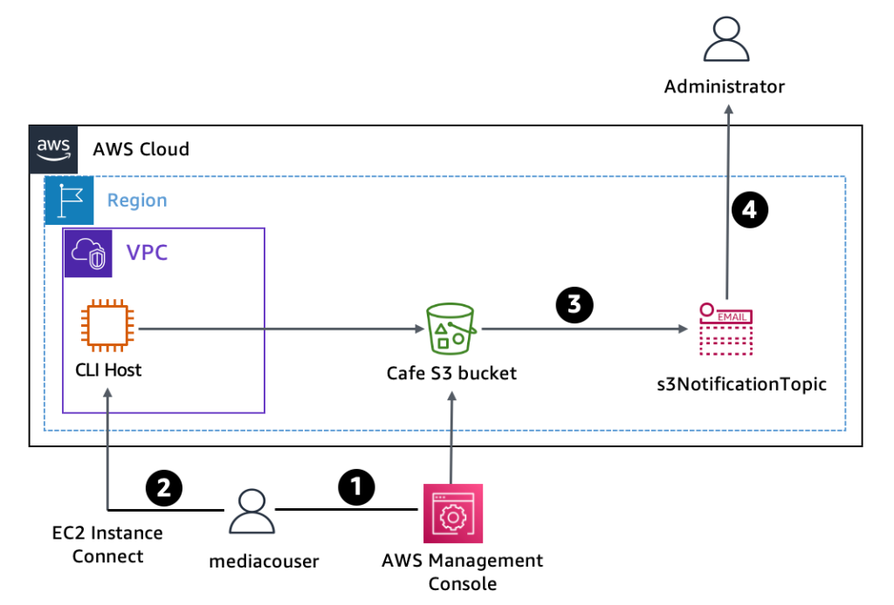
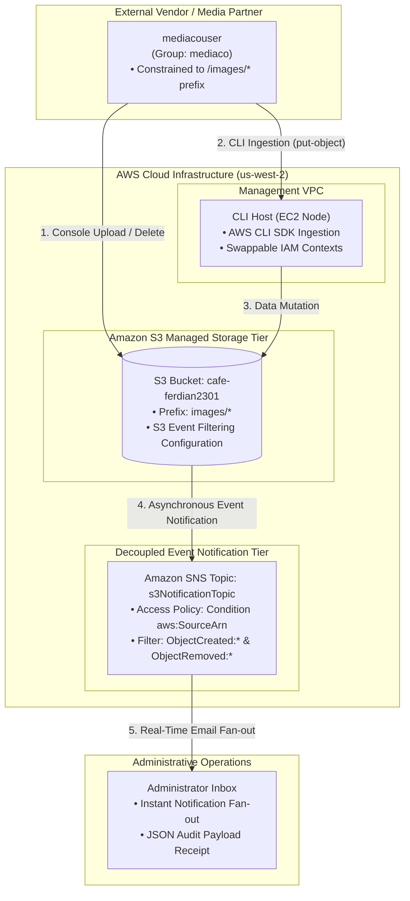
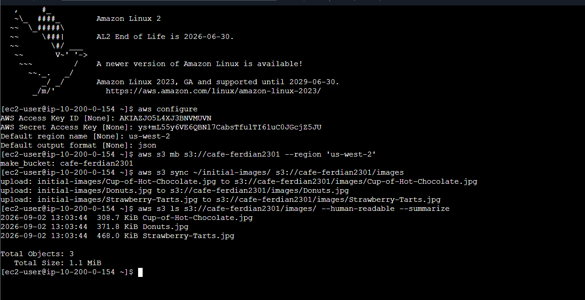
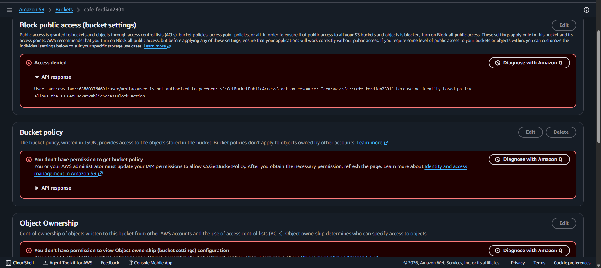
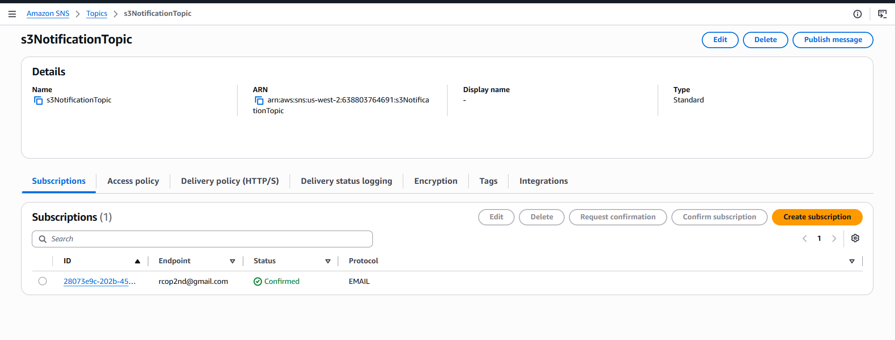
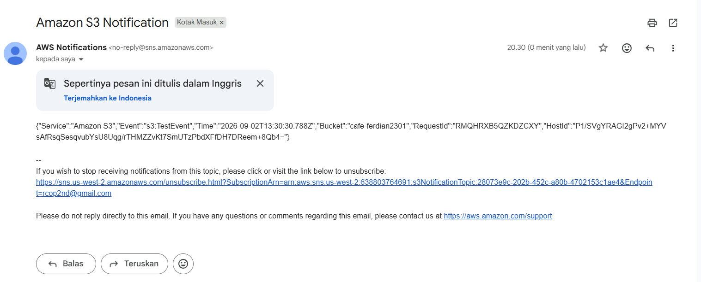
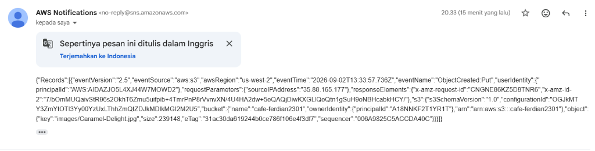
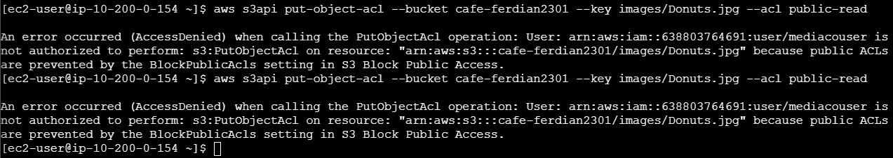

# Scalable S3 Object Storage Architecture: Prefix-Level IAM Scoping & Event-Driven SNS Notifications

## Executive Summary & Architectural Purpose
In enterprise cloud storage architectures, collaborating with external third-party entities (such as creative media vendors or data partners) presents significant security and compliance challenges. Granting broad IAM permissions risks data leakage, unauthorized permission modifications, or accidental bucket deletion. Simultaneously, administrators require real-time visibility into asset mutations without resorting to inefficient, resource-draining manual audits.

This hands-on engineering lab delivers an enterprise-grade, event-driven asset ingestion and audit notification platform on Amazon Web Services (AWS):
1. **Programmatic Bucket Provisioning & Baseline Synchronization**: Deploying a globally unique Amazon S3 bucket (`cafe-ferdian2301`) via AWS CLI and establishing initial asset baseline directories using high-throughput `aws s3 sync`.
2. **Least-Privilege Third-Party IAM Scoping**: Reviewing and validating strict prefix-isolated IAM policies (`mediaCoPolicy`) governing external user `mediacouser`. Operations (`GetObject`, `PutObject`, `DeleteObject`) are strictly constrained to the `images/*` prefix, with root-level bucket policy modification attempts categorically denied (`AccessDenied`).
3. **Event-Driven Asynchronous Notification Architecture**: Engineering an automated telemetry pipeline pairing **Amazon S3 Event Notifications** with **Amazon Simple Notification Service (Amazon SNS)** topic `s3NotificationTopic`. S3 is granted least-privilege publish authorization via an SNS Access Policy Condition (`aws:SourceArn`).
4. **Real-Time Operational Audit & Compliance Verification**: Validating automated email dispatch upon object creation (`ObjectCreated:Put` for `Caramel-Delight.jpg`) and deletion (`ObjectRemoved:Delete` for `Strawberry-Tarts.jpg`), while proving that read operations (`GetObject`) remain quiet and unauthorized ACL manipulation (`put-object-acl`) is blocked and audited.

---

## Architectural Topology & Notification Flow





---

## Technical Specifications & Security Baseline

| Component | Technical Value / Resource Identifier | Architectural Role & Access Boundary |
|:---|:---|:---|
| **S3 Storage Bucket** | `cafe-ferdian2301` (`us-west-2`) | Central media repository enforcing prefix-level object isolation |
| **Object Prefix Scope** | `images/` | Isolated directory partition designated for third-party collaboration |
| **IAM User Group** | `mediaco` | Group entity holding common media vendor permissions |
| **IAM User Identity** | `mediacouser` | External contractor identity inheriting `mediaCoPolicy` |
| **IAM Security Policy** | `mediaCoPolicy` | Grants S3 actions exclusively on `arn:aws:s3:::cafe-*/images/*` |
| **SNS Topic** | `s3NotificationTopic` (Standard) | Regional pub/sub messaging hub dispatching audit events |
| **Topic Publisher Policy** | Principal `s3.amazonaws.com` | Least-privilege publish permission scoped to `cafe-ferdian2301` |
| **Notification Subscription** | Protocol: `EMAIL` | Active subscriber endpoint receiving structured JSON event alerts |
| **S3 Event Filter** | Prefix: `images/` | Evaluates `s3:ObjectCreated:*` and `s3:ObjectRemoved:*` |

---

## Key Implementation Phases & Forensic Verification

### Phase 1: S3 Bucket Creation & Initial Asset Synchronization
1. Configured AWS CLI on `CLI Host` with administrative credentials.
2. Created a regionally constrained Amazon S3 bucket: `cafe-ferdian2301` in `us-west-2`.
3. Synchronized initial product media files from local storage to the S3 bucket under prefix `images/`:
   ```bash
   aws s3 mb s3://cafe-ferdian2301 --region 'us-west-2'
   aws s3 sync ~/initial-images/ s3://cafe-ferdian2301/images
   aws s3 ls s3://cafe-ferdian2301/images/ --human-readable --summarize
   ```
4. Verified successful synchronization of 3 image assets totaling 1.1 MiB.



---

### Phase 2: Third-Party IAM Boundary Audit & Browser Testing
1. **Policy Inspection**:
   Audited `mediaCoPolicy` attached to `mediacouser`. Confirmed statements:
   - `AllowGroupToSeeBucketListInTheConsole`: Permitted `s3:ListAllMyBuckets`.
   - `AllowRootLevelListingOfTheBucket`: Permitted listing bucket keys with delimiter `/`.
   - `AllowUserSpecificActionsOnlyInTheSpecificPrefix`: Restricted `s3:GetObject`, `s3:PutObject`, and `s3:DeleteObject` strictly to `cafe-*/images/*`.
2. **Authorized Actions (Incognito Window)**:
   - Signed in as `mediacouser`. Successfully viewed `Donuts.jpg`, uploaded a new image, and deleted `Cup-of-Hot-Chocolate.jpg`.
3. **Unauthorized Security Test**:
   - Attempted to inspect and edit bucket permissions under the **Permissions** tab.
   - Amazon S3 immediately returned: **`Insufficient permissions`** / **`Access denied`** (`s3:GetBucketPublicAccessBlock` & `s3:GetBucketPolicy` blocked).



---

### Phase 3: Amazon SNS Notification Hub & Access Policy Configuration
1. Provisioned Standard SNS topic: `s3NotificationTopic`.
2. Established an email subscription to `rcop2nd@gmail.com` and completed the handshake confirmation.
3. Injected a secure resource-based **Access Policy** granting the S3 service principal (`s3.amazonaws.com`) permission to publish, conditionally locked to the bucket ARN:
   ```json
   {
     "Version": "2008-10-17",
     "Statement": [{
       "Sid": "AllowPublishFromS3",
       "Effect": "Allow",
       "Principal": { "Service": "s3.amazonaws.com" },
       "Action": "SNS:Publish",
       "Resource": "arn:aws:sns:us-west-2:xxxx:s3NotificationTopic",
       "Condition": {
         "ArnLike": { "aws:SourceArn": "arn:aws:s3:::cafe-ferdian2301" }
       }
     }]
   }
   ```



---

### Phase 4: S3 Event Notification Binding & Test Dispatch
1. Defined `s3EventNotification.json` specifying event types (`ObjectCreated:*`, `ObjectRemoved:*`) and prefix filter (`images/`).
2. Programmatically applied the notification configuration via AWS CLI:
   ```bash
   aws s3api put-bucket-notification-configuration      --bucket cafe-ferdian2301      --notification-configuration file://s3EventNotification.json
   ```
3. **Test Handshake Verification**: Amazon S3 automatically emitted a test event to the SNS topic. Received an email notification containing JSON payload:
   ```json
   {
     "Service": "Amazon S3",
     "Event": "s3:TestEvent",
     "Time": "2026-09-02T13:30:30.788Z",
     "Bucket": "cafe-ferdian2301"
   }
   ```



---

### Phase 5: Production Operational Audit & Security Boundary Enforcement
1. **Ingestion Event (`ObjectCreated:Put`)**:
   Switched CLI context to `mediacouser` and uploaded `Caramel-Delight.jpg`:
   ```bash
   aws s3api put-object --bucket cafe-ferdian2301 --key images/Caramel-Delight.jpg --body ~/new-images/Caramel-Delight.jpg
   ```
   *Verification*: Verified receipt of structured email alert with `eventName: "ObjectCreated:Put"` identifying object key `images/Caramel-Delight.jpg` and uploader principal.



2. **Security Violation Prevention (`put-object-acl`)**:
   Attempted to alter the object ACL to make `Donuts.jpg` publicly readable:
   ```bash
   aws s3api put-object-acl --bucket cafe-ferdian2301 --key images/Donuts.jpg --acl public-read
   ```
   *Result*: Operation failed immediately with **`AccessDenied`**:
   `User mediacouser is not authorized to perform: s3:PutObjectAcl on resource ... because public ACLs are prevented by BlockPublicAcls setting.`



---

## Practitioner Insights & Architecture Takeaways

> [!NOTE]
> **SNS Topic Access Policy Condition (`aws:SourceArn`)**:
> Always enforce the `aws:SourceArn` condition when granting AWS services permission to publish to SNS. Without this condition, any S3 bucket across any AWS account in the world could potentially publish messages to your SNS topic, creating a severe cross-service confused deputy vulnerability.

> [!TIP]
> **S3 Event Notifications vs. Amazon EventBridge**:
> While direct S3-to-SNS notification is straightforward and low-latency, modern cloud architectures increasingly route S3 events via **Amazon EventBridge** (`aws s3api put-bucket-notification-configuration` with `EventBridgeConfiguration`). EventBridge allows advanced content-based filtering, multiple target destinations (Lambda, SQS, Step Functions, Kinesis), and dead-letter queue (DLQ) error handling without altering SNS policies.

> [!WARNING]
> **S3 Block Public Access Defaults**:
> Since April 2023, Amazon S3 automatically enables **S3 Block Public Access** and disables S3 Object ACLs (enforcing Bucket Owner Enforced) for all newly created buckets. Any programmatic attempt to call `PutObjectAcl` with `--acl public-read` will fail with `AccessDenied` regardless of IAM user permissions, ensuring data remains private by default.

---

## Master S3 & SNS Operational Command Reference

```bash
# 1. Create S3 Bucket with Region Constraint
aws s3 mb s3://<BUCKET_NAME> --region us-west-2

# 2. High-Throughput Directory Sync
aws s3 sync ~/local-dir/ s3://<BUCKET_NAME>/images/

# 3. Summarize Bucket Capacity
aws s3 ls s3://<BUCKET_NAME>/images/ --human-readable --summarize

# 4. Attach Event Notification Configuration
aws s3api put-bucket-notification-configuration   --bucket <BUCKET_NAME>   --notification-configuration file://s3EventNotification.json

# 5. Put Object via s3api
aws s3api put-object --bucket <BUCKET_NAME> --key images/<FILE> --body ~/path/<FILE>

# 6. Delete Object via s3api
aws s3api delete-object --bucket <BUCKET_NAME> --key images/<FILE>

# 7. Audit Bucket Notification Settings
aws s3api get-bucket-notification-configuration --bucket <BUCKET_NAME>
```
