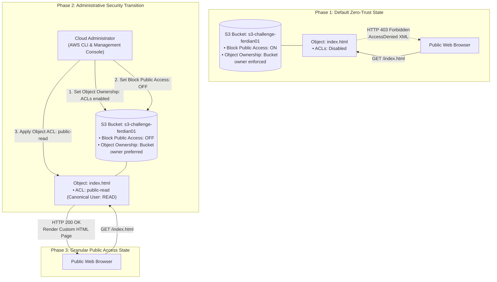
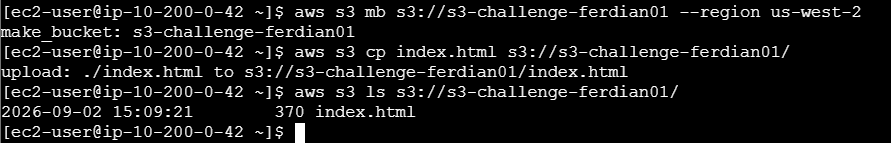
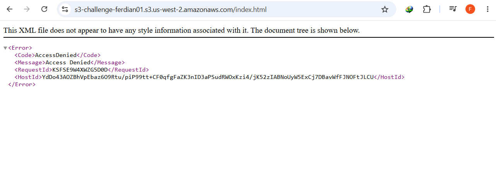
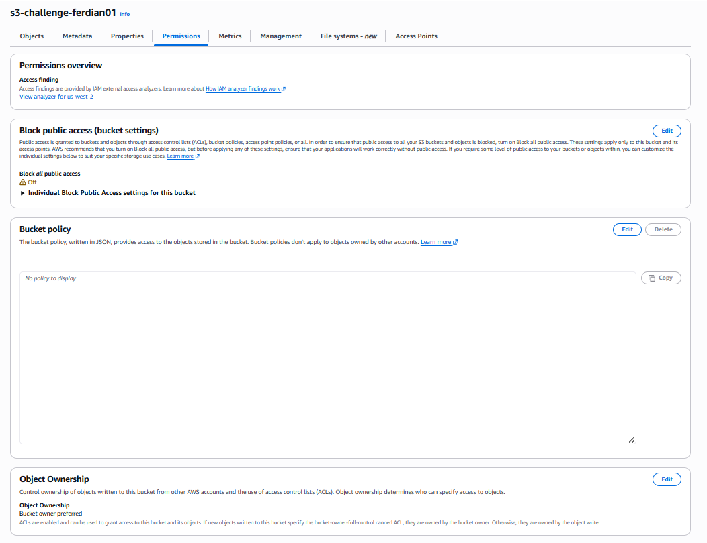
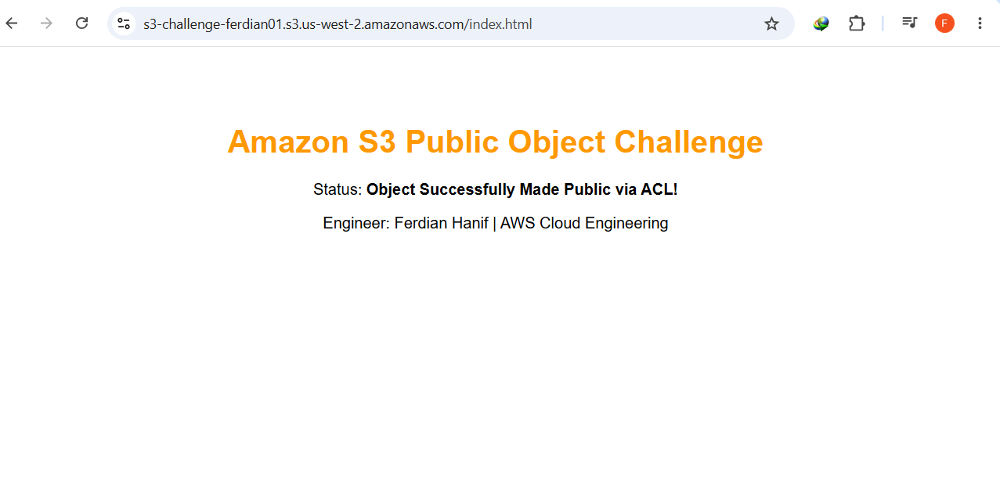
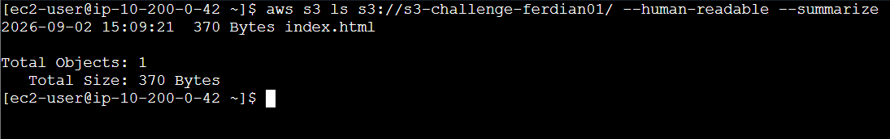

# Granular Object Access Management & S3 Security Decoupling (Challenge Lab)

## Executive Summary & Challenge Overview
By default, Amazon Simple Storage Service (Amazon S3) enforces an uncompromising zero-trust posture: **Block Public Access (BPA)** is enabled across all accounts and newly provisioned buckets, while **Object Ownership** defaults to *Bucket owner enforced* (disabling all Access Control Lists / ACLs). This architectural baseline prevents accidental data leaks, but enterprise use cases frequently require selective public distribution of specific static assets (e.g., downloadable public reports, marketing media, brand assets) without compromising the private status of the enclosing bucket or other sensitive data.

This engineering challenge validates the precision decoupling of S3 security controls:
1. **Programmatic Bucket & Asset Bootstrapping**: Deploying an isolated Amazon S3 bucket (`s3-challenge-ferdian01`) in `us-west-2` and ingesting a custom HTML web asset (`index.html`) via the AWS Command Line Interface (AWS CLI).
2. **Default Security Perimeter Verification**: Probing the raw public Object URL to confirm the native HTTP 403 / XML `<Code>AccessDenied</Code>` error, proving zero-trust default encapsulation.
3. **Targeted Security Decoupling (BPA & Object Ownership)**: Selectively relaxing bucket-level perimeter controls by disabling Block Public Access and switching Object Ownership to *Bucket owner preferred (ACLs enabled)* to restore object-level discretionary access control.
4. **Granular Object-Level Authorization (`public-read`)**: Granting public read permissions exclusively to `index.html` via S3 Object ACLs (`Make public using ACL`), validating zero impact on bucket-level privacy.
5. **Multi-Channel Verification & Inventory Auditing**: Confirming HTTP 200 OK rendering in a public web browser and performing administrative CLI storage inventory audits using human-readable summarization flags.

---

## Architectural Topology & Permission Transition Flow



---

## Technical Specifications & Configuration Matrix

| Parameter / Resource | Value / Identifier | Architectural Purpose & Access Control Impact |
|:---|:---|:---|
| **S3 Storage Bucket** | `s3-challenge-ferdian01` (`us-west-2`) | Regional object store hosting isolated public and private assets |
| **Object Key** | `index.html` (370 Bytes) | Custom HTML test asset authored and uploaded via CLI |
| **Object URL** | `https://s3-challenge-ferdian01.s3.us-west-2.amazonaws.com/index.html` | Public RESTful endpoint for browser-based HTTP probing |
| **Initial Security Posture** | Block Public Access: `ON` (All 4 gates) | Enforces complete isolation; blocks all public ACLs and policies |
| **Object Ownership Setting** | `Bucket owner preferred` (`ACLs enabled`) | Restores capability to evaluate and enforce granular Object ACLs |
| **Decoupled BPA State** | Block Public Access: `OFF` | Allows S3 to evaluate public-read ACL requests on individual objects |
| **Applied Object ACL** | `public-read` (`Grantee: Everyone`) | Grants world-readable permissions strictly to `index.html` |
| **Final HTTP Status** | `HTTP 200 OK` | Confirms successful asset resolution and browser rendering |

---

## Step-by-Step Challenge Execution & Forensic Evidence

### Step 1: Programmatic Bucket Creation & Asset Ingestion
1. Generated a clean HTML asset (`index.html`) on the `CLI Host` instance with embedded engineering metadata.
2. Created the bucket in `us-west-2` and transferred the file using the high-level AWS CLI S3 commands:
   ```bash
   aws s3 mb s3://s3-challenge-ferdian01 --region us-west-2
   aws s3 cp index.html s3://s3-challenge-ferdian01/
   aws s3 ls s3://s3-challenge-ferdian01/
   ```
3. Verified the object was staged successfully with an initial size of 370 Bytes.



---

### Step 2: Native Security Boundary Verification (AccessDenied)
1. Extracted the RESTful Object URL from the Amazon S3 Console:
   `https://s3-challenge-ferdian01.s3.us-west-2.amazonaws.com/index.html`
2. Probed the endpoint using a public web browser.
3. *Expected Result Verified*: The request was rejected with an XML payload confirming default zero-trust containment:
   ```xml
   <Error>
       <Code>AccessDenied</Code>
       <Message>Access Denied</Message>
   </Error>
   ```



---

### Step 3: Security Perimeter Decoupling (ACLs Enabled & BPA Off)
1. **Object Ownership Transition**:
   - Navigated to **Permissions** -> **Object Ownership** -> **Edit**.
   - Switched from *Bucket owner enforced* to **ACLs enabled** (*Bucket owner preferred*).
   - Acknowledged that ACLs would be honored by the storage engine.
2. **Block Public Access Deactivation**:
   - Navigated to **Block public access (bucket settings)** -> **Edit**.
   - Disabled **Block all public access** (deactivating *BlockPublicAcls*, *IgnorePublicAcls*, *BlockPublicPolicy*, and *RestrictPublicBuckets*).
   - Confirmed changes via security prompt.



---

### Step 4: Object-Level Public Read Grant & Browser Verification
1. Selected `index.html` in the Amazon S3 console -> **Actions** -> **Make public using ACL**.
2. Alternatively applied the change programmatically via CLI:
   ```bash
   aws s3api put-object-acl --bucket s3-challenge-ferdian01 --key index.html --acl public-read
   ```
3. Refreshed the public browser window:
   - The page rendered immediately with **HTTP 200 OK**, displaying:
     * **Title**: "Amazon S3 Public Object Challenge"
     * **Status**: "Object Successfully Made Public via ACL!"
     * **Signature**: "Engineer: Ferdian Hanif | AWS Cloud Engineering"



---

### Step 5: S3 Storage Inventory & CLI Audit
1. Performed an administrative inventory audit using the AWS CLI:
   ```bash
   aws s3 ls s3://s3-challenge-ferdian01/ --human-readable --summarize
   ```
2. Validated bucket health: `Total Objects: 1`, `Total Size: 370 Bytes`.



---

## Practitioner Insights & Architecture Hardening

> [!NOTE]
> **Modern AWS Best Practice: Bucket Policies over Object ACLs**:
> While this challenge tested mastery of Object ACLs, AWS officially recommends using **Bucket Policies** for granular access control in modern architectures. ACLs operate on individual objects, making access auditing complex across millions of files. A Bucket Policy centralizes permissions in a single JSON document (e.g., granting `s3:GetObject` conditionally based on prefix or IP CIDR).

> [!TIP]
> **The 4 Gates of Block Public Access (BPA)**:
> BPA is composed of four distinct settings:
> 1. `BlockPublicAcls`: Rejects new public ACLs on buckets or objects.
> 2. `IgnorePublicAcls`: Ignores all existing public ACLs (forces private evaluation).
> 3. `BlockPublicPolicy`: Rejects new bucket policies that grant public access.
> 4. `RestrictPublicBuckets`: Restricts access to existing public buckets to AWS services and authorized users only.

> [!CAUTION]
> **Cost & Security Implication of Public S3 Objects**:
> When an S3 object is made public, data transfer out (egress) bandwidth is billed to the bucket owner. To protect production assets from DDoS-driven bandwidth billing attacks, always front public S3 assets with **Amazon CloudFront** CDN and **AWS WAF** (Web Application Firewall).

---

## Master Command Reference

```bash
# 1. Create S3 Bucket
aws s3 mb s3://<BUCKET_NAME> --region us-west-2

# 2. Copy Local File to S3
aws s3 cp <LOCAL_FILE> s3://<BUCKET_NAME>/

# 3. Apply Object ACL Public-Read via CLI
aws s3api put-object-acl   --bucket <BUCKET_NAME>   --key <OBJECT_KEY>   --acl public-read

# 4. Audit Bucket Object ACL
aws s3api get-object-acl   --bucket <BUCKET_NAME>   --key <OBJECT_KEY>

# 5. Summarize Bucket Inventory
aws s3 ls s3://<BUCKET_NAME>/ --human-readable --summarize
```
