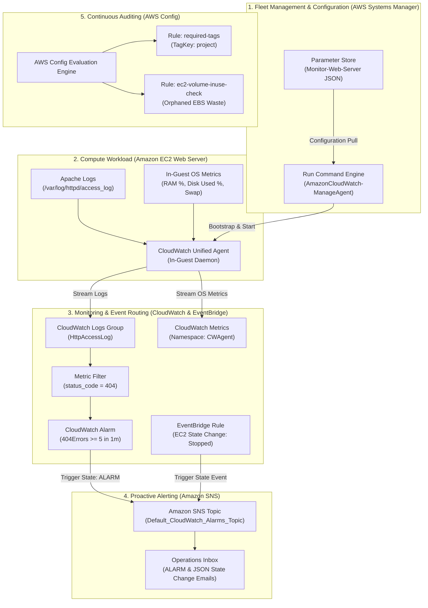
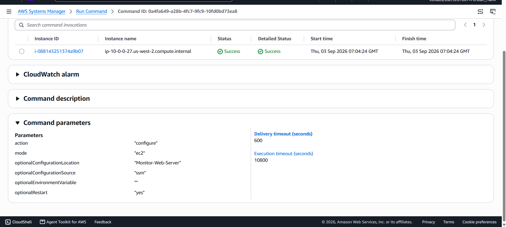
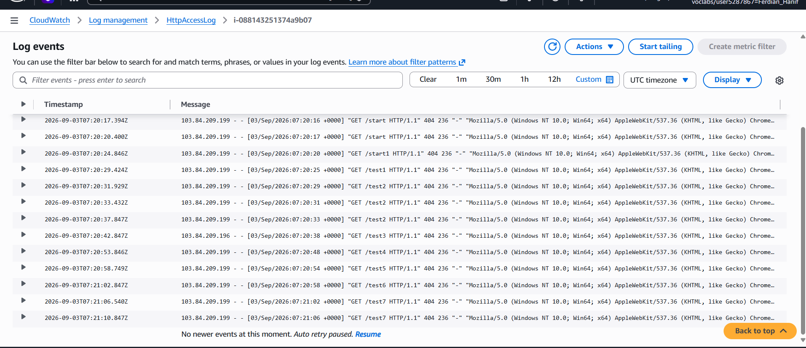
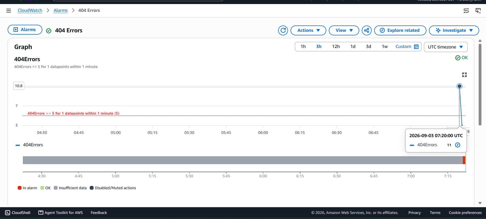
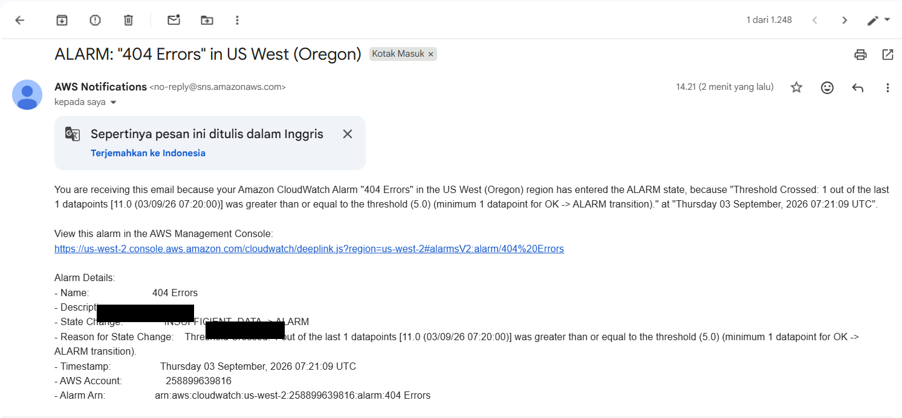
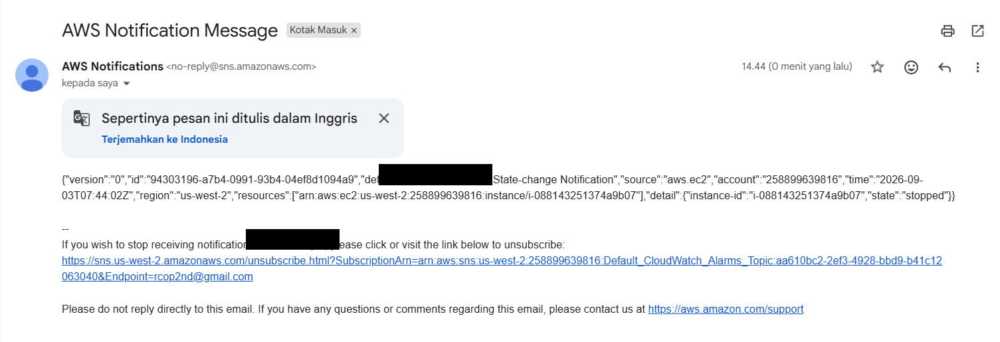
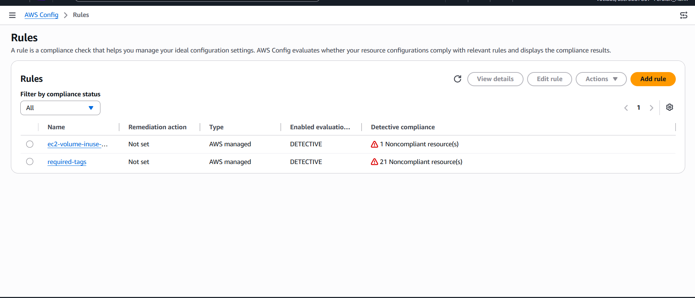
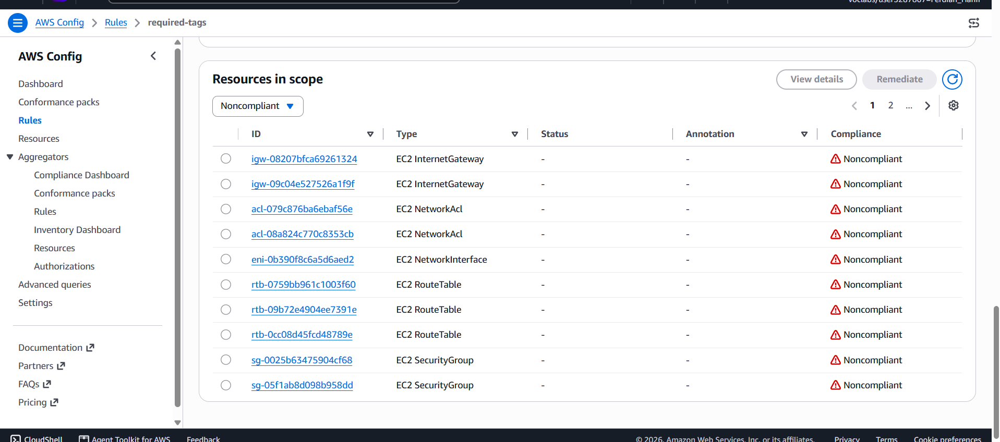
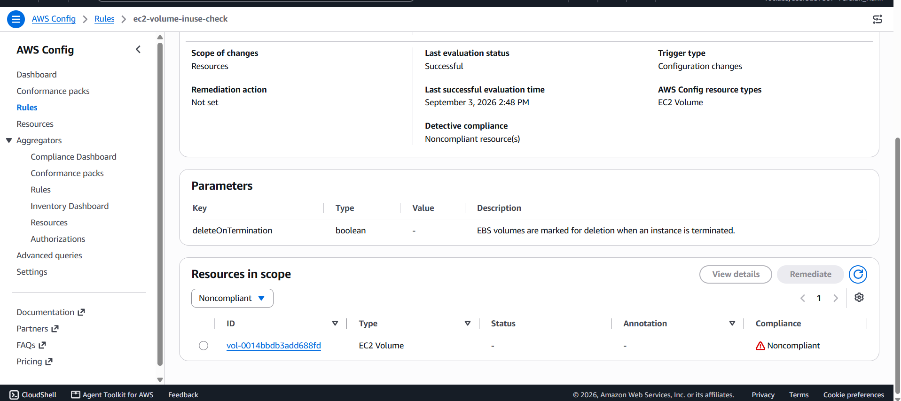

# Full-Stack Cloud Observability: In-Guest Telemetry, Metric Filter Alerting, and Continuous Compliance via AWS Systems Manager, CloudWatch, EventBridge, and AWS Config

## Executive Summary & Architectural Purpose
In enterprise production workloads, system outages, anomalous error rates, and compliance drifts directly impact business availability and operational revenue. True observability requires a multi-tier approach: extracting deep in-guest operating system metrics (RAM utilization, disk space, swap), aggregating distributed application access logs, triggering automated threshold alarms via push notifications, and continuously evaluating resource states against governance rules.

This hands-on engineering project provisions a full-stack observability and compliance architecture on AWS:
1. **Zero-SSH Telemetry Deployment (AWS Systems Manager)**: Using **SSM Run Command** (`AWS-ConfigureAWSPackage` and `AmazonCloudWatch-ManageAgent`) to deploy and initialize the **Unified CloudWatch Agent** on live EC2 instances, pulling centralized JSON configurations from **SSM Parameter Store** (`Monitor-Web-Server`).
2. **Application Log Parsing & Anomaly Alarms (CloudWatch Logs & SNS)**: Ingesting Apache access logs (`/var/log/httpd/access_log`), building a structured **Metric Filter** (`[ip, id, user, timestamp, request, status_code=404, size]`), and wiring a real-time **CloudWatch Alarm** (`404Errors >= 5 in 1 minute`) delivering automated incident emails via **Amazon SNS**.
3. **Event-Driven Lifecycle Automation (Amazon EventBridge)**: Establishing rules matching EC2 state-change events (`stopped`, `terminated`) to deliver immediate operational alert payloads without manual polling.
4. **Continuous Infrastructure Compliance & FinOps Governance (AWS Config)**: Enforcing detective compliance rules—`required-tags` (requiring mandatory `project` tag allocation) and `ec2-volume-inuse-check` (identifying orphaned EBS volumes to eliminate storage waste).

---

## Architectural Topology & Telemetry Pipeline

---

## Technical Specifications & Monitoring Baseline

| Parameter / Component | Technical Value / Identifier | Operational Justification & Role |
|:---|:---|:---|
| **Agent Deployment** | `AWS-ConfigureAWSPackage` via SSM | Fully automated deployment of `AmazonCloudWatchAgent` without SSH keys |
| **Centralized Config** | SSM Parameter Store `Monitor-Web-Server` | Single source of truth defining in-guest metric intervals (10s) and log streams |
| **Ingested Log Groups** | `HttpAccessLog` & `HttpErrorLog` | Centralized ingestion of web server access and error logs with instance ID streams |
| **Metric Filter Pattern** | `[ip, id, user, timestamp, request, status_code=404, size]` | Extracted structured HTTP 404 Not Found error codes from combined Apache log format |
| **Alarm Threshold** | `404Errors >= 5` within `1 minute` | Proactive detection of broken links or malicious application URL scanning |
| **Event-Driven Rule** | EventBridge `Instance_Stopped_Terminated` | Near-real-time capture of EC2 state transitions (`stopping` / `stopped`) |
| **Compliance Rule 1** | AWS Config `required-tags` (`tag1Key: project`) | Enforced organizational cost-allocation tagging policies across all resources |
| **Compliance Rule 2** | AWS Config `ec2-volume-inuse-check` | Automated detection of unattached EBS volumes to prevent FinOps storage waste |

---

## Step-by-Step Implementation & Forensic Verification

### Step 1: Zero-SSH CloudWatch Agent Provisioning via SSM Run Command
Deployed and configured the Unified CloudWatch Agent across the EC2 fleet using SSM Run Command with configuration stored in Parameter Store.

*Figure 1: Successful SSM Run Command execution configuring the CloudWatch agent daemon on the Web Server.*

---

### Step 2: Application Log Ingestion & HTTP 404 Stream Parsing
Captured Apache access logs in CloudWatch Logs group `HttpAccessLog`, verifying 404 status codes generated by invalid page requests (`/start`).

*Figure 2: Real-time CloudWatch log events showing HTTP GET requests returning status code 404.*

---

### Step 3: Anomaly Detection & Proactive Alerting via CloudWatch Alarm & SNS
Configured Metric Filter `404Errors` and an alarm evaluating datapoints over 1-minute periods. Simulated traffic crossed the threshold (11 datapoints >= 5), successfully firing the alarm to SNS.

| CloudWatch Alarm Metric Graph (11 Datapoints >= 5) | Automated SNS Incident Notification Email |
|:---:|:---:|
|  |  |
| *Figure 3a: Metric graph breaching the defined threshold* | *Figure 3b: SNS email alert indicating state change to ALARM* |

---

### Step 4: Real-Time Event-Driven Monitoring via Amazon EventBridge
Created an EventBridge rule capturing EC2 state changes. Stopping the instance immediately delivered a structured JSON payload to the operational topic.

*Figure 4: Automated EventBridge JSON notification received upon EC2 instance state transition to `stopped`.*

---

### Step 5: Continuous Governance & FinOps Auditing via AWS Config
Configured AWS Config managed rules to continuously evaluate resource states and detect non-compliant infrastructure.

| AWS Config Rules Dashboard | Required Tags Evaluation | Unattached EBS Volume Evaluation |
|:---:|:---:|:---:|
|  |  |  |
| *Figure 5a: Detective compliance overview* | *Figure 5b: 21 non-compliant resources lacking tag `project`* | *Figure 5c: 1 orphaned unattached EBS volume detected* |

---

## Enterprise Production Standards & Best Practices

1. **Hypervisor vs In-Guest Metrics**:
   * Standard CloudWatch EC2 metrics observe the virtual machine from the outside (CPU, network, basic disk I/O).
   * To monitor **Memory (RAM) Utilization** and **Disk Space Percentage**, deploying the **Unified CloudWatch Agent** inside the guest OS is mandatory.
2. **Automated FinOps Remediation**:
   * Combine AWS Config `ec2-volume-inuse-check` with **SSM Automation Documents** to automatically snapshot and terminate orphaned EBS volumes after a 7-day grace period.
3. **High-Throughput Log Streaming**:
   * For high-volume production logs, stream CloudWatch Log Groups via **Subscription Filters** into **Amazon Kinesis Data Firehose** targeting **Amazon OpenSearch Service** or **S3 Data Lakes**.
