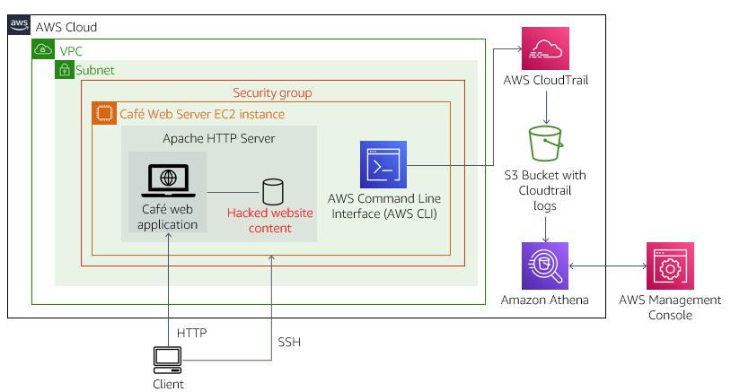
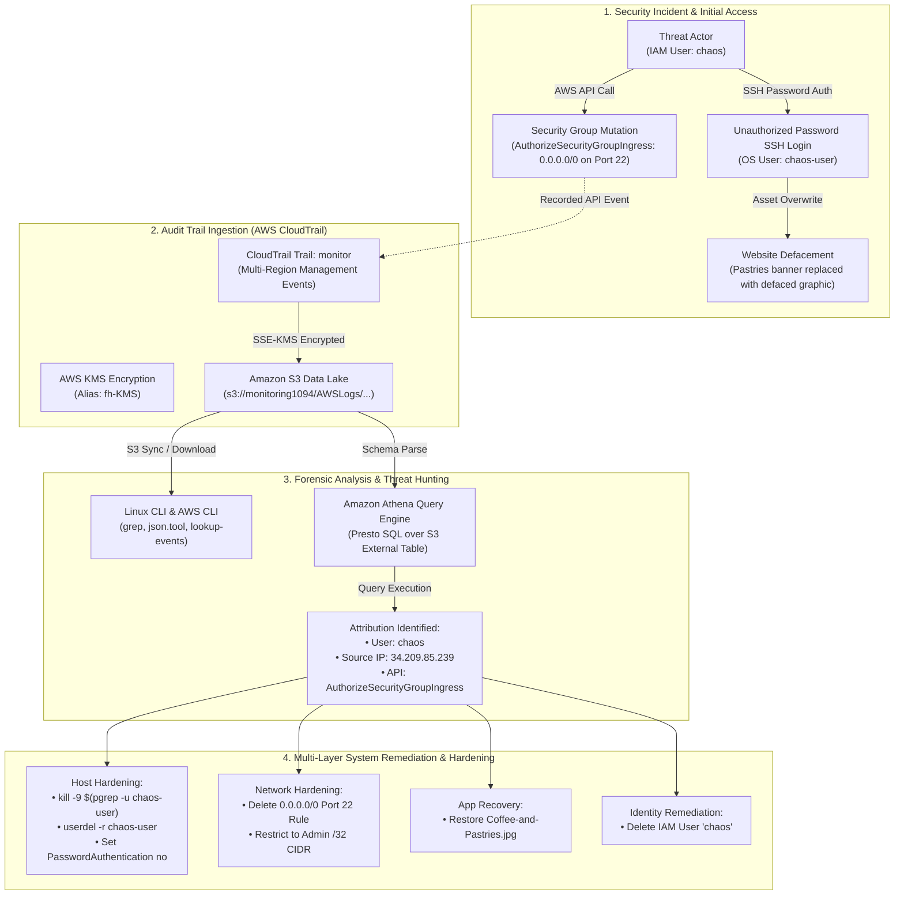
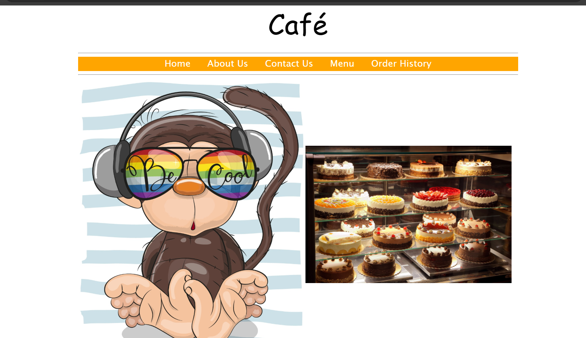
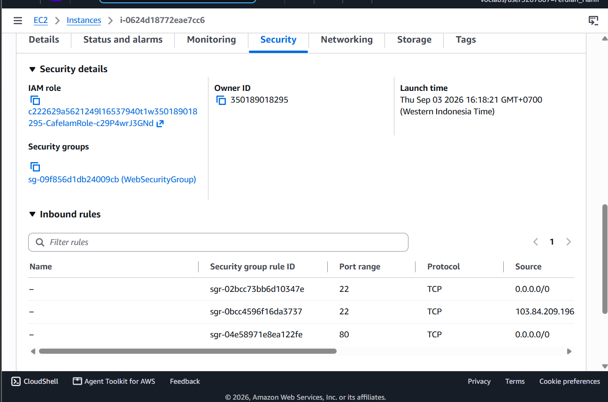
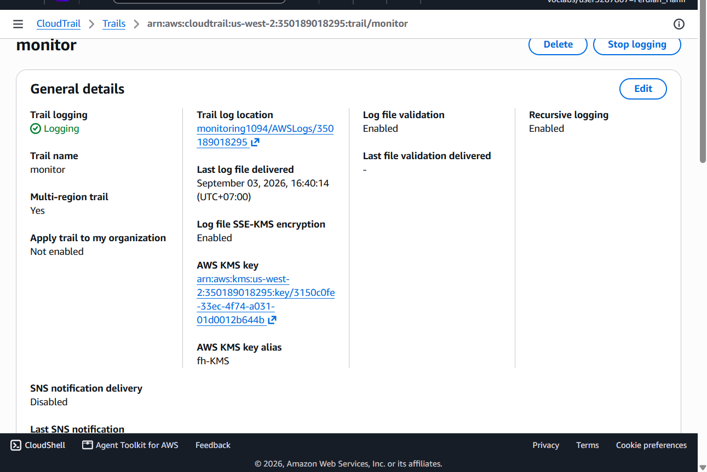
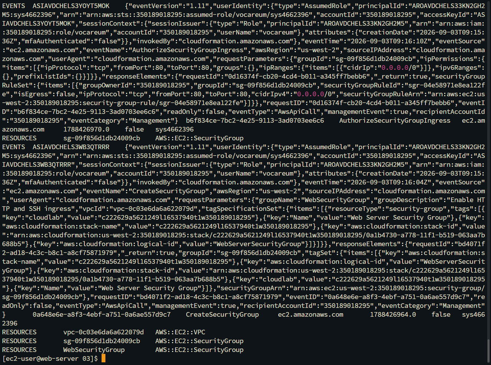
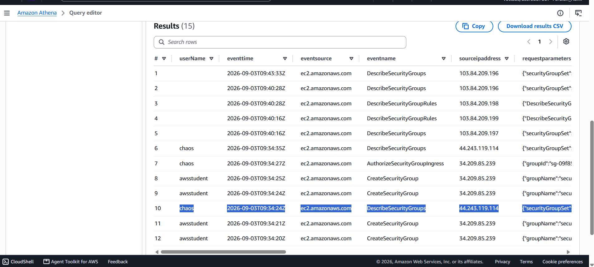
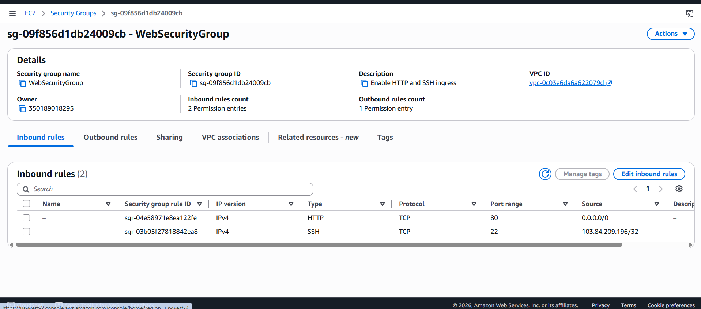
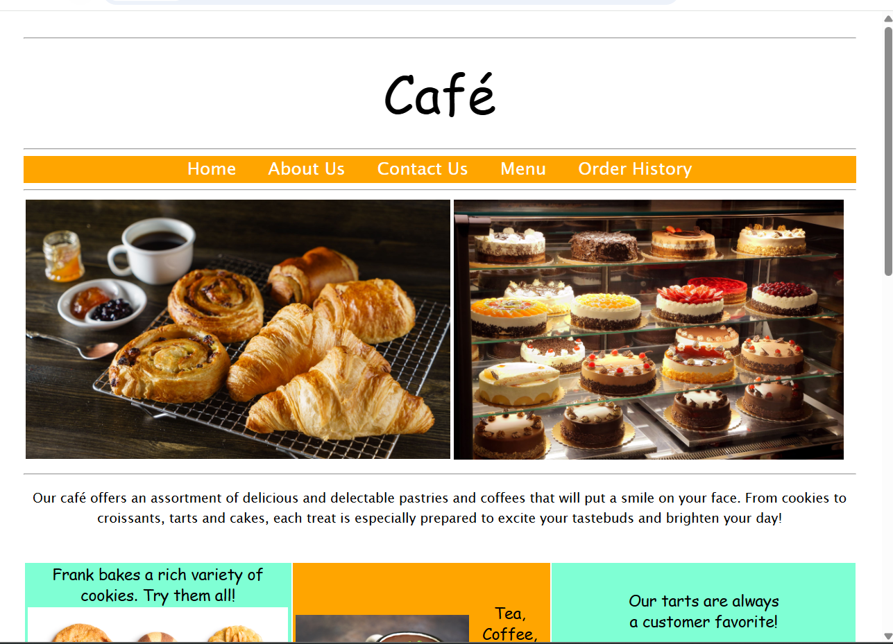
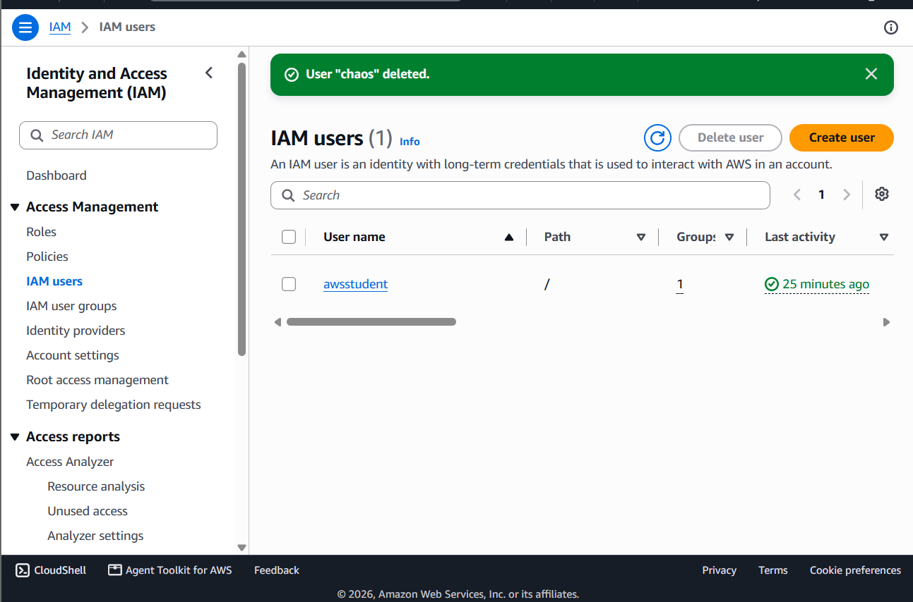

# Cloud Security Incident Response & Forensics: Threat Attribution and Multi-Layer Hardening via AWS CloudTrail and Amazon Athena

## Executive Summary & Architectural Purpose
In enterprise cloud operations, rapid incident response and deterministic digital forensics are essential to contain security breaches, determine threat actor vectors, and enforce system hardening. When unauthorized actors compromise infrastructure or manipulate security boundaries (such as opening administrative ports to `0.0.0.0/0`), security engineers require centralized, immutable audit trails and low-latency query capabilities to trace API mutations and remediate vulnerabilities.

This hands-on security engineering project investigates and neutralizes a live incident on the **Café Web Server**:
1. **Centralized Immutable Audit Logging (AWS CloudTrail)**: Provisioning a dedicated multi-Region trail (`monitor`) delivering management event logs encrypted via **AWS Key Management Service (KMS)** (`fh-KMS`) to an isolated **Amazon S3** log archive bucket (`monitoring1094`).
2. **Multi-Vector Forensic Triage**:
   - **Host-Level & CLI Parsing**: Extracting compressed `.json.gz` log archives from S3, formatting payloads via `python -m json.tool`, and isolating security group mutations via `aws cloudtrail lookup-events`.
   - **Serverless SQL Analytics (Amazon Athena)**: Provisioning external table schemas over S3 log data and executing ad-hoc Presto SQL queries to identify the unauthorized IAM principal (`chaos`), source IP address (`34.209.85.239`), timestamp, and exact API mutation (`AuthorizeSecurityGroupIngress`).
3. **Four-Tier Incident Response & Remediation**:
   - **Host / OS Hardening**: Terminating active threat processes (`kill -9`), purging unauthorized Linux OS accounts (`chaos-user`), and permanently disabling password-based SSH authentication (`PasswordAuthentication no`) in `/etc/ssh/sshd_config`.
   - **Network Security Group Remediation**: Revoking the unauthorized `0.0.0.0/0` SSH ingress rule, restricting port 22 strictly to the administrator's `/32` CIDR block.
   - **Application Recovery**: Restoring the defaced web assets (`Coffee-and-Pastries.jpg`) from clean backup storage.
   - **IAM Identity Revocation**: Permanently terminating the compromised `chaos` IAM user account.

---

## Architectural Topology & Incident Response Pipeline

---

## Technical Specifications & Forensic Baseline

| Parameter / Resource | Technical Value / Identifier | Architectural Role & Context |
|:---|:---|:---|
| **Audit Service** | AWS CloudTrail Trail (`monitor`) | Multi-Region API activity recording delivering encrypted JSON events to S3 |
| **KMS Customer Master Key** | `arn:aws:kms:us-west-2:350189018295:key/...` (`fh-KMS`) | Hardware security module (HSM) key for Server-Side Encryption (SSE-KMS) |
| **Log Archive S3 Bucket** | `s3://monitoring1094/` | Immutable object storage holding partitioned GZIP log files (`.json.gz`) |
| **Serverless SQL Engine** | Amazon Athena Query Editor | Presto-based query engine executing schema-on-read over CloudTrail JSON records |
| **Forensic SQL Query** | `WHERE eventsource = 'ec2.amazonaws.com' AND eventname LIKE '%Security%'` | Isolated security group modification events from general management traffic |
| **Identified Threat Principal** | IAM User `chaos` (`34.209.85.239`) | Attributed identity executing `AuthorizeSecurityGroupIngress` at 09:34:27 UTC |
| **Host SSH Configuration** | `/etc/ssh/sshd_config` (`PasswordAuthentication no`) | Eliminated password authentication attack surface, enforcing asymmetric key pairs |
| **Network Security Group** | `sg-09f856d1db24009cb` (`WebSecurityGroup`) | Inbound port 22 access restricted strictly to administrator IP `103.84.209.196/32` |

---

## Step-by-Step Implementation & Forensic Verification

### Step 1: Incident Detection (Website Defacement & Security Group Breach)
Initial reconnaissance revealed that the Café website had been defaced and an unauthorized inbound rule opening SSH port 22 to `0.0.0.0/0` had been injected into the web server's Security Group.

| Café Website Defaced (*Monkey Graphic*) | Inbound Security Group Breach (`0.0.0.0/0`) |
|:---:|:---:|
|  |  |
| *Figure 1a: Defaced banner replacing pastries visual* | *Figure 1b: Unauthorized port 22 rule open to the world* |

---

### Step 2: Provisioning Centralized CloudTrail Audit Logging
Configured a multi-Region CloudTrail trail (`monitor`) delivering SSE-KMS encrypted logs to S3 bucket `monitoring1094`.

*Figure 2: Active CloudTrail logging configuration with SSE-KMS key `fh-KMS` and S3 bucket.*

---

### Step 3: Low-Level CLI Forensic Triage
Extracted raw compressed log files from S3 and utilized `aws cloudtrail lookup-events` to isolate security group modification events.

*Figure 3: Forensic log extraction identifying `AuthorizeSecurityGroupIngress` API invocation.*

---

### Step 4: Serverless SQL Threat Hunting via Amazon Athena (Threat Attribution)
Created an external Athena table partitioned over the CloudTrail S3 bucket and executed SQL queries to attribute the breach to IAM user `chaos`.

*Figure 4: Athena SQL query revealing IAM user `chaos` (Source IP: `34.209.85.239`) mutating security groups at 09:34:27 UTC.*

---

### Step 5: Incident Remediation & Multi-Layer System Hardening
Executed comprehensive remediation across OS, network, application, and IAM identity layers.

| Network Remediation: Port 22 Scoped | Application Recovery: Website Restored | Identity Revocation: User `chaos` Deleted |
|:---:|:---:|:---:|
|  |  |  |
| *Figure 5a: Port 22 restricted strictly to admin IP* | *Figure 5b: Restored original pastry visuals* | *Figure 5c: Malicious IAM principal permanently deleted* |

---

## Enterprise Best Practices & Security Operations Center (SOC) Standards

1. **Immutable Log Storage with S3 Object Lock**:
   * Production audit trails should be stored in an isolated, dedicated **Log Archive AWS Account** with **S3 Object Lock (Compliance Mode / WORM)** enabled to prevent log tampering or deletion even by compromised root credentials.
2. **Zero-Trust Access via AWS Systems Manager Session Manager**:
   * Eliminate all inbound SSH (port 22) rules entirely from Security Groups and manage instances using **AWS Systems Manager Session Manager**, providing auditable, IAM-governed shell access without open ports.
3. **Automated Threat Detection with Amazon GuardDuty & EventBridge**:
   * Pair CloudTrail logs with **Amazon GuardDuty** and **Amazon EventBridge** to trigger automated AWS Lambda functions that instantly revoke unauthorized Security Group rules in near real-time.
