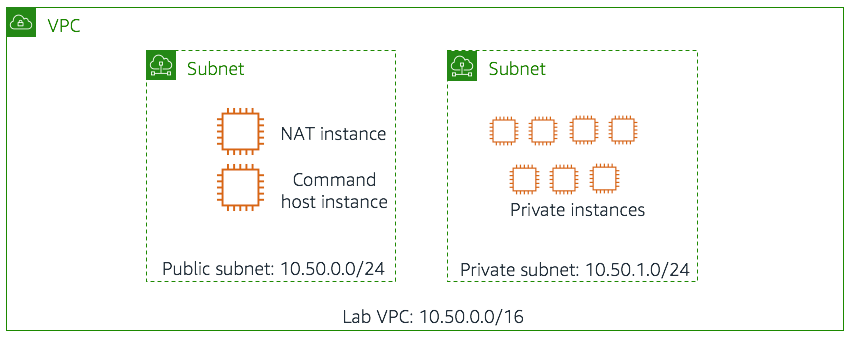
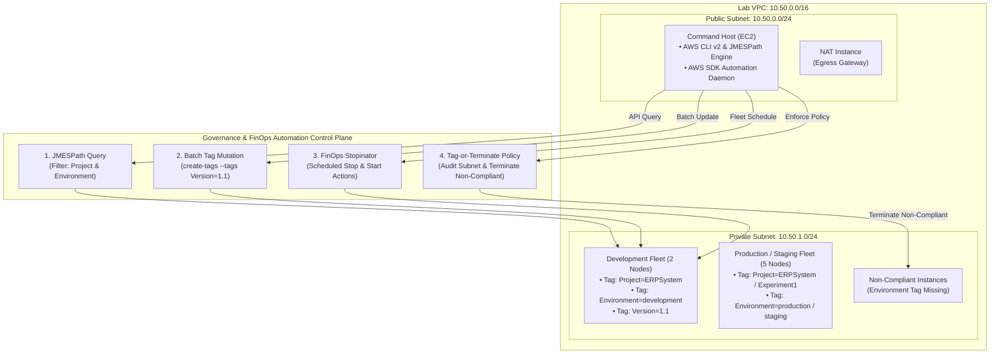
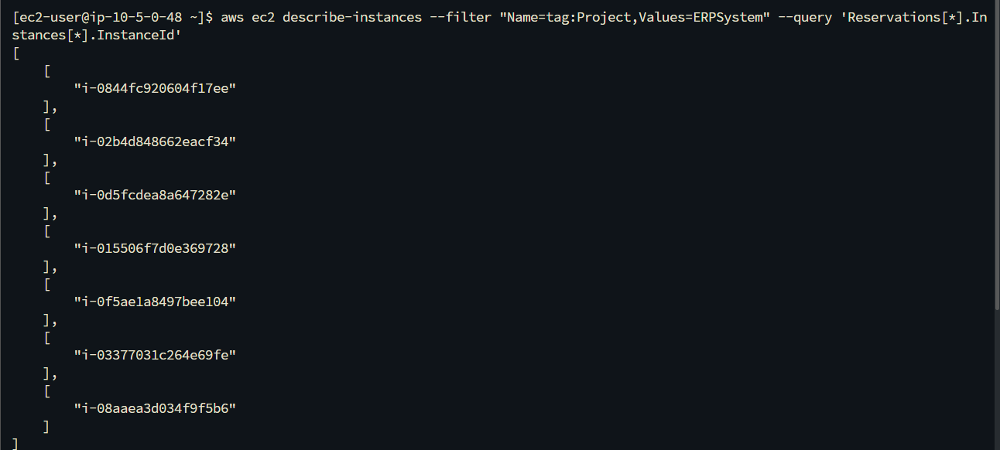
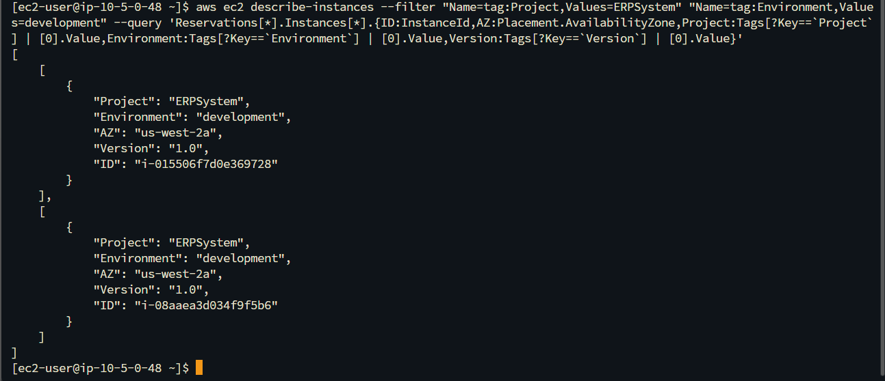
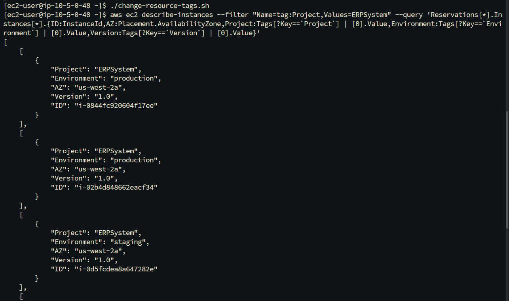
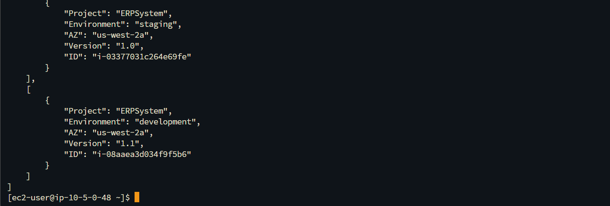
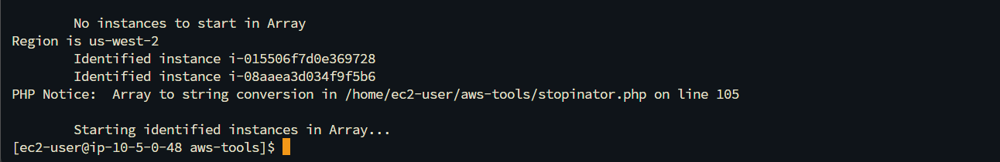
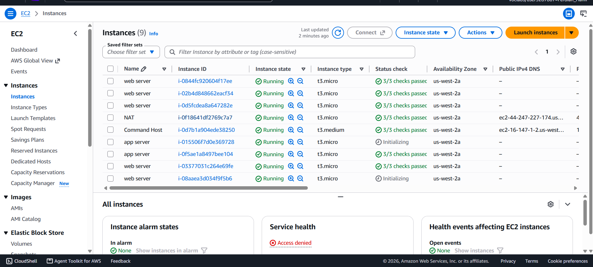
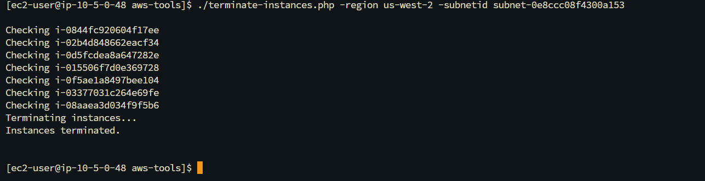
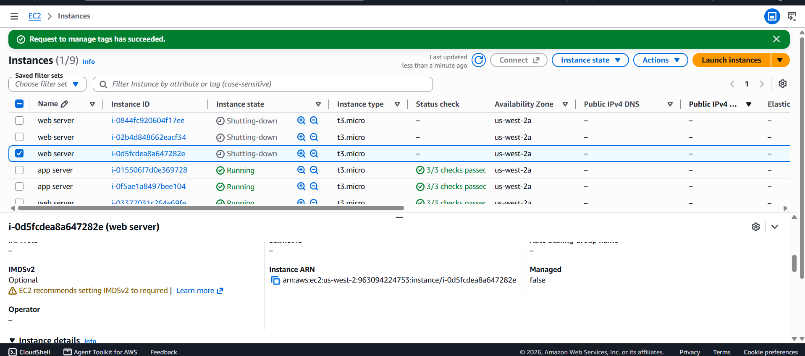

# Automated Cloud Governance & Resource Lifecycle Automation: Advanced JMESPath Tag Auditing, FinOps Fleet Scheduling, and Tag-or-Terminate Enforcement

## Executive Summary & Architectural Purpose
In hyper-scale enterprise cloud environments hosting hundreds of heterogeneous workloads across multi-account topologies, unmanaged resources generate significant financial waste, operational friction, and security blind spots. Tagging metadata serves as the foundational control plane for cost allocation, environment isolation, automated operational maintenance, and compliance auditing.

This hands-on engineering project implements automated resource governance and fleet lifecycle management on Amazon Web Services (AWS):
1. **Advanced JMESPath Querying & Multi-Attribute Extraction (AWS CLI)**: Executing structured JMESPath filter projections over the Amazon EC2 control plane to parse nested metadata arrays (`Project`, `Environment`, `Version`) and extract targeted instance identifiers without bloated JSON payloads.
2. **Batch Tag Mutation Automation**: Developing shell automation (`change-resource-tags.sh`) to perform atomic metadata updates across development fleets, migrating `Version: 1.0` to `Version: 1.1` without mutating production or staging baselines.
3. **FinOps Automated Fleet Scheduling (The Stopinator)**: Implementing programmatic workload scheduling using the AWS SDK (`stopinator.php`) to automatically identify, gracefully stop, and restart non-production instances (`Project=ERPSystem;Environment=development`), eliminating idle compute costs during off-business hours.
4. **Automated Security & Governance Enforcement ("Tag-or-Terminate" Policy)**: Simulating unauthorized compliance deviations and deploying an automated policy-as-code daemon (`terminate-instances.php`) that audits private subnets and automatically terminates non-compliant EC2 workloads lacking the mandatory `Environment` tag.

---

## Architectural Topology & Governance Flow

---

## Technical Specifications & Governance Baseline

| Parameter / Dimension | Technical Baseline / Specification | Governance Context & Justification |
|:---|:---|:---|
| **VPC Infrastructure** | `10.50.0.0/16` (`Lab VPC`) | Isolated dual-tier networking environment with public and private subnets |
| **Management Host** | `Command Host` (`t3.medium` in `10.50.0.0/24`) | Bastion management node executing CLI and PHP SDK governance routines |
| **Monitored Projects** | `ERPSystem` & `Experiment1` | Business application tags categorizing distinct workload domains |
| **Environment Baselines** | `development`, `staging`, `production` | Operational lifecycle tiers determining scheduling and retention policies |
| **JMESPath Syntax** | `Reservations[*].Instances[*].{ID:InstanceId,AZ:Placement.AvailabilityZone,Project:Tags[?Key=='Project']\|[0].Value}` | Complex array projection parsing specific tag values from nested objects |
| **FinOps Cost Impact** | Automated Off-Hours EC2 Shutdown | Up to 70% cost reduction on development compute workloads by stopping off-hours |
| **Compliance Standard** | Mandatory `Environment` Tag Allocation | Non-compliant workloads automatically isolated and terminated to prevent shadow IT |

---

## Step-by-Step Implementation & Technical Verification

### Step 1: Fleet Discovery & Advanced JMESPath Projections
Connected to `Command Host` and executed multi-tier AWS CLI queries utilizing JMESPath syntax to isolate instances belonging to `Project=ERPSystem` and `Environment=development`.

| Single Property Projection (Instance IDs) | Multi-Attribute Projection (`Project`, `Environment`, `Version`) |
|:---:|:---:|
|  |  |
| *Figure 1a: Filtered array of instance IDs* | *Figure 1b: Full metadata projection showing baseline Version 1.0* |

---

### Step 2: Automated Batch Metadata Mutation
Executed `change-resource-tags.sh` to programmatically update the `Version` tag from `1.0` to `1.1` exclusively across development instances.

| Shell Script Execution | Verified Metadata Mutation (`Version: 1.1`) |
|:---:|:---:|
|  |  |
| *Figure 2a: Automated tag update invocation* | *Figure 2b: Verified Version 1.1 on development instances* |

---

### Step 3: FinOps Fleet Scheduling (The Stopinator)
Deployed `stopinator.php` to identify and gracefully toggle the power state of development instances based on custom metadata tags.

| Programmatic Instance Restart Invocation | EC2 Fleet State Transition (`Initializing`) |
|:---:|:---:|
|  |  |
| *Figure 3a: PHP SDK restart action on identified nodes* | *Figure 3b: EC2 console reflecting instances restarting* |

---

### Step 4: Policy as Code — "Tag-or-Terminate" Governance Enforcement
Simulated compliance drift by removing mandatory `Environment` tags from target private instances and executed `terminate-instances.php` to enforce automated decommissioning.

| Policy Enforcement Script Execution | EC2 Fleet Decommissioning (`Shutting-down`) |
|:---:|:---:|
|  |  |
| *Figure 4a: Daemon identifying and terminating non-compliant nodes* | *Figure 4b: Real-time decommissioning of untagged workloads* |

---

## Enterprise Best Practices & Governance Recommendations

1. **Tag Policies via AWS Organizations**:
   * Implement **AWS Organizations Tag Policies** to define standardized capitalization and acceptable values for mandatory tags (e.g., `Environment` must strictly match `development | staging | production`).
2. **Preventative Controls with Service Control Policies (SCPs)**:
   * Enforce preventative SCPs that deny `ec2:RunInstances` requests if mandatory tags (`Project`, `Environment`, `Owner`) are not provided during instance creation.
3. **Automated Continuous Governance via AWS Config & EventBridge**:
   * Instead of standalone scripts, deploy AWS Config rule `required-tags` coupled with Amazon EventBridge and AWS Systems Manager Automation to automatically remediate or isolate untagged resources enterprise-wide.
