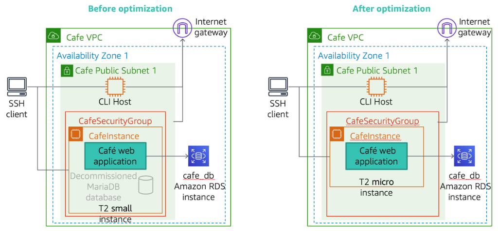
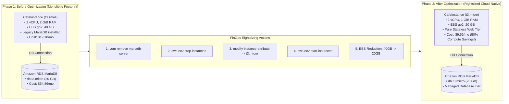
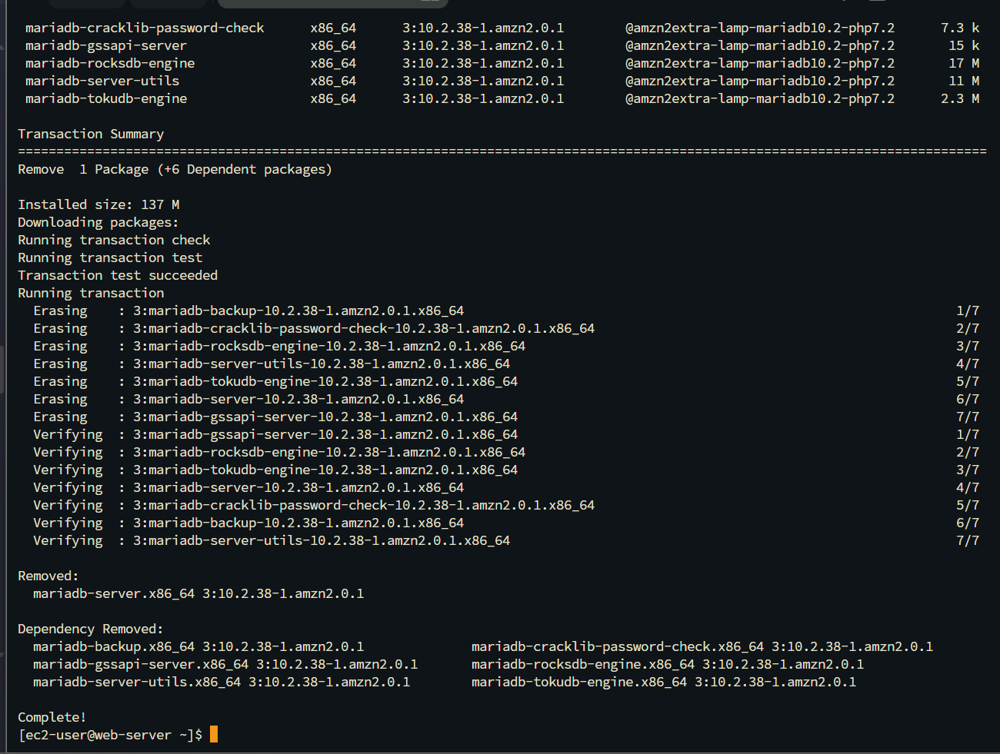
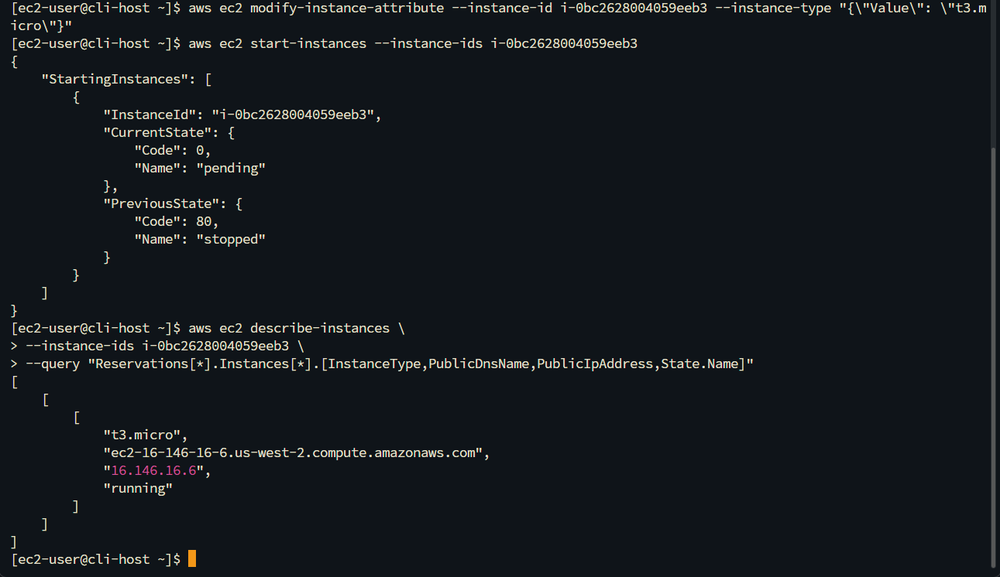
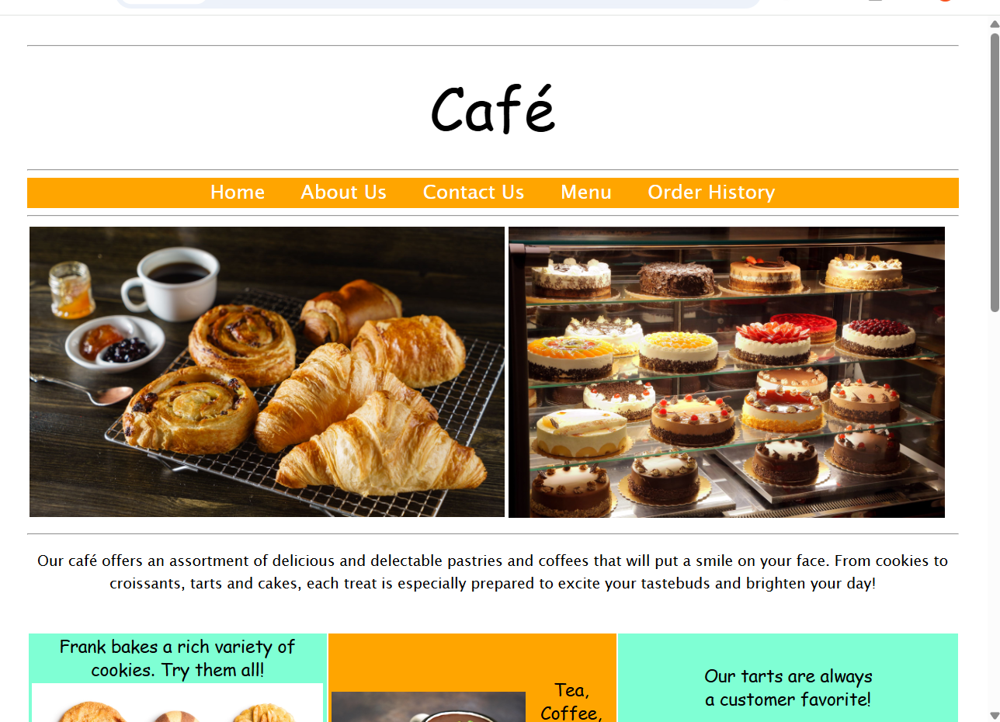
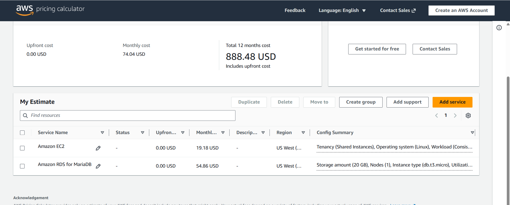
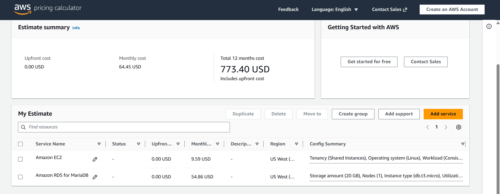

# Cloud Financial Engineering & FinOps Optimization: Workload Decoupling, Compute Rightsizing, and AWS Pricing Calculator Modeling

## Executive Summary & Architectural Purpose
In enterprise cloud operations, transitioning from monolithic architectures to decoupled cloud-native managed services frequently leaves behind oversized compute instances and legacy disk footprints. Without deliberate FinOps intervention, organizations incur unnecessary run-rate costs for idle CPU, overprovisioned RAM, and redundant storage volumes.

This hands-on FinOps and cloud optimization project implements architectural rightsizing and financial modeling for the **Café Web Application**:
1. **Legacy Workload Decommissioning**: Purging the unmanaged local `mariadb-server` packages from the web instance, freeing up compute memory and reclaiming 20 GB of unnecessary EBS disk capacity following the database migration to **Amazon RDS for MariaDB**.
2. **Programmatic Compute Rightsizing via AWS CLI**: Executing vertical instance downsizing on `CafeInstance` from `t3.small` (2 vCPU, 2 GiB RAM) to `t3.micro` (2 vCPU, 1 GiB RAM) via `aws ec2 modify-instance-attribute`, tailoring compute capacity strictly to stateless web tier requirements.
3. **Application Resilience & Operational Continuity Verification**: Validating zero-downtime database connectivity and end-to-end web application functionality against the decoupled Amazon RDS backend post-resize.
4. **Financial Modeling & ROI Projection via AWS Pricing Calculator**: Constructing formal Before-vs-After total cost of ownership (TCO) models, demonstrating a 50% reduction in EC2 monthly compute spend ($19.18 to $9.59/month).

---

## Architectural Topology: Before vs After Optimization

---

## Technical Specifications & Cost Baseline

| Parameter / Dimension | Baseline (Before Optimization) | Optimized (After Rightsizing) | FinOps Impact & Savings |
|:---|:---|:---|:---|
| **EC2 Instance Type** | `t3.small` (2 vCPU, 2 GiB RAM) | `t3.micro` (2 vCPU, 1 GiB RAM) | 50% reduction in EC2 hourly compute run-rate |
| **Local Host Services** | Apache Web Server + `mariadb-server` | Apache Web Server (Pure Stateless) | CPU & RAM freed from database daemon contention |
| **EBS Storage Allocation** | 40 GB General Purpose SSD (`gp2`) | 20 GB General Purpose SSD (`gp2`) | 50% reduction in provisioned EBS block storage costs |
| **Database Tier** | Amazon RDS for MariaDB (`db.t3.micro`) | Amazon RDS for MariaDB (`db.t3.micro`) | Decoupled managed database ensuring high availability |
| **EC2 Monthly Cost** | `$19.18 / month` | `$9.59 / month` | **-$9.59 / month (50.0% compute savings)** |
| **Total Workload Cost** | `$74.04 / month` | `$64.45 / month` | Immediate operational expenditure (OpEx) reduction |

---

## Step-by-Step Implementation & Financial Verification

### Step 1: Decommissioning Local Database Daemon
Connected via SSH to `CafeInstance`, halted the local database daemon, and uninstalled all MariaDB server packages to reclaim compute resources.

*Figure 1: Successful package removal (`yum -y remove mariadb-server`) completing without errors.*

---

### Step 2: Programmatic Compute Rightsizing via AWS CLI
From `CLI Host`, modified instance attributes to transition the compute instance from `t3.small` to `t3.micro` and started the resized host.

*Figure 2: CLI execution of `modify-instance-attribute` and verification of `t3.micro` in `running` state.*

---

### Step 3: Application Continuity & Operational Verification
Accessed the updated web application URL to confirm full functional integrity and active connection to the Amazon RDS database.

*Figure 3: Production Café web application operating seamlessly post-downsizing.*

---

### Step 4: Financial Modeling via AWS Pricing Calculator
Constructed comprehensive cost estimates comparing the baseline footprint against the rightsized architecture.

| Baseline Footprint (Before: EC2 $19.18/mo) | Rightsized Footprint (After: EC2 $9.59/mo) |
|:---:|:---:|
|  |  |
| *Figure 4a: Baseline model reflecting t3.small & 40GB EBS* | *Figure 4b: Optimized model showing 50% EC2 compute reduction* |

---

## Enterprise FinOps Best Practices & Cost Optimization Principles

1. **AWS Compute Optimizer & Rightsizing Recommendations**:
   * Deploy **AWS Compute Optimizer** (leveraging ML telemetry over CloudWatch memory and CPU utilization) to automatically detect over-provisioned EC2, EBS, and Lambda workloads enterprise-wide.
2. **Decoupled Architecture Rightsizing Workflow**:
   * Immediately following data tier migrations (e.g., EC2 database to RDS/DynamoDB), trigger an automated audit to downsize host compute types and shrink EBS volumes.
3. **Savings Plans & Reserved Instances**:
   * For steady-state production workloads after rightsizing has stabilized, apply **1-Year or 3-Year Compute Savings Plans** to unlock an additional 25–40% cost reduction over On-Demand rates.
