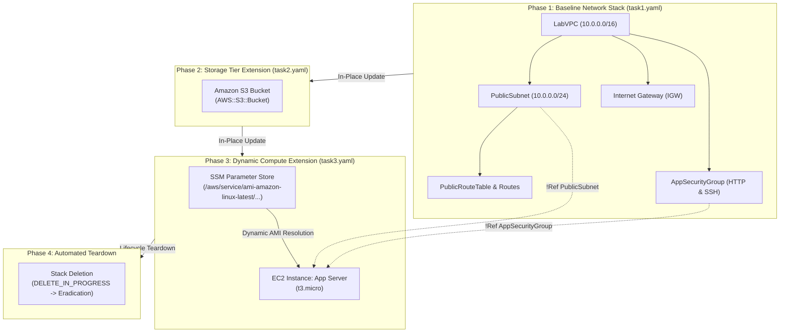
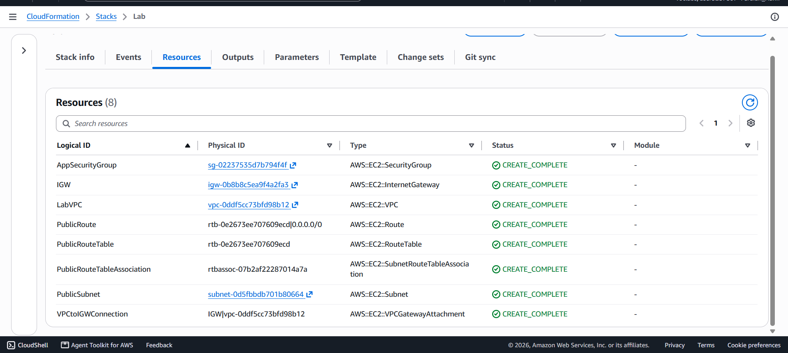
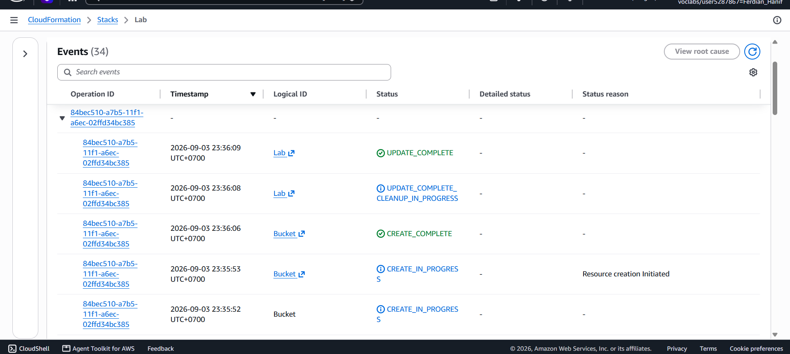
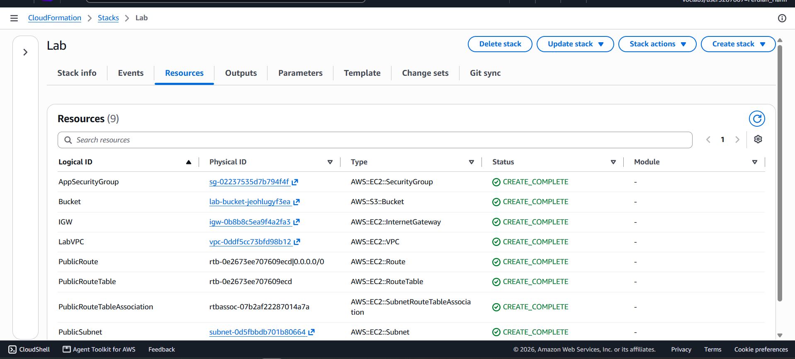
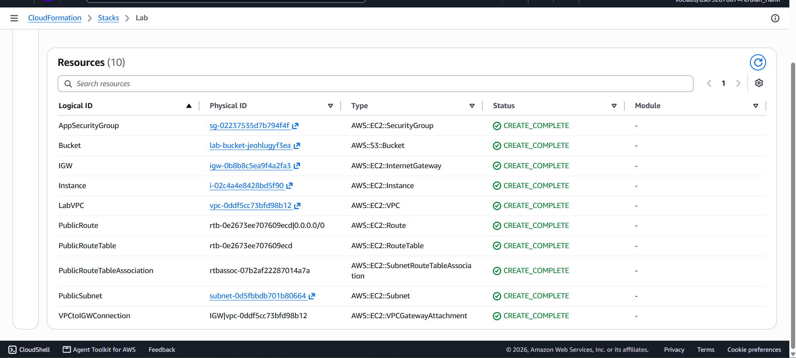
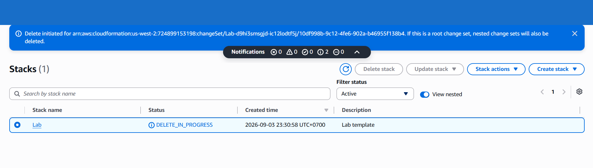

# Infrastructure as Code (IaC) Engineering: Multi-Tier Stack Automation, Dynamic SSM AMI Ingestion, and In-Place Change Set Updates via AWS CloudFormation

## Executive Summary & Architectural Purpose
Manual infrastructure provisioning (*ClickOps*) introduces human error, configuration drift across environments, and severe operational bottlenecks during disaster recovery scenarios. **AWS CloudFormation** provides deterministic, automated Infrastructure as Code (IaC), allowing engineering teams to define, version-control, incrementally mutate (*Change Sets*), and cleanly teardown complex multi-tier topologies via declarative YAML/JSON templates.

This hands-on cloud engineering project implements the progressive lifecycle development of a production CloudFormation stack (`Lab`):
1. **Baseline VPC & Network Fabric Deployment (`task1.yaml`)**: Provisioning an isolated Virtual Private Cloud (`10.0.0.0/16`), Public Subnet (`10.0.0.0/24`), Internet Gateway, Route Table, and Application Security Group (`AppSecurityGroup`).
2. **In-Place Storage Tier Extension via Change Sets (`task2.yaml`)**: Incrementally mutating the running stack by appending an **Amazon S3 Bucket** resource (`AWS::S3::Bucket`), demonstrating zero-impact stack evolution without disrupting established network bindings.
3. **Compute Tier Provisioning with Dynamic SSM Parameter Ingestion (`task3.yaml`)**: Integrating **AWS Systems Manager Parameter Store** (`AWS::SSM::Parameter::Value<AWS::EC2::Image::Id>`) to dynamically resolve latest regional Amazon Linux 2 AMI IDs at runtime, provisioning an EC2 compute node (`App Server`), and wiring dependencies using intrinsic functions (`!Ref`).
4. **Automated Lifecycle Teardown**: Executing deterministic, reverse-dependency stack deletion (`DELETE_IN_PROGRESS`), ensuring complete eradication of orphaned compute, storage, and networking resources.

---

## Architectural Topology & Stack Evolution Flow

---

## Technical Specifications & CloudFormation Baseline

| Component / Parameter | Logical ID / Syntax | Resource Type & Architectural Role |
|:---|:---|:---|
| **Stack Identifier** | `Lab` | Centralized CloudFormation management stack container |
| **VPC Resource** | `LabVPC` (`10.0.0.0/16`) | `AWS::EC2::VPC` - Primary network boundary container |
| **Public Subnet** | `PublicSubnet` (`10.0.0.0/24`) | `AWS::EC2::Subnet` - Compute placement tier with public routing |
| **Egress Gateway** | `IGW` & `VPCToIGWConnection` | `AWS::EC2::InternetGateway` & `AWS::EC2::VPCGatewayAttachment` |
| **Security Perimeter** | `AppSecurityGroup` | `AWS::EC2::SecurityGroup` - State firewall governing ingress traffic |
| **Storage Extension** | `Bucket` | `AWS::S3::Bucket` - Object storage provisioned via in-place stack update |
| **Dynamic AMI Lookup** | `AmazonLinuxAMIID` | `AWS::SSM::Parameter::Value<AWS::EC2::Image::Id>` - Parameter Store AMI feed |
| **Compute Instance** | `Instance` (`App Server`) | `AWS::EC2::Instance` (`t3.micro`) linked via `!Ref` expressions |

---

## Step-by-Step Implementation & IaC Verification

### Step 1: Baseline Network Stack Deployment (`task1.yaml`)
Uploaded the baseline template to provision the core VPC fabric, verifying all 8 baseline resources reach `CREATE_COMPLETE`.

*Figure 1: CloudFormation Resources tab confirming successful creation of VPC, Subnet, RouteTable, IGW, and SecurityGroup.*

---

### Step 2: In-Place Stack Mutation — Amazon S3 Bucket Addition (`task2.yaml`)
Updated the running stack with `task2.yaml` containing the declarative `AWS::S3::Bucket` resource, executing an in-place update without recreating existing network components.

| CloudFormation Events Stream | S3 Bucket Resource Deployed |
|:---:|:---:|
|  |  |
| *Figure 2a: Stack events reflecting in-place bucket provisioning* | *Figure 2b: Resources list expanded to 9 active managed assets* |

---

### Step 3: Dynamic Parameter Ingestion & Compute Workload Provisioning (`task3.yaml`)
Integrated SSM Parameter Store to dynamically feed the latest Amazon Linux 2 AMI ID into the EC2 instance definition, referencing the security group and subnet via `!Ref`.

*Figure 3: Complete 10-resource stack topology featuring the running EC2 App Server alongside the S3 Bucket and VPC.*

---

### Step 4: Automated Stack Teardown & Clean Resource Eradication
Initiated stack deletion to validate automated reverse-dependency resource destruction, preventing orphaned infrastructure waste.

*Figure 4: CloudFormation orchestrating orderly deletion of all provisioned cloud assets.*

---

## Enterprise IaC Best Practices & Production Guidelines

1. **Dynamic AMI Resolution vs Hardcoded AMI IDs**:
   * Never hardcode region-specific AMI IDs (e.g., `ami-0c55b159cbfafe1f0`).
   * Utilize `AWS::SSM::Parameter::Value<AWS::EC2::Image::Id>` pointing to `/aws/service/ami-amazon-linux-latest/...` to ensure templates are globally portable and automatically ingest security-patched base images.
2. **Change Sets for Production Safety**:
   * Always execute `aws cloudformation create-change-set` prior to deploying production updates to preview resource replacements (*Modify* vs *Replace*) and prevent accidental database drops.
3. **Modular Stacks with Nested Stacks & Exported Outputs**:
   * Decouple foundational networking (VPC/Subnets) from application workloads using **Nested Stacks** (`AWS::CloudFormation::Stack`) and reference shared resources across stacks via `Fn::ImportValue`.
