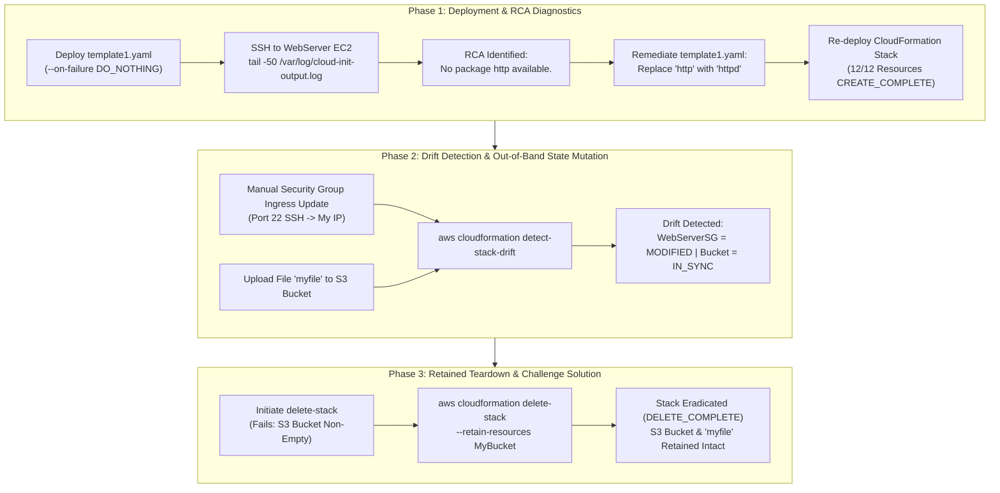
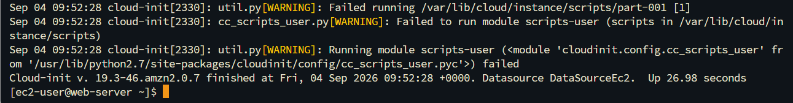
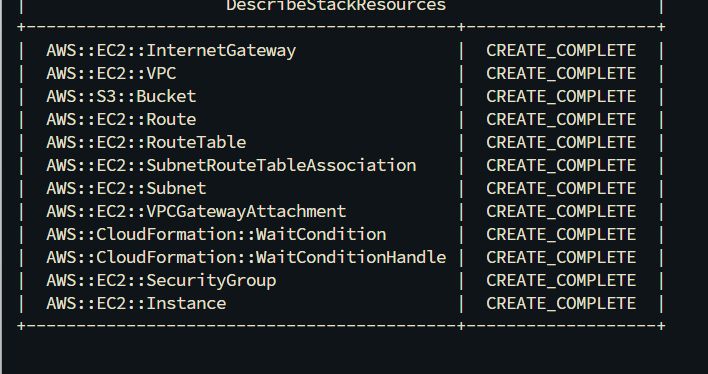
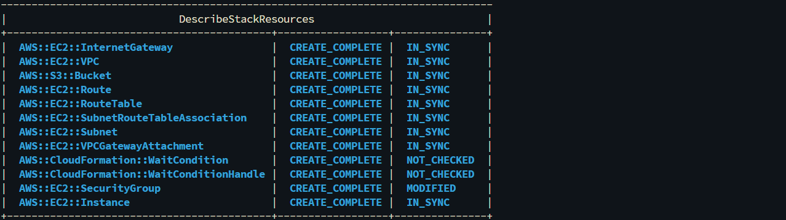
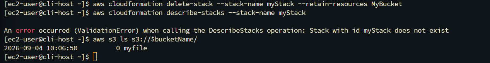

# Infrastructure as Code (IaC) Diagnostics: CLI-Driven CloudFormation Troubleshooting, Failure Recovery, Drift Detection, and Retained Resource Deletion via AWS CLI

## Executive Summary & Architectural Purpose
Declarative Infrastructure as Code (IaC) simplifies multi-tier cloud deployments, but syntax errors, missing package dependencies, out-of-band manual changes, and non-empty storage buckets can disrupt automation pipelines. **AWS CloudFormation** provides automated deployment rollback safeguards, stack drift detection engines, and granular resource retention controls to maintain state integrity across complex environments.

This hands-on cloud engineering project implements end-to-end failure diagnostics, configuration drift tracking, and resilient stack teardown for a CloudFormation stack (`myStack`):
1. **JMESPath CLI Querying (Task 1)**: Inspecting stack outputs and resource states programmatically using `aws cloudformation describe-stacks` and `describe-stack-resources` filtered with `--query` expressions.
2. **Failure Inspection & Post-Mortem Root Cause Analysis (`template1.yaml`) (Task 2)**: Provisioning a flawed CloudFormation template using `--on-failure DO_NOTHING` to prevent immediate rollback. SSHing into the EC2 instance to inspect `/var/log/cloud-init-output.log`, identifying a package repository error (`No package http available.`), remediating the template (`http` -> `httpd`), and achieving `CREATE_COMPLETE` across all 12 managed resources.
3. **Out-of-Band State Mutation & Drift Detection (Task 3)**: Modifying the `WebServerSG` security group out-of-band and uploading objects to the S3 bucket. Triggering `aws cloudformation detect-stack-drift` and verifying that CloudFormation accurately detects configuration drift on `WebServerSG` (`MODIFIED`).
4. **Retained Resource Deletion & Challenge Teardown (Task 4 & Challenge)**: Handling a failed stack deletion (`DELETE_FAILED`) caused by a non-empty S3 bucket by executing `aws cloudformation delete-stack --stack-name myStack --retain-resources MyBucket`, successfully destroying all infrastructure while retaining the S3 bucket and its data intact.

---

## Architectural Workflow & Troubleshooting Lifecycle

---

## Technical Specifications & CloudFormation Diagnostics Matrix

| Diagnostic Stage | CLI Command / Mechanism | Resource / Parameter | Observed State / Result |
|:---|:---|:---|:---|
| **Resource Querying** | `aws cloudformation describe-stack-resources` | `--query "StackResources[?ResourceType=='AWS::EC2::Instance']"` | Filtering specific compute physical IDs via JMESPath |
| **Failure Preservation** | `--on-failure DO_NOTHING` | `myStack` deployment flag | Halts rollback, retaining EC2 instance for SSH diagnostics |
| **Root Cause Analysis** | `tail -50 /var/log/cloud-init-output.log` | `WebServer` EC2 UserData log | `No package http available.` (Package name mismatch) |
| **Template Remediation** | YAML Edit (`UserData` package list) | `http` -> `httpd` | Corrects package installation directive for Amazon Linux |
| **Drift Detection** | `aws cloudformation detect-stack-drift` | `WebServerSG` | `StackResourceDriftStatus: MODIFIED` (Manual SG edit) |
| **S3 Object Drift** | `aws s3 cp` object creation | `MyBucket` | `StackResourceDriftStatus: IN_SYNC` (Data drift != Infra drift) |
| **Retained Teardown** | `delete-stack --retain-resources MyBucket` | `DELETE_FAILED` -> `DELETE_COMPLETE` | Stack deleted; S3 bucket & objects preserved |

---

## Step-by-Step Implementation & Verification

### Step 1: Failure Preservation & Root Cause Analysis (`/var/log/cloud-init-output.log`)
Deployed `template1.yaml` with `--on-failure DO_NOTHING`. Connected via SSH to the Web Server instance and inspected the `cloud-init` execution log to diagnose the deployment stall.

*Figure 1: `/var/log/cloud-init-output.log` confirming yum failure due to invalid package name `http` instead of `httpd`.*

---

### Step 2: Template Remediation & Full Stack Provisioning (`CREATE_COMPLETE`)
Corrected package definition in `template1.yaml` from `http` to `httpd` and re-executed stack creation. Verified all 12 stack resources reached `CREATE_COMPLETE`.

*Figure 2: `aws cloudformation describe-stack-resources` output displaying all 12 stack components in `CREATE_COMPLETE` status.*

---

### Step 3: Out-of-Band Modification & Infrastructure Drift Detection
Modified the `WebServerSG` inbound rules out-of-band and executed drift detection via AWS CLI to identify configuration divergence.

*Figure 3: `aws cloudformation describe-stack-resource-drifts` confirming `WebServerSG` status as `MODIFIED` due to out-of-band security group changes.*

---

### Step 4: Challenge Solution — Retained Stack Deletion (`--retain-resources MyBucket`)
Attempted stack deletion on an S3 bucket containing data (`myfile`), causing a `DELETE_FAILED` state. Resolved by issuing `delete-stack` with `--retain-resources MyBucket`, achieving stack eradication while keeping S3 data intact.

*Figure 4: AWS CLI execution verifying successful stack deletion (`Stack with id myStack does not exist`) while `aws s3 ls` confirms S3 data preservation.*

---

## Enterprise IaC Best Practices & Troubleshooting Guidelines

1. **Leverage `--on-failure DO_NOTHING` During Template Development**:
   * Default CloudFormation behavior (`ROLLBACK`) destroys failed resources immediately, wiping away valuable diagnostic logs. Using `DO_NOTHING` preserves instances, enabling deep inspection of `/var/log/cloud-init-output.log` or `/var/log/cfn-init.log`.
2. **Automate Continuous Drift Detection**:
   * Out-of-band manual changes introduce security vulnerabilities and state divergence. Integrate `aws cloudformation detect-stack-drift` into automated CI/CD security pipelines to flag unauthorized rule changes.
3. **Graceful Storage Lifecycle & Retained Deletion**:
   * S3 buckets containing objects automatically reject stack deletion requests to prevent data loss. Use `--retain-resources <LogicalID>` during emergency stack tear-downs or configure `DeletionPolicy: Retain` directly within CloudFormation templates for critical storage assets.
