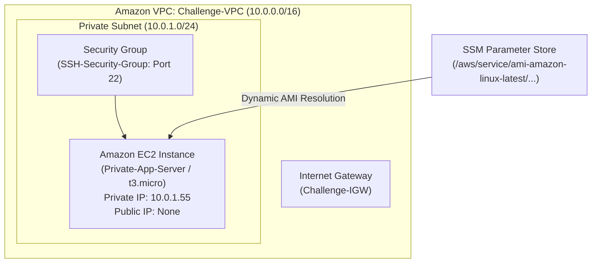
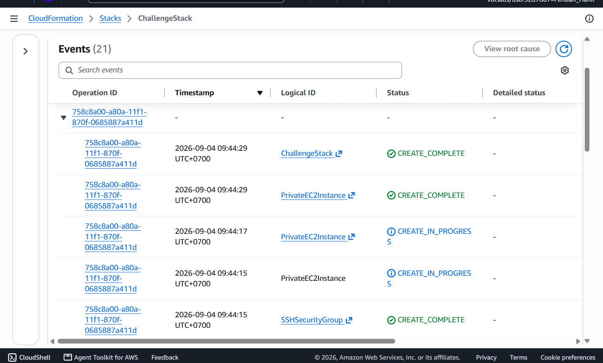
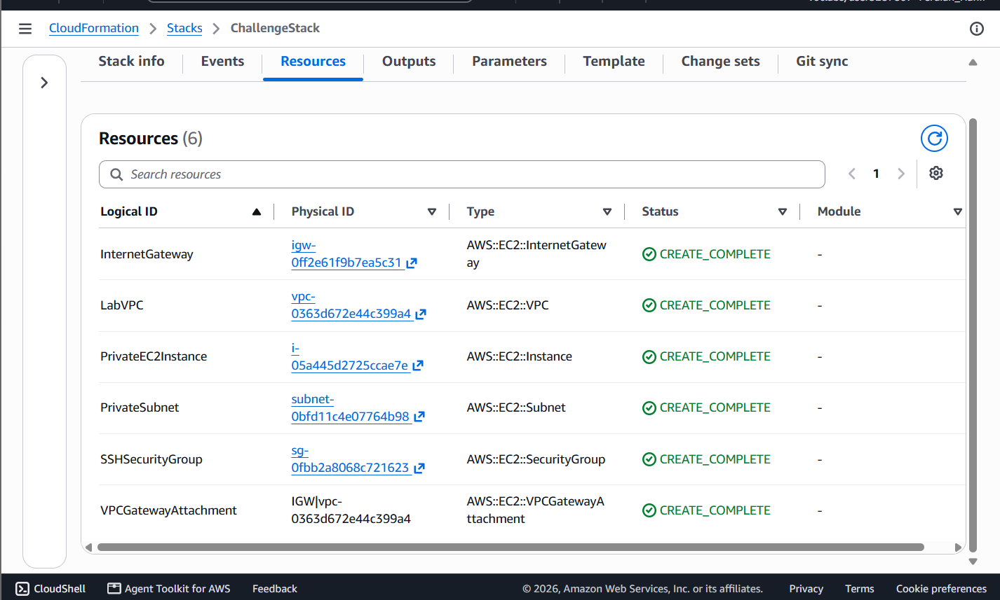
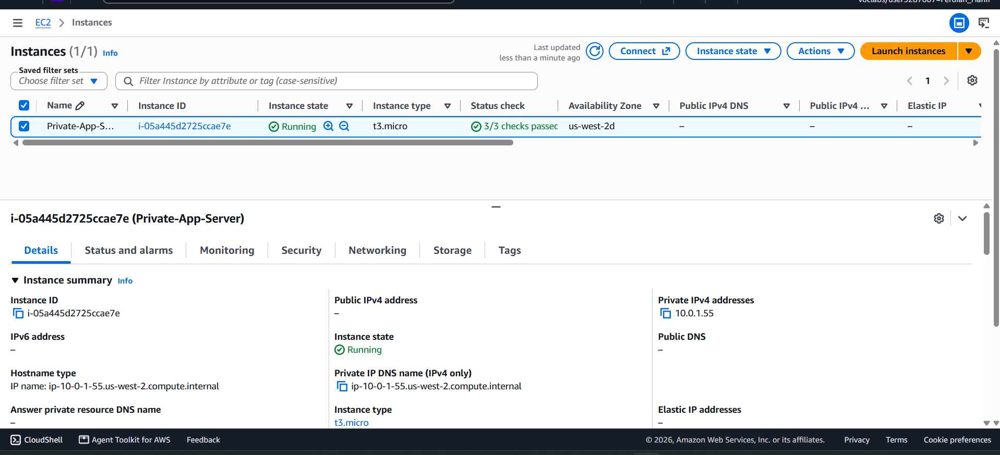

# Infrastructure as Code Challenge: Declarative Provisioning of Isolated Private Compute Topologies via AWS CloudFormation

## Executive Summary & Architectural Purpose
Declarative Infrastructure as Code (IaC) allows cloud engineers to define production network boundaries and isolated compute environments with 100% repeatability, zero configuration drift, and strict security compliance. 

This challenge project implements an automated, declarative AWS CloudFormation deployment (`ChallengeStack`) that constructs a secure, isolated compute tier:
1. **Network Boundary Definition**: Provisioning an isolated Virtual Private Cloud (`10.0.0.0/16`), an Internet Gateway, and explicit VPC gateway attachments.
2. **Strict Security Ingress Perimeter**: Configuring a dedicated Security Group (`SSHSecurityGroup`) enforcing inbound SSH access rules (`tcp/22` from `0.0.0.0/0`).
3. **Isolated Private Subnet Placement**: Creating a private subnet (`10.0.1.0/24`) with `MapPublicIpOnLaunch: false` to ensure compute workloads remain unexposed to direct public internet routing.
4. **Dynamic AMI Lookup & Compute Provisioning**: Integrating AWS Systems Manager Parameter Store (`AWS::SSM::Parameter::Value<AWS::EC2::Image::Id>`) to dynamically resolve region-specific Amazon Linux 2 AMI IDs at stack runtime, launching an EC2 `t3.micro` instance linked via intrinsic function `!Ref`.

---

## Architectural Topology

---

## Technical Specifications & Infrastructure Declarations

| Component | Logical ID | CloudFormation Type | Configuration & Attributes |
|:---|:---|:---|:---|
| **VPC Container** | `LabVPC` | `AWS::EC2::VPC` | CIDR `10.0.0.0/16`, DNS Support Enabled, Hostnames Enabled |
| **Internet Gateway** | `InternetGateway` | `AWS::EC2::InternetGateway` | Attached to VPC via `VPCGatewayAttachment` |
| **Ingress Security** | `SSHSecurityGroup` | `AWS::EC2::SecurityGroup` | Inbound SSH (`tcp/22`) from `0.0.0.0/0` |
| **Private Subnet** | `PrivateSubnet` | `AWS::EC2::Subnet` | CIDR `10.0.1.0/24`, `MapPublicIpOnLaunch: false` |
| **Compute Instance** | `PrivateEC2Instance` | `AWS::EC2::Instance` | Type `t3.micro`, Dynamic SSM AMI, Placed in `PrivateSubnet` |

---

## Step-by-Step Verification & Validation

### Step 1: Stack Creation & Event Execution
Uploaded the declarative YAML template to AWS CloudFormation, verifying all stack events complete successfully with `CREATE_COMPLETE`.

*Figure 1: CloudFormation Events stream displaying successful provisioning of all 6 logical resources.*

---

### Step 2: Resource Inventory Inspection
Validated the complete stack topology within the Resources tab of `ChallengeStack`.

*Figure 2: Active inventory showing `CREATE_COMPLETE` status for VPC, Subnet, IGW, Security Group, and EC2 Instance.*

---

### Step 3: EC2 Workload & Private Subnet Isolation Audit
Inspected the provisioned EC2 instance (`Private-App-Server`) in the Amazon EC2 Console to verify private IP binding and absence of public IPv4 addresses.

*Figure 3: EC2 Console showing `Private-App-Server` running in `10.0.1.55` without a Public IP.*

---

## Enterprise Best Practices Applied

1. **Strict Subnet Isolation**: By enforcing `MapPublicIpOnLaunch: false` on `PrivateSubnet`, backend database and application servers remain isolated from direct internet access.
2. **SSM Parameter Store AMI Ingestion**: Utilizing dynamic Parameter Store references prevents template brittleness across AWS regions and avoids static AMI ID hardcoding.
