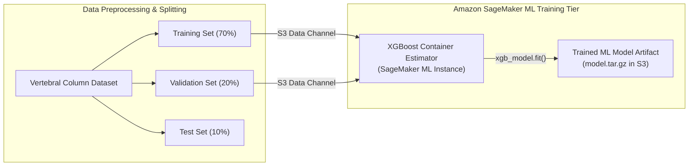
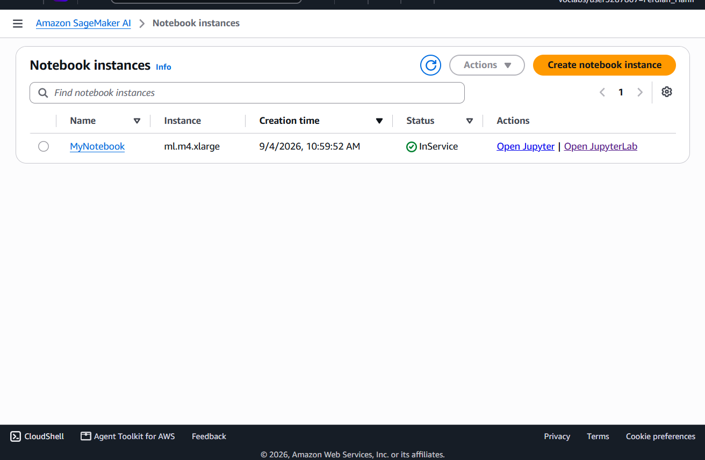
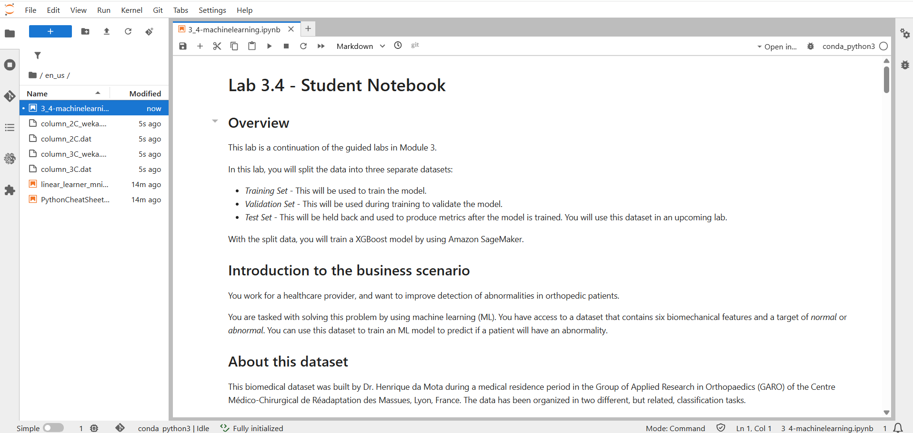
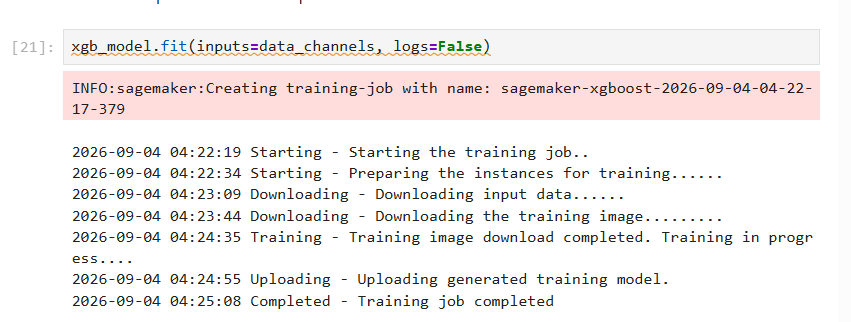

# Machine Learning Operations (MLOps): Training XGBoost Classification Models in Managed Amazon SageMaker Environments

## Executive Summary & Architectural Purpose
Training machine learning models at scale requires reproducible compute environments, managed data partitioning, and decoupled model artifact storage. **Amazon SageMaker AI** provides a fully managed machine learning platform that abstracts instance provisioning, containerized algorithm execution, and model artifact management.

This capstone cloud engineering lab completes the **AWS re/Start Curriculum (50/50 Labs 100% Completed)** by building an end-to-end Machine Learning training pipeline:
1. **Managed JupyterLab Notebook Environment**: Provisioning an `ml.m4.xlarge` SageMaker Notebook instance (`MyNotebook`) running a managed Python 3 conda kernel (`conda_python3`).
2. **Dataset Partitioning & Preprocessing**: Ingesting the biomedical vertebral column dataset and splitting raw data into three distinct subsets (Training, Validation, and Test sets).
3. **Managed Model Training via SageMaker XGBoost Container**: Invoking the managed SageMaker XGBoost estimator, binding S3 data channels, and executing containerized model training (`xgb_model.fit()`).
4. **Artifact Generation & Output Validation**: Verifying training job completion (`TrainingJobStatus: Completed`), artifact packaging in S3, and training metrics logging.

---

## Architectural Topology & MLOps Pipeline

---

## Technical Specifications & Machine Learning Pipeline

| Parameter / Dimension | Configuration Specification | Operational Role |
|:---|:---|:---|
| **SageMaker Notebook Instance** | `MyNotebook` (`ml.m4.xlarge`) | Fully managed JupyterLab development environment |
| **Execution Environment** | `conda_python3` Kernel | Data science & ML Python runtime environment |
| **Dataset Source** | Biomechanical Vertebral Column Dataset | Orthopedic patient classification (Normal vs Abnormal) |
| **Algorithm & Framework** | XGBoost (Gradient Boosted Trees) | High-performance supervised classification algorithm |
| **Training Execution** | `xgb_model.fit(inputs=data_channels)` | Asynchronous containerized SageMaker training job execution |
| **Training Result** | `TrainingJobStatus: Completed` | Validated model output serialized to S3 bucket |

---

## Step-by-Step Implementation & Model Training Validation

### Step 1: SageMaker Notebook Instance Provisioning
Accessed the Amazon SageMaker AI Console to confirm the operational status of `MyNotebook` in the `InService` state.

*Figure 1: SageMaker Console displaying MyNotebook running in an InService state.*

---

### Step 2: JupyterLab Environment & Notebook Execution
Opened `3_4-machinelearning.ipynb` within the JupyterLab interface, binding the `conda_python3` kernel for execution.

*Figure 2: JupyterLab interface presenting the machine learning student notebook and dataset files.*

---

### Step 3: XGBoost Training Job Completion
Executed dataset splitting and triggered the SageMaker XGBoost model training job, confirming successful execution and model generation.

*Figure 3: Output cell confirming `Completed - Training job completed` for the SageMaker XGBoost estimator.*

---

## Enterprise MLOps Best Practices Applied

1. **Decoupled Training Compute**: Utilizing SageMaker Estimators offloads heavy model training from notebook instances to ephemeral, dedicated ML compute clusters, optimizing compute costs.
2. **S3 Data Channels**: Streaming training data via Amazon S3 channels ensures scalable, high-throughput I/O during distributed model training.
